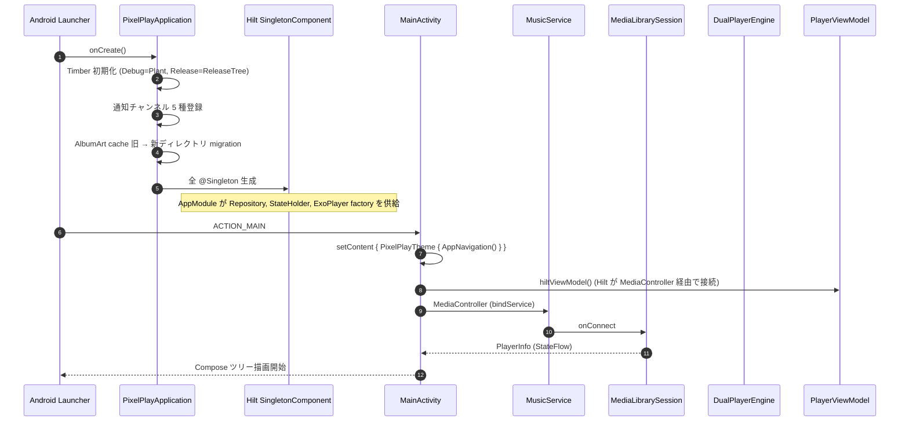
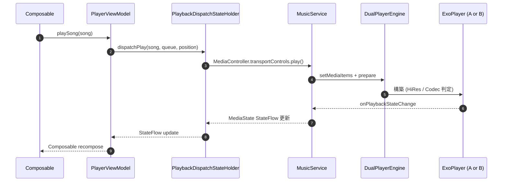
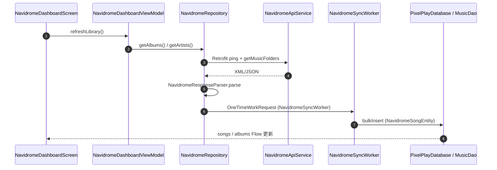
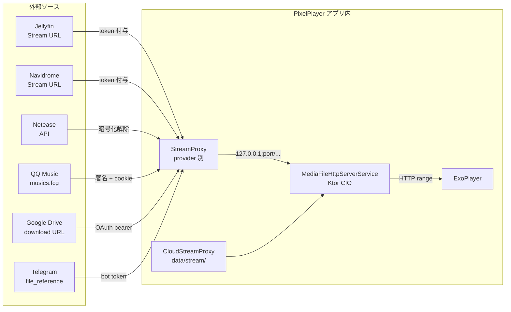

# 00 — PixelPlayer 全体アーキテクチャ

> **PixelPlayer** は Material 3 / Jetpack Compose / Hilt / Room / Media3 (ExoPlayer) ベースの
> Android ローカル音楽プレイヤー。ローカル音源に加えて Jellyfin / Navidrome / Netease / QQ Music /
> Google Drive / Telegram チャンネルのクラウド音源、AI プレイリスト生成、Chromecast / Android Auto
> / Wear OS / Glance Widget / Quick Settings Tile までを 1 パッケージに統合したフルスタック実装。

## 0. モジュール構成 (Gradle プロジェクト)

| モジュール | 役割 | パッケージ |
|------------|------|-----------|
| `app/` | メイン Android アプリ (Phone / Tablet / Android Auto / Cast sender / Tile / Widget) | `com.theveloper.pixelplay.*` |
| `shared/` | phone↔wear IPC 用データモデル (WearBrowseRequest, WearPlaybackCommand 等) | `com.theveloper.pixelplay.shared.*` |
| `wear/` | Wear OS アプリ本体 (Room + Media3 + Compose) | `com.theveloper.pixelplay.*` (別 namespace) |

> **ビルドツール**: Gradle Kotlin DSL + Version Catalog (`gradle/libs.versions.toml`)
> **SDK ターゲット**: `compileSdk` 36 / `minSdk` 26 / `targetSdk` 36
> **言語**: Kotlin 2.x + KSP + Hilt + Compose Compiler プラグイン
> 設定ファイル: `build.gradle.kts`, `app/build.gradle.kts`, `settings.gradle.kts`

## 1. アーキテクチャ レイヤー

```
┌────────────────────────────────────────────────────────────────────────┐
│                          presentation 層 (Compose)                       │
│  Screen / Component / BottomSheet / Dialog / Glance Widget              │
│  ─ StateFlow / SharedFlow を collectAsStateWithLifecycle で購読           │
└────────────────────────────────────────────────────────────────────────┘
                                  │
                                  ▼
┌────────────────────────────────────────────────────────────────────────┐
│                        state 層 (ViewModel / StateHolder)               │
│  PlayerViewModel (Hilt VM) ─┬─ 29 StateHolder (@Singleton)              │
│  18 画面別 ViewModel ───────┴─ 6 Provider Dashboard VM                  │
│  Navigation (AppNavigation / Screen / Routes)                           │
└────────────────────────────────────────────────────────────────────────┘
                                  │
                                  ▼
┌────────────────────────────────────────────────────────────────────────┐
│                          engine 層 (Service / Player)                   │
│  PixelPlayApplication → MainActivity → MusicService (MediaLibraryService)│
│  DualPlayerEngine (ExoPlayer A/B) / CastPlayer / TransitionController    │
│  AutoMediaBrowseTree (Android Auto) / MediaFileHttpServerService (Ktor) │
└────────────────────────────────────────────────────────────────────────┘
                                  │
                                  ▼
┌────────────────────────────────────────────────────────────────────────┐
│                          data 層 (Repository + Network)                 │
│  MusicRepository (集約 facade) / MediaStoreSongRepository /              │
│  <provider>/Repository (jellyfin / navidrome / netease / qqmusic /       │
│  gdrive / telegram) / LyricsRepository / ArtistImageRepository /        │
│  PlaybackStatsRepository / TransitionRepository                         │
│  data/network/* (Retrofit / OkHttp) / data/ai/* (LLM provider)         │
└────────────────────────────────────────────────────────────────────────┘
                                  │
                                  ▼
┌────────────────────────────────────────────────────────────────────────┐
│                       database / persistence 層 (Room)                 │
│  PixelPlayDatabase v42 ─┬─ MusicDao (中心) + 15 特殊 Dao                │
│                          ├─ 28 Entity (統合 songs テーブル)             │
│                          ├─ 18 Migration / FTS 同期トリガー              │
│                          ├─ DataStore<Preferences> (user pref)           │
│                          └─ DataStore (equalizer / playlist / ai / theme)│
└────────────────────────────────────────────────────────────────────────┘
```

## 2. ディレクトリ → スペック対応表

| 実コード (相対パス) | スペック | 担当レイヤ |
|----------------------|----------|-----------|
| `app/src/main/java/com/theveloper/pixelplay/MainActivity.kt` | [04-engine/activities.md](04-engine/activities.md) | engine |
| `app/src/main/java/com/theveloper/pixelplay/PixelPlayApplication.kt` | [04-engine/application.md](04-engine/application.md) | engine |
| `app/src/main/java/com/theveloper/pixelplay/service/` (= `data/service/`) | [04-engine/](04-engine/README.md) | engine |
| `app/src/main/java/com/theveloper/pixelplay/di/` | [04-engine/di-modules.md](04-engine/di-modules.md) | engine |
| `app/src/main/java/com/theveloper/pixelplay/data/database/` | [01-data-foundation/](01-data-foundation/README.md) | data |
| `app/src/main/java/com/theveloper/pixelplay/data/model/` | [01-data-foundation/models.md](01-data-foundation/models.md) | data |
| `app/src/main/java/com/theveloper/pixelplay/data/network/` | [02-data-network/](02-data-network/README.md) | data |
| `app/src/main/java/com/theveloper/pixelplay/data/{jellyfin,navidrome,netease,qqmusic,gdrive,telegram}/` | [02-data-network/streaming-*.md](02-data-network/README.md) | data |
| `app/src/main/java/com/theveloper/pixelplay/data/ai/` | [02-data-network/ai-system.md](02-data-network/ai-system.md) | data |
| `app/src/main/java/com/theveloper/pixelplay/data/repository/` | [03-data-services/repositories.md](03-data-services/repositories.md) | data |
| `app/src/main/java/com/theveloper/pixelplay/data/backup/` | [03-data-services/backup-system.md](03-data-services/backup-system.md) | data |
| `app/src/main/java/com/theveloper/pixelplay/data/preferences/` | [03-data-services/preferences.md](03-data-services/preferences.md) | data |
| `app/src/main/java/com/theveloper/pixelplay/data/worker/` | [03-data-services/workers.md](03-data-services/workers.md) | data |
| `app/src/main/java/com/theveloper/pixelplay/data/diagnostics/` | [03-data-services/diagnostics.md](03-data-services/diagnostics.md) | data |
| `app/src/main/java/com/theveloper/pixelplay/data/media/` | [03-data-services/media-processing.md](03-data-services/media-processing.md) | data |
| `app/src/main/java/com/theveloper/pixelplay/data/equalizer/` | [03-data-services/equalizer.md](03-data-services/equalizer.md) | data |
| `app/src/main/java/com/theveloper/pixelplay/data/stats/` | [03-data-services/playback-stats-daily-mix-eot.md](03-data-services/playback-stats-daily-mix-eot.md) | data |
| `app/src/main/java/com/theveloper/pixelplay/data/{DailyMixManager,EotStateHolder}.kt` | [03-data-services/playback-stats-daily-mix-eot.md](03-data-services/playback-stats-daily-mix-eot.md) | data |
| `app/src/main/java/com/theveloper/pixelplay/presentation/screens/` | [05-presentation-ui/screens-*.md](05-presentation-ui/README.md) | presentation |
| `app/src/main/java/com/theveloper/pixelplay/presentation/components/` | [05-presentation-ui/components-*.md](05-presentation-ui/README.md) | presentation |
| `app/src/main/java/com/theveloper/pixelplay/presentation/viewmodel/` | [06-state-navigation/viewmodels-*.md](06-state-navigation/README.md) | state |
| `app/src/main/java/com/theveloper/pixelplay/presentation/navigation/` | [06-state-navigation/navigation.md](06-state-navigation/navigation.md) | state |
| `app/src/main/java/com/theveloper/pixelplay/presentation/{gdrive,jellyfin,navidrome,netease,qqmusic,telegram}/` | [06-state-navigation/provider-screens.md](06-state-navigation/provider-screens.md) | state |
| `app/src/main/java/com/theveloper/pixelplay/ui/theme/` | [07-ui-system/theme.md](07-ui-system/theme.md) | ui |
| `app/src/main/java/com/theveloper/pixelplay/ui/glancewidget/` | [07-ui-system/widgets.md](07-ui-system/widgets.md) | ui |
| `app/src/main/java/com/theveloper/pixelplay/utils/` | [10-utils.md](10-utils.md) | util |
| `shared/src/main/java/com/theveloper/pixelplay/shared/` | [08-shared-module.md](08-shared-module.md) | ipc |
| `wear/src/main/java/com/theveloper/pixelplay/` | [09-wear-module/](09-wear-module/README.md) | wear |

## 3. 起動シーケンス



詳細は [04-engine/README.md](04-engine/README.md), [04-engine/application.md](04-engine/application.md), [04-engine/music-service.md](04-engine/music-service.md) 参照。

## 4. 再生コマンドフロー (Play / Pause / Seek)



詳細は [06-state-navigation/viewmodels-playback.md](06-state-navigation/viewmodels-playback.md), [04-engine/player-engine.md](04-engine/player-engine.md) 参照。

## 5. クラウドソース (例: Navidrome) 同期フロー



詳細: [02-data-network/streaming-navidrome.md](02-data-network/streaming-navidrome.md), [03-data-services/workers.md](03-data-services/workers.md)

## 6. ストリーミング プロキシ (クラウド → ローカル ループバック)

クラウド URL は Media3 (ExoPlayer) が直接再生できないケース (DRM / Cookie / 認証ヘッダ) があるため、
アプリ内 HTTP サーバー (Ktor CIO) で `http://127.0.0.1:<port>/song/<id>` 形式にラップして
ExoPlayer に渡す。



## 7. DI 構成 (Hilt)

```mermaid
graph TD
    App[PixelPlayApplication]:::app
    Hilt[SingletonComponent]:::core
    AppModule[AppModule<br/>data/di/]:::module
    BackupModule[BackupModule<br/>data/di/]:::module
    Quals[Qualifiers<br/>data/di/]:::module

    Hilt --> AppModule
    Hilt --> BackupModule
    Hilt --> Quals

    AppModule -->|provide| ExoFactory[ExoPlayer Factory]
    AppModule -->|provide| DAOs[全 Room Dao]
    AppModule -->|provide| Repos[全 Repository]
    AppModule -->|provide| Engines[DualPlayerEngine / CastPlayer / TransitionController]
    AppModule -->|provide| StateHolders[29 StateHolder]
    AppModule -->|provide| MediaController[MusicService 接続]
    BackupModule -->|provide| BackupManager / History
    Quals -->|@IoDispatcher / @MainDispatcher| Dispatchers

    classDef app fill:#ffd,stroke:#aa0
    classDef core fill:#fdd,stroke:#a00
    classDef module fill:#ddf,stroke:#00a
```

## 8. 主要データソース (Songs テーブル) のマージ

`songs` テーブルは `source_type` 列で全ソースを統合保持する。

| source_type | 由来 | 主なフィールド | 別テーブル |
|-------------|------|---------------|-----------|
| `LOCAL` | MediaStore | `path`, `album_id` | — |
| `TELEGRAM` | Telegram channel | `telegram_chat_id`, `telegram_message_id` | `telegram_songs` |
| `NETEASE` | Netease Cloud Music | `netease_id` | `netease_songs` |
| `QQMUSIC` | QQ Music | `qq_music_id`, `qq_music_mid` | `qq_music_songs` |
| `GDRIVE` | Google Drive | `gdrive_file_id` | `gdrive_songs` |
| `NAVIDROME` | Navidrome / Subsonic | `navidrome_id` | `navidrome_songs` |
| `JELLYFIN` | Jellyfin | `jellyfin_id` | `jellyfin_songs` |

詳細: [01-data-foundation/database-system.md](01-data-foundation/database-system.md), [01-data-foundation/database-entities.md](01-data-foundation/database-entities.md)

## 9. コルーチン / スレッド モデル

| レイヤ | Dispatcher | Scope |
|--------|-----------|-------|
| ViewModel / StateHolder | `@HiltViewModel` の `viewModelScope` (Main + SupervisorJob) / `@Singleton` の `CoroutineScope(SupervisorJob() + Dispatchers.Default)` | 各 StateHolder |
| Repository | `Dispatchers.IO` (withContext) + Flow (Room は独自の executor) | Repository 独自 |
| MusicService | `serviceScope = CoroutineScope(SupervisorJob() + Dispatchers.Main)` | Service |
| Worker (WorkManager) | `Dispatchers.Default` (Kotlin coroutine worker) | WorkManager |
| ExoPlayer | 内部 playback thread (触らない) | — |
| Compose | `LaunchedEffect` / `rememberCoroutineScope` (Main) | Composable |

## 10. 主要 設計判断 (Architecture Decision Records 抜粋)

| 判断 | 採用 | 理由 |
|------|------|------|
| 全 songs を 1 テーブル | Yes | 検索 / ライブラリ / プレイリスト 統合クエリが単純化 |
| 再生プレイヤー | Media3 ExoPlayer 2 instances (A/B) | クロスフェード / トランジション |
| Cast | Google Cast SDK + 自前 CastPlayer | 既存 MediaSession と統合 |
| Auto | `MediaLibraryService` + `BrowserTree` | Auto 標準仕様 |
| クラウド認証 | provider ごとに SharedPreferences (暗号) + EncryptedSharedPreferences (drives) | セキュリティ |
| 暗号化通信 | Netease / QQ は独自暗号化, アプリは OkHttp Interceptor | プロトコル仕様遵守 |
| AI | OpenAI 互換 + Gemini 両対応 (Factory) | ユーザー選択 |
| 設定 | DataStore Preferences (型安全) | SharedPreferences 廃止 |
| Room Migration | 18 個, v1→v42, 全て Migration クラスで明示 | データ保護 |
| Wear | 別プロセス / Wear 側にも Room を持つ | オフライン再生 |
| IPC (Phone↔Wear) | `Wearable Data Layer` + Asset + Message | 標準 API |

## 11. 既知のホットスポット (size ベース)

| ファイル | 行 | 役割 |
|---------|-----|------|
| `presentation/viewmodel/PlayerViewModel.kt` | 3118 | 中央オーケストレータ |
| `data/service/http/MediaFileHttpServerService.kt` | 2940 | クラウド→ローカル HTTP |
| `data/service/MusicService.kt` | 2917 | MediaLibraryService 本体 |
| `presentation/screens/LibraryScreen.kt` | 3760 | ライブラリ画面 (タブ + リスト) |
| `presentation/screens/SettingsCategoryScreen.kt` | 2930 | 設定カテゴリ画面 |
| `presentation/components/FullPlayerContent.kt` | 2644 | フルプレイヤー UI |
| `presentation/components/QueueBottomSheet.kt` | 2150 | キュー UI |
| `presentation/components/CastBottomSheet.kt` | 2045 | Cast 連携 UI |
| `presentation/components/LyricsSheet.kt` | 2085 | 歌詞 UI |
| `presentation/viewmodel/CastTransferStateHolder.kt` | 1598 | Cast ファイル転送 |
| `data/repository/LyricsRepositoryImpl.kt` | 1723 | 歌詞解決 |
| `data/database/MusicDao.kt` | 1953 | 集約 DAO |
| `data/database/PixelPlayDatabase.kt` | 1534 | DB 本体 |
| `data/media/SongMetadataEditor.kt` | 1389 | タグ編集 |
| `data/preferences/UserPreferencesRepository.kt` | 1390 | 設定 Repository |
| `data/ai/provider/GenericOpenAiClient.kt` | 184 | OpenAI 互換クライアント (実は小さい) |
| `data/service/player/DualPlayerEngine.kt` | 1580 | 再生エンジン |
| `data/service/player/CastPlayer.kt` | 1131 | Cast プレイヤー |
| `data/telegram/TelegramRepository.kt` | 840 | Telegram 統合 |
| `data/netease/NeteaseRepository.kt` | 859 | Netease 統合 |
| `data/qqmusic/QqMusicRepository.kt` | 807 | QQ Music 統合 |
| `data/jellyfin/JellyfinRepository.kt` | 663 | Jellyfin 統合 |
| `data/equalizer/EqualizerManager.kt` | 716 | EQ |

## 12. スペック ファイル マップ (全 73 ファイル)

```
specs/
├── README.md (本ディレクトリ案内)
├── 00-architecture.md (このファイル)
├── 99-correlation-diagrams.md (相関図集)
├── 01-data-foundation/      (DB + Domain Model)
│   ├── README.md
│   ├── database-entities.md
│   ├── database-daos.md
│   ├── database-system.md
│   └── models.md
├── 02-data-network/         (Network + クラウド統合)
│   ├── README.md
│   ├── network-jellyfin.md
│   ├── network-navidrome.md
│   ├── network-netease.md
│   ├── network-qqmusic.md
│   ├── network-lyrics-deezer.md
│   ├── ai-system.md
│   ├── streaming-jellyfin.md
│   ├── streaming-navidrome.md
│   ├── streaming-netease.md
│   ├── streaming-qqmusic.md
│   ├── streaming-gdrive.md
│   ├── streaming-telegram.md
│   ├── streaming-cloud.md
│   ├── image-fetchers.md
│   └── github-integration.md
├── 03-data-services/        (Repository / Backup / Worker / EQ)
│   ├── README.md
│   ├── repositories.md
│   ├── backup-system.md
│   ├── preferences.md
│   ├── workers.md
│   ├── diagnostics.md
│   ├── media-processing.md
│   ├── equalizer.md
│   ├── misc.md
│   └── playback-stats-daily-mix-eot.md
├── 04-engine/               (Service / Player / DI)
│   ├── README.md
│   ├── application.md
│   ├── activities.md
│   ├── di-modules.md
│   ├── music-service.md
│   ├── player-engine.md
│   ├── auto-cast-http.md
│   ├── wear-bridge.md
│   ├── tile-widgets.md
│   └── notification-misc.md
├── 05-presentation-ui/      (Compose Screen / Component)
│   ├── README.md
│   ├── screens-main.md
│   ├── screens-detail.md
│   ├── screens-settings.md
│   ├── screens-specialized.md
│   ├── components-player.md
│   ├── components-library.md
│   ├── components-controls.md
│   ├── components-bottomsheets.md
│   └── components-shared.md
├── 06-state-navigation/     (ViewModel / StateHolder / Navigation)
│   ├── README.md
│   ├── viewmodels-core.md
│   ├── viewmodels-playback.md
│   ├── viewmodels-library.md
│   ├── viewmodels-playlist-edit.md
│   ├── viewmodels-settings-stats.md
│   ├── viewmodels-ai-extra.md
│   ├── viewmodels-support.md
│   ├── navigation.md
│   └── provider-screens.md
├── 07-ui-system/            (Theme / Glance Widget)
│   ├── README.md
│   ├── theme.md
│   └── widgets.md
├── 08-shared-module.md      (phone↔wear IPC model)
├── 09-wear-module/          (Wear OS アプリ)
│   ├── README.md
│   ├── app.md
│   ├── data.md
│   ├── di.md
│   ├── local-db.md
│   └── presentation.md
└── 10-utils.md              (共通ユーティリティ)
```

## 13. ナビゲーション 早見表

| 目的 | 参照先 |
|------|--------|
| DB のスキーマ・テーブル詳細 | [01-data-foundation/database-entities.md](01-data-foundation/database-entities.md) |
| DAO の全 SQL クエリ | [01-data-foundation/database-daos.md](01-data-foundation/database-daos.md) |
| Migration 履歴 | [01-data-foundation/database-system.md](01-data-foundation/database-system.md) |
| ドメインモデル | [01-data-foundation/models.md](01-data-foundation/models.md) |
| Jellyfin / Navidrome API | [02-data-network/network-jellyfin.md](02-data-network/network-jellyfin.md) / [02-data-network/network-navidrome.md](02-data-network/network-navidrome.md) |
| Netease / QQ 暗号化 | [02-data-network/network-netease.md](02-data-network/network-netease.md) / [02-data-network/streaming-qqmusic.md](02-data-network/streaming-qqmusic.md) |
| AI プロバイダ | [02-data-network/ai-system.md](02-data-network/ai-system.md) |
| 画像取得 (Coil) | [02-data-network/image-fetchers.md](02-data-network/image-fetchers.md) |
| 集約 Repository | [03-data-services/repositories.md](03-data-services/repositories.md) |
| Backup / Restore | [03-data-services/backup-system.md](03-data-services/backup-system.md) |
| 設定 (DataStore) | [03-data-services/preferences.md](03-data-services/preferences.md) |
| WorkManager 同期 | [03-data-services/workers.md](03-data-services/workers.md) |
| パフォーマンス計測 | [03-data-services/diagnostics.md](03-data-services/diagnostics.md) |
| メタデータ・タグ編集 | [03-data-services/media-processing.md](03-data-services/media-processing.md) |
| EQ | [03-data-services/equalizer.md](03-data-services/equalizer.md) |
| 再生統計 / Daily Mix | [03-data-services/playback-stats-daily-mix-eot.md](03-data-services/playback-stats-daily-mix-eot.md) |
| 起動 / Application | [04-engine/application.md](04-engine/application.md) |
| 画面遷移 / Activity | [04-engine/activities.md](04-engine/activities.md) |
| Hilt モジュール | [04-engine/di-modules.md](04-engine/di-modules.md) |
| 再生 Service | [04-engine/music-service.md](04-engine/music-service.md) |
| プレイヤー実装 | [04-engine/player-engine.md](04-engine/player-engine.md) |
| Android Auto / Cast / HTTP | [04-engine/auto-cast-http.md](04-engine/auto-cast-http.md) |
| Phone↔Wear 転送 | [04-engine/wear-bridge.md](04-engine/wear-bridge.md) |
| Quick Settings Tile | [04-engine/tile-widgets.md](04-engine/tile-widgets.md) |
| 通知 / Widget / ReplayGain | [04-engine/notification-misc.md](04-engine/notification-misc.md) |
| 主要画面 (Home/Library/Search) | [05-presentation-ui/screens-main.md](05-presentation-ui/screens-main.md) |
| 詳細画面 (Album/Artist/...) | [05-presentation-ui/screens-detail.md](05-presentation-ui/screens-detail.md) |
| 設定画面 | [05-presentation-ui/screens-settings.md](05-presentation-ui/screens-settings.md) |
| 特殊画面 (Stats/Equalizer/...) | [05-presentation-ui/screens-specialized.md](05-presentation-ui/screens-specialized.md) |
| プレイヤー UI | [05-presentation-ui/components-player.md](05-presentation-ui/components-player.md) |
| ライブラリ UI | [05-presentation-ui/components-library.md](05-presentation-ui/components-library.md) |
| カスタム UI 部品 | [05-presentation-ui/components-controls.md](05-presentation-ui/components-controls.md) |
| BottomSheet 群 | [05-presentation-ui/components-bottomsheets.md](05-presentation-ui/components-bottomsheets.md) |
| 共通 UI | [05-presentation-ui/components-shared.md](05-presentation-ui/components-shared.md) |
| コア ViewModel | [06-state-navigation/viewmodels-core.md](06-state-navigation/viewmodels-core.md) |
| 再生系 StateHolder | [06-state-navigation/viewmodels-playback.md](06-state-navigation/viewmodels-playback.md) |
| ライブラリ系 StateHolder | [06-state-navigation/viewmodels-library.md](06-state-navigation/viewmodels-library.md) |
| プレイリスト / 編集 | [06-state-navigation/viewmodels-playlist-edit.md](06-state-navigation/viewmodels-playlist-edit.md) |
| 設定 / Stats / EQ | [06-state-navigation/viewmodels-settings-stats.md](06-state-navigation/viewmodels-settings-stats.md) |
| AI / Cast / 外部 | [06-state-navigation/viewmodels-ai-extra.md](06-state-navigation/viewmodels-ai-extra.md) |
| サポート型 (UiState 等) | [06-state-navigation/viewmodels-support.md](06-state-navigation/viewmodels-support.md) |
| Navigation | [06-state-navigation/navigation.md](06-state-navigation/navigation.md) |
| Provider Dashboard | [06-state-navigation/provider-screens.md](06-state-navigation/provider-screens.md) |
| テーマ / カラー | [07-ui-system/theme.md](07-ui-system/theme.md) |
| Glance Widget | [07-ui-system/widgets.md](07-ui-system/widgets.md) |
| Phone↔Wear IPC model | [08-shared-module.md](08-shared-module.md) |
| Wear アプリ全体 | [09-wear-module/](09-wear-module/README.md) |
| ユーティリティ | [10-utils.md](10-utils.md) |
