# database-system.md

> `PixelPlayDatabase` 統合仕様、Migration 履歴、FTS トリガー、Favorite 同期トリガー、ER 図。

## ファイル

| 項目 | 値 |
|------|-----|
| パス | `app/src/main/java/com/theveloper/pixelplay/data/database/PixelPlayDatabase.kt` |
| 行数 | 1,533 |
| パッケージ | `com.theveloper.pixelplay.data.database` |
| 役割 | Room `@Database` 集約エントリ ポイント + 30+ Migration + トリガー インストール |

## 1. `class PixelPlayDatabase : RoomDatabase()`

### 1.1 `@Database` アノテーション

| 属性 | 値 |
|------|-----|
| `entities` | 28 個の `@Entity` クラス (下記一覧) |
| `version` | **42** |
| `exportSchema` | `true` |

### 1.2 エンティティ一覧 (28)

```
AlbumArtThemeEntity, SearchHistoryEntity, SongEntity, SongSearchFtsEntity,
AlbumEntity, ArtistEntity, TransitionRuleEntity, SongArtistCrossRef,
TelegramSongEntity, TelegramChannelEntity, SongEngagementEntity,
FavoritesEntity, LyricsEntity, NeteaseSongEntity, NeteasePlaylistEntity,
GDriveSongEntity, GDriveFolderEntity, PlaylistEntity, PlaylistSongEntity,
QqMusicSongEntity, QqMusicPlaylistEntity, NavidromeSongEntity,
NavidromePlaylistEntity, TelegramTopicEntity, JellyfinSongEntity,
JellyfinPlaylistEntity, AiCacheEntity, AiUsageEntity
```

### 1.3 DAO アクセサ (16 個、`abstract fun`)

| 行 | シグネチャ | 戻り値 | 目的 |
|----|----------|--------|------|
| 43 | `albumArtThemeDao()` | `AlbumArtThemeDao` | アート テーマ CRUD |
| 44 | `searchHistoryDao()` | `SearchHistoryDao` | 検索履歴 CRUD |
| 45 | `musicDao()` | `MusicDao` | 統合 songs / albums / artists / junction |
| 46 | `transitionDao()` | `TransitionDao` | トランジション ルール |
| 47 | `telegramDao()` | `TelegramDao` | Telegram songs / channels / topics |
| 48 | `engagementDao()` | `EngagementDao` | 再生統計 |
| 49 | `favoritesDao()` | `FavoritesDao` | お気に入り |
| 50 | `lyricsDao()` | `LyricsDao` | 歌詞 |
| 51 | `neteaseDao()` | `NeteaseDao` | Netease songs / playlists |
| 52 | `gdriveDao()` | `GDriveDao` | GDrive songs / folders |
| 53 | `localPlaylistDao()` | `LocalPlaylistDao` | ローカル playlist |
| 54 | `qqmusicDao()` | `QqMusicDao` | QQ Music |
| 55 | `navidromeDao()` | `NavidromeDao` | Navidrome / Subsonic |
| 56 | `jellyfinDao()` | `JellyfinDao` | Jellyfin |
| 57 | `aiCacheDao()` | `AiCacheDao` | AI プロンプト キャッシュ |
| 58 | `aiUsageDao()` | `AiUsageDao` | AI トークン使用量 |

---

## 2. ER 図 (Entity Relationship)

```mermaid
erDiagram
    songs ||--o{ song_artist_cross_ref : "song_id"
    artists ||--o{ song_artist_cross_ref : "artist_id"
    albums ||--o{ songs : "album_id (CASCADE)"
    artists ||--o{ songs : "artist_id (SET NULL)"
    playlists ||--o{ playlist_songs : "playlist_id"
    songs ||--o| song_engagements : "song_id (PK in engagements)"
    songs ||--o| favorites : "songId (PK in favorites)"
    songs ||--o| lyrics : "songId (PK in lyrics)"
    telegram_channels ||--o{ telegram_songs : "chat_id"
    telegram_channels ||--o{ telegram_topics : "chat_id"
    telegram_topics ||--o{ telegram_songs : "(chat_id, thread_id)"
    netease_playlists ||--o{ netease_songs : "playlist_id"
    gdrive_folders ||--o{ gdrive_songs : "folder_id"
    qqmusic_playlists ||--o{ qqmusic_songs : "playlist_id"
    navidrome_playlists ||--o{ navidrome_songs : "playlist_id"
    jellyfin_playlists ||--o{ jellyfin_songs : "playlist_id"
    albums ||--o| album_art_themes : "albumArtUriString"

    songs {
        Long id PK
        String title
        String artist_name
        Long artist_id
        String album_name
        Long album_id
        String content_uri_string
        String album_art_uri_string
        Long duration
        String genre
        String file_path
        String parent_directory_path
        Boolean is_favorite
        String lyrics
        Int track_number
        Int disc_number
        Int year
        Long date_added
        String mime_type
        Int bitrate
        Int sample_rate
        Long telegram_chat_id
        Int telegram_file_id
        String artists_json
        Int source_type
    }

    albums {
        Long id PK
        String title
        String artist_name
        Long artist_id
        String album_art_uri_string
        Int song_count
        Long date_added
        Int year
        String album_artist
    }

    artists {
        Long id PK
        String name
        Int track_count
        String image_url
        String custom_image_uri
    }

    song_artist_cross_ref {
        Long song_id PK
        Long artist_id PK
        Boolean is_primary
    }

    playlists {
        String id PK
        String name
        Long created_at
        Long last_modified
        Boolean is_ai_generated
        Boolean is_queue_generated
        String cover_image_uri
        Int cover_color_argb
        String cover_icon_name
        String cover_shape_type
        Float cover_shape_detail_1
        Float cover_shape_detail_2
        Float cover_shape_detail_3
        Float cover_shape_detail_4
        String source
    }

    playlist_songs {
        String playlist_id PK
        String song_id PK
        Int sort_order
    }

    song_engagements {
        String song_id PK
        Int play_count
        Long total_play_duration_ms
        Long last_played_timestamp
    }

    favorites {
        Long songId PK
        Boolean isFavorite
        Long timestamp
    }

    lyrics {
        Long songId PK
        String content
        Boolean isSynced
        String source
    }

    album_art_themes {
        String albumArtUriString PK
        String paletteStyle
    }

    telegram_songs {
        String id PK
        Long chat_id
        Long message_id
        Int file_id
        String title
        String artist
        Long duration
        String file_path
        String mime_type
        Long date_added
        String album_art_uri_string
        Long thread_id
    }

    telegram_channels {
        Long chat_id PK
        String title
        String username
        Int song_count
        Long last_sync_time
        String photo_path
    }

    telegram_topics {
        String id PK
        Long chat_id
        Long thread_id
        String name
        Int song_count
        Long last_sync_time
        String icon_emoji
    }

    netease_songs {
        String id PK
        Long netease_id
        Long playlist_id
        String title
        String artist
        String album
        Long album_id
        Long duration
        String album_art_url
        String mime_type
        Int bitrate
        Long date_added
    }

    gdrive_songs {
        String id PK
        String drive_file_id
        String folder_id
        String title
        String artist
        String album
        Long album_id
        Long duration
        String album_art_url
        String mime_type
        Int bitrate
        Long file_size
        Long date_added
        Long date_modified
    }

    qqmusic_songs {
        String id PK
        String song_mid
        Long playlist_id
        String title
        String artist
        String album
        String album_mid
        Long duration
        String album_art_url
        String mime_type
        Int bitrate
        Long date_added
    }

    navidrome_songs {
        String id PK
        String navidrome_id
        String playlist_id
        String title
        String artist
        String artist_id
        String album
        String album_id
        String cover_art_id
        Long duration
        Int track_number
        Int disc_number
        Int year
        String genre
        Int bitRate
        String mime_type
        String suffix
        String path
        Long date_added
    }

    jellyfin_songs {
        String id PK
        String jellyfin_id
        String playlist_id
        String title
        String artist
        String artist_id
        String album
        String album_id
        Long duration
        Int track_number
        Int disc_number
        Int year
        String genre
        Int bitRate
        String mime_type
        String path
        Long date_added
    }

    transition_rules {
        Long id PK
        String playlistId
        String fromTrackId
        String toTrackId
    }

    search_history {
        Long id PK
        String query
        Long timestamp
    }

    ai_cache {
        String promptHash PK
        String responseJson
        Long timestamp
    }

    ai_usage {
        Long id PK
        Long timestamp
        String provider
        String model
        String promptType
        Int promptTokens
        Int outputTokens
        Int thoughtTokens
    }
```



---

## 3. Migration 履歴 (companion object)

> Room の `Migration` オブジェクトを順次並べたリスト。`PixelPlayDatabase.kt` 内で定義。

| Migration | 行 | from → to | 種別 | 内容 (要約) |
|-----------|----|-----------|------|------------|
| `MIGRATION_3_4` | 74 | 3 → 4 | no-op ブリッジ | ギャップ ブリッジ (推測) |
| `MIGRATION_4_5` | 80 | 4 → 5 | no-op ブリッジ | ギャップ ブリッジ |
| `MIGRATION_5_6` | 64 | 5 → 6 | **no-op** | ギャップ ブリッジ (Telegram 機能以前) |
| `MIGRATION_6_7` | 86 | 6 → 7 | no-op ブリッジ | ギャップ ブリッジ |
| `MIGRATION_7_8` | 67 | 7 → 8 | **no-op** | ギャップ ブリッジ |
| `MIGRATION_8_9` | 70 | 8 → 9 | **no-op** | ギャップ ブリッジ |
| `MIGRATION_9_10` | 94 | 9 → 10 | スキーマ変更 | 詳細不明 (ファイル参照) |
| `MIGRATION_10_11` | 120 | 10 → 11 | スキーマ変更 | — |
| `MIGRATION_11_12` | 126 | 11 → 12 | スキーマ変更 | — |
| `MIGRATION_12_13` | 145 | 12 → 13 | スキーマ変更 | — |
| `MIGRATION_13_14` | 151 | 13 → 14 | スキーマ変更 | — |
| `MIGRATION_14_15` | 304 | 14 → 15 | **スキーマ変更** | ロール系カラム追加 (`newRoleColumns` を `light_`/`dark_` プレフィックスで 100 列近く追加) |
| `MIGRATION_15_16` | 166 | 15 → 16 | **破壊的** | `album_art_themes` を DROP → 100 列 (50 色 × 2 テーマ) で再生成。色カラム (`colorColumns`) を動的に組み立て |
| `MIGRATION_16_17` | 220 | 16 → 17 | **破壊的** | `album_art_themes` 再 DROP/RECREATE。`colorColumns` パターン継続 |
| `MIGRATION_17_18` | 274 | 17 → 18 | スキーマ変更 | — |
| `MIGRATION_18_19` | 293 | 18 → 19 | スキーマ変更 | — |
| `MIGRATION_19_20` | 350 | 19 → 20 | スキーマ変更 | — |
| `MIGRATION_20_21` | 390 | 20 → 21 | スキーマ変更 | — |
| `MIGRATION_21_22` | 424 | 21 → 22 | スキーマ変更 | — |
| `MIGRATION_22_23` | 461 | 22 → 23 | スキーマ変更 | — |
| `MIGRATION_23_24` | 474 | 23 → 24 | スキーマ変更 | — |
| `MIGRATION_24_25` | 483 | 24 → 25 | スキーマ変更 | — |
| `MIGRATION_25_26` | 491 | 25 → 26 | スキーマ変更 | — |
| `MIGRATION_26_27` | 530 | 26 → 27 | スキーマ変更 | — |
| `MIGRATION_27_28` | 1271 | 27 → 28 | スキーマ変更 | — |
| `MIGRATION_28_29` | 1305 | 28 → 29 | スキーマ変更 | — |
| `MIGRATION_29_30` | 1328 | 29 → 30 | スキーマ変更 | — |
| `MIGRATION_30_31` | 1337 | 30 → 31 | **破壊的** | `navidrome_songs` を `recreateNavidromeSongsTable` で完全再構築 (FK 含む) |
| `MIGRATION_31_32` | 1461 | 31 → 32 | スキーマ変更 | — |
| `MIGRATION_32_33` | 1483 | 32 → 33 | スキーマ変更 | — |
| `MIGRATION_33_34` | 1505 | 33 → 34 | スキーマ変更 | — |
| `MIGRATION_34_35` | 1511 | 34 → 35 | スキーマ変更 | — |
| `MIGRATION_35_36` | 1524 | 35 → 36 | スキーマ変更 | — |
| `MIGRATION_36_37` | 542 | 36 → 37 | **破壊的** | `songs` テーブルを `recreateSongsTable` で再構築 (`requiredColumns` セット検証 → カラム単位の動的コピー) |
| `MIGRATION_37_38` | 592 | 37 → 38 | スキーマ変更 | — |
| `MIGRATION_38_39` | 609 | 38 → 39 | スキーマ変更 | — |
| `MIGRATION_39_40` | 615 | 39 → 40 | スキーマ変更 | — |
| `MIGRATION_40_41` | 628 | 40 → 41 | **破壊的** | `playlists` テーブルを `recreatePlaylistsTable` で再構築。`created_at`/`last_modified`/`is_ai_generated`/`is_queue_generated`/`cover_*`/`source` を含む |
| `MIGRATION_41_42` | 652 | 41 → 42 | **破壊的** | `navidrome_songs` を含む複数テーブル再構築。`columnExpr` ヘルパで旧カラムの存在確認しつつコピー |

> 各 Migration の正確な SQL 内容は `PixelPlayDatabase.kt` の該当行を参照。
> スキーマ JSON は `app/schemas/com.theveloper.pixelplay.data.database.PixelPlayDatabase/{1..42}.json` にエクスポートされている (40 KB 超)。

### 3.1 主要ヘルパ関数

| 関数 | 行 | 戻り値 | 目的 |
|------|----|--------|------|
| `recreateSongsTable(db)` | 772 | `Unit` (private) | `songs` テーブルの存在可否 + `requiredColumns` セット検証 → 旧カラムを `columnExpr` で動的にコピー → `albumArtist`, `albumArtUriString`, `genre`, `parentDirectoryPath`, `isFavorite`, `lyrics`, `trackNumber`, `discNumber`, `year`, `dateAdded`, `mimeType`, `bitrate`, `sampleRate`, `telegramChatId`, `telegramFileId` を保護 |
| `recreatePlaylistsTable(db)` | 959 | `Unit` (private) | `playlists` テーブル再構築。`createdAt = nowMs = (CAST(strftime('%s','now') AS INTEGER) * 1000)` でデフォルト |
| `recreatePlaylistSongsTable(db)` | 1047 | `Unit` (private) | `playlist_songs` 再構築 |
| `recreateNavidromeSongsTable(db)` | 1343 | `Unit` (private) | `navidrome_songs` 再構築 |
| `tableExists(db, tableName)` | 1086 | `Boolean` (private) | `sqlite_master` を照会 |
| `getTableColumns(db, tableName)` | 1095 | `Set<String>` (private) | `PRAGMA table_info(...)` |
| `getTableColumnDefaultValue(db, tableName, columnName)` | 1107 | `String?` (private) | `PRAGMA table_info(...).dflt_value` |
| `ensureSongsTableHasDiscNumber(db)` | 1126 | `Unit` (private) | `disc_number` カラムが無ければ追加 |
| `ensureSongsTableHasDateAdded(db)` | 750 | `Unit` (private) | `date_added` カラムが無ければ追加 |
| `columnExpr(columns, columnName, fallbackExpr)` | 1149 | `String` (private) | カラムが存在すればその列、なければフォールバック式 |
| `createSongsEntityIndexes(db)` | 917 | `Unit` (private) | `songs` テーブルに各種 INDEX を作成 (column 存在チェック付き) |
| `createIndexIfColumnExists(columnName, indexName)` | 920 | `Unit` (private nested fun) | 単一カラム INDEX |
| `createCompositeIndexIfColumnsExist(indexName, vararg columnNames)` | 926 | `Unit` (private nested fun) | 複合 INDEX |
| `installFavoriteSyncTriggers(db)` | 1157 | `Unit` | 後述 (Favorite 同期) |
| `createSongsSearchVirtualTable(db)` | 1193 | `Unit` (private) | FTS4 `songs_fts` 仮想テーブル作成 |
| `installSongsSearchSyncTriggers(db)` | 1206 | `Unit` | 後述 (FTS 同期) |
| `rebuildSongsSearchIndex(db)` | 1247 | `Unit` (private) | FTS インデックス全削除 → 再挿入 |
| `createRuntimeArtifactsCallback()` | 1258 | `RoomDatabase.Callback` | onCreate 時に FTS と favorite トリガーをインストール |

---

## 4. Favorite 同期トリガー

`installFavoriteSyncTriggers` (`PixelPlayDatabase.kt:1157`)

| トリガー | 発火タイミング | 動作 |
|---------|--------------|------|
| `trg_favorites_insert_sync_song` | `AFTER INSERT ON favorites` | `UPDATE songs SET is_favorite = NEW.isFavorite WHERE id = NEW.songId` |
| `trg_favorites_update_sync_song` | `AFTER UPDATE ON favorites` | `UPDATE songs SET is_favorite = NEW.isFavorite WHERE id = NEW.songId` |
| `trg_favorites_delete_sync_song` | `AFTER DELETE ON favorites` | `UPDATE songs SET is_favorite = 0 WHERE id = OLD.songId` |

> **目的**: `favorites` テーブルはタイムスタンプ管理 + バックアップ互換、`songs.is_favorite` は高速参照用 — 両者を自動同期。

---

## 5. FTS 検索トリガー

`installSongsSearchSyncTriggers` (`PixelPlayDatabase.kt:1206`)

### 5.1 仮想テーブル

```sql
CREATE VIRTUAL TABLE IF NOT EXISTS songs_fts
USING fts4(title, artist_name, tokenize=unicode61)
```

### 5.2 同期トリガー

| トリガー | 発火タイミング | 動作 |
|---------|--------------|------|
| `trg_songs_fts_insert` | `AFTER INSERT ON songs` | `INSERT INTO songs_fts(rowid, title, artist_name) VALUES (NEW.id, NEW.title, NEW.artist_name)` |
| `trg_songs_fts_update` | `AFTER UPDATE ON songs` | `DELETE FROM songs_fts WHERE rowid = OLD.id` → `INSERT` |
| `trg_songs_fts_delete` | `AFTER DELETE ON songs` | `DELETE FROM songs_fts WHERE rowid = OLD.id` |

### 5.3 ランタイム コールバック

`createRuntimeArtifactsCallback` (`PixelPlayDatabase.kt:1258`)。`onCreate` で `installFavoriteSyncTriggers` + `installSongsSearchSyncTriggers` を呼び出す。

---

## 6. スキーマ JSON

| 項目 | 値 |
|------|-----|
| エクスポート先 | `app/schemas/com.theveloper.pixelplay.data.database.PixelPlayDatabase/` |
| 含まれるバージョン | 1 〜 42 (すべて) |
| 41 → 42 サイズ | 各 2,748 行 |
| 全体サイズ | 約 42 KB |

### 6.1 スキーマ 42 のテーブル列数

| テーブル | 列数 |
|---------|------|
| `album_art_themes` | **98** (PK + paletteStyle + 48 色 × 2 テーマ + 追加メタ) |
| `songs` | 26 |
| `navidrome_songs` | 19 |
| `jellyfin_songs` | 17 |
| `playlists` | 15 |
| `gdrive_songs` | 14 |
| `telegram_songs` | 12 |
| `netease_songs` | 12 |
| `qqmusic_songs` | 12 |
| `albums` | 9 |
| `navidrome_playlists` | 9 |
| `transition_rules` | 8 |
| `ai_usage` | 8 |
| `telegram_topics` | 7 |
| `telegram_channels` | 6 |
| `artists` | 5 |
| `netease_playlists` | 5 |
| `gdrive_folders` | 4 |
| `qqmusic_playlists` | 5 |
| `jellyfin_playlists` | 5 |
| `song_engagements` | 4 |
| `lyrics` | 4 |
| `search_history` | 3 |
| `song_artist_cross_ref` | 3 |
| `favorites` | 3 |
| `playlist_songs` | 3 |
| `ai_cache` | 3 |
| `songs_fts` | 2 |

---

## 7. 内部実装メモ

### 7.1 段階的マイグレーション戦略

- 多くの `Migration` が no-op ブリッジ (`MIGRATION_5_6`, `MIGRATION_7_8`, `MIGRATION_8_9`)
- 一部で完全な再構築 (`recreateSongsTable`, `recreatePlaylistsTable`, `recreateNavidromeSongsTable`) — `columnExpr` でカラム単位のフォールバック

### 7.2 カラム存在確認パターン

```kotlin
private fun getTableColumns(db: SupportSQLiteDatabase, tableName: String): Set<String> {
    val columns = mutableSetOf<String>()
    db.query("PRAGMA table_info($tableName)").use { cursor ->
        val nameIndex = cursor.getColumnIndex("name")
        while (cursor.moveToNext()) {
            columns.add(cursor.getString(nameIndex))
        }
    }
    return columns
}
```

### 7.3 `columnExpr` パターン

```kotlin
private fun columnExpr(columns: Set<String>, columnName: String, fallbackExpr: String): String {
    return if (columnName in columns) columnName else fallbackExpr
}
```

### 7.4 トリガーの冪等性

- `DROP TRIGGER IF EXISTS` → 再作成で冪等
- `createRuntimeArtifactsCallback.onCreate` で初回作成
- Migration 内では別途 `installFavoriteSyncTriggers` / `installSongsSearchSyncTriggers` を呼ぶ (推測)

### 7.5 SQLite 変数上限

- `MusicDao.CROSS_REF_BATCH_SIZE = 333` で対応 (詳細: `database-daos.md` 参照)
- インクリメンタル同期は `SONG_BATCH_SIZE = 500` チャンク

### 7.6 データベース初期化フロー (推測)

1. `AppModule` が `Room.databaseBuilder(...).addMigrations(MIGRATION_3_4 ... MIGRATION_41_42).addCallback(createRuntimeArtifactsCallback())` でビルド
2. 初回起動: `onCreate` で FTS 仮想テーブル + 両方のトリガー群をインストール
3. 既存ユーザー: 各バージョンの Migration を順次適用
4. `installFavoriteSyncTriggers` / `installSongsSearchSyncTriggers` は Migration 内で個別にも呼ばれる

---

## 8. 上流 / 下流

### 上流 (この DB を呼ぶ側)

| レイヤ | 例 (推測) |
|--------|----------|
| Repository | `data/repository/MusicRepositoryImpl.kt`, `PlaylistRepositoryImpl.kt`, `AlbumArtThemeRepositoryImpl.kt` |
| Worker | `data/worker/SyncWorker.kt` |
| Service | `MusicService` (再生中の曲参照) |
| DI | `di/AppModule.kt` で `Room.databaseBuilder` 設定 |

### 下流 (この DB が依存する側)

- AndroidX Room (ランタイム)
- AndroidX SQLite (バックエンド)
- kotlinx-coroutines (Flow サポート)

---

## 9. 関連ファイル

- Entity 層: [`database-entities.md`](./database-entities.md)
- DAO 層: [`database-daos.md`](./database-daos.md)
- モデル層: [`models.md`](./models.md)
- エクスポート スキーマ: `app/schemas/com.theveloper.pixelplay.data.database.PixelPlayDatabase/`
- 上位ディレクトリ README: [`README.md`](./README.md)