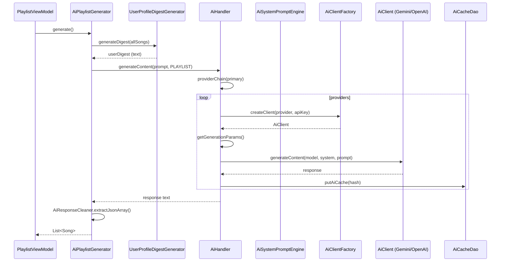

# ai-system.md

> AI プレイリスト生成・メタデータ生成・AI プロンプト構築の全体仕様。
> Gemini と OpenAI 互換 API を統一インターフェース (`AiClient`) で抽象化し、プロバイダチェーン・モデル復旧・キャッシュを実装。

## パッケージ

```
app/src/main/java/com/theveloper/pixelplay/data/ai/
├─ AiHandler.kt                       // 統合エントリポイント (288 lines)
├─ AiNotificationManager.kt           // Android Notification 通知 (70 lines)
├─ AiPlaylistGenerator.kt             // プレイリスト生成 (171 lines)
├─ AiResponseCleaner.kt               // JSON 抽出ヘルパ (93 lines)
├─ AiSystemPromptEngine.kt            // プロンプト構築 (221 lines)
├─ GeminiModelService.kt              // Gemini モデル列挙 (158 lines)
├─ UserProfileDigestGenerator.kt      // ユーザ嗜好サマリ生成 (109 lines)
└─ provider/
    ├─ AiClient.kt                    // 統一インターフェース (40 lines)
    ├─ AiClientFactory.kt             // プロバイダ別 AiClient 生成 (92 lines)
    ├─ AiProvider.kt                  // プロバイダ enum (24 lines)
    ├─ AiProviderSupport.kt           // フォールバック/エラー分類 (217 lines)
    ├─ GeminiAiClient.kt              // Gemini 実装 (283 lines)
    ├─ GenericOpenAiClient.kt         // OpenAI 互換実装 (183 lines)
    └─ UnifiedModelFilter.kt          // チャット用モデルフィルタ (30 lines)
```

## 全体フロー



---

## 1. `AiHandler`

### 役割

`AiClient` の生成・キャッシュ・フォールバック・使用量記録・temperature/topP/topK 等を束ねる高レベルエントリポイント。

### 依存

| 依存 | 用途 |
| --- | --- |
| `AiPreferencesRepository` | プロバイダ/API キー/モデル選択/温度設定 |
| `AiClientFactory` | プロバイダ別 `AiClient` 生成 |
| `AiCacheDao` (Room) | 30 分 TTL のレスポンスキャッシュ |
| `AiUsageDao` (Room) | トークン消費ログ |
| `AiSystemPromptEngine` | システムプロンプト構築 |
| `AppScope` (CoroutineScope) | 失敗時のクールダウン記録 (in-memory) |

### 定数

| 定数 | 値 |
| --- | --- |
| `COOLDOWN_DURATION_MS` | `1000L * 60 * 5` (5 分) |
| `CACHE_TTL_MS` | `1000L * 60 * 30` (30 分) |
| `REQUEST_TIMEOUT_MS` | `60_000L` (60 秒) |

### 状態

| フィールド | 型 | 説明 |
| --- | --- | --- |
| `providerCooldowns` | `MutableMap<AiProvider, Long>` | プロバイダ毎の次回試行可能時刻 (ms)。 |

### 公開 API メソッド

| メソッド | シグネチャ | 目的 |
| --- | --- | --- |
| `generateContent` | `suspend fun generateContent(prompt: String, type: AiSystemPromptType, context: String = ""): String` | キャッシュ → プロバイダチェーン → 復旧 → 記録 までの一気通貫。失敗時はクールダウン後次のプロバイダへ。 |
| `generateWithRecovery` | `private suspend fun generateWithRecovery(client, apiKey, model, system, prompt, generationParams): GenerationResult` | 単一 `AiClient` に対する実行 + `recoverModelIfNeeded` でモデル差し替え再試行。 |
| `recoverModelIfNeeded` | `private suspend fun recoverModelIfNeeded(client, currentModel, defaultModel, apiKey, throwable): String?` | エラーが `isModelUnavailable` なら別モデルへ切り替え。 |
| `getApiKey` | `private suspend fun getApiKey(provider: AiProvider): String` | `AiPreferencesRepository` から取得 (空文字チェック無し)。 |
| `getModel` | `private suspend fun getModel(provider: AiProvider): String` | 選択中モデル。未設定なら `client.getDefaultModel()`。 |
| `setModel` | `private suspend fun setModel(provider, model)` | モデル永続化。 |
| `getBasePersona` | `private suspend fun getBasePersona(provider): String` | プロバイダ別システムペルソナ文字列。 |
| `getGenerationParams` | `private suspend fun getGenerationParams(): GenerationParams` | `AiPreferencesRepository` から temperature/topP/topK/maxTokens/penalty を読み出し。 |
| `callWithModel` | `suspend fun callWithModel(model: String): String` | 単発モデル実行 (キャッシュ無効)。 |

### 内部データクラス

```kotlin
private data class GenerationParams(
    val temperature: Float,
    val topP: Float,
    val topK: Int,
    val maxTokens: Int,
    val presencePenalty: Float,
    val frequencyPenalty: Float
)

private data class GenerationResult(
    val response: String,
    val modelUsed: String
)
```

### キャッシュ戦略

- キー = `sha256(provider.name + systemPrompt + prompt)` (16 進)。
- TTL 30 分 (`CACHE_TTL_MS`)。
- `AiCacheDao` 経由で取得/保存。

### プロバイダチェーン

`AiProviderSupport.buildProviderChain(primary)` に委譲 ([§6](#6-aiprovidersupport) 参照)。

### フォールバック時のクールダウン

5 分間 (`COOLDOWN_DURATION_MS`) そのプロバイダをスキップ。`providerCooldowns[provider]` に次回試行可能時刻を保存し、`generateContent` 冒頭で `now < cooldownExpiry` ならスキップ。

### 使用量ログ

成功時のみ `AiUsageDao` に `AiUsageEntity` を挿入 (promptToken + outputToken + thoughtToken 推計)。

---

## 2. `AiSystemPromptEngine`

### 役割

`AiSystemPromptType` 別の few-shot 例 + コンテキスト + 共通制約を 1 つのシステムプロンプト文字列に合成。

### enum `AiSystemPromptType`

| 値 | 用途 |
| --- | --- |
| `PLAYLIST` | AI プレイリスト生成 (Daily Mix 等) |
| `METADATA` | 曲/アルバム/アーティストのメタデータ生成 |
| `TAGGING` | 自動タグ付与 |
| `MOOD_ANALYSIS` | ムード/ジャンル解析 |

### 定数 (private val)

| 定数 | 内容 |
| --- | --- |
| `UNIVERSAL_CONSTRAINTS` | 全プロンプト共通の禁止事項 (JSON 以外の出力禁止・曲 ID の範囲・null 禁止 等) |
| `playlistFewShot` | PLAYLIST 用 few-shot 例 |
| `metadataFewShot` | METADATA 用 few-shot 例 |
| `taggingFewShot` | TAGGING 用 few-shot 例 |
| `moodAnalysisFewShot` | MOOD_ANALYSIS 用 few-shot 例 |
| `dailyMixPersonaPrompt` | Daily Mix 専用ペルソナ |

### 公開 API

| メソッド | シグネチャ | 目的 |
| --- | --- | --- |
| `buildPrompt` | `fun buildPrompt(basePersona: String, type: AiSystemPromptType, context: String = ""): String` | `requirementLayer + dailyMixPersonaPrompt + contextLayer + systemBlock` を結合。 |

### 内部構造

```
buildPrompt = UNIVERSAL_CONSTRAINTS
            + personaLayer (basePersona)
            + requirementLayer (type 別の few-shot 例 + JSON スキーマ例)
            + contextLayer (context が空でなければ追加)
            + systemBlock (出力フォーマット指定)
```

---

## 3. `AiPlaylistGenerator`

### 役割

ライブラリから候補曲を抽出し、AI に渡してプレイリスト JSON 配列を取得 → Song ID リストに変換。

### 依存

| 依存 | 用途 |
| --- | --- |
| `DailyMixManager` | 候補曲ランキング |
| `AiHandler` | AI 実行 |
| `UserProfileDigestGenerator` | ユーザ嗜好サマリ |
| `AiPreferencesRepository` | サンプルサイズ・安全モード・拡張フィールド |
| `Json` (`kotlinx.serialization`) | レスポンスパース |

### 公開 API

| メソッド | シグネチャ | 目的 |
| --- | --- | --- |
| `generate` | `suspend fun generate(progress: ((Float, String) -> Unit)? = null): Result<List<Song>>` | Daily Mix 風プレイリストを生成。 |
| `buildDetailedErrorMessage` | `private fun buildDetailedErrorMessage(e: Exception): String` | ルート原因を連結したエラーメッセージ文字列。 |
| `extractPlaylistSongIds` | `private fun extractPlaylistSongIds(rawResponse: String): List<String>` | レスポンスから ID 配列 JSON を抽出。 |

### アルゴリズム概要

```
1. samplingPool = (候補曲のランキング)
2. sampleCap = isSafeTokenLimit ? prefSampleSize : prefSampleSize * 2
3. songSample = samplingPool.take(sampleCap)
4. availableSongsJson = buildSongIndex(songSample)  // JSON Lines 風
5. userDigest = digestGenerator.generateDigest(allSongs, isSafe)
6. fullPrompt = build full prompt
7. responseText = aiHandler.generateContent(fullPrompt, PLAYLIST)
8. songIds = extractPlaylistSongIds(responseText)   // JSON 配列パース
9. generatedPlaylist = allSongs.filter { it.id in songIds }
```

---

## 4. `UserProfileDigestGenerator`

### 役割

PlaybackStatsRepository / LocalPlaylistDao を集約し、AI に渡せる「ユーザ嗜好の自然言語サマリ」を生成。

### 定数

| 定数 | 値 | 用途 |
| --- | --- | --- |
| `SAFE_TARGET_CHAR_LIMIT` | 4000 | 安全モード時の文字数上限 |
| `MAX_TARGET_CHAR_LIMIT` | 32000 | 全情報モード時の上限 |
| `SAFE_LISTENED_LIMIT` | 15 | 聴取履歴曲数 |
| `SAFE_DISCOVERY_LIMIT` | 30 | 未聴曲数 |
| `FULL_LISTENED_LIMIT` | 60 | 全情報モード時 |
| `FULL_DISCOVERY_LIMIT` | 120 | 全情報モード時 |

### 公開 API

| メソッド | シグネチャ | 目的 |
| --- | --- | --- |
| `generateDigest` | `suspend fun generateDigest(allSongs: List<Song>, isSafeLimit: Boolean = true): String` | ユーザ嗜好テキストを生成。 |

### 出力セクション

1. **Phase summary**: 再生時間帯の 4 区分 (morning / afternoon / evening / night)。
2. **Variety**: ユニーク曲数 / 総再生数の比率。
3. **Playlists**: 上位プレイリスト名。
4. **Played songs**: `id|title|artist|album|year|mins|fav` 形式。
5. **Discovery candidates**: 未再生曲の上位サンプル。

---

## 5. `AiResponseCleaner`

### 役割

LLM の出力をそのままパースしようとすると壊れる (Markdown フェンス・前置き文) ため、JSON 部分だけを抽出するヘルパ。

### 公開 API

| メソッド | シグネチャ | 目的 |
| --- | --- | --- |
| `cleanJsonResponse` | `fun cleanJsonResponse(raw: String): String` | Markdown フェンス除去 + 余分なテキストトリム。 |
| `cleanTextResponse` | `fun cleanTextResponse(raw: String): String` | 前置き文のトリム。 |
| `extractJsonArray` | `fun extractJsonArray(text: String): String?` | 最初の `[` から対応する `]` までを抽出。 |
| `extractJsonObject` | `fun extractJsonObject(text: String): String?` | 最初の `{` から対応する `}` までを抽出。 |

### 非公開ヘルパ

| メソッド | シグネチャ | 目的 |
| --- | --- | --- |
| `findMatchingBracket` | `private fun findMatchingBracket(text, start): Int` | 文字列リテラル内の括弧を無視して対応する `]` を探す。 |
| `findMatchingBrace` | `private fun findMatchingBrace(text, start): Int` | 文字列リテラル内の括弧を無視して対応する `}` を探す。 |

> ステートマシン: `inString`/`escaped` フラグで `"` 内の `]`/`}` をスキップする。

---

## 6. `AiProviderSupport` (`internal object`)

### 役割

フォールバックチェーン構築・エラーの分類 (`isModelUnavailable`/`isBillingIssue`/`isApiKeyIssue`/`shouldCooldown`)・例外構築 (`createException`)・Throwable ラッパ (`wrapThrowable`)。**UI/Repository 層から直接使わない** (`internal`)。

### 公開 API

| メソッド | シグネチャ | 目的 |
| --- | --- | --- |
| `buildProviderChain` | `fun buildProviderChain(primary: AiProvider): List<AiProvider>` | `primary` を含む優先度順配列 (Gemini → OpenAI → Anthropic 等)。 |
| `selectRecoveryModel` | `fun selectRecoveryModel(currentModel, defaultModel, availableModels): String?` | `availableModels` から `defaultModel` 優先 → それ以外を順に返す。 |
| `createException` | `fun createException(providerName, throwable, requestedModel?): AiProviderException` | HTTP ステータス + プロバイダコード/タイプを抽出。 |
| `wrapThrowable` | `fun wrapThrowable(providerName, throwable): AiProviderException` | 既に `AiProviderException` ならそのまま、それ以外なら `wrapThrowable` で HTTP コード推測。 |

### 内部データクラス

```kotlin
internal class AiProviderException(
    val providerName: String,
    val statusCode: Int? = null,
    val requestedModel: String? = null,
    val providerCode: String? = null,
    val providerType: String? = null,
    val rawBody: String? = null,
) : Exception(...)

private data class ParsedProviderError(
    val message: String? = null,
    val code: String? = null,
    val type: String? = null,
)
```

### `isModelUnavailable` 判定

```
text = providerCode/providerType/message/rawBody を結合
"model" + "not found|unknown|unsupported|invalid|deprecated|removed" を含む → true
```

### `isBillingIssue` 判定

```
"quota|credit|billing|payment|insufficient|limit exceeded|rate limit" を含む → true
```

### `isApiKeyIssue` 判定

```
"api key|apikey|auth|unauthorized|forbidden|invalid.*key|401|403" を含む → true
```

### `shouldCooldown` 判定

```
"timeout|connection|network|unavailable|internal|try again|temporarily|too many" を含む → true
```

### `wrapThrowable`

Throwable.message から `\b([1-5]\d{2})\b` で HTTP コード (100-599) を推測し `AiProviderException` でラップ。

---

## 7. `AiClient` (interface)

```kotlin
interface AiClient {
    suspend fun generateContent(model: String, systemPrompt: String, prompt: String): String
    suspend fun countTokens(model: String, systemPrompt: String, prompt: String): Int
    suspend fun getAvailableModels(apiKey: String): List<String>
    suspend fun validateApiKey(apiKey: String): Boolean
    fun getDefaultModel(): String
}
```

---

## 8. `AiClientFactory`

### 役割

`AiProvider` と `apiKey` から対応する `AiClient` を生成。

### 公開 API

| メソッド | シグネチャ | 目的 |
| --- | --- | --- |
| `createClient` | `fun createClient(provider: AiProvider, apiKey: String): AiClient` | `Gemini` → `GeminiAiClient`, その他 → `GenericOpenAiClient` (プロバイダ別 baseUrl)。 |
| `createClientWithUrl` | `fun createClientWithUrl(provider, apiKey, baseUrl): AiClient` | baseUrl をカスタムしたい場合 (OpenAI 互換プロバイダ用)。 |

### プロバイダ別 baseUrl

| Provider | baseUrl |
| --- | --- |
| `OPENAI` | `https://api.openai.com/v1` |
| `ANTHROPIC` | `https://api.anthropic.com/v1` |
| `OPENROUTER` | `https://openrouter.ai/api/v1` |
| `DEEPSEEK` | `https://api.deepseek.com/v1` |
| `MISTRAL` | `https://api.mistral.ai/v1` |
| `GROQ` | `https://api.groq.com/openai/v1` |
| `CUSTOM` | ユーザ指定 |

---

## 9. `GeminiAiClient`

### 役割

Google Gemini の `generateContent` / `countTokens` / `models` エンドポイントへ直接アクセスする OkHttp ラッパ。

### 定数

| 定数 | 値 |
| --- | --- |
| `DEFAULT_GEMINI_MODEL` | `"gemini-3.1-flash-lite"` |
| `BASE_URL` | `"https://generativelanguage.googleapis.com/v1beta"` |

### 内部データクラス (送信)

```kotlin
private data class GenerateRequest(
    val contents: List<Content>,
    val systemInstruction: Content? = null,
    val generationConfig: GenerationConfig
)
private data class Content(val role: String? = null, val parts: List<Part>)
private data class Part(val text: String)
private data class GenerationConfig(
    val temperature: Double,
    val topK: Int = 64,
    val topP: Double = 0.95,
    val maxOutputTokens: Int,
    val presencePenalty: Double = 0.0,
    val frequencyPenalty: Double = 0.0,
    val thinkingBudget: Int? = null,   // 【推測】reasoning model 用
)
```

### 内部データクラス (受信)

```kotlin
private data class Candidate(val content: Content? = null, val finishReason: String? = null)
private data class PromptFeedback(val blockReason: String? = null)
private data class GenerateResponse(val candidates: List<Candidate>, val promptFeedback: PromptFeedback? = null)
```

### 公開 API

| メソッド | シグネチャ | 目的 |
| --- | --- | --- |
| `generateContent` | `override suspend fun generateContent(model, systemPrompt, prompt): String` | POST `/models/{model}:generateContent?key={apiKey}`。 |
| `countTokens` | `override suspend fun countTokens(model, systemPrompt, prompt): Int` | `totalTokens` フィールドを regex 抽出。 |
| `getAvailableModels` | `override suspend fun getAvailableModels(apiKey): List<String>` | GET `/models?key={apiKey}` → `"name":"models/X"` を regex で列挙。 |
| `validateApiKey` | `override suspend fun validateApiKey(apiKey): Boolean` | GET `/models?key={apiKey}` のステータス 200 判定。 |
| `getDefaultModel` | `override fun getDefaultModel(): String` | `DEFAULT_GEMINI_MODEL`。 |

### 非公開ヘルパ

| メソッド | シグネチャ | 目的 |
| --- | --- | --- |
| `parseModelsFromResponse` | `private fun parseModelsFromResponse(jsonResponse): List<String>` | regex `"""name":\s*"(models/[^"]+)"` で抽出、`"models/"` prefix 除去。 |
| `isNonChatModel` | `private fun isNonChatModel(modelName): Boolean` | `embedding`/`imagen`/`aqa`/`tts`/`vision` を除外。 |
| `getDefaultModels` | `private fun getDefaultModels(): List<String>` | API 列挙失敗時のフォールバック候補。 |

---

## 10. `GenericOpenAiClient`

### 役割

OpenAI `/chat/completions` 互換 API を叩く薄い OkHttp ラッパ。

### 内部データクラス

```kotlin
private data class ChatMessage(val role: String, val content: String)
private data class ChatRequest(val model: String, val messages: List<ChatMessage>, val temperature: Double = 0.7, val topP: Double = 1.0, val maxTokens: Int? = null, val presencePenalty: Double = 0.0, val frequencyPenalty: Double = 0.0, val stream: Boolean = false)
private data class ChatChoice(val message: ChatMessage)
private data class ChatResponse(val choices: List<ChatChoice>)
private data class ModelItem(val id: String)
private data class ModelsResponse(val data: List<ModelItem>)
```

### 公開 API

| メソッド | シグネチャ | 目的 |
| --- | --- | --- |
| `generateContent` | `override suspend fun generateContent(model, systemPrompt, prompt): String` | POST `{baseUrl}/chat/completions`。 |
| `countTokens` | `override suspend fun countTokens(model, systemPrompt, prompt): Int` | 概算: `(system.length + prompt.length) / 4` (ヒューリスティック)。 |
| `getAvailableModels` | `override suspend fun getAvailableModels(apiKey): List<String>` | GET `{baseUrl}/models`。 |
| `validateApiKey` | `override suspend fun validateApiKey(apiKey): Boolean` | GET `/models` のステータス 200 判定。 |
| `getDefaultModel` | `override fun getDefaultModel(): String` | コンストラクタで指定された `defaultModelId`。 |

---

## 11. `AiProvider` (`enum class`)

```kotlin
enum class AiProvider(val displayName: String, val requiresApiKey: Boolean, val hasConfigurableUrl: Boolean = false) {
    GEMINI("Google Gemini", false),
    OPENAI("OpenAI", true),
    ANTHROPIC("Anthropic", true),
    OPENROUTER("OpenRouter", true),
    DEEPSEEK("DeepSeek", true),
    MISTRAL("Mistral AI", true),
    GROQ("Groq", true),
    CUSTOM("Custom (OpenAI-compatible)", true, hasConfigurableUrl = true);
    
    companion object {
        fun fromString(value: String): AiProvider = ... // 大文字小文字を吸収
    }
}
```

---

## 12. `UnifiedModelFilter` (`object`)

### 役割

モデル一覧からチャット用途に適さないもの (embedding / imagen / tts / vision 等) を除外。

### 公開 API

| メソッド | シグネチャ | 目的 |
| --- | --- | --- |
| `isModelUsableForChat` | `fun isModelUsableForChat(modelName: String): Boolean` | `UNSUITABLE_PATTERNS` いずれかにマッチしなければ true。 |
| `filterChatModels` | `fun filterChatModels(models: List<String>): List<String>` | モデル一覧をフィルタ。 |
| `filterChatModelsWithDefaults` | `fun filterChatModelsWithDefaults(models, defaultModels): List<String>` | 既定モデルを先頭に維持しつつフィルタ。 |

### `UNSUITABLE_PATTERNS`

```
embedding, embed, text-embedding,
imagen, image-generation, imagegeneration,
tts, text-to-speech, speech,
whisper, transcription,
vision, image-input, imageinput,
preview, experimental,
moderation, safety,
robots, file-search, code-interpreter,
babbage, davinci, curie, ada   // legacy モデル
```

---

## 13. `AiNotificationManager`

### 役割

AI 処理中 / 完了のシステム通知を表示 (Foreground service 等の代替ではない、Android Notification API)。

### 定数

| 定数 | 値 |
| --- | --- |
| `CHANNEL_ID` | `"ai_generation_channel"` |
| `PROGRESS_NOTIFICATION_ID` | `1001` |
| `COMPLETION_NOTIFICATION_ID` | `1002` |

### 公開 API

| メソッド | シグネチャ | 目的 |
| --- | --- | --- |
| `showProgress` | `fun showProgress(title, message, progress, max = 100)` | `IMPORTANCE_LOW` 通知を表示。 |
| `showCompletion` | `fun showCompletion(title, message)` | 完了通知を表示。 |
| `hideProgress` | `fun hideProgress()` | 進捗通知をキャンセル。 |
| `createChannel` | `private fun createChannel()` | `NotificationChannel` を一度だけ作成。 |

---

## 14. `GeminiModelService`

### 役割

`AiHandler` とは異なるレガシーパスで Gemini モデルを列挙。`WorkerManager` から呼ばれる WorkManager 連携用。

### 公開 API

| メソッド | シグネチャ | 目的 |
| --- | --- | --- |
| `fetchAvailableModels` | `suspend fun fetchAvailableModels(apiKey: String): Result<List<GeminiModel>>` | Gemini REST からモデル取得 + 非チャットモデル除外。 |
| `estimateTokens` | `fun estimateTokens(text: String): Int` | 概算 (4 文字 / token)。 |
| `performAiTask` | `suspend fun performAiTask(type: AiSystemPromptType, prompt: String, apiKey: String, modelName: String): Result<String>` | プロンプト生成 → AI 実行 → ログ記録。 |
| `isNonChatModel` | `private fun isNonChatModel(modelName): Boolean` | 同 §12 の `UnifiedModelFilter` と同等の判定。 |
| `formatDisplayName` | `private fun formatDisplayName(modelName): String` | `"gemini-1.5-flash"` → `"Gemini 1.5 Flash"` のタイトル整形。 |
| `getDefaultModels` | `private fun getDefaultModels(): List<GeminiModel>` | フォールバック既定モデル。 |

### データクラス

```kotlin
data class GeminiModel(val name: String, val displayName: String)
```

---

## 15. 内部実装メモ

### モデル復旧フロー

```
1. request → 失敗
2. throwable を AiProviderSupport.wrapThrowable()
3. isModelUnavailable なら:
   availableModels = client.getAvailableModels(apiKey)  // 失敗時 empty
   recoveredModel = selectRecoveryModel(currentModel, defaultModel, availableModels)
   recoveredModel != null → 復旧リトライ
4. 復旧できなければ次のプロバイダへ
```

### キャッシュ無効化

- 30 分 TTL 経過後はキャッシュミス → 新規実行。
- プロンプト + プロバイダ名 の SHA-256 でキーが変わるため、モデル選択変更でも自動キャッシュヒット。

### Worker 統合

`AiWorker.kt` (本 spec 範囲外) が `WorkManager` から `GeminiModelService.performAiTask` を呼び、定期バッチ生成に利用。

---

## 16. 関連ファイル

- 上流: `presentation/viewmodel/AiStateHolder.kt`, `PlaylistViewModel.kt`
- 連携: `data/preferences/AiPreferencesRepository.kt`, `data/database/{AiCacheDao, AiUsageDao}.kt`
- Worker: `data/worker/AiWorker.kt`
- 共通: [`streaming-cloud.md`](./streaming-cloud.md) (NetworkClient 抽象化)
- DB: [`../01-data-foundation/database.md`](../01-data-foundation/database.md)
