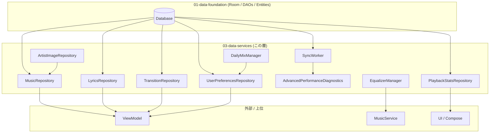

# 03 — Data Services

データレイヤー応用層（Repositories, Backup, Preferences, Workers, Diagnostics, Media, Equalizer, Stats）のメソッドレベル詳細仕様書。

この層は [`../01-data-foundation/database.md`](../01-data-foundation/database.md) で定義された Room エンティティ/DAO の上に成り立ち、上位レイヤー（Presentation/UI, ViewModel, Engine）から呼ばれる公開 API 群を提供します。

---

## ファイル一覧

| ファイル | 内容 | 主な公開型 |
|---|---|---|
| [`repositories.md`](./repositories.md) | 楽曲 / アーティスト / プレイリスト / 歌詞 / フォルダの読み書きを行う Repository 群 | `MusicRepository`, `MusicRepositoryImpl`, `MediaStoreSongRepository`, `SongRepository`, `LyricsRepository`, `LyricsRepositoryImpl`, `TransitionRepository`, `TransitionRepositoryImpl`, `ArtistImageRepository`, `FolderTreeBuilder` |
| [`backup-system.md`](./backup-system.md) | `.pxpl` 形式による設定 / プレイリスト / 統計のエクスポート・インポート | `BackupManager`, `AppDataBackupManager` (legacy), `BackupReader`, `BackupWriter`, `BackupFormatDetector`, `LegacyPayloadAdapter`, `RestorePlanner`, `RestoreExecutor`, `ValidationPipeline`, `BackupFileValidator`, `ManifestValidator`, `ModuleSchemaValidator`, `ContentSanitizer`, `BackupHistoryRepository` + 12 個の `BackupModuleHandler` |
| [`preferences.md`](./preferences.md) | DataStore Preferences をバックエンドとする設定値の読み書き | `UserPreferencesRepository`, `ThemePreferencesRepository`, `EqualizerPreferencesRepository`, `PlaylistPreferencesRepository`, `AiPreferencesRepository`, `PreferenceBackupEntry`, 各種 enum / sealed |
| [`workers.md`](./workers.md) | `WorkManager` 上で動く長時間 / バックグラウンドタスク | `SyncWorker` + `SyncMode`, `SyncManager` + `SyncProgress`, `AiWorker`, `AiWorkerManager`, `NavidromeSyncWorker`, `AlbumGroupingUtils`, `ArtistParsingUtils` |
| [`diagnostics.md`](./diagnostics.md) | パフォーマンス計測 / フレームストール監視 / デバッグレポート生成 | `AdvancedPerformanceDiagnostics`, `AdvancedPerformanceDiagnosticsController`, `MainThreadStallMonitor`, `PerformanceMetrics`, `DebugPerformanceReport` + `DebugPerformanceReportCollector` |
| [`media-processing.md`](./media-processing.md) | メディアメタデータ読み取り / アートワーク URI 生成 / ReplayGain / MediaController 生成 | `AudioMetadataReader`, `AudioMetadataUtils`, `ImageCacheManager`, `MediaControllerFactory`, `MediaMapper`, `ReplayGainManager` |
| [`equalizer.md`](./equalizer.md) | Android AudioEffect（Equalizer / BassBoost / Virtualizer / LoudnessEnhancer）のラッパ | `EqualizerManager`, `EqualizerPreset` |
| [`misc.md`](./misc.md) | 上記カテゴリに属さない補助的なクラス群 | `MediaStoreObserver`, `MediaStorePagingSource`, `M3uManager`, `SharedArtworkContentProvider` |
| [`playback-stats-daily-mix-eot.md`](./playback-stats-daily-mix-eot.md) | 再生統計 / ホームミックス推薦 / End-of-Track ステート | `PlaybackStatsRepository`, `DailyMixManager`, `EotStateHolder` |

---

## レイヤー全体像

---

## 共通依存（横断）

多くの Repository は以下の共通依存を `@Inject` で受け取ります（便宜上ここに集約）。

| 共通依存 | 型 | 役割 |
|---|---|---|
| Application Context | `Context` | ContentResolver 経由の MediaStore アクセス |
| `MusicDao` | Room DAO | songs/albums/artists/playlists テーブル |
| `FavoritesDao` | Room DAO | お気に入りテーブル |
| `LyricsDao` | Room DAO | 歌詞テーブル |
| `SearchHistoryDao` | Room DAO | 検索履歴 |
| `TransitionDao` | Room DAO | トランジションルール |
| `TelegramDao` | Room DAO | Telegram 楽曲 / チャンネル / トピック |
| `EngagementDao` | Room DAO | 再生統計集計 |
| `UserPreferencesRepository` | DataStore | ユーザー設定 |
| `MediaStoreObserver` | ContentObserver | MediaStore 変更通知 |
| `AlbumArtUtils` / `DirectoryFilterUtils` | utils | アルバムアートURI生成 / ディレクトリフィルタ |

---

## Coroutine / Flow 規約

- **`Flow<T>`** は DAO / Preference の Reactive な反応ストリームを表し、collect する側のライフタイムに紐付く。
- **`suspend fun`** は 1 回限りのスナップショットを返すか、副作用のある書き込みを行う。
- **メインスレッドをブロックしない**：`withContext(Dispatchers.IO)` を内部で使い、呼び出し側は `viewModelScope` 等から起動する。
- **`flowOn(Dispatchers.IO)`** は DB クエリ実行スレッドを伝播させる。
- **Mutex** (`kotlinx.coroutines.sync.Mutex`) は読み書き競合を防ぐため内部的に使用される（例: `MusicRepositoryImpl.directoryScanMutex`, `PlaylistPreferencesRepository.editMutex`）。

## Diagnostic 計測規約

- 各重い処理（同期、メタデータ読み取り、アルバムアート抽出等）は `PerformanceMetrics.recordTiming(...)` / `increment(...)` を呼び出し、`DebugPerformanceReportCollector.generate()` によってスナップショット化される。
- 任意のユーザーは `AdvancedPerformanceDiagnostics` を有効化することで、各 WorkManager や IO 経路から `recordEventIfEnabled(...)` 経由でイベントログ（最大 120 件）を記録できる。