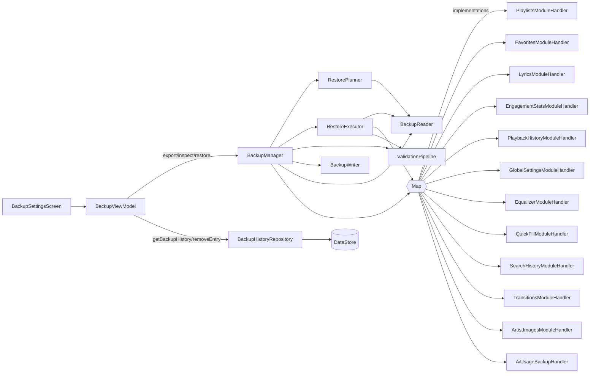
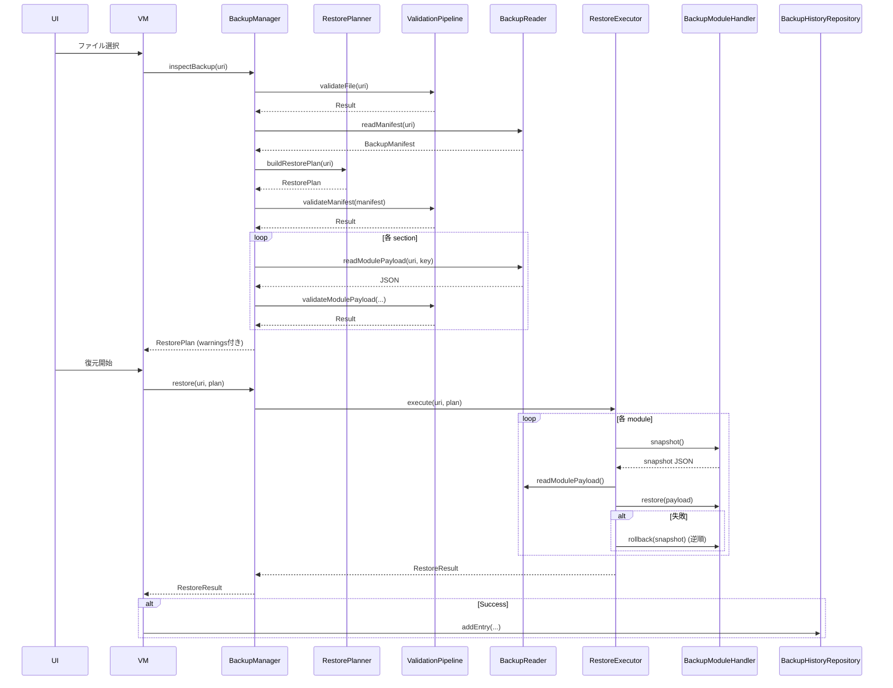

# Backup System

`.pxpl` 形式によるアプリ設定 / プレイリスト / 統計のエクスポート・リストア。 v1 (raw JSON) / v2 (GZIP) / v3 (ZIP with manifest) の 3 つのフォーマットに対応。

## パッケージ

- `com.theveloper.pixelplay.data.backup` — トップレベル（旧形式 `AppDataBackupManager` を含む）
- `com.theveloper.pixelplay.data.backup.format` — ファイル I/O
- `com.theveloper.pixelplay.data.backup.history` — バックアップ履歴
- `com.theveloper.pixelplay.data.backup.model` — データモデル / sealed / enum
- `com.theveloper.pixelplay.data.backup.module` — 12 個の `BackupModuleHandler`
- `com.theveloper.pixelplay.data.backup.restore` — 復元プランナー / 実行
- `com.theveloper.pixelplay.data.backup.validation` — バリデーション

---

## 依存関係

### 上流
- `presentation/screens/settings/BackupSettingsScreen.kt` — UI からの export/inspect/restore 呼び出し
- `presentation/viewmodel/BackupViewModel.kt` — 進行状況と履歴を表示

### 下流
- `data/database/MusicDao.kt`, `FavoritesDao.kt`, `LyricsDao.kt`, `SearchHistoryDao.kt`, `TransitionDao.kt`, `EngagementDao.kt`, `AiUsageDao.kt`
- `data/preferences/UserPreferencesRepository.kt`, `PlaylistPreferencesRepository.kt`
- `data/stats/PlaybackStatsRepository.kt`
- `data/worker/SyncManager.kt` — 復元完了後の再同期検知

---

## 全体アーキテクチャ



---

## ファイル一覧

| ファイル | 行 | 役割 |
|---|---|---|
| `BackupManager.kt` | 222 | export/inspect/restore/history 統合 |
| `AppDataBackupManager.kt` | 498 | v1/v2 レガシー実装（`@Deprecated`）。`BackupSection`, `BackupOperationType`, `BackupTransferProgressUpdate`, `PlaybackHistoryBackupEntry`, `AppDataBackupPayload` も同居 |
| `format/BackupFormatDetector.kt` | 66 | PXPL v3/v2 / Legacy GZIP / Legacy RAW の検出 |
| `format/BackupReader.kt` | 254 | Manifest / 各モジュール Payload / 全モジュール読み出し |
| `format/BackupWriter.kt` | 92 | PXPL v3 (ZIP + manifest + SHA-256) の書き出し |
| `format/LegacyPayloadAdapter.kt` | 130 | v1/v2 → v3 変換 |
| `model/BackupManifest.kt` | 28 | `BackupManifest`, `DeviceInfo`, `BackupModuleInfo` |
| `model/BackupModels.kt` | 88 | `BackupOperationType`, `BackupTransferProgressUpdate`, `PlaybackHistoryBackupEntry`, `ArtistImageBackupEntry`, `BackupHistoryEntry`, `RestorePlan`, `ModuleRestoreDetail`, `BackupValidationResult`, `ValidationError`, `Severity`, `RestoreResult` |
| `model/BackupSection.kt` | 94 | 13 セクション enum（PLAYLISTS, GLOBAL_SETTINGS, FAVORITES, LYRICS, SEARCH_HISTORY, TRANSITIONS, ENGAGEMENT_STATS, PLAYBACK_HISTORY, QUICK_FILL, ARTIST_IMAGES, EQUALIZER, AI_USAGE_LOGS, …） |
| `module/BackupModuleHandler.kt` | 22 | 共通 interface |
| `module/{Playlists,Favorites,Lyrics,SearchHistory,Transitions,EngagementStats,PlaybackHistory,GlobalSettings,QuickFill,Equalizer,ArtistImages,AiUsageBackupHandler}.kt` | 各 | セクション別 export/restore |
| `restore/RestorePlanner.kt` | 56 | バックアップ解析 → `RestorePlan` 生成 |
| `restore/RestoreExecutor.kt` | 162 | スナップショット → 検証 → 復元 → 失敗時ロールバック |
| `validation/ValidationPipeline.kt` | 72 | file/manifest/module の段階的バリデーション |
| `validation/BackupFileValidator.kt` | 183 | PXPL magic / サイズ / zip-bomb チェック |
| `validation/ManifestValidator.kt` | 77 | schemaVersion / timestamp / known module key |
| `validation/ModuleSchemaValidator.kt` | 413 | モジュールごとのスキーマ検証 |
| `validation/ContentSanitizer.kt` | 38 | 文字列 / URL / モジュールキー サニタイズ |
| `history/BackupHistoryRepository.kt` | 75 | DataStore に履歴 JSON 保存（最大 10 件） |

---

## 主要型

### `BackupManifest` (`model/BackupManifest.kt:3`)

```kotlin
data class BackupManifest(
    val schemaVersion: Int = CURRENT_SCHEMA_VERSION, // 3
    val appVersion: String = "",
    val appVersionCode: Int = 0,
    val createdAt: Long = System.currentTimeMillis(),
    val deviceInfo: DeviceInfo = DeviceInfo(),
    val modules: Map<String, BackupModuleInfo> = emptyMap()
)
```

| 補助定数 | 値 | 用途 |
|---|---|---|
| `CURRENT_SCHEMA_VERSION` | 3 | 現行 |
| `MIN_SUPPORTED_VERSION` | 1 | 最低互換バージョン |
| `MANIFEST_FILENAME` | `"manifest.json"` | ZIP 内エントリ名 |

`BackupModuleInfo` は `checksum: "sha256:..."`, `entryCount: Int`, `sizeBytes: Long` を持つ。

### `BackupSection` (`model/BackupSection.kt:5`)

13 セクション。各セクションは `key`, `label`, `description`, `iconRes`, `sinceVersion` を持つ。

| Section | sinceVersion |
|---|---|
| PLAYLISTS, GLOBAL_SETTINGS, FAVORITES, LYRICS, SEARCH_HISTORY, TRANSITIONS, ENGAGEMENT_STATS, PLAYBACK_HISTORY | 1 |
| QUICK_FILL, ARTIST_IMAGES, EQUALIZER | 3 |
| AI_USAGE_LOGS | 4 |

`defaultSelection: Set<BackupSection>` と `fromKey(key: String): BackupSection?` を提供。

### `BackupOperationType` (`model/BackupModels.kt:3`)

`EXPORT` または `IMPORT`。

### `BackupTransferProgressUpdate` (`model/BackupModels.kt:8`)

UI に逐次通知される進捗。`progress: Float`（step/totalSteps、coerceIn 0..1）を派生プロパティとして提供。

### `RestorePlan` (`model/BackupModels.kt:44`)

- `manifest`, `backupUri`, `availableModules`, `selectedModules`, `moduleDetails`, `warnings`

`ModuleRestoreDetail` は `entryCount`, `sizeBytes`, `willOverwrite` を持つ。

### `BackupValidationResult` (`model/BackupModels.kt:59`)

`sealed class`。`Valid` / `Invalid(errors: List<ValidationError>)` の 2 値。`Invalid.fatalErrors` / `warnings` を派生プロパティで提供。`isValid()` で `Valid || (Invalid && fatalErrors.isEmpty())` を判定。

### `ValidationError` (`model/BackupModels.kt:71`)

`code`, `message`, `module`, `severity` (`ERROR` or `WARNING`)。

### `RestoreResult` (`model/BackupModels.kt:80`)

`sealed class`。`Success` / `PartialFailure(succeeded, failed, rolledBack)` / `TotalFailure(error)`。

### `BackupModuleHandler` (`module/BackupModuleHandler.kt:5`)

```kotlin
interface BackupModuleHandler {
    val section: BackupSection
    suspend fun export(): String          // 現在の状態を JSON 文字列に
    suspend fun countEntries(): Int       // manifest の entryCount 用
    suspend fun snapshot(): String        // ロールバック用スナップショット
    suspend fun restore(payload: String)  // payload を復元
    suspend fun rollback(snapshot: String)// スナップショットからロールバック
}
```

### `PlaybackHistoryBackupEntry` / `ArtistImageBackupEntry` / `BackupHistoryEntry` (`model/BackupModels.kt:20-42`)

各 Payload の個別シリアライズ形式。`BackupHistoryEntry` は URI / displayName / createdAt / schemaVersion / modules / sizeBytes / appVersion を持つ。

---

## フォーマット仕様

### v3 (PXPL_V3_ZIP)

| フィールド | 値 |
|---|---|
| Magic | `PXPL` (4 バイト) |
| Payload | `ZipOutputStream` |
| エントリ | `manifest.json` + `<module_key>.json` 群 |
| 整合性 | 各モジュールの SHA-256 を manifest に記載 |

### v2 (PXPL_V2_GZIP)

| フィールド | 値 |
|---|---|
| Magic | `PXPL` |
| Payload | GZIP → 単一 JSON (`AppDataBackupPayload` v2 形式) |

### Legacy GZIP (LEGACY_GZIP)

`PXPL` マジックなし、GZIP のみ。v1 または v2 の `AppDataBackupPayload`。

### Legacy RAW (LEGACY_RAW)

GZIP 展開なしの生 JSON。v1。

---

## `BackupManager` (`BackupManager.kt:30`)

### メソッド

| メソッド | 行 | 戻り値 | 目的 |
|---|---|---|---|
| `export(uri, sections, onProgress)` | 43 | `Result<Unit>` | 各モジュールから JSON を収集し、PXPL v3 で書き出し。`BackupManifest` にパッケージ情報と各モジュールの SHA-256 を埋め込む |
| `inspectBackup(uri)` | 101 | `Result<RestorePlan>` | ファイル検証 → manifest 検証 → 各モジュールのスキーマ検証（任意）。`RestorePlan.warnings` に収集 |
| `restore(uri, plan, onProgress)` | 164 | `RestoreResult` | snapshot → 各モジュール復元 → 失敗時逆順ロールバック → 成功時 `BackupHistoryRepository.addEntry` |
| `getBackupHistory()` | 194 | `Flow<List<BackupHistoryEntry>>` | 履歴 |
| `removeBackupHistoryEntry(uri)` | 198 | `suspend Unit` | 履歴個別削除 |

### 内部実装メモ

- `handlers: Map<BackupSection, BackupModuleHandler>` は Hilt により `@IntoMap` + `@BackupSectionKey` で自動注入される（`di/` 配下）。
- `reportProgress` (`BackupManager.kt:202`) は progress DTO を組み立てる内部ヘルパ。
- 進行報告の `totalSteps = selectedSections.size + 3`（準備 / 収集 / パッケージング / 完了）。

---

## `AppDataBackupManager` (`AppDataBackupManager.kt:124`)

> `@Deprecated("Use BackupManager instead. This class is retained for legacy format reference only.")` — 旧 v1/v2 互換のために残されている。

### メソッド

| メソッド | 行 | 戻り値 | 目的 |
|---|---|---|---|
| `exportToUri(uri, sections, onProgress)` | 148 | `Result<Unit>` | v1/v2 形式の JSON+GZIP を直接書き出し |
| `importFromUri(uri, sections, onProgress)` | 263 | `Result<Unit>` | v1/v2 を読み出し |
| `splitPreferences(entries)` | 396 | `Pair<List, List>` | プレイリスト vs グローバル設定の分類 |
| `restorePreferences(payload, selectedSections)` | 402 | `suspend Unit` | preferences の選択的復元 |
| `encodePayload(payload)` | 444 | `ByteArray` | `PXPL` + GZIP 化 |
| `decodePayload(rawBytes)` | 454 | `AppDataBackupPayload` | PXPL / GZIP / RAW を分岐デコード |

旧 `playlistPreferenceKeys = { "user_playlists_json_v1", "playlist_song_order_modes", "playlists_sort_option" }` を保持。

---

## `BackupFormatDetector` (`format/BackupFormatDetector.kt:5`)

| メソッド | 行 | 戻り値 | 目的 |
|---|---|---|---|
| `detect(header: ByteArray)` | 15 | `Format` | 8 バイトのマジックでフォーマット判定 |
| `readHeader(inputStream, size)` | 51 | `ByteArray` | 先頭バイト列 |

`Format` enum: `PXPL_V3_ZIP`, `PXPL_V2_GZIP`, `LEGACY_GZIP`, `LEGACY_RAW`, `UNKNOWN`。

`PXPL_MAGIC = {'P','X','P','L'}`, `PXPL_MAGIC_SIZE = 4`。

---

## `BackupReader` (`format/BackupReader.kt:19`)

| メソッド | 行 | 戻り値 | 目的 |
|---|---|---|---|
| `readManifest(uri)` | 34 | `Result<BackupManifest>` | マニフェストのみ読込（軽量化） |
| `readModulePayload(uri, moduleKey)` | 59 | `Result<String>` | 1 モジュール JSON |
| `readAllModulePayloads(uri)` | 86 | `Result<Map<String, String>>` | 全モジュール JSON |
| `detectFormat(uri)` | 111 | `Result<Format>` | フォーマット検出 |

| 定数 | 値 |
|---|---|
| `MAX_MANIFEST_BYTES` | `512 * 1024` (512 KB) |
| `MAX_MODULE_PAYLOAD_BYTES` | `16 * 1024 * 1024` (16 MB) |
| `MAX_LEGACY_BACKUP_BYTES` | `32 * 1024 * 1024` (32 MB) |

内部: `skipFully(input, byteCount)` で magic / ヘッダを正確スキップ。

---

## `BackupWriter` (`format/BackupWriter.kt:19`)

| メソッド | 行 | 戻り値 | 目的 |
|---|---|---|---|
| `write(uri, manifest, modulePayloads, onProgress)` | 23 | `Result<Unit>` | PXPL v3 書き出し。各モジュールを SHA-256 でチェックサム、`entryCount` を JSON 配列長から計算 |

`countJsonArrayEntries(json)` (`BackupWriter.kt:79`) は `[` で始まる JSON を `JsonArray` として解析、それ以外は 1。

---

## `LegacyPayloadAdapter` (`format/LegacyPayloadAdapter.kt:19`)

v1/v2 JSON → v3 manifest + per-module JSON map 変換。

| メソッド | 行 | 目的 |
|---|---|---|
| `adapt(legacyJson, gson)` | 24 | `Pair<BackupManifest, Map<String, String>>` を返す |

内部で `splitLegacyPreferences` / `extractJsonArrayModule` / `buildModuleInfo` を呼び、SHA-256 を計算。

---

## `RestorePlanner` (`restore/RestorePlanner.kt:15`)

| メソッド | 行 | 戻り値 | 目的 |
|---|---|---|---|
| `buildRestorePlan(uri)` | 23 | `Result<RestorePlan>` | フォーマット検出 → manifest 読込 → `BackupSection.fromKey` で利用可能モジュール列挙 → legacy < 3 で警告 |

`availableModules = selectedModules` で初期化（呼び出し側で個別フィルタ可能）。

---

## `RestoreExecutor` (`restore/RestoreExecutor.kt:19`)

3 段階トランザクション:

```
PHASE 1: snapshot() — 全モジュールの現状をスナップショット
PHASE 2: 各モジュールに対し readModulePayload → validate → restore() 
PHASE 3: 完了報告
```

失敗時: 復元済みの全モジュール（失敗したものも含む）を逆順で `rollback(snapshot)`。`rollbackSuccess` フラグで `RestoreResult.TotalFailure` (成功) / `RestoreResult.PartialFailure(rolledBack=false)` (失敗) を分岐。

`selectedModules.size * 2 + 3` ステップで進捗計算。

---

## `ValidationPipeline` (`validation/ValidationPipeline.kt:13`)

| メソッド | 行 | 戻り値 | 目的 |
|---|---|---|---|
| `validateFile(uri)` | 21 | `BackupValidationResult` | `BackupFileValidator` に委譲 |
| `validateManifest(manifest)` | 25 | `BackupValidationResult` | `ManifestValidator` に委譲 |
| `validateModulePayload(section, payload, manifest?)` | 29 | `BackupValidationResult` | チェックサム検証 → `ModuleSchemaValidator.validate` |
| `collectWarnings(vararg results)` | 64 | `List<ValidationError>` | `Invalid.warnings` をフラット化 |

---

## `BackupFileValidator` (`validation/BackupFileValidator.kt:19`)

- `MAX_BACKUP_SIZE_BYTES = 50 MB` (`BackupFileValidator.kt:24`)
- `MAX_ZIP_RATIO = 100` (`BackupFileValidator.kt:25`)
- `MAX_TOTAL_DECOMPRESSED_BYTES = 256 MB` (`BackupFileValidator.kt:26`)
- ZIP エントリの **path traversal** (`..`、先頭 `/` / `\`)、**爆発的圧縮率**、**過大展開** を検出
- `.pxpl` / `.gz` 以外の拡張子は警告レベル
- `DocumentFile.fromSingleUri(context, uri).length()` で実体サイズ取得

---

## `ManifestValidator` (`validation/ManifestValidator.kt:13`)

- `schemaVersion < MIN_SUPPORTED_VERSION (1)` → fatal
- `schemaVersion > CURRENT_SCHEMA_VERSION (3)` → warning
- タイムスタンプ: 1 日未来 / 2023 年以前 を warning
- 不明なモジュールキーは warning（skip される）

| メソッド | 行 | 目的 |
|---|---|---|
| `verifyChecksum(moduleKey, payload, manifest)` | 64 | `sha256:<hex>` 形式で一致確認 |

---

## `ModuleSchemaValidator` (`validation/ModuleSchemaValidator.kt:12`)

各セクションごとのスキーマ検証。

- **PLAYLISTS**: 配列（旧形式）またはオブジェクト（新形式 `PlaylistsBackupPayload`）
- **FAVORITES**: `songId` > 0 を要求
- **LYRICS**: `content.length <= MAX_STRING_LENGTH (50_000)`
- **SEARCH_HISTORY**: `query.length <= 500`
- **ENGAGEMENT_STATS**: `playCount`, `totalPlayDurationMs`, `lastPlayedTimestamp` の符号・重複チェック
- **PLAYBACK_HISTORY**: `durationMs >= 0`
- **ARTIST_IMAGES**: HTTPS URL、長さ ≤ 2000
- **TRANSITIONS**: `settings.durationMs in [0, 30000]`
- **PREFERENCES**: `key` 非空、`type in VALID_PREF_TYPES`

---

## `ContentSanitizer` (`validation/ContentSanitizer.kt:7`)

- `DEFAULT_MAX_LENGTH = 10_000`
- 制御文字除去（タブ・改行・復帰を除く `\x00-\x08`, `\x0B`, `\x0C`, `\x0E-\x1F`, `\x7F`）
- `sanitizeUrl(url, maxLength=2000)`: http/https 以外は空文字
- `isValidModuleKey(key)`: `^[a-z_]+$` で 50 文字以内

---

## `BackupHistoryRepository` (`history/BackupHistoryRepository.kt:17`)

DataStore に最大 10 件の `BackupHistoryEntry` を JSON で保存。

| メソッド | 行 | 目的 |
|---|---|---|
| `historyFlow` | 28 | `Flow<List<BackupHistoryEntry>>` |
| `addEntry(entry)` | 41 | 新規エントリを先頭に挿入、同じ URI は除去 |
| `removeEntry(uri)` | 53 | URI 指定削除 |
| `clear()` | 61 | 全消去 |

`MAX_HISTORY_ENTRIES = 10`。

---

## `BackupModuleHandler` 実装

### `PlaylistsModuleHandler` (`module/PlaylistsModuleHandler.kt:32`)

複雑な処理：

- **エクスポート**: `LOCAL_SOURCES = {"LOCAL", "AI"}` のプレイリストのみ。クラウド曲は除外。`songMetadata` (title/artist/album/duration) を各曲に付与。カバー画像は Base64 で同梱。
- **インポート**:
  - **メタデータ一致**: 直接 ID マッチ → `title|artist` 一致 → `album` で曖昧性解消 → `duration` ±2 秒 で曖昧性解消 → それでも曖昧なら破棄。
  - **未解決曲**: `pending_playlists_restore.json` を `filesDir` に保存。
  - **カバー画像復元**: `playlist_cover_<id>.jpg` を書き出し、URI を更新。
- **遅延解決**: `resolvePendingPlaylists` (`PlaylistsModuleHandler.kt:62`) は `SyncManager.syncProgress` を購読し、同期完了時に再度マッチングを試みる。

| キー定数 | 値 |
|---|---|
| `LEGACY_USER_PLAYLISTS_KEY` | `"user_playlists_json_v1"` |
| `LEGACY_PLAYLIST_ORDER_MODES_KEY` | `"playlist_song_order_modes"` |
| `LEGACY_PLAYLIST_SORT_OPTION_KEY` | `"playlists_sort_option"` |
| `PLAYLIST_KEYS` | 上記 3 つの set |
| `LOCAL_SOURCES` | `{"LOCAL", "AI"}` |
| `DURATION_TOLERANCE_MS` | `2000L` |

### `FavoritesModuleHandler` (`module/FavoritesModuleHandler.kt:14`)

`favoritesDao.getAllFavoritesOnce()` → `gson.toJson()` でエクスポート。`replaceAll` で全置換インポート。

### `LyricsModuleHandler` (`module/LyricsModuleHandler.kt:14`)

`lyricsDao.getAll()` を JSON 化、`replaceAll(lyrics)` で全置換。

### `SearchHistoryModuleHandler` (`module/SearchHistoryModuleHandler.kt:14`)

`searchHistoryDao.getAll()` を JSON 化、`replaceAll` で全置換。

### `TransitionsModuleHandler` (`module/TransitionsModuleHandler.kt:14`)

`transitionDao.getAllRulesOnce()` を JSON 化、`replaceAllRules` で全置換。

### `EngagementStatsModuleHandler` (`module/EngagementStatsModuleHandler.kt:17`)

- エクスポート: `engagementDao.getAllEngagements()` を JSON 化。
- インポート: 旧キー（`play_count`, `total_duration` など）へのフォールバックを許容し、`SongId` で `mergeEntries` (max 値) して `replaceAll`。
- 入力エントリ 0 で実エントリも 0 なら例外。

### `PlaybackHistoryModuleHandler` (`module/PlaybackHistoryModuleHandler.kt:14`)

`PlaybackStatsRepository.exportEventsForBackup()` を `PlaybackHistoryBackupEntry` にマップしてエクスポート、インポート時は `clearExisting=true` で置換。

### `GlobalSettingsModuleHandler` (`module/GlobalSettingsModuleHandler.kt:14`)

`UserPreferencesRepository.exportPreferencesForBackup()` のうち、`EXCLUDED_KEYS = PLAYLIST_KEYS ∪ QUICK_FILL_KEYS ∪ EQUALIZER_KEYS` を除いたものをエクスポート。インポート時は `clearPreferencesExceptKeys(...)` で他モジュールのキーを保護。

### `QuickFillModuleHandler` (`module/QuickFillModuleHandler.kt:14`)

`QUICK_FILL_KEYS = {"custom_genres", "custom_genre_icons"}` を専用に扱う。

### `EqualizerModuleHandler` (`module/EqualizerModuleHandler.kt:14`)

`EQUALIZER_KEYS = {"custom_presets_json", "pinned_presets_json"}` を専用に扱う。

### `ArtistImagesModuleHandler` (`module/ArtistImagesModuleHandler.kt:19`)

- エクスポート: `MusicDao.getAllArtistsListRaw()` から画像 URL またはユーザー設定 Base64 を抽出。
- インポート: `musicDao.getArtistIdByName(name)` で解決 → URL 復元 + `artist_art_<id>.jpg` を Base64 デコードして上書き。

### `AiUsageBackupHandler` (`module/AiUsageBackupHandler.kt:11`)

`AiUsageDao` をクリア + `insertAll(logs)` で復元（sinceVersion = 4）。

---

## 復元フロー（シーケンス図）



---

## 関連ファイル

- 上位: `presentation/screens/settings/BackupSettingsScreen.kt`, `presentation/viewmodel/BackupViewModel.kt`
- 下位: `data/database/MusicDao.kt`, `FavoritesDao.kt`, `LyricsDao.kt`, `SearchHistoryDao.kt`, `TransitionDao.kt`, `EngagementDao.kt`, `AiUsageDao.kt`
- 下位 (Preferences): `data/preferences/UserPreferencesRepository.kt`, `data/preferences/PlaylistPreferencesRepository.kt`
- 下位 (Stats): `data/stats/PlaybackStatsRepository.kt`
- DI: `di/BackupModule.kt` で `@IntoMap` + `@BackupSectionKey`
- 詳細: [`repositories.md`](./repositories.md), [`preferences.md`](./preferences.md), [`workers.md`](./workers.md)