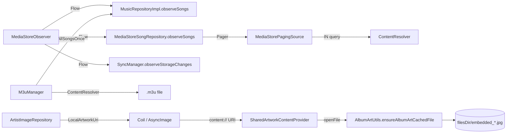

# Misc

カテゴリに属さない補助的なクラス群。MediaStore 監視、Paging、M3U、共有アートワーク ContentProvider。

## 依存関係

### 上流

- `data/repository/MusicRepositoryImpl.kt` — `MediaStoreObserver.mediaStoreChanges` を `combine` で購読
- `data/repository/MediaStoreSongRepository.kt` — `MediaStoreObserver.mediaStoreChanges` を `combine` で購読
- `data/worker/SyncManager.kt` — `MediaStoreObserver.externalMediaStoreChanges` を購読
- `data/paging/MediaStorePagingSource.kt` — ページングソースとして
- `data/provider/SharedArtworkContentProvider.kt` — Coil 等のイメージローダーから参照される
- `data/playlist/M3uManager.kt` — プレイリスト import/export UI から呼び出し

### 下流

- `android.content.ContentObserver` + `androidx.lifecycle.DefaultLifecycleObserver`
- `androidx.paging.PagingSource`
- `android.content.ContentProvider`
- `utils/AlbumArtUtils.kt`, `utils/LocalArtworkUri.kt`
- `data/repository/MusicRepository.kt` (`getAllSongsOnce`)

---

## `MediaStoreObserver` (`data/observer/MediaStoreObserver.kt:21`)

`@Singleton` / `@Inject` で `Context` を受ける。
`ContentObserver(Handler(Looper.getMainLooper()))` + `DefaultLifecycleObserver`。

### 役割

MediaStore 変更通知を `Flow` で配信し、`SyncWorker` の自動起動を駆動。

### 公開 API

| API | 行 | 型 | 目的 |
|---|---|---|---|
| `mediaStoreChanges` | 29 | `SharedFlow<Unit>` (replay=1, DROP_OLDEST) | すべての変更通知。Room 監視用 |
| `externalMediaStoreChanges` | 35 | `SharedFlow<Unit>` (extraBufferCapacity=1, DROP_OLDEST) | `SyncManager` 専用 |
| `register()` | 44 | `Unit` | `MediaStore.Audio.Media.EXTERNAL_CONTENT_URI` と `MediaStore.Files.getContentUri(VOLUME_EXTERNAL)` に ContentObserver を登録（`notifyForDescendants=true`） |
| `unregister()` | 59 | `Unit` | `unregisterContentObserver` |
| `forceRescan()` | 84 | `Unit` | 強制的に `mediaStoreChanges.tryEmit(Unit)` |

### 内部実装メモ

- `init` (`MediaStoreObserver.kt:40`) で `ProcessLifecycleOwner.get().lifecycle.addObserver(this)` を実行し、MainActivity なしでも動作。
- `onStart` で `register()`、`onStop` / `onDestroy` で `unregister()`。
- `onChange(selfChange, uri)` (`MediaStoreObserver.kt:78`) で 2 つの Flow に `tryEmit(Unit)`。

### 依存関係

- 上流: `data/worker/SyncManager.kt` (`observeStorageChanges`)
- 下流: `data/repository/MusicRepositoryImpl.kt` (`observeSongs` の `combine` 入力)
- 下流: `data/repository/MediaStoreSongRepository.kt` (同上)

### 内部実装メモ（追加）

- **3 つの public Flow プロパティ**:
  - `mediaStoreChanges` — 内部の `_mediaStoreChanges` (`MutableSharedFlow<Unit>(replay=1, onBufferOverflow=BufferOverflow.DROP_OLDEST)`) を `asSharedFlow()` で公開
  - `externalMediaStoreChanges` — 内部の `_externalMediaStoreChanges` (`MutableSharedFlow<Unit>(extraBufferCapacity=1, onBufferOverflow=BufferOverflow.DROP_OLDEST)`) を `asSharedFlow()` で公開
  - いずれも `Unit` ペイロード
- **状態管理**: `@Volatile var isRegistered: Boolean` で二重登録抑止
- **Lifecycle binding**: `ProcessLifecycleOwner.get().lifecycle.addObserver(this)` で Application スコープに紐付け
- **ContentObserver callback**: `Handler(Looper.getMainLooper())` 経由で UI スレッドへ通知
- **register()**: 2 つの URI (`MediaStore.Audio.Media.EXTERNAL_CONTENT_URI`, `MediaStore.Files.getContentUri(VOLUME_EXTERNAL)`) に `notifyForDescendants=true` で登録。`isRegistered` フラグで冪等性を保証
- **unregister()**: `unregisterContentObserver(this)` のみ。`isRegistered=false` で冪等
- **onChange()**: `tryEmit(Unit)` で 2 つの Flow に両方通知。失敗しても例外を伝播させない
- **forceRescan()**: `mediaStoreChanges` のみに emit（pull-to-refresh ボタン押下時など）

---

## `MediaStorePagingSource` (`data/paging/MediaStorePagingSource.kt:21`)

`PagingSource<Int, Song>` の実装。MediaStore から事前にフィルタした ID リストに基づき、`IN (...)` クエリでページング取得する。

### 公開 API

| API | 行 | 戻り値 | 目的 |
|---|---|---|---|
| `getRefreshKey(state)` | 30 | `Int?` | 隣接ページからリフレッシュキー計算 |
| `load(params)` | 37 | `LoadResult<Int, Song>` | 1 ページ分の楽曲を返す |

### 内部実装メモ

- コンストラクタ: `filteredIds: List<Long>` (directory / duration フィルタ済み), `songIdToGenreMap: Map<Long, String>`。
- `load` (`MediaStorePagingSource.kt:37`) で `pageIndex * loadSize` 〜 `min(start + loadSize, filteredIds.size)` を slice し、`fetchSongDetails(idsToLoad)` で MediaStore から詳細取得。
- `IN (...)` クエリは順序保証なしのため、取得後に `idsToLoad` の順にソートし直す (`MediaStorePagingSource.kt:64`)。
- 楽曲は `AlbumArtUtils.getAlbumArtUri(...)` でアート URI を補完。
- `trackNumber % 1000` でトラック番号を抽出（ディスク番号は `trackNumber / 1000` で派生）。

### フィールド詳細

| フィールド | 行 | 型 | 用途 |
|---|---|---|---|
| `context` | 22 | `Context` | ContentResolver クエリ用 |
| `filteredIds` | 23 | `List<Long>` | ディレクトリ / duration フィルタ済み ID 列 |
| `songIdToGenreMap` | 24 | `Map<Long, String>` | Genres テーブルから構築済みルックアップ |

### private `fetchSongDetails(ids)` (行 85)

- `${MediaStore.Audio.Media._ID} IN (${ids.joinToString(",")})` で MediaStore クエリ
- 12 カラムを projection 取得
- 各行を `Song` オブジェクトにマッピング
- `albumArtUriString` は `AlbumArtUtils.getAlbumArtUri(...)` で補完
- `genre` は `songIdToGenreMap[id]` で補完

### LoadResult 分岐

| 状況 | 戻り値 |
|---|---|
| `filteredIds` 空 | `LoadResult.Page(emptyList(), null, null)` |
| `start >= filteredIds.size` | `LoadResult.Page(emptyList(), prevKey=?, nextKey=null)` |
| 通常ページ | `LoadResult.Page(orderedSongs, prevKey=?, nextKey=?)` |
| 例外 | `LoadResult.Error(e)` |

### 依存関係

- 上流: `data/repository/MediaStoreSongRepository.kt` (`getPaginatedSongs()` の `pagingSourceFactory`)
- 下流: `utils/AlbumArtUtils.kt`

---

## `M3uManager` (`data/playlist/M3uManager.kt:15`)

`@Singleton` / `@Inject` で `Context`, `MusicRepository` を受ける。

### 公開 API

| メソッド | 行 | 戻り値 | 目的 |
|---|---|---|---|
| `parseM3u(uri)` | 20 | `suspend Pair<String, List<String>>` | `.m3u`/`.m3u8` をパースして (プレイリスト名, songIds) を返す |
| `generateM3u(playlist, songs)` | 73 | `String` | `#EXTM3U` 形式の文字列を生成 |

### 内部実装メモ

#### `parseM3u` マッチング戦略

1. `musicRepository.getAllSongsOnce()` で全曲スナップショット取得 → 3 つの Lookup Map 構築
   - `songsByPath: Map<String, Song>` — フルパス
   - `songsByFileName: Map<String, List<Song>>` — ファイル名のみ
   - `songsByContentUriFileName: Map<String, List<Song>>` — content URI のファイル名部分
2. 行ごとに (1) 完全パス → (2) ファイル名 (ファイルパスマップ) → (3) content URI ファイル名 の順で照合
3. `#` で始まる行はスキップ（EXTINF メタデータは未対応）
4. `playlistName` は `DISPLAY_NAME` から `.m3u` / `.m3u8` を除去した値

#### `parseM3u` のコード詳細

```
val allSongs = musicRepository.getAllSongsOnce()
val songsByPath = allSongs.associateBy { it.path }
val songsByFileName = allSongs.groupBy { it.path.substringAfterLast("/") }
val songsByContentUriFileName = allSongs.groupBy { it.contentUriString.substringAfterLast("/") }

contentResolver.openInputStream(uri)?.use { inputStream ->
    BufferedReader(InputStreamReader(inputStream)).use { reader ->
        while (reader.readLine()?.let { line ->
            val trimmed = line.trim()
            if (trimmed.isEmpty() || trimmed.startsWith("#")) return@let
            val song = songsByPath[trimmed]
                ?: songsByFileName[trimmed.substringAfterLast("/")]?.firstOrNull()
                ?: songsByContentUriFileName[trimmed.substringAfterLast("/")]?.firstOrNull()
            song?.let { songIds.add(it.id) }
        } != null) { /* loop */ }
    }
}
```

#### `generateM3u`

`#EXTM3U` + 各曲 `#EXTINF:<durationSec>,<artist> - <title>\n<path>\n`。

#### エクスポート形式例

```
#EXTM3U
#EXTINF:180,Artist Name - Song Title
/storage/emulated/0/Music/song.mp3
```

### 依存関係

- 上流: `presentation/screens/playlists/...` のインポート / エクスポート UI
- 下流: `data/repository/MusicRepository.kt`

---

## `SharedArtworkContentProvider` (`data/provider/SharedArtworkContentProvider.kt:14`)

`ContentProvider` を継承し、`content://<packageName>.artwork/song/<songId>?t=<cacheBust>` URI でアルバムアートワークを共有する。

### 登録方法

`AndroidManifest.xml` で `<provider android:authorities="${applicationId}.artwork" android:exported="true" .../>` として登録。

### 公開 API (ContentProvider)

| メソッド | 行 | 戻り値 | 目的 |
|---|---|---|---|
| `onCreate()` | 16 | `Boolean = true` | 初期化 |
| `query(...)` | 18 | `Cursor? = null` | 検索は非対応（read-only ファイル配信専用） |
| `getType(uri)` | 26 | `String?` | `"image/jpeg"` を返す（songId がパース可能な場合） |
| `insert(...)` | 35 | `Uri? = null` | 非対応 |
| `delete(...)` | 37 | `Int = 0` | 非対応 |
| `update(...)` | 39 | `Int = 0` | 非対応 |
| `openFile(uri, mode)` | 46 | `ParcelFileDescriptor` | `"r"` モードのみ。`AlbumArtUtils.ensureAlbumArtCachedFile(...)` でファイルを取得して開く |
| `openAssetFile(uri, mode)` | 57 | `AssetFileDescriptor` | `openFile` のラッパ |

### 内部実装メモ

- `parseSongId(uri, packageName?)` (`SharedArtworkContentProvider.kt:104`):
  - `packageName` 指定時: `"content://${authority}/song/"` プレフィックスを期待
  - プレフィックスはスキップ、`?` と `/` の前までが songId
  - songId 部分が `Long?` としてパース可能なら返す
- `authority(packageName)` = `"${packageName}.artwork"`
- `buildSongUri(context, songId, cacheBustToken?)` で URI を構築。`?t=<token>` 付きならキャッシュバスティング。

### companion 定数

| 定数 | 値 |
|---|---|
| `AUTHORITY_SUFFIX` | `".artwork"` |
| `PATH_SONG` | `"song"` |
| `DEFAULT_CONTENT_TYPE` | `"image/jpeg"` |

### URI 形式

```
content://<applicationId>.artwork/song/<songId>?t=<cacheBustToken>
```

### openFile の動作

1. `mode != "r"` → `FileNotFoundException("Shared artwork provider is read-only")`
2. `resolveArtworkFile(uri)` で `parseSongId(uri, packageName)` → `AlbumArtUtils.ensureAlbumArtCachedFile(context, songId)?.takeIf { exists && isFile && canRead }`
3. ファイルがあれば `ParcelFileDescriptor.open(file, MODE_READ_ONLY)` で返す
4. なければ `FileNotFoundException("No artwork found for uri=$uri")`

### セキュリティ

- 外部アプリからのアクセスは `android:exported="true"` だが、`packageName` プレフィックスチェックにより同一パッケージの URI のみ受け付ける設計
- 実際は `<applicationId>.artwork` という固有 authority により、他アプリは ContentResolver 経由で参照不可

### 関連 URI ヘルパ (`LocalArtworkUri`)

`utils/LocalArtworkUri.kt` で以下を提供：
- `isLocalArtworkUri(uri: String): Boolean` — スキーム + ホスト判定
- `parseSongId(uri): Long?` — 簡易パース版
- `buildSongUri(songId: Long): Uri` — songId → URI 生成
- `looksLikeVolatileArtworkUri(uri): Boolean` — 揮発性 URI 検出（ContentResolver を経由する動的 URI）

これらは SharedArtworkContentProvider の URI と相互運用される。

### 依存関係

- 上流: `presentation/...` の `AsyncImage` / Coil
- 下流: `utils/AlbumArtUtils.kt` (`ensureAlbumArtCachedFile`, `parseSongId`)
- 下流: `data/repository/ArtistImageRepository.kt` (`LocalArtworkUri.buildSongUri`)

---

## 内部実装メモ (横断)

### MediaStore 変更通知の 2 系統

- **`mediaStoreChanges`** (replay=1): Room 監視用。Flow の `combine` で「最新 1 件」を常に保持するため、Activity 再生成時にも即座に最新値が流れる。
- **`externalMediaStoreChanges`** (extraBufferCapacity=1): `SyncManager` のデバウンス付き自動起動用。バッファ 1 で多重起動を防ぐ。

### PagingSource の `IN (...)` クエリの限界

Android SQLite の `?` プレースホルダ上限（既定 999）を考慮し、`MediaStoreSongRepository.getFilteredSongIds` で事前に ID フィルタ → ページング取得の 2 段戦略を採用。`MediaStorePagingSource.load` はその ID を slice するだけ。

### M3U のルーズマッチ

`parseM3u` は厳密なパス一致を保証しない。**クロスデバイス export/import 用**であり、ローカル絶対パスが一致しないケースを想定してファイル名フォールバックを持つ（コメント `M3uManager.kt:24-30`）。

### 共有アートワーク ContentProvider のセキュリティ

- `mode != "r"` は `FileNotFoundException` で拒否
- songId がパースできない URI は `null` を返してアクセス拒否
- `packageName` プレフィックスチェックで外部アプリからの不正 URI を防ぐ

### Observer / PagingSource / M3U / ContentProvider の相互関係



### 注意点

- `MediaStoreObserver` の `ContentObserver` コールバックは **Main Looper** で実行されるため、変更通知を DB クエリに伝播させる `combine` などは重い IO を行う前に `flowOn(Dispatchers.IO)` で切り替えが必要。
- `MediaStorePagingSource.load` は `withContext(Dispatchers.IO)` を明示しており、IO スレッドで実行される。
- `M3uManager` は `getAllSongsOnce()` で全曲を取得するため、ライブラリが大きい場合はメモリ消費に注意。`getAllSongsOnce` はディレクトリフィルタを適用するため、フィルタ済み件数を意識する。
- `SharedArtworkContentProvider` は `android:exported="true"` だが、`applicationId.artwork` という固有 authority により実質的に外部アプリからのアクセスは不可能（ContentResolver 経由で他アプリが `applicationId` を知る必要がある）。

---

## 関連ファイル

- 上位: `data/repository/MediaStoreSongRepository.kt`, `data/repository/MusicRepositoryImpl.kt`, `data/worker/SyncManager.kt`, `presentation/screens/.../PlaylistScreen.kt`
- 下流: `utils/AlbumArtUtils.kt`, `utils/LocalArtworkUri.kt`
- 関連: [`repositories.md`](./repositories.md), [`workers.md`](./workers.md)