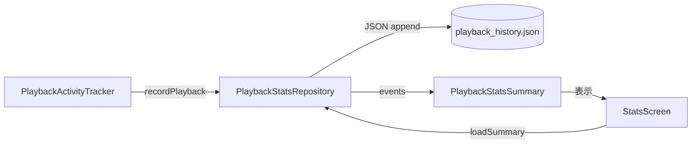

# Playback Stats / Daily Mix / End-of-Track

再生統計集計 / ホームミックス推薦 / End-of-Track タイマー状態。

---

## `PlaybackStatsRepository` (`data/stats/PlaybackStatsRepository.kt:39`)

`@Singleton` / `@Inject` で `Context` を受ける。
`AtomicFile` + Gson で `filesDir/playback_history.json` を読み書き。

### データクラス

| クラス | 行 | フィールド |
|---|---|---|
| `PlaybackEvent` | 54 | `songId: String`, `timestamp: Long`, `durationMs: Long`, `startTimestamp: Long?`, `endTimestamp: Long?` |
| `PlaybackHistoryEntry` | 62 | `songId: String`, `timestamp: Long` |
| `SongPlaybackSummary` | 67 | `songId`, `title`, `artist`, `albumArtUri`, `totalDurationMs`, `playCount` |
| `ArtistPlaybackSummary` | 76 | `artist`, `totalDurationMs`, `playCount`, `uniqueSongs` |
| `GenrePlaybackSummary` | 83 | `genre`, `totalDurationMs`, `playCount`, `uniqueArtists` |
| `AlbumPlaybackSummary` | 90 | `album`, `albumArtUri`, `totalDurationMs`, `playCount`, `uniqueSongs` |
| `TimelineEntry` | 98 | `label`, `totalDurationMs`, `playCount` |
| `PlaybackSegment` | 104 | `songId`, `startMillis`, `endMillis` + 派生 `durationMs` |
| `PlaybackSpan` | 113 | `startMillis`, `endMillis` + 派生 `durationMs` |
| `DayListeningDistribution` | 121 | `bucketSizeMinutes`, `buckets`, `maxBucketDurationMs`, `days` |
| `DailyListeningBucket` | 128 | `startMinute`, `endMinuteExclusive`, `totalDurationMs` |
| `DailyListeningDay` | 134 | `date: LocalDate`, `buckets`, `totalDurationMs` |
| `PlaybackStatsSummary` | 140 | `range`, `startTimestamp`, `endTimestamp`, `totalDurationMs`, `totalPlayCount`, `uniqueSongs`, `averageDailyDurationMs`, `songs`, `topSongs`, `topGenres`, `timeline`, `topArtists`, `topAlbums`, `activeDays`, `longestStreakDays`, `totalSessions`, `averageSessionDurationMs`, `longestSessionDurationMs`, `averageSessionsPerDay`, `dayListeningDistribution`, `peakTimeline`, `peakDayLabel`, `peakDayDurationMs` |

### 定数

| 定数 | 値 |
|---|---|
| `sessionGapThresholdMs` | `30 * 60 * 1000L` (30 分) |
| `MAX_HISTORY_AGE_MS` | (内部) |
| `MAX_SONG_STATS_COUNT` | (内部) |
| `MAX_PLAYBACK_HISTORY_LIMIT` | (内部) |
| `DEFAULT_PLAYBACK_HISTORY_LIMIT` | (内部) |

### 公開 API

| API | 行 | 戻り値 | 目的 |
|---|---|---|---|
| `refreshFlow` | 50 | `StateFlow<Long>` | 履歴変更通知（バージョン番号） |
| `recordPlayback(songId, durationMs, timestamp)` | 166 | `suspend Unit` | イベントを 1 件追加（30 分以上古ければ削除） |
| `loadSummary(range, songs, nowMillis)` | 195 | `suspend PlaybackStatsSummary` | サマリ計算 |
| `exportEventsForBackup()` | 461 | `suspend List<PlaybackEvent>` | バックアップ用エクスポート |
| `loadPlaybackHistory(limit)` | 465 | `suspend List<PlaybackHistoryEntry>` | 履歴を新しい順に取得 |
| `importEventsFromBackup(events, clearExisting=true)` | 481 | `suspend Unit` | リストア（distinctBy + sanitize） |
| `requestRefresh()` | 505 | `Unit` | `refreshFlow++` |

### 内部実装メモ

- **ファイル管理**: `AtomicFile` で atomic 書き込み、`fileLock` で同期、`cachedEvents` メモリキャッシュ。
- **履歴ローテーション**: `MAX_HISTORY_AGE_MS` を超える古いイベントを `recordPlayback` 時に削除。
- **サマリ計算 (`buildSummaryFromEvents`)**: 時間範囲フィルタ → クリッピング → 楽曲集約 → トップ N 抽出 → セッション集計 → 日別バケット集計 → ピーク算出の多段処理。
- **`mergeSongEvents`** (`PlaybackStatsRepository.kt:576`): 同一楽曲の重複区間をマージ。
- **`mergeSpans`** (`PlaybackStatsRepository.kt:599`): 全楽曲の区間をマージして重複除去。
- **タイムラインバケット**: `createTimelineBuckets` → 日 / 週 / 月 / 年 / 全期間 (`PlaybackStatsRepository.kt:905-1020`)。
- **セッション検出**: `sessionGapThresholdMs = 30 分` を超えるギャップで新セッション (`PlaybackStatsRepository.kt:782`)。

---

## `DailyMixManager` (`data/DailyMixManager.kt:26`)

`@Singleton` / `@Inject` で `Context`, `EngagementDao` を受ける。

### データクラス

| クラス | 行 | フィールド |
|---|---|---|
| `SongEngagementStats` | 45 | `playCount: Int = 0`, `totalPlayDurationMs: Long = 0L`, `lastPlayedTimestamp: Long = 0L` |
| `RankedSong` (private) | 621 | `song`, `finalScore`, `discoveryScore`, `affinityScore`, `recencyScore`, `noveltyScore`, `favoriteScore` |
| `DiversityState` (private) | 631 | `artistCounts: Map<Long, Int>`, `genreCounts: Map<String, Int>`, `unknownGenreCount: Int` |

### 定数

| 定数 | 値 | 用途 |
|---|---|---|
| `SCORE_KEY_CANDIDATES` | `["score", "count", "value"]` | 旧 JSON パース用 |

### 状態

| フィールド | 行 | 用途 |
|---|---|---|
| `gson` | 31 | JSON |
| `legacyScoresFile` | 32 | `filesDir/song_scores.json` |
| `fileLock` | 33 | 同期 |
| `managerScope` | 37 | `SupervisorJob + Dispatchers.IO` |
| `migrationDeferred` | 40 | `Deferred<Unit>` |
| `legacyMigrationComplete` | 43 | フラグ |

### 公開 API

| API | 行 | 戻り値 | 目的 |
|---|---|---|---|
| `recordPlay(songId, songDurationMs, timestamp)` | 248 | `suspend Unit` | Room の `engagementDao.recordPlay(...)` |
| `incrementScore(songId)` | 260 | `suspend Unit` | `recordPlay` のシンタックスシュガー |
| `getScore(songId)` | 264 | `suspend Int` | `playCount` を取得 |
| `getEngagementStats(songId)` | 268 | `suspend SongEngagementStats?` | DB 1 件取得 |
| `getAllEngagementStats()` | 278 | `suspend Map<String, SongEngagementStats>` | 全件マップ |
| `generateDailyMix(allSongs, favoriteSongIds, limit=30)` | 365 | `suspend List<Song>` | デイリーミックス生成 |
| `generateYourMix(allSongs, favoriteSongIds, limit=60)` | 408 | `suspend List<Song>` | ユアミックス生成 |
| `getTopCandidatesForAi(allSongs, favoriteSongIds, limit=100)` | 493 | `suspend List<Song>` | AI 用候補 |

### 内部実装メモ

#### マイグレーション (`migrateLegacyDataIfNeeded`)

`init` (`DailyMixManager.kt:51`) で `managerScope.async { migrateLegacyDataIfNeeded() }` を起動。`filesDir/song_scores.json` を読み込み → Room に upsert → `song_scores.json.bak` にリネーム。

#### レガシー JSON パース (`parseEngagementElement`)

- `JsonObject` か `JsonArray` か判別して分岐。
- 各エントリがオブジェクトなら `SongEngagementStats` にパース、または `score`/`count`/`value` キーの数値を `playCount` に変換。

#### スコアリングアルゴリズム (`computeRankedSongs`)

各楽曲に 5 つのスコアを計算し、重み付け合計で `finalScore` を算出：

| スコア | 重み | 計算 |
|---|---|---|
| `preferenceScore` | 0.45 | artist (0.45) + genre (0.35) + favorite (0.20) の重み付き |
| `affinityScore` | 0.25 | `playCount/maxPlay * 0.7 + duration/maxDuration * 0.3` |
| `recencyScore` | 0.15 | `computeRecencyScore`: <1 日→0.2, <3 日→0.5, <7 日→0.7, <14 日→0.85, それ以外 1.0 |
| `favoriteScore` | 0.10 | お気に入りなら 1.0 |
| `noveltyScore` | 0.05 | `computeNoveltyScore`: `(1 - daysSinceAdded/60).coerceIn(0,1)` |
| `baselineScore` | - | 未再生曲は 0.1 |
| `noise` | - | `random.nextDouble() * 0.005` |

`discoveryScore = (1 - affinity) * 0.6 + novelty * 0.25 + preference * 0.15`。

#### 日次シード (`generateDailyMix`)

`Calendar` から `YEAR * 1000 + DAY_OF_YEAR` を Random シードに。`generateYourMix` は `+ 17`、`getTopCandidatesForAi` は `+ 42` で派生シードを使い、同一日内の複数呼び出しで同じリストになる（AI プロンプトキャッシュ最適化）。

#### ダイバーシティ制約 (`pickWithDiversity`)

- 1 アーティストあたり最大 2 件（お気に入りは 3 件）
- 1 ジャンルあたり `maxKnownGenreCount(limit, isFavorite)` 件
- 不明ジャンルは `maxUnknownGenreCount(limit, isFavorite)` 件
- クォータに満たない場合は残りを順に追加

| 関数 | 行 | 用途 |
|---|---|---|
| `normalizeGenreKey(rawGenre)` | 566 | "unknown" を含む場合は null |
| `maxKnownGenreCount(limit, isFavorite)` | 580 | 12以下→2、30以下→3、それ以上→4（お気に入り+1） |
| `maxUnknownGenreCount(limit, isFavorite)` | 589 | 12以下→1、30以下→2、それ以上→3（お気に入り+1） |
| `computeRecencyScore(lastPlayed, now)` | 598 | 再生からの経過日数でスコア |
| `computeNoveltyScore(dateAdded, now)` | 610 | 追加からの経過日数で逆スコア（60 日で 0） |

#### `generateYourMix` の 3 段構成

- お気に入りセクション (30% / 最低 5 件)
- コアセクション (45% / 最低 10 件)
- ディスカバリーセクション (残り)
- 各セクション間で `LinkedHashSet<Song>` で重複排除しつつ順序を保持

---

## `EotStateHolder` (`data/EotStateHolder.kt:13`)

`object` (シングルトン)。End-of-Track タイマーの対象曲を共有するステートホルダー。

### 公開 API

| API | 行 | 型 | 目的 |
|---|---|---|---|
| `eotTargetSongId` | 15 | `StateFlow<String?>` | EOT 対象曲の ID、null は非アクティブ |
| `setEotTargetSong(songId)` | 23 | `Unit` | `null` で解除、`String` でセット |

### 役割

`PlayerViewModel` と `MusicService` 間の EOT 状態共有。シングルトン object なので DI 不要。

---

## 内部実装メモ (横断)

### 再生統計の集計パイプライン

- セッションギャップ 30 分で区切るため、長時間連続再生でも 1 セッションとして集計される。
- `MAX_HISTORY_AGE_MS` を超える古いイベントは自動削除され、統計が無制限に膨らまない。

### デイリーミックス vs ユアミックス

| 側面 | DailyMix | YourMix |
|---|---|---|
| 件数 | 30 | 60 |
| 構成 | 単一ランキング | お気に入り 30% + コア 45% + ディスカバリー残り |
| 推奨シーン | 朝 / 通勤 | 長時間リスニング |
| シード | `YEAR * 1000 + DAY_OF_YEAR` | `+ 17` |

### EOT ステートの適用例

- ユーザーが曲終了 5 秒前に「次の曲へ」を予約 → `EotStateHolder.setEotTargetSong(nextSongId)`
- `MusicService` が `eotTargetSongId` を購読し、対象曲再生後にフェードアウト / 次の曲頭出し

---

## 関連ファイル

- 上位: `presentation/viewmodel/PlayerViewModel.kt`, `presentation/viewmodel/HomeViewModel.kt`, `presentation/screens/HomeScreen.kt`, `presentation/screens/settings/StatsScreen.kt`
- 下流: `data/database/EngagementDao.kt`, `data/database/MusicDao.kt`
- 関連: [`repositories.md`](./repositories.md), [`preferences.md`](./preferences.md), [`workers.md`](./workers.md)