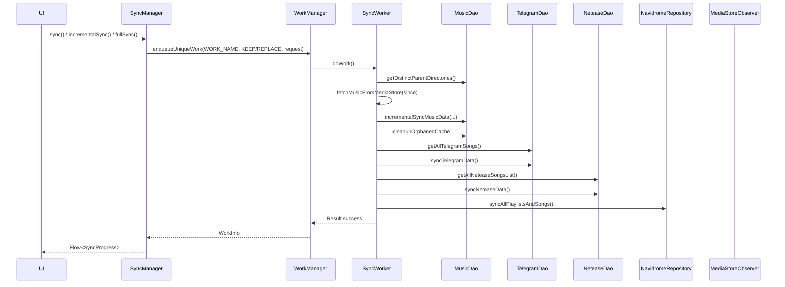

# Workers (WorkManager)

`WorkManager` 上で動く長時間 / バックグラウンドタスク群。

## パッケージ

`com.theveloper.pixelplay.data.worker`

---

## 依存関係

### 上流
- `presentation/viewmodel/LibraryViewModel.kt` — `SyncManager.sync()`, `incrementalSync()`, `fullSync()`, `rebuildDatabase()`, `forceRefresh()` を呼び出し
- `presentation/screens/LibraryScreen.kt` — pull-to-refresh
- `data/repository/MusicRepositoryImpl.kt` — Telegram 同期トリガ (`requestTelegramUnifiedSync`)
- `data/backup/module/PlaylistsModuleHandler.kt` — `SyncManager.syncProgress` を購読して遅延解決
- `data/navidrome/...` — NavidromeSyncWorker を enqueue
- `data/ai/...` — `AiWorkerManager.enqueueAiTask`

### 下流
- `data/repository/MusicRepository.kt`, `LyricsRepository.kt`
- `data/database/MusicDao.kt`, `TelegramDao.kt`, `NeteaseDao.kt`
- `data/navidrome/NavidromeRepository.kt`
- `data/preferences/UserPreferencesRepository.kt`
- `data/observer/MediaStoreObserver.kt`
- `data/diagnostics/PerformanceMetrics.kt`, `AdvancedPerformanceDiagnostics.kt`

---

## ファイル一覧

| ファイル | 行 | 役割 |
|---|---|---|
| `SyncWorker.kt` | 1736 | MediaStore 同期 + LRC 走査 + アルバムアートキャッシュ + Telegram / Netease / Navidrome 統合 |
| `SyncManager.kt` | 372 | WorkManager を抽象化した sync コントロールパネル（Flow 公開） |
| `AiWorker.kt` | 110 | AI 推論タスク（LLM 呼び出し、digest 生成） |
| `AiWorkerManager.kt` | 52 | AI タスクの enqueue / キャンセル |
| `NavidromeSyncWorker.kt` | 111 | Navidrome サーバー同期 |
| `AlbumGroupingUtils.kt` | 172 | アルバムグルーピングキー生成（internal） |
| `ArtistParsingUtils.kt` | 54 | アーティスト名のパース・優先順位決定（internal） |

---

## `SyncMode` enum (`SyncWorker.kt:63`)

| 値 | 用途 |
|---|---|
| `INCREMENTAL` | `lastSyncTimestamp` 以降の差分 |
| `FULL` | 全件再スキャン（directory ルール変更時等） |
| `REBUILD` | DB を完全にクリアして再構築 |

---

## `SyncWorker` (`SyncWorker.kt:69`)

`@HiltWorker` / `@AssistedInject` で `MusicDao`, `UserPreferencesRepository`, `LyricsRepository`, `TelegramDao`, `NeteaseDao`, `NavidromeRepository` を受ける。

### 公開 companion API

| API | 行 | 戻り値 | 目的 |
|---|---|---|---|
| `WORK_NAME` | 1204 | `String` | `enqueueUniqueWork` 用の一意名 |
| `PERIODIC_MAINTENANCE_WORK_NAME` | 1207 | `String` | 24 時間ごとのメンテンナンス（充電中・Wi-Fi のみ） |
| `INPUT_FORCE_METADATA` | 1210 | `String` ("input_force_metadata") | `boolean` |
| `INPUT_RUN_MAINTENANCE` | 1211 | `String` ("input_run_maintenance") | `boolean` |
| `INPUT_SYNC_MODE` | 1212 | `String` ("input_sync_mode") | `SyncMode.name` |
| `PROGRESS_CURRENT` | 1219 | `String` | `int` |
| `PROGRESS_TOTAL` | 1220 | `String` | `int` |
| `PROGRESS_PHASE` | 1221 | `String` | `int` (SyncProgress.SyncPhase.ordinal) |
| `OUTPUT_TOTAL_SONGS` | 1222 | `String` | `long` |
| `startUpSyncWork(deepScan)` | 1244 | `OneTimeWorkRequest` | INCREMENTAL + maintenance=true |
| `incrementalSyncWork(runMaintenance)` | 1255 | `OneTimeWorkRequest` | INCREMENTAL |
| `fullSyncWork(deepScan)` | 1276 | `OneTimeWorkRequest` | FULL + heavySyncConstraints (`storageNotLow`) |
| `rebuildDatabaseWork()` | 1290 | `OneTimeWorkRequest` | REBUILD + heavySyncConstraints |
| `periodicMaintenanceWork()` | 1304 | `PeriodicWorkRequest` | 24 時間、`charging + unmetered + storageNotLow` |
| `invalidateGenreCache()` | 1238 | `Unit` | ジャンルキャッシュ手動無効化 |

`heavySyncConstraints` (`SyncWorker.kt:1271`) は `Constraints.Builder().setRequiresStorageNotLow(true).build()`。

`MAX_PLAYBACK_DEFERRALS = 5` (`SyncWorker.kt:1216`) — 再生アクティブ時の INCREMENTAL 再試行上限。

`TELEGRAM_SYNC_CHUNK_SIZE = 500` (`SyncWorker.kt:1225`) — Telegram 同期のチャンクサイズ（メモリ保護）。

`NETEASE_SONG_ID_OFFSET = 3_000_000_000_000L` 等の Netease ID オフセット (`SyncWorker.kt:1227-1231`) で Netease 楽曲を統一 songs テーブルの負 ID として扱う。

`GENRE_CACHE_TTL_MS = 1h` でジャンルマップキャッシュを共有 (`SyncWorker.kt:1234-1236`)。

### `doWork()` (`SyncWorker.kt:87`)

主要な処理フロー：

1. `inputData` から `SyncMode`, `forceMetadata`, `runMaintenance` を読む。
2. **再生中なら INCREMENTAL は `retry()`** — `runAttemptCount < MAX_PLAYBACK_DEFERRALS` の間バックオフ。
3. `userPreferences` から `artistDelimiters`, `allowedDirectories`, `minSongDuration` 等を `.first()` で取得。
4. **削除フェーズ**: `INCREMENTAL/FULL` のみ。`localSongIds ∖ mediaStoreIds` を 500 件ずつ削除。
5. **取得フェーズ**:
   - `INCREMENTAL && !rescanRequired && !directoryRulesChanged && !isFreshInstall` なら `lastSyncTimestamp / 1000` で差分クエリ。
   - それ以外は 0 (全件)。
6. **処理フェーズ**: `preProcessAndDeduplicateWithMultiArtist(...)` で曲・アルバム・アーティスト・クロスレファランスを生成し、`incrementalSyncMusicData(...)` または `rebuildMusicDataWithCrossRefs(...)` を行う。
7. **永続化**: `setLastSyncTimestamp(startTime)`、LRC 走査、アルバムアートキャッシュ掃除。
8. **クラウド同期**: Telegram / Netease / Navidrome。
9. **完了**: `Result.success(workDataOf(OUTPUT_TOTAL_SONGS to total))`。

`SyncProgress.SyncPhase` の `ordinal` を `setProgress(...)` で逐次通知。

### `preProcessAndDeduplicateWithMultiArtist` (`SyncWorker.kt:508`)

- `artistSplitCache` (`SyncWorker.kt:526`) で同一楽曲+タイトルのアーティスト分割結果をメモ化。
- `albumMap` (`SyncWorker.kt:525`) で `AlbumGroupingKey → albumId` を解決。
- クロスリファレンス `SongArtistCrossRef(songId, artistId, isPrimary)` を構築。
- `artistsJson` (`SyncWorker.kt:598`) は UI 用にシリアライズされた `ArtistRef` リスト。

### `fetchMusicFromMediaStore` (`SyncWorker.kt:813`)

- フェーズ 1: カーソルイテレーション → `RawSongData` リスト。
- フェーズ 2: 既存 DB と比較 → 変更分のみ処理 (`isSongUnchanged` で判定)。
- フェーズ 3: `Semaphore(4)` で並行処理 → `SongEntity` 生成。各バッチ 200 件で逐次実行（既存 Map を GC）。
- 深い処理 (`AudioMetadataReader.read`) は raw 値が "Unknown" 系なら自動フォールバック。

### `processSongData` (`SyncWorker.kt:1073`)

`SongEntity` 1 件分の処理。`MediaStore` から取った `RawSongData` を `AudioMetadataReader` + `AlbumArtUtils` でリッチ化。`shouldAugmentMetadata` 判定で `.wav/.opus/.ogg/.oga/.aiff` または `isDefaultMetadata(raw.artist)` または `isDefaultMetadata(raw.album)` の場合に TagLib メタデータ取得を実行。

### `fetchMediaStoreIds` (`SyncWorker.kt:1175`)

削除曲検出のため MediaStore の `_ID` を全件走査。

### `fetchGenreMap` (`SyncWorker.kt:673`)

API 30+ は空 Map を返す（メインの MediaStore クエリで GENRE が取れるため）。API 30 未満では `Genres` テーブルから `Genres.Members.getContentUri(...)` で 2 段階クエリ。`Semaphore(4)` で並行制御、`ConcurrentHashMap` で結果集約、1 時間キャッシュ。

### `syncTelegramData` (`SyncWorker.kt:1330`)

- `TELEGRAM_SYNC_CHUNK_SIZE = 500` でチャンク処理し、ピークメモリを抑制。
- 全チャンクをまたぐ album 集計は `albumSongCounts` (`SyncWorker.kt:1358`) に集約。
- 各チャンク末で `incrementalSyncMusicData(...)` を即時 flush → GC 対象。
- 削除曲は最後に `existingUnifiedTelegramIds ∖ syncedTelegramSongIds` を 500 件ずつ削除。

### `syncNeteaseData` (`SyncWorker.kt:1556`)

- `parseNeteaseArtistNames` (`SyncWorker.kt:1678`) で `[,/&;+、]` 区切りパース。
- `toUnifiedNeteaseSongId/AlbumId/ArtistId` (`SyncWorker.kt:1687-1701`) で負 ID に変換。

### `syncNavidromeData` (`SyncWorker.kt:1704`)

- `NavidromeRepository.SYNC_THRESHOLD_MS` (24h) チェック。
- 閾値内ならローカルキャッシュのみ再同期。
- 閾値超ならネットワーク同期、失敗時はローカルキャッシュフォールバック。

### 診断

各主要フェーズで `AdvancedPerformanceDiagnostics.recordEventIfEnabled(WORKER, "sync_worker_*")` を発行。

---

## `SyncProgress` / `SyncManager` (`SyncManager.kt:33`)

### `data class SyncProgress`

```kotlin
data class SyncProgress(
    val isRunning: Boolean = false,
    val currentCount: Int = 0,
    val totalCount: Int = 0,
    val isCompleted: Boolean = false,
    val phase: SyncPhase = SyncPhase.IDLE
)
```

派生:
- `progress: Float` — `currentCount.toFloat() / totalCount`
- `hasProgress: Boolean` — `totalCount > 0`

### `enum SyncPhase`

| 値 | 用途 |
|---|---|
| `IDLE` | 待機 |
| `FETCHING_MEDIASTORE` | MediaStore 取得中 |
| `PROCESSING_FILES` | ファイル処理中 |
| `SAVING_TO_DATABASE` | DB 書き込み中 |
| `SCANNING_LRC` | .lrc スキャン中 |
| `CLEANING_CACHE` | キャッシュ掃除中 |
| `SYNCING_CLOUD` | クラウドソース同期中 |
| `COMPLETING` | 完了処理中 |

### `SyncManager` (`SyncManager.kt:58`)

`@Singleton` / `@Inject` で `Context`, `UserPreferencesRepository`, `MediaStoreObserver` を受ける。

### 主要 API

| API | 行 | 戻り値 | 目的 |
|---|---|---|---|
| `isSyncing` (Flow) | 73 | `Flow<Boolean>` | WORK_NAME 監視。RUNNING + 新規 ENQUEUED で true、retry-backoff ENQUEUED は除外（コメント `SyncManager.kt:78-86` 参照） |
| `syncProgress` (Flow) | 117 | `Flow<SyncProgress>` | runningWork → succeededWork → enqueuedWork の優先順で `SyncProgress` を流す |
| `isFetchingChanges` (Flow) | 178 | `Flow<Boolean>` | `phase in CHANGE_PHASES` |
| `isPerformingMaintenance` (Flow) | 195 | `Flow<Boolean>` | `phase in MAINTENANCE_PHASES` |
| `sync()` | 206 | `Unit` | 起動時。前回同期から 6h 以上経過なら `incrementalSyncWork` を `KEEP` で enqueue |
| `incrementalSync()` | 233 | `Unit` | `REPLACE` でインクリメンタル（メンテナンス無し） |
| `fullSync()` | 245 | `Unit` | `REPLACE` で FULL |
| `rebuildDatabase()` | 258 | `Unit` | `REPLACE` で REBUILD |
| `forceRefresh()` | 270 | `Unit` | `REPLACE` でインクリメンタル（メンテナンス無し）+ MediaStore 強制再走査 |

### 内部実装メモ

- `MIN_SYNC_INTERVAL_MS = 6h` (`SyncManager.kt:354`) で `sync()` の重複起動を抑制。
- `MEDIASTORE_CHANGE_DEBOUNCE_MS = 1500ms` (`SyncManager.kt:355`) で連続変更を吸収。
- `FOREGROUND_SYNC_COOLDOWN_MS = 60s` (`SyncManager.kt:356`) で最小化 / 復元の連続ループ防止。
- `observeAppForeground()` (`SyncManager.kt:305`) は `ProcessLifecycleOwner` 経由で フォアグラウンド復帰時に catch-up sync を `KEEP` で enqueue。
- `init` (`SyncManager.kt:95`) で `observeStorageChanges` / `observeAppForeground` / `schedulePeriodicMaintenance` を開始。
- `schedulePeriodicMaintenance` (`SyncManager.kt:106`) は `PERIODIC_MAINTENANCE_WORK_NAME` で 24h 周期の `enqueueUniquePeriodicWork(KEEP)`。

### `CHANGE_PHASES` / `MAINTENANCE_PHASES`

- `CHANGE_PHASES = {IDLE, FETCHING_MEDIASTORE, PROCESSING_FILES, SAVING_TO_DATABASE}`
- `MAINTENANCE_PHASES = {SCANNING_LRC, CLEANING_CACHE, SYNCING_CLOUD, COMPLETING}`

これにより UI は 2 種類のインジケータ（フル / 細い）を独立表示できる。

---

## `AiWorker` / `AiWorkerManager`

### `AiWorker` (`AiWorker.kt:23`)

`@HiltWorker` / `@AssistedInject` で `AiHandler`, `AiNotificationManager`, `MusicRepository`, `UserProfileDigestGenerator`, `AiPreferencesRepository` を受ける。

| companion 定数 | 値 |
|---|---|
| `INPUT_PROMPT` | `"input_prompt"` |
| `INPUT_TYPE` | `"input_type"` |
| `INPUT_TEMP` | `"input_temp"` |
| `OUTPUT_RESULT` | `"output_result"` |
| `WORK_NAME` | `"ai_generation_worker"` |
| `MAX_PLAYBACK_DEFERRALS` | `5` |

### `doWork()` (`AiWorker.kt:47`)

1. 再生アクティブ時、`runAttemptCount < 5` なら `Result.retry()` で延期。
2. `inputData` から `prompt`, `type`, `temp` を読む。
3. `type` が `PLAYLIST / TAGGING / DAILY_MIX / PERSONA` のいずれかなら `musicRepository.getAllSongsOnce()` + `digestGenerator.generateDigest(...)` で長文コンテキストを生成。
4. `handler.generateContent(prompt, type, temperature, context)` を実行。
5. `notificationManager.showCompletion(...)` を通知。
6. `Result.success(workDataOf(OUTPUT_RESULT to result))` または `Result.failure()`。

`handleResult` (`AiWorker.kt:97`) は現時点で `PLAYLIST` / `TAGGING` のログのみ。永続化フックは将来拡張用。

### `AiWorkerManager` (`AiWorkerManager.kt:15`)

`@Singleton` / `@Inject` で `Context` を受ける。

| メソッド | 行 | 目的 |
|---|---|---|
| `enqueueAiTask(prompt, type, temperature=0.7f)` | 29 | 制約 `CONNECTED + batteryNotLow` で WorkManager enqueue |
| `cancelAllTasks()` | 49 | `cancelAllWorkByTag(WORK_NAME)` |

`aiConstraints` (`AiWorkerManager.kt:24`) で `setRequiredNetworkType(CONNECTED)` + `setRequiresBatteryNotLow(true)`。

---

## `NavidromeSyncWorker` (`NavidromeSyncWorker.kt:16`)

`@HiltWorker` / `@AssistedInject` で `NavidromeRepository` を受ける。

| companion 定数 | 値 |
|---|---|
| `KEY_SYNC_TYPE` | `"sync_type"` |
| `KEY_PLAYLIST_ID` | `"playlist_id"` |
| `SYNC_TYPE_ALL` | `"all"` |
| `SYNC_TYPE_PLAYLISTS` | `"playlists"` |
| `SYNC_TYPE_PLAYLIST_SONGS` | `"playlist_songs"` |
| `PROGRESS_VALUE` | `"progress_value"` |
| `PROGRESS_MESSAGE` | `"progress_message"` |
| `ERROR_MESSAGE` | `"error_message"` |

| ファクトリ | 行 | 目的 |
|---|---|---|
| `startAllSync()` | 98 | SYNC_TYPE_ALL で全同期 |
| `startPlaylistSync(playlistId)` | 102 | SYNC_TYPE_PLAYLIST_SONGS + playlistId 指定 |

### `doWork()` (`NavidromeSyncWorker.kt:22`)

`syncType` で分岐：
- `all` → `repository.syncAllPlaylistsAndSongs { progress, message -> setProgressAsync(...) }`
- `playlists` → `repository.syncPlaylists()`
- `playlist_songs` → `playlistId` が非 `null` なら `syncPlaylistSongs(playlistId)` + `syncUnifiedLibrarySongsFromNavidrome()`

成功 / 失敗時に `AdvancedPerformanceDiagnostics.recordEventIfEnabled(WORKER, "navidrome_sync_*")` を発行。

---

## `AlbumGroupingUtils.kt`

### internal 関数

| 関数 | 行 | 目的 |
|---|---|---|
| `resolveAlbumArtist(rawAlbumArtist, metadataAlbumArtist)` | 15 | `<unknown>` や空文字を除外した最初の非空値 |
| `buildAlbumGroupingKey(song: SongEntity)` | 27 | `albumArtist > local path > art > media:<id>` の優先順で identity 文字列を作る |
| `buildAlbumGroupingKeys(album: AlbumEntity)` | 38 | 上記 + `media:<id>` + `art:<uri>` の 3 つのキー候補 |
| `chooseAlbumDisplayArtist(songs, preferAlbumArtist, ...)` | 68 | albumArtist と trackArtist の多数決 |
| `resolveAlbumDisplayArtistId(displayArtist, songs, ...)` | 101 | `artistNameToId` から ID を解決 |
| `mostCommonValue(values)` (private) | 121 | 多数決（同数は長い方） |

`AlbumGroupingKey(normalizedTitle, identity)` のデータクラス (`AlbumGroupingUtils.kt:10`)。

`preferStableLocalIdentity` (`AlbumGroupingUtils.kt:34, 137`) はローカルメディア（`LocalArtworkUri.isLikelyLocalMedia`）では `parentDirectoryPath` を優先することを意味する。

---

## `ArtistParsingUtils.kt`

### internal 関数

| 関数 | 行 | 目的 |
|---|---|---|
| `collectArtistNames(rawArtistName, title, delimiters, wordDelims, extractFromTitle)` | 6 | アーティスト名 + タイトルから `feat.` 等を除去しつつ結合 |
| `choosePreferredArtistName(localArtistName, mediaStoreArtistName, delimiters, wordDelims)` | 32 | ローカル編集済み名と MediaStore 名のどちらを採用するか決定（要素数 > 文字数 > MediaStore） |

---

## 同期の全体シーケンス図



---

## 関連ファイル

- 上位: `presentation/viewmodel/LibraryViewModel.kt`, `presentation/screens/LibraryScreen.kt`
- 下位: `data/repository/MusicRepository.kt`, `data/database/MusicDao.kt`, `data/observer/MediaStoreObserver.kt`, `data/preferences/UserPreferencesRepository.kt`
- 関連: [`repositories.md`](./repositories.md), [`diagnostics.md`](./diagnostics.md), [`preferences.md`](./preferences.md), [`backup-system.md`](./backup-system.md)