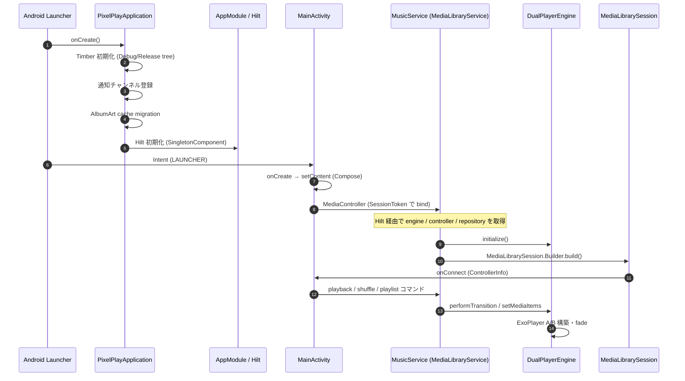

# 04 — Engine / Service / DI / Application

再生エンジン層。`Application` 起動、`MusicService` (MediaLibraryService)、再生プレイヤー (`DualPlayerEngine` / `CastPlayer`)、Android Auto 対応、Chromecast 対応、Wear OS 連携、Quick Settings Tile、Glance Widget、DI モジュール群。

> **注意**: サービスは `app/src/main/java/com/theveloper/pixelplay/data/service/` 配下に集約されている。タスクの説明文では `service/` と書かれていたが、実コードは `data/service/` 以下。

## ファイル構成

| ファイル | 役割 |
|----------|------|
| `application.md` | `PixelPlayApplication` / `ReleaseTree` / `MainActivityIntentContract` |
| `activities.md` | `MainActivity` / `ExternalPlayerActivity` (UI エントリーポイント) |
| `di-modules.md` | `AppModule` / `BackupModule` / `Qualifiers` |
| `music-service.md` | `MusicService` 本体 (2916 行の MediaLibraryService) |
| `player-engine.md` | `DualPlayerEngine` / `CastPlayer` / `TransitionController` / `AudioDecoderPolicy` / `HiFiCapabilityChecker` / `HiResSampleRateCapAudioProcessor` / `SurroundDownmixProcessor` |
| `auto-cast-http.md` | `auto/AutoMediaBrowseTree` (Android Auto browse tree), `cast/*` (Mime/Options/State/IsoBmff detector), `http/MediaFileHttpServerService` (Ktor CIO), `http/CastSessionSecurity` |
| `wear-bridge.md` | `wear/*` (Wear OS 連携 8 ファイル) |
| `tile-widgets.md` | `tile/*` (Quick Settings Tile), `MusicNotificationProvider`, `LocalOnlyMediaNotificationProvider`, `WidgetUpdateManager`, `CoilBitmapLoader` |
| `notification-misc.md` | `ReplayGainProcessor`, `PlaybackActivityTracker`, `SleepTimerReceiver`, `PixelPlayMediaButtonReceiver`, `CastSyncCoordinator`, `TrustedMediaItemsResolution` |

## 起動フロー概要

## 主要依存関係

- `MusicService` → `DualPlayerEngine`, `TransitionController`, `MusicRepository`, `UserPreferencesRepository`, `EqualizerPreferencesRepository`, `WearStatePublisher`, `AutoMediaBrowseTree`, `ReplayGainManager`
- `DualPlayerEngine` → 6 種類の `StreamProxy` (Telegram / Netease / QQ / Navidrome / Jellyfin / GDrive), `TelegramRepository`, `TelegramCacheManager`, `ConnectivityStateHolder`
- `MediaFileHttpServerService` → `MusicRepository`, `CastAudioMimeUtils`, `IsoBmffAudioCodecDetector`, `CastSessionSecurity`
- `WearCommandReceiver` → `MusicService` セッションコマンド転送、`MusicRepository`, `PlaylistPreferencesRepository`, `MediaController`
- `PhoneDirectWatchTransferCoordinator` → Wear OS への直接楽曲転送 (HTTP/Channel API)、アルバムアート抽出、テーマパレット生成
- `MainActivity` → `PlayerViewModel`, `MainViewModel`, `MusicService` (MediaController), `SyncManager`

## 主要ライフサイクル

| 状態 | トリガ | 主要動作 |
|------|--------|---------|
| App 起動 | `PixelPlayApplication.onCreate` | Timber 初期化、通知チャンネル作成、DataStore マイグレーション、Hilt グラフ構築 |
| 初回 MainActivity | `onCreate` | Splash 解除、SetupScreen 判定、Permission チェック、SyncManager 起動、Compose UI 描画 |
| MediaService 起動 | `MediaController.Builder.buildAsync` (MainActivity.onStart) | `MusicService.onCreate` → Hilt 注入 → `DualPlayerEngine.initialize` → `MediaLibrarySession` 構築 → `setMediaNotificationProvider` |
| 曲再生 | `PlayerViewModel.playSong` | `MusicService` custom command or `MediaController.setMediaItems` → `engine.setMediaItems` |
| クロスフェード | `DualPlayerEngine.performTransition` | Player B プリロード → 32ms ステップでボリュームフェード → プレイヤー swap → listeners 通知 |
| タスク削除 | `MusicService.onTaskRemoved` | `keepPlayingInBackground` 設定により条件付き `stopPlaybackAndUnload` |
| Wear 同期 | `WidgetUpdateManager.requestFullUpdate` | 250ms / 300ms debounce → diff → Glance widget 更新 + `WearStatePublisher.publishState` |
| Media Button | `PixelPlayMediaButtonReceiver.onReceive` | 5 秒以内の FGS 昇格ヒント → `MusicService.onStartCommand` → 一時 foreground → playback action |

## 相互スペック参照

- データレイヤー: `../01-data-foundation/README.md`, `../03-data-services/README.md`
- ネットワーク層: `../02-data-network/README.md`
- ViewModel/StateHolder: `../06-state-navigation/README.md`
- Glance Widget: `../07-ui-system/glance-widgets.md`
- Wear OS (phone 側): `../09-wear-module.md`
- Shared モジュール: `../08-shared-module.md`
- ユーティリティ: `../10-utils.md`

## 主要なデータソースへの参照

| データ | ソース |
|--------|--------|
| Room DB (`PixelPlayDatabase`) | `di/AppModule.kt:122-181` |
| DataStore Preferences | `di/AppModule.kt:95-97`, `preferences/UserPreferencesRepository.kt` |
| Coil ImageLoader | `di/AppModule.kt:268-316`, `PixelPlayApplication.newImageLoader` |
| Media3 / ExoPlayer | `DualPlayerEngine.buildPlayer` (`player/DualPlayerEngine.kt:1031-1150`) |
| Glance AppWidget | `service/WidgetUpdateManager.kt:143-189` |
| Wear DataLayer API | `wear/WearStatePublisher.kt`, `wear/WearCommandReceiver.kt` |
| Chromecast (Google Cast SDK) | `cast/CastOptionsProvider.kt`, `cast/CastPlayer.kt` |
| Ktor CIO HTTP server | `http/MediaFileHttpServerService.kt:384-840` |
| Media3 MediaBrowserService | `service/MusicService.kt:142` (`extends MediaLibraryService`) |