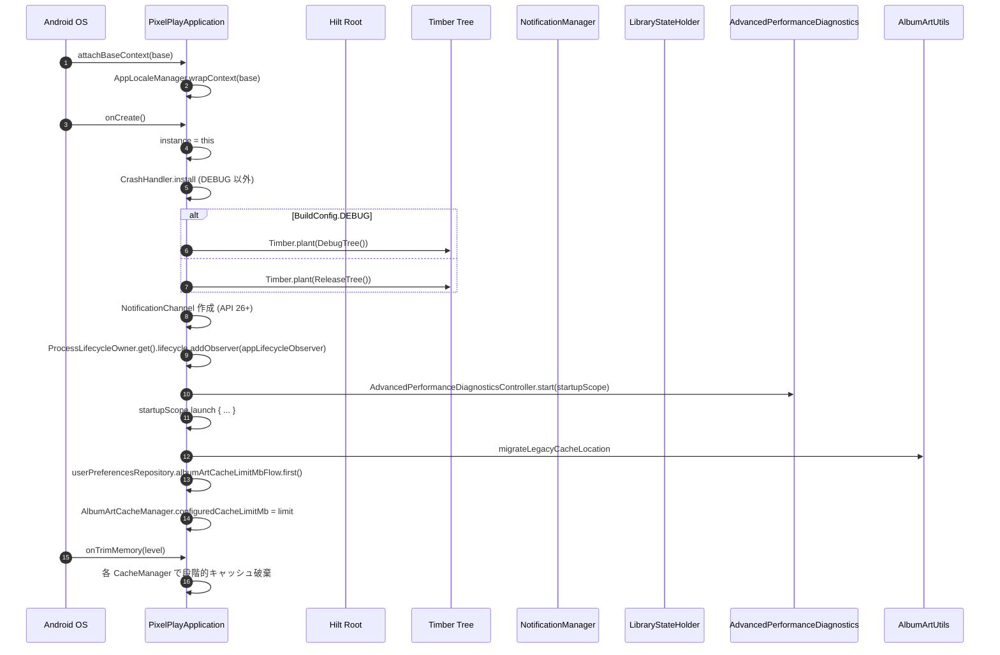

# Application クラス / Intent 契約 / Logging

`PixelPlayApplication` (Hilt root)、`ReleaseTree` (ログ)、`MainActivityIntentContract` (Intent アクション文字列) の 3 ファイル。

---

## PixelPlayApplication.kt

**パッケージ**: `com.theveloper.pixelplay`
**役割**: Hilt の `@HiltAndroidApp` ルート Application。Coil の ImageLoader、WorkManager の HiltWorkerFactory、Process ライフサイクル監視を担当する。

**依存 (上流)**: Android フレームワーク (`Application.onCreate`)
**依存 (下流)**: `BuildConfig.DEBUG`, `CrashHandler`, `Timber`, `NotificationManager`, `ProcessLifecycleOwner`, `AdvancedPerformanceDiagnosticsController`, `LibraryStateHolder`, `AlbumArtUtils`, `AlbumArtCacheManager`, `AppLocaleManager`, 各 Coil Fetcher Factory (`LocalArtworkCoilFetcher.Factory` / `TelegramCoilFetcher.Factory` / `NavidromeCoilFetcher.Factory` / `JellyfinCoilFetcher.Factory`), `HiltWorkerFactory`

### クラス / オブジェクト
| 名前 | 種類 | 説明 |
|------|------|------|
| `PixelPlayApplication` | `class Application()` + `ImageLoaderFactory` + `Configuration.Provider` | Hilt ルート。Coil / WorkManager / Process ライフサイクルを初期化 |
| (companion) `NOTIFICATION_CHANNEL_ID` | `const val String` | `"pixelplay_music_channel"` - `MediaSession` 通知用 |
| (companion) `instance` | `lateinit var PixelPlayApplication` (private set) | グローバル静的参照 (CycleObserver 用) |

### Hilt @Inject フィールド
| フィールド | 型 | 用途 |
|-----------|----|----|
| `workerFactory` | `HiltWorkerFactory` | WorkManager 設定 |
| `imageLoader` | `Lazy<ImageLoader>` | Coil 用 |
| `telegramCoilFetcherFactory` | `Lazy<TelegramCoilFetcher.Factory>` | Coil Telegram fetcher |
| `navidromeCoilFetcherFactory` | `Lazy<NavidromeCoilFetcher.Factory>` | Coil Navidrome fetcher |
| `jellyfinCoilFetcherFactory` | `Lazy<JellyfinCoilFetcher.Factory>` | Coil Jellyfin fetcher |
| `localArtworkCoilFetcherFactory` | `Lazy<LocalArtworkCoilFetcher.Factory>` | Coil ローカルアート fetcher |
| `themeStateHolder` | `Lazy<ThemeStateHolder>` | メモリ監視 (画像キャッシュ) |
| `artistImageRepository` | `Lazy<ArtistImageRepository>` | メモリ監視 (アーティスト画像) |
| `telegramRepository` | `Lazy<TelegramRepository>` | メモリ監視 (Telegram cache) |
| `libraryStateHolder` | `Lazy<LibraryStateHolder>` | ライブラリ状態復元 |
| `userPreferencesRepository` | `Lazy<UserPreferencesRepository>` | 設定読み出し |
| `advancedPerformanceDiagnosticsController` | `Lazy<AdvancedPerformanceDiagnosticsController>` | パフォーマンス計測開始 |

### public/protected API (主要メソッド)

| シグネチャ | 戻り値 | 目的 | 呼び出し元 |
|------------|--------|------|-----------|
| `attachBaseContext(base: Context)` | `Unit` | `AppLocaleManager.wrapContext(base)` でロケールを適用してからスーパークラスへ渡す | フレームワーク |
| `onCreate()` | `Unit` | `instance` 設定 → CrashHandler install → Timber.plant → 通知チャンネル作成 → ProcessLifecycle observer → DiagnosticsController.start → Startup scope で AlbumArt migration / cache limit 設定 | フレームワーク |
| `newImageLoader()` | `ImageLoader` | `imageLoader.get().newBuilder().components { add(localArtworkCoilFetcherFactory.get()); add(telegramCoilFetcherFactory.get()); add(navidromeCoilFetcherFactory.get()); add(jellyfinCoilFetcherFactory.get()) }.build()` - 4 種の Coil fetcher を登録 | Coil フレームワーク |
| `onTrimMemory(level: Int)` | `Unit` | メモリレベルに応じて各リポジトリのキャッシュを段階的に破棄 (TRIM_MEMORY_RUNNING_MODERATE で theme、RUNNING_LOW で artist/telegram/MMR、CRITICAL/COMPLETE で imageLoader.memoryCache.clear()) | フレームワーク |
| `workManagerConfiguration` | `Configuration` | `Configuration.Builder().setWorkerFactory(workerFactory).build()` | フレームワーク |

### 内部実装メモ

- **2 つの Timber.Tree を排他**: `BuildConfig.DEBUG` なら `Timber.DebugTree()`、そうでなければ自作の `ReleaseTree()` を `plant` する (`PixelPlayApplication.kt:104-109`)。ベンチマークビルドでは CrashHandler を意図的に install しない (`PixelPlayApplication.kt:100-102`)。
- **通知チャンネル作成**: API 26+ のみ。`IMPORTANCE_LOW` の `MediaSession` 用チャンネルを作成し、後で `MusicService` から `setMediaNotificationProvider` で利用される (`PixelPlayApplication.kt:111-119`)。
- **ProcessLifecycle observer**: フォアグラウンド復帰時に `libraryStateHolder.get().restoreAfterTrimIfNeeded()` を呼ぶ。`onTrimMemory` で破棄されたライブラリ状態を復元する (`PixelPlayApplication.kt:84-88`)。
- **startupScope**: `CoroutineScope(SupervisorJob() + Dispatchers.IO)` を private に保持し、`AlbumArtUtils.migrateLegacyCacheLocation` と `AlbumArtCacheManager.configuredCacheLimitMb` の設定をバックグラウンドで実行 (`PixelPlayApplication.kt:124-132`)。
- **Companion `instance`**: ベンチマークなど `Application` 参照が必要な箇所から利用される想定だが、利用箇所は現時点で無し (潜在的 API)。

### 関連ファイル
- 上流: `AndroidManifest.xml`
- 下流: `data/worker/*` (Worker), `data/image/*` (Coil Fetcher), `presentation/viewmodel/ThemeStateHolder.kt`, `data/diagnostics/AdvancedPerformanceDiagnosticsController.kt`, `utils/CrashHandler.kt`, `utils/AppLocaleManager.kt`, `utils/AlbumArtUtils.kt`, `utils/AlbumArtCacheManager.kt`

---

## ReleaseTree.kt

**パッケージ**: `com.theveloper.pixelplay`
**役割**: リリースビルド専用 Timber Tree。WARN 以上のみ `android.util.Log` へ流す。

**依存 (上流)**: `Timber.plant(ReleaseTree())` (in `PixelPlayApplication.onCreate`)
**依存 (下流)**: `android.util.Log`

### クラス / オブジェクト
| 名前 | 種類 | 説明 |
|------|------|------|
| `ReleaseTree` | `class : Timber.Tree()` | リリース時のログを WARN 以上のみにする |

### public API (主要メソッド)

| シグネチャ | 戻り値 | 目的 | 呼び出し元 |
|------------|--------|------|-----------|
| `isLoggable(tag: String?, priority: Int)` | `Boolean` | `priority >= Log.WARN` のみ true を返す | Timber フレームワーク |
| `log(priority: Int, tag: String?, message: String, t: Throwable?)` | `Unit` | VERBOSE/DEBUG/INFO をスキップし、WARN/ERROR/ASSERT をそれぞれ `Log.w/e/wtf` へ委譲。Firebase Crashlytics 連携用 TODO コメントあり | Timber フレームワーク |

### 内部実装メモ

- 冗長だが防御的に `priority < Log.WARN` の early-return を入れる (`ReleaseTree.kt:21`)。
- リリースでは R8 が `android.util.Log` を strip する想定。

### 関連ファイル
- 上流: `PixelPlayApplication.kt:108`
- 関連: `app/build.gradle.kts` (proguard 設定)

---

## MainActivityIntentContract.kt

**パッケージ**: `com.theveloper.pixelplay`
**役割**: MainActivity に対するカスタム Intent アクションと extra key の定数 object。

**依存 (上流)**: Quick Settings Tile (`tile/ShuffleAllTileService.kt`, `tile/LastPlaylistTileService.kt`), Wear からの呼び出し, MainActivity 自身
**依存 (下流)**: なし (単なる定数)

### オブジェクト

| 名前 | 種類 | 値 | 説明 |
|------|------|----|------|
| `MainActivityIntentContract` | `object` | - | Intent 契約の集約 |
| `ACTION_SHUFFLE_ALL` | `const val String` | `"com.theveloper.pixelplay.ACTION_SHUFFLE_ALL"` | Tile / Wear から「全曲シャッフル再生」を依頼 |
| `ACTION_OPEN_PLAYLIST` | `const val String` | `"com.theveloper.pixelplay.ACTION_OPEN_PLAYLIST"` | Tile から「最後のプレイリストを開く」を依頼 |
| `EXTRA_PLAYLIST_ID` | `const val String` | `"playlist_id"` | `ACTION_OPEN_PLAYLIST` と一緒に playlist id を渡す extra |

### 内部実装メモ

- 値は `app/src/main/AndroidManifest.xml` の `<intent-filter>` でも参照される想定 (該当なしの場合はコード上のみ)。
- `Intent.action = null` への再代入で連続起動時の重複発火を防ぐ (`MainActivity.kt:370-371`, `378-379`)。
- `ACTION_SHOW_PLAYER` フラグ (`MainActivity.kt:381`) はこの object には含まれず、MainActivity 内部で `Boolean` extra として直接参照される (Mini Player を強制的に開く用途)。

### 拡張された MainActivity.handleIntent のディスパッチ テーブル

| Intent.action | extra | 目的 | 後続 |
|--------------|-------|------|------|
| `ACTION_SHUFFLE_ALL` | - | 全曲シャッフル | `PlayerViewModel.triggerShuffleAllFromTile()` |
| `ACTION_OPEN_PLAYLIST` | `EXTRA_PLAYLIST_ID` | 指定プレイリストを開く | `_pendingPlaylistNavigation` → NavController 経由で `Screen.PlaylistDetail` |
| (ブール) `ACTION_SHOW_PLAYER` | - | フル Player UI を強制表示 | `PlayerViewModel.showPlayer()` |
| `ACTION_VIEW` | `data: Uri` | 単一 URI 再生 | `PlayerViewModel.playExternalUri(uri)` |
| `ACTION_SEND` | `type = audio/*`, `EXTRA_STREAM` | Share intent | `resolveStreamUri` → `playExternalUri` |
| `com.theveloper.pixelplay.ACTION_PLAY_SONG` | `song: Parcelable Song` | 内部起動 | `PlayerViewModel.playSong(song)` |

### 関連ファイル
- 上流 (発行側): `tile/ShuffleAllTileService.kt:31-35`, `tile/LastPlaylistTileService.kt:114-119`
- 下流 (受信側): `MainActivity.kt:362-414` (`handleIntent`)
- 関連: `data/service/MusicService.kt:1086-1095` (同等の action `PlayerActions` も参照)

---

## Application 起動の全体フロー (補足)

### 起動シーケンス詳細



### CrashHandler.install の意図

- CrashHandler は独自の Thread.UncaughtExceptionHandler をプロセス全体にインストールし、Java/Kotlin のクラッシュをファイルに記録 → 次の起動時に CrashReportDialog で表示。
- **ベンチマークビルドでは意図的に skip** (`PixelPlayApplication.kt:100-102`): AndroidX Macrobenchmark のプロセスリスタートがダミーのクラッシュレポートを残してしまうため。

### AlbumArtCacheManager との結合

- `AlbumArtCacheManager.configuredCacheLimitMb` を startup scope で DataStore から読み込んで static に書き込む。
- `AlbumArtUtils.migrateLegacyCacheLocation` は旧キャッシュディレクトリ (`/sdcard/...` 等) から app-private (`cacheDir`) への移行。
- どちらも IO bound なので `Dispatchers.IO` で起動シーケンスをブロックしない。

### 通知チャンネルの ID 戦略

| チャンネル ID | 用途 | importance |
|------------|------|-----------|
| `pixelplay_music_channel` | MediaSession / 再生通知 | LOW |
| `pixelplay_watch_transfers` | Watch 転送進捗 | LOW |
| `pixelplay_cast_server` | Cast HTTP サーバー (foreground) | LOW |

すべて IMPORTANCE_LOW で、ユーザーの邪魔をしない。

### CoIL ImageLoader の拡張性

`PixelPlayApplication.newImageLoader()` は `Lazy<ImageLoader>` を受け取り、追加の Coil Fetcher (LocalArtwork / Telegram / Navidrome / Jellyfin) を登録する。`ImageLoaderFactory` インターフェースを実装することで、Coil は `Application.newImageLoader()` を呼び出して singleton を取得する。`OkHttpClient` は `AppModule.provideImageLoader` 側で構築 (QQ Music Referer ヘッダ注入)。

### onTrimMemory の段階的破棄

| level | 動作 |
|-------|------|
| `>= TRIM_MEMORY_RUNNING_MODERATE (10)` or `TRIM_MEMORY_BACKGROUND (40)` or `TRIM_MEMORY_UI_HIDDEN (20)` | `themeStateHolder.trimMemory(level)` |
| `>= TRIM_MEMORY_RUNNING_LOW (10)` | `artistImageRepository.clearCache()`, `telegramRepository.clearMemoryCache()`, `MediaMetadataRetrieverPool.clear()` |
| `>= TRIM_MEMORY_RUNNING_CRITICAL (15)` or `TRIM_MEMORY_COMPLETE (80)` | `imageLoader.memoryCache?.clear()` |

レベルが上がるほど段階的に解放される。`TRIM_MEMORY_UI_HIDDEN` は activity がバックグラウンドに行ったときで、テーマ状態だけリセット。

### Hilt 初期化との関係

`@HiltAndroidApp` アノテーションが Hilt のコード生成 (`Hilt_PixelPlayApplication`) をトリガし、SingletonComponent が構築される。`Application.onCreate` 時点では SingletonComponent は初期化済みだが、Lazy<> 注入により必要になるまで実体化されない (`ImageLoader`, `LibraryStateHolder` 等)。

### Companion `instance` の使途

`@AndroidEntryPoint` が生成する Hilt グラフは Activity/Fragment 単位で管理されるが、Application 全体にアクセスする必要がある箇所 (例: 古い CrashHandler API, 一部の Wear Receiver) では `PixelPlayApplication.instance` から取得する。private set で外部書き換えを禁止。

### Application.onTerminate の不在

`onTerminate` はエミュレータでしか呼ばれないため、実装しない (公式ドキュメントの推奨)。代わりに、`WorkManager` の Worker / Coil の `ImageLoader` / DataStore の `dataStore` extension が process kill で GC される。

### ベンチマークビルドでの挙動

`app/build.gradle.kts` (推測) で `benchmark` buildType を定義している場合、`BuildConfig.BUILD_TYPE != "benchmark"` 判定により CrashHandler.install を skip。これにより AndroidX Macrobenchmark の process restart が CrashReportDialog の元データを残さない。

### ImageLoader 構築のカスタマイズ

`newImageLoader()` は `@Inject Lazy<ImageLoader>` からベースを取得し、追加の Fetcher Factory を登録する:

```kotlin
override fun newImageLoader(): ImageLoader {
    return imageLoader.get().newBuilder()
        .components {
            add(localArtworkCoilFetcherFactory.get())
            add(telegramCoilFetcherFactory.get())
            add(navidromeCoilFetcherFactory.get())
            add(jellyfinCoilFetcherFactory.get())
        }
        .build()
}
```

これにより Coil は `data` (URI / File / 文字列) を 4 種類のカスタムスキーム (Local / Telegram / Navidrome / Jellyfin) で decode できるようになる。

### `ProcessLifecycleOwner` 監視の意味

```kotlin
ProcessLifecycleOwner.get().lifecycle.addObserver(appLifecycleObserver)
```

`ProcessLifecycleOwner` はプロセス全体の foreground / background を観測する。`onStart` (foreground 化) で `libraryStateHolder.get().restoreAfterTrimIfNeeded()` を呼ぶ。これは `onTrimMemory` で破棄されたライブラリ状態を復元するロジック。

### `appLifecycleObserver` の限定スコープ

`DefaultLifecycleObserver` を `object` として匿名実装し、`lifecycle` の `addObserver` に渡すと、Process の start / stop を跨いでコールバックが呼ばれる。`onStart` のみ実装 (onStop は不要)。

### WorkManager と HiltWorkerFactory

`@HiltAndroidApp` で `@Inject HiltWorkerFactory` を提供し、`Configuration.Provider` interface 経由で `workManagerConfiguration` を返す。これによりすべての Worker が Hilt 経由で dependency 注入を受けられる。

```kotlin
@Inject lateinit var workerFactory: HiltWorkerFactory
override val workManagerConfiguration: Configuration
    get() = Configuration.Builder().setWorkerFactory(workerFactory).build()
```

Worker クラスは `@HiltWorker` を付けて `WorkerParameters` 経由で `Context` / `WorkerParameters` を受け取り、`@AssistedInject` で Hilt から dependency を受け取る。

### Application 起動時に必要なすべての channel

| channel ID | 用途 | importance |
|------------|------|-----------|
| `pixelplay_music_channel` | MediaSession 通知 | LOW |
| `pixelplay_watch_transfers` | Watch 転送進捗 | LOW |
| `pixelplay_cast_server` | Cast HTTP サーバー | LOW |

すべて `IMPORTANCE_LOW` で、ヘッドアップ通知を出さない。`PixelPlayApplication.onCreate` で `pixelplay_music_channel` のみ作成し、他は各 Service の onCreate で作成する。

### App 起動時の Lazy 初期化されるもの

| 依存 | トリガ |
|------|--------|
| `ImageLoader` | Coil の最初の load 要求時 |
| `ThemeStateHolder` | 最初の ViewModel inject 時 |
| `ArtistImageRepository` | 同上 |
| `TelegramRepository` | Telegram Coil fetcher 経由 or `musicRepository` 経由 |
| `LibraryStateHolder` | `ProcessLifecycleOwner.onStart` |
| `UserPreferencesRepository` | 最初の `Flow.first()` 呼び出し |
| `AdvancedPerformanceDiagnosticsController` | `start()` (Application onCreate) |

`Lazy<>` 化することで、Hilt グラフ構築時のコストを抑えている。

### 設定 DataStore の永続化対象

`UserPreferencesRepository` には以下の設定があり、すべて DataStore で永続化されている:

- `keepPlayingInBackgroundFlow` — タスク削除時の挙動
- `hiFiModeEnabledFlow` — PCM_FLOAT 出力
- `albumArtCacheLimitMbFlow` — アルバムアートキャッシュ上限
- `resumeOnHeadsetReconnectFlow` — ヘッドセット再接続で resume
- `pauseOnVolumeZeroFlow` — 音量ゼロで pause
- `persistentShuffleEnabledFlow` — シャッフル状態を永続化
- `isShuffleOnFlow` — シャッフル ON/OFF
- `replayGainEnabledFlow` — RG 有効化
- `replayGainUseAlbumGainFlow` — Album gain mode
- `lastPlaylistIdFlow` — 最後のプレイリスト
- `showScrollbarFlow` — スクロールバー表示
- `playbackQueueSnapshot` — キュー復元用

### まとめ: Application レイヤーの設計思想

| 要件 | 戦略 |
|------|----|
| アプリ全体のシングル インスタンス | `@Singleton` + `Lazy<>` |
| 起動時間短縮 | `Dispatchers.IO` の startupScope で並列処理 |
| メモリ圧迫への段階的対応 | `onTrimMemory` の 3 段階 fallback |
| ロケール即時反映 | `attachBaseContext` で override |
| Crash レポート | CrashHandler + ベンチマーク skip |
| Coil 拡張性 | `ImageLoaderFactory` + Fetcher Factory |