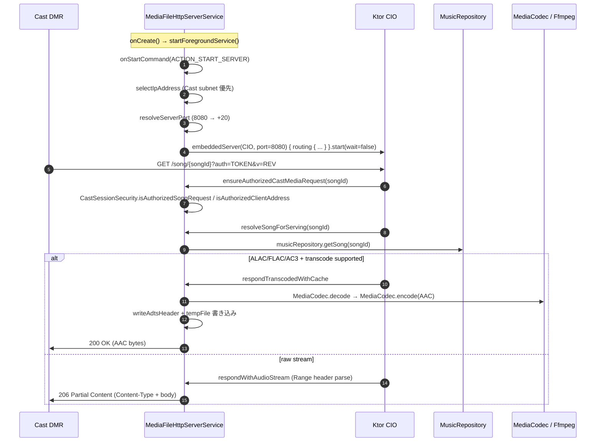

# Android Auto / Chromecast / HTTP サーバー

外部連携の 3 領域。Android Auto 用 browse tree、Chromecast 用 MIME 検出 + 状態投影、Cast セッションへ楽曲を供給する Ktor CIO HTTP サーバー。

---

## auto/AutoMediaBrowseTree.kt

**パッケージ**: `com.theveloper.pixelplay.data.service.auto`
**役割**: Android Auto からの `onGetLibraryRoot` / `onGetChildren` / `onGetItem` / `onSearch` / `onGetSearchResult` に応答する browse tree 構築。

**依存 (上流)**: `MusicService` callback (L728-848)
**依存 (下流)**: `MusicRepository`, `PlaylistPreferencesRepository`, `EngagementDao`, `MediaItemBuilder`

### クラス

| 名前 | 種類 | 説明 |
|------|------|------|
| `AutoMediaBrowseTree` | `class @Inject constructor(...)` (`@Singleton`) | Auto browse 実装 |

### コンパニオン定数 (ID プレフィックス)

| 定数 | 値 | 用途 |
|------|----|----|
| `ROOT_ID` | `"ROOT"` | ルート |
| `RECENT_ID` | `"RECENT"` | 最近再生 |
| `FAVORITES_ID` | `"FAVORITES"` | お気に入り |
| `PLAYLISTS_ID` | `"PLAYLISTS"` | プレイリスト一覧 |
| `ALBUMS_ID` | `"ALBUMS"` | アルバム一覧 |
| `ARTISTS_ID` | `"ARTISTS"` | アーティスト一覧 |
| `SONGS_ID` | `"SONGS"` | 全曲 |
| `ALBUM_PREFIX` | `"ALBUM_"` | アルバム詳細 |
| `ARTIST_PREFIX` | `"ARTIST_"` | アーティスト詳細 |
| `PLAYLIST_PREFIX` | `"PLAYLIST_"` | プレイリスト詳細 |
| `CONTEXT_TYPE_EXTRA` | `"com.theveloper.pixelplay.auto.extra.CONTEXT_TYPE"` | アイテム metadata extras |
| `CONTEXT_ID_EXTRA` | `"com.theveloper.pixelplay.auto.extra.CONTEXT_ID"` | 同上 |
| `CONTEXT_PARENT_ID_EXTRA` | `"com.theveloper.pixelplay.auto.extra.CONTEXT_PARENT_ID"` | 同上 |
| (private) `CONTEXT_TYPE_*` | `"recent"` / `"favorites"` / `"all_songs"` / `"album"` / `"artist"` / `"playlist"` | getSongsForContext で使う |
| (private) `MAX_RECENT_SONGS` | `50` | 直近 N 件 |
| (private) `MAX_SEARCH_RESULTS` | `30` | 検索結果上限 |

### public API

| シグネチャ | 戻り値 | 目的 |
|------------|--------|------|
| `getRootItems()` | `List<MediaItem>` | 6 つのブラウズ可能エントリ |
| `getChildren(parentId, page, pageSize)` (suspend) | `List<MediaItem>` | 親 ID で分岐。offset = page * pageSize、drop + take |
| `getItem(mediaId)` (suspend) | `MediaItem?` | 単一アイテム取得 |
| `search(query)` (suspend) | `List<MediaItem>` | 曲 30 + アルバム 10 + アーティスト 10 を混合 |
| `getSongsForContext(contextType, contextId)` (suspend) | `List<Song>` | コンテキストから曲リストを解決 (Recent / Favorites / All Songs / Album / Artist / Playlist) |

### 内部実装メモ

- **`buildPlayableSongItem`**: `MediaItemBuilder.externalControllerArtworkUri` で Auto 側からも開ける URI に変換 (SAF 経由)。コンテキスト extra を Bundle に詰める。
- **`buildBrowsableAlbumItem` / `ArtistItem` / `PlaylistItem`**: `MEDIA_TYPE_FOLDER_*` をセットし、Auto の UI でフォルダ表示にする。
- **getRecentSongList**: `EngagementDao.getRecentlyPlayedSongs(50)` → `musicRepository.getSongsByIds` で Song を逆引き → order を維持して map。
- **`resolveContextFromParent`**: parent_id のプレフィックスから `(contextType, contextId)` ペアを返す。
- **getSongsForContext**: 各 context 別実装。Playlist は `playlist.songIds` 順を維持。
- **search**: `musicRepository.searchSongs / Albums / Artists` を呼び、上限 30 件まで返却。
- **getChildrenForPrefix**: `ALBUM_xxx` / `ARTIST_xxx` / `PLAYLIST_xxx` の子エントリ (曲リスト) を返す。

### 関連ファイル
- 上流: `MusicService.kt:728-848` (callback)
- 下流: `MusicRepository.searchSongs` / `getAlbumById` / `getArtistById` / `getSong` / `getFavoriteSongsPage` / `getAlbumsPage` / `getArtistsPage` / `getSongsPage` / `getSongsForAlbum` / `getSongsForArtist` / `getSongsByIds`, `PlaylistPreferencesRepository.userPlaylistsFlow`, `EngagementDao.getRecentlyPlayedSongs`
- 関連: `MediaItemBuilder.kt` (URI 変換)

---

## cast/CastAudioMimeUtils.kt

**パッケージ**: `com.theveloper.pixelplay.data.service.cast`
**役割**: 音声 MIME を Cast DMR が再生できる形式へ正規化するユーティリティ。OGG 系は内部 codec 判別で Opus / Vorbis に分岐。

**依存 (上流)**: `CastPlayer`, `MediaFileHttpServerService`
**依存 (下流)**: なし

### オブジェクト

| 名前 | 種類 | 説明 |
|------|------|------|
| `CastAudioMimeUtils` | `internal object` | MIME 正規化 |
| `AUDIO_OGG` | `const "audio/ogg"` | |
| `AUDIO_OGG_OPUS` | `const "audio/ogg; codecs=\"opus\""` | |
| `AUDIO_OGG_VORBIS` | `const "audio/ogg; codecs=\"vorbis\""` | |

### public API

| シグネチャ | 戻り値 | 目的 |
|------------|--------|------|
| `baseMimeType(mimeType: String?)` | `String?` | `;` で split して lower-case の base 抽出 |
| `toCastSupportedMimeTypeOrNull(rawMimeType: String)` | `String?` | 多くの MIME alias を 13 種類の正規 Cast MIME にマップ |
| `resolveOggContentType(rawMimeCandidates, extension, headerBytes)` | `String?` | mime param (`codecs="opus"`) → extension (`opus`) → header bytes (`OggS + OpusHead` / `vorbis`) の順で判別 |
| `isExactOggContentType(contentType: String)` | `Boolean` | `AUDIO_OGG_OPUS` / `AUDIO_OGG_VORBIS` か |
| `isCastSeekUnstableContentType(contentType: String?)` | `Boolean` | OGG 系 (seek 不安定) か |

### 内部実装メモ

- 163 行に 13+ MIME alias + OGG 内部 codec 判別を詰め込んだユーティリティ。
- `detectOggCodecFromMimeParameter`: `codecs="opus"` のような RFC 形式パラメータを抽出。
- `detectOggCodecContentType`: magic bytes 検査 (`OggS` + `OpusHead` / `vorbis` substring)。
- `containsAscii`: 自前のバイト列 substring 検索 (依存なしで実装)。

### 関連ファイル
- 上流: `CastPlayer.kt:312`, `:540-600`, `MediaFileHttpServerService.kt:1391-1394`
- 関連: なし

---

## cast/CastOptionsProvider.kt

**パッケージ**: `com.theveloper.pixelplay.data.service.cast`
**役割**: Google Cast SDK の `OptionsProvider` 実装。`CastMediaControlIntent.DEFAULT_MEDIA_RECEIVER_APPLICATION_ID` (default media receiver) を使う。

**依存 (上流)**: Google Cast SDK (`<meta-data android:name="com.google.android.gms.cast.framework.OPTIONS_PROVIDER_CLASS_NAME"/>` で AndroidManifest.xml から参照)
**依存 (下流)**: なし

### クラス

| 名前 | 種類 | 説明 |
|------|------|------|
| `CastOptionsProvider` | `class : OptionsProvider` | CastOptions factory |

### API

| シグネチャ | 戻り値 | 目的 |
|------------|--------|------|
| `getCastOptions(context: Context)` | `CastOptions` | DEFAULT_MEDIA_RECEIVER_APP_ID + NotificationOptions (toggle playback + stop casting アクション) |
| `getAdditionalSessionProviders(context: Context)` | `List<SessionProvider>?` | 追加 session なし |

### 内部実装メモ

- 35 行で完結する小さな provider。manifest で `<meta-data>` 指定が必要。

### 関連ファイル
- 上流: AndroidManifest.xml の `<application>` 配下
- 関連: なし

---

## cast/CastRemotePlaybackState.kt

**パッケージ**: `com.theveloper.pixelplay.data.service.cast`
**役割**: Cast `MediaStatus` を ExoPlayer の playback state に投影するヘルパー。

### データクラス / オブジェクト

| 名前 | 種類 | 説明 |
|------|------|------|
| `CastRemotePlaybackProjection` | `internal data class` | `isPlaying`, `playWhenReady`, `isBuffering` |
| `CastRemotePlaybackState` | `internal object` | 投影ロジック |

### API

| シグネチャ | 戻り値 | 目的 |
|------------|--------|------|
| `project(mediaStatus, previousPlayIntent)` | `CastRemotePlaybackProjection` | `MediaStatus` を state / idleReason から投影 |
| `project(playerState, idleReason, previousPlayIntent)` | `CastRemotePlaybackProjection` | 同上 (テスト容易性のための分離) |

### 内部実装メモ

- `PLAYER_STATE_IDLE && IDLE_REASON_ERROR && previousPlayIntent` → "回復可能エラー" として `playWhenReady = true, isPlaying = true` (復帰可能なバッファリング/エラー状態)。
- `PLAYER_STATE_BUFFERING` は一時的に `isPlaying = true` (「再生しようとしている」 状態として扱う)。
- `PLAYER_STATE_PAUSED` は明確に停止。
- `previousPlayIntent` は state machine を跨いだ保持のため (UNKNOWN 状態から推測)。

### 関連ファイル
- 上流: `CastSyncCoordinator.resolveRemoteSnapshot`
- 関連: なし

---

## cast/IsoBmffAudioCodecDetector.kt

**パッケージ**: `com.theveloper.pixelplay.data.service.cast`
**役割**: ISO BMFF (MP4 / M4A) ファイルから音声 codec を特定するパーサ。

### オブジェクト

| 名前 | 種類 | 説明 |
|------|------|------|
| `IsoBmffAudioCodecDetector` | `internal object` | ISO BMFF 音声 codec 検出 |

### API

| シグネチャ | 戻り値 | 目的 |
|------------|--------|------|
| `detectAudioCodec(bytes: ByteArray)` | `String?` | `moov` → `trak` → `mdia(soun)` → `stsd` → sample entry type を MIME 文字列に変換 |

### 内部実装メモ

- **Box parser**: `BOX_HEADER_SIZE = 8`, `EXTENDED_BOX_HEADER_SIZE = 16`。`size = 0` で親範囲末尾まで、`size = 1` で 64bit size、`size = n` で 32bit size。
- **対象 box**: `moov`, `trak`, `mdia`, `minf`, `stbl` (再帰的)、`hdlr` (handler_type が `"soun"` なら音声)、`stsd` (SampleDescription) の entry type。
- **sample entry type → MIME**: alac → `audio/alac`, mp4a → `audio/mp4a-latm`, ac-3 → `audio/ac3`, ec-3 → `audio/eac3`, flac → `audio/flac`, opus → `audio/opus`。
- 172 行の自家実装。`forEachBox` の lambda は `false` 返却で早期 break。

### 関連ファイル
- 上流: `CastPlayer.detectIsoBmffAudioCodec`, `MediaFileHttpServerService.detectIsoBmffAudioCodec`
- 関連: なし

---

## http/CastSessionSecurity.kt

**パッケージ**: `com.theveloper.pixelplay.data.service.http`
**役割**: Cast セッションがローカル HTTP サーバーへアクセスする際の認可 (auth token + IP allowlist) を管理する。

### データクラス / オブジェクト

| 名前 | 種類 | 説明 |
|------|------|------|
| `CastAccessPolicy` | `internal data class` | `authToken`, `allowedSongIds: Set<String>`, `allowedClientAddresses: Set<String>`, `enforceClientAddressAllowlist: Boolean` |
| `CastAccessPolicy.EMPTY` | `companion` | 空 policy |
| `CastSessionSecurity` | `internal object` | 認可ロジック |

### 定数

| 定数 | 値 |
|------|----|
| `AUTH_QUERY_PARAMETER` | `"auth"` |

### API

| シグネチャ | 戻り値 | 目的 |
|------------|--------|------|
| `buildAccessPolicy(existingToken, allowedSongIds, castDeviceIpHint, serverOwnIp)` | `CastAccessPolicy` | token 生成 / IP allowlist 構築 (loopback + Cast 端末 IP + サーバー自身の IP) |
| `isLoopbackAddress(rawAddress)` | `Boolean` | 127.0.0.1 / ::1 等 |
| `isAuthorizedClientAddress(remoteAddress, policy)` | `Boolean` | loopback / allowlist 判定 |
| `isAuthorizedSongRequest(providedToken, requestedSongId, policy)` | `Boolean` | token 一致 + songId 許可 |
| `buildSongUrl(serverAddress, songId, streamRevision, authToken)` | `String` | `http://...:PORT/song/{id}?v=...&auth=...` |
| `buildArtUrl(serverAddress, songId, streamRevision, authToken)` | `String` | `http://...:PORT/art/{id}?v=...&auth=...` |
| `buildLoopbackSongUrl(serverAddress, songId, authToken)` | `String?` | host を `127.0.0.1` に強制した内部用 URL |
| `redactAuthToken(url)` | `String` | `?auth=...` を `?auth=<redacted>` に置換 (ログ用) |
| `generateAuthToken()` (private) | `String` | `SecureRandom` 16 bytes を hex 化 |

### 内部実装メモ

- **IP 正規化**: `InetAddress.getByName` で `hostAddress` を取得し、IPv4-mapped IPv6 (`::ffff:xxx`) は `xxx` 単体を allowlist に追加。
- **サーバー自身の IP も allowlist に追加**: `serverOwnIp` を渡すと widget 更新など同一端末内のコンポーネントも認可される (`CastSessionSecurity.kt:46-53`)。
- **`enforceClientAddressAllowlist`**: Cast 端末 IP が指定されている時のみ true。loopback は常に許可。
- **URL ビルダ**: `okhttp3.HttpUrl` を使って安全組み立て。

### 関連ファイル
- 上流: `MediaFileHttpServerService.configureCastSessionAccess` / `currentCastAccessPolicy`
- 下流: `CastPlayer.toMediaQueueItem` (URL 生成), `MediaFileHttpServerService` (認可チェック)

---

## http/MediaFileHttpServerService.kt

**パッケージ**: `com.theveloper.pixelplay.data.service.http`
**役割**: Ktor CIO ベースのローカル HTTP サーバー (port 8080、フォアグラウンド Service)。Cast DMR からの `GET /song/{id}` / `HEAD /song/{id}` / `GET /art/{id}` / `HEAD /art/{id}` / `GET /health` に応答する。Range request、ALAC/FLAC/AC3 トランスコード、MIME 検出、サムネイル抽出を実装する。

**依存 (上流)**: `CastPlayer` (URL ロード), `CastSyncCoordinator` (Cast セッション認可 policy 設定)
**依存 (下流)**: `MusicRepository`, `CastAudioMimeUtils`, `IsoBmffAudioCodecDetector`, `CastSessionSecurity`, `AlbumArtUtils`, `MediaCodec` / `MediaCodecList` / `MediaExtractor` / `MediaMetadataRetriever`, `ConnectivityManager`, `MediaStore`, `FfmpegLibrary` (ALAC/AC3 拡張デコーダ), Ktor CIO

### クラス

| 名前 | 種類 | 説明 |
|------|------|------|
| `MediaFileHttpServerService` | `class : Service()` (`@AndroidEntryPoint`) | Ktor CIO ホスト Service |
| `TranscodeEntry` | `private data class` | トランスコード temp file 状態 (`tempFile`, `done: Boolean`, `failed: Boolean`, `latch: CountDownLatch`) |
| `AudioStreamSource` | `private data class` | 範囲付き再生用 (`sourceLabel`, `fileSize`, `lastModifiedEpochMs`, `inputStreamFactory`) |
| `AudioCodecInfo` | `private data class` | 音声 codec メタ (`codecMime`, `sampleRate`, `channelCount`, `trackIndex`) |
| `CountingOutputStream` | `private class : OutputStream` | 書き込んだ byte 数を数える |
| `ArtStreamSource` | `private data class` | アート用 (`sourceLabel`, `contentType: ContentType`, `contentLength`, `lastModifiedEpochMs`, `inputStreamFactory`) |
| `LocalAddressCandidate` | `private data class` | ネットワーク候補 (`hostAddress`, `address: Inet4Address`, `prefixLength`, `isActiveNetwork`, `isValidated`, `hasInternet`) |
| `AddressSelection` | `private data class` | 最終的に選ばれた IP (`hostAddress`, `prefixLength`, `matchedCastSubnet`) |
| `FailureReason` | `enum class` | `NO_NETWORK_ADDRESS`, `FOREGROUND_START_EXCEPTION`, `START_EXCEPTION` |

### コンパニオン

| 名前 | 種類 | 説明 |
|------|------|------|
| `ACTION_START_SERVER` | `const String` | `"ACTION_START_SERVER"` |
| `ACTION_STOP_SERVER` | `const String` | `"ACTION_STOP_SERVER"` |
| `EXTRA_CAST_DEVICE_IP` | `const String` | `"EXTRA_CAST_DEVICE_IP"` |
| `isServerRunning`, `isServerStarting` | `var Boolean` (Volatile) | 状態 |
| `serverAddress`, `serverHostAddress`, `serverPrefixLength` | `var` | 接続情報 |
| `lastFailureReason`, `lastFailureMessage` | `var` | 失敗理由 |
| `castAccessPolicy` | `private var CastAccessPolicy` | `CastSessionSecurity` 用 |
| `configureCastSessionAccess(allowedSongIds, castDeviceIpHint)` | `internal fun` | policy 構築 + 自身の IP 自動 allowlist |
| `currentCastAccessPolicy()` | `internal fun` | 取得 |
| `clearCastSessionAccess()` | `internal fun` | EMPTY に戻す |
| `SERVER_START_PORT_RETRY_LIMIT` | `private const 3` | bind 失敗時のリトライ |
| `ISO_BMFF_CODEC_PROBE_BYTES` | `private const 1 MB` | codec 検出バイト数 |
| `TRANSCODE_RANGE_WAIT_TIMEOUT_MINUTES` | `private const 10L` | range request 待機 |
| `TRANSCODE_STREAM_IDLE_TIMEOUT_MS` | `private const 45_000L` | アイドル タイムアウト |

### public API (Service)

| シグネチャ | 戻り値 | 目的 |
|------------|--------|------|
| `onCreate()` | `Unit` | `startForegroundService()` で即座に foreground 昇格 (cast_server_channel) |
| `onStartCommand(intent, flags, startId)` | `Int` | `ACTION_STOP_SERVER` で stop / `ACTION_START_SERVER` または null で IP 選択 → port 解決 → Ktor 起動 |
| `onDestroy()` | `Unit` | server.stop、transcode temp クリーンアップ、scope cancel |
| `onBind(intent)` | `IBinder?` | null (非 bind) |

### 内部実装メモ

#### ルーティング
- `GET /health`, `HEAD /health` — loopback のみ許可 (`ensureLoopbackHealthRequest`)。応答は `200 OK "ok"`。
- `GET /song/{songId}` — `ensureAuthorizedCastMediaRequest` で認可後:
  1. `resolveSongForServing` (Repository → MediaStore fallback)
  2. `detectAudioCodecViaExtractor` で codec 検出
  3. ALAC → `isAlacTranscodeSupported` なら temp file transcode cache、不可なら raw M4A (`audio/mp4`)
  4. FLAC → `isFlacTranscodeSupported` なら AAC-ADTS transcode
  5. AC3/EAC3 → `isAc3TranscodeSupported` なら AAC-ADTS transcode
  6. 上記以外は raw stream を `respondWithAudioStream` で Range 対応配信
- `HEAD /song/{songId}` — Content-Length / Content-Type / Last-Modified を返す (transcode cache 完了時のみ Content-Length)
- `GET /art/{songId}` / `HEAD /art/{songId}` — `resolveArtStreamSource` で album art URI / embed / placeholder PNG (1×1 transparent) を返す。失敗時は placeholder

#### 認可
- `ensureLoopbackHealthRequest`: `request.origin.remoteHost` が loopback なら許可。
- `ensureAuthorizedCastMediaRequest`: `CastSessionSecurity.isAuthorizedSongRequest(token, songId, policy)` + `isAuthorizedClientAddress(remoteAddress, policy)` の両方。

#### IP 選択 (`selectIpAddress`)
- 全 `Network` を走査、`NetworkCapabilities.isLocalLanTransport()` (`NOT_VPN`, WiFi / Ethernet / Cellular) を満たすもののみ抽出。
- `castDeviceIpHint` と同サブネットなら優先 (matchedCastSubnet=true)。
- そうでなければ active / validated / hasInternet で sort。

#### Port 選択 (`resolveServerPort`)
- 8080 から +20 まで空き port を試行、なければ `ServerSocket(0)` で OS に任せる。

#### MIME 検出 (`detectAudioMimeTypeBySignature`)
- `readAudioSignature` で URI から先頭 16 KB 読む
- ID3 tag size を skip して `detectMimeAtOffset`
- MP3 sync (`0xFF FB/FA/F3/F2`), RIFF (`WAVE`), fLaC (`FLAC`), OggS (`Ogg` / `Opus` / `Vorbis`), ftyp (`isom` / `mp42` / `dash`)

#### トランスコード (`transcodeToAacAdts`)
- `isAlacTranscodeSupported` / `isFlacTranscodeSupported` / `isAc3TranscodeSupported` のいずれかで true
- `MediaCodec` (default) or `FfmpegLibrary` で decode + AAC encoder で encode
- 5.1/7.1 → stereo ダウンミックス (`c0 = FL * 0.5 + c2 (FC) * 0.35 + c4 (SL) * 0.35`)
- 出力 temp file (`cast_transcode_${songId}.aac`) に書き込み、ADTS ヘッダ付与

#### キャッシュ (`TranscodeEntry` 状態機械)
- `null` → 未着手
- `entry(done=false, latch)` → 進行中、別リクエストは latch を await
- `entry(done=true)` → 完了、`tempFile.length()` で Content-Length 配信
- `entry(failed=true)` → 失敗、エラー応答

#### メモリ管理
- `transparentPng1x1` 1×1 PNG を embed 失敗時の placeholder として lazy 保持
- `onDestroy` で `cleanupAllTranscodeTempFiles`

### 関連ファイル
- 上流: `CastPlayer.loadQueue` (URL 生成のため `serverAddress` を読む), `CastSyncCoordinator` (間接的に policy 設定)
- 下流: `MusicRepository`, `AlbumArtUtils`, Google Cast SDK (URL 検証), `CastAudioMimeUtils`, `IsoBmffAudioCodecDetector`, `CastSessionSecurity`, MediaCodec / FfmpegLibrary
- 関連: `app/src/main/AndroidManifest.xml` の `<service>` 宣言

---

### Mermaid: HTTP サーバー起動とリクエスト処理

