# DI モジュール (Hilt)

`AppModule` (Singleton 依存の主プロバイダ)、`BackupModule` (バックアップ専用ハンドラ群)、`Qualifiers` (`@DeezerRetrofit`, `@FastOkHttpClient`, `@BackupGson`, `@AppScope`) の 3 ファイル。

---

## AppModule.kt

**パッケージ**: `com.theveloper.pixelplay.di`
**役割**: Hilt `SingletonComponent` に対する `@Provides` の集大成。Database, DataStore, Coil, OkHttp / Retrofit, LyricsRepository, SongRepository, MusicRepository, TransitionRepository, SongMetadataEditor, MediaCodec selector, Application 参照など主要な依存を提供。

**依存 (上流)**: `MusicService`, `PlayerViewModel`, `MainViewModel`, 各種 ViewModel, Repository
**依存 (下流)**: `PixelPlayApplication`, `Context`, `BuildConfig`, `PixelPlayDatabase`, `Gson`, `Media3 SessionToken`, `DataStore`, `kotlinx.serialization Json`, `CoroutineScope`, `WorkManager`, 全 DAO (`MusicDao` / `FavoritesDao` / `TransitionDao` / `LyricsDao` / etc.), `ImageLoader`, `LyricsRepository(Impl)`, `SongRepository(MediaStoreSongRepository)`, `MusicRepository(Impl)`, `TransitionRepository(Impl)`, `SongMetadataEditor`, `OkHttpClient` (default + Fast), `Retrofit` (LRCLIB + Deezer), `LrcLibApiService`, `DeezerApiService`, `ArtistImageRepository`

### オブジェクト

| 名前 | 種類 | 説明 |
|------|------|------|
| `AppModule` | `object` (`@Module @InstallIn(SingletonComponent::class)`) | アプリ全体の依存プロバイダ |

### @Provides 関数

| シグネチャ | 戻り値 | 目的 |
|------------|--------|------|
| `provideApplication(@ApplicationContext app: Context)` | `PixelPlayApplication` | Application キャスト |
| `provideGson()` | `Gson` | 共通 Gson |
| `provideSessionToken(@ApplicationContext context: Context)` (`@OptIn(UnstableApi)`) | `SessionToken` | `MusicService` へのセッション トークン (MediaController が bind するために使う) |
| `providePreferencesDataStore(@ApplicationContext context: Context)` | `DataStore<Preferences>` | `context.dataStore` を返す薄いラッパ |
| `provideJson()` | `Json` | kotlinx.serialization の `Json` (`isLenient = true`, `ignoreUnknownKeys = true`, `coerceInputValues = true`) |
| `provideAppCoroutineScope()` (`@AppScope`) | `CoroutineScope` | `SupervisorJob + Dispatchers.IO` のアプリ寿命スコープ |
| `provideWorkManager(@ApplicationContext context: Context)` | `WorkManager` | `WorkManager.getInstance(context)` |
| `providePixelPlayDatabase(@ApplicationContext context: Context)` | `PixelPlayDatabase` | Room database 構築。`MIGRATION_3_4` から `MIGRATION_41_42` まで全追加。`setJournalMode(WRITE_AHEAD_LOGGING)`。**DEBUG ビルドのみ** `fallbackToDestructiveMigration(dropAllTables = true)` |
| `provideAlbumArtThemeDao(database)` / `provideSearchHistoryDao(database)` / `provideMusicDao(database)` / `provideTransitionDao(database)` / `provideEngagementDao(database)` / `provideFavoritesDao(database)` / `provideLyricsDao(database)` / `provideGDriveDao(database)` / `provideLocalPlaylistDao(database)` / `provideQqMusicDao(database)` / `provideNavidromeDao(database)` / `provideAiCacheDao(database)` / `provideAiUsageDao(database)` / `provideJellyfinDao(database)` | 各種 DAO | `database.xxxDao()` |
| `provideTelegramDao(database)` / `provideNeteaseDao(database)` | `TelegramDao` / `NeteaseDao` | 同上 |
| `provideImageLoader(@ApplicationContext context: Context)` | `ImageLoader` | Coil の設定。40 MB ハード上限の `MemoryCache`、100 MB `DiskCache`、`okHttpClient` (QQ Music Referer ヘッダ注入)、`respectCacheHeaders(false)` |
| `provideLyricsRepository(...)` | `LyricsRepository` | `LyricsRepositoryImpl` 構築 |
| `provideSongRepository(...)` | `SongRepository` | `MediaStoreSongRepository` 構築 |
| `provideFolderTreeBuilder()` | `FolderTreeBuilder` | フォルダツリー構築ヘルパ |
| `provideMusicRepository(...)` | `MusicRepository` | `MusicRepositoryImpl` 構築。`TelegramRepository`/`TelegramCacheManager` は `dagger.Lazy` 注入 (循環回避) |
| `provideTransitionRepository(impl: TransitionRepositoryImpl)` | `TransitionRepository` | 既存 impl をそのまま返す |
| `provideSongMetadataEditor(...)` | `SongMetadataEditor` | タグ編集 |
| `provideOkHttpClient()` | `OkHttpClient` | 8 秒タイムアウト、`ConnectionPool(5, 30s)`、User-Agent / `Authorization` / `Cookie` / `X-Emby-Token` 等の資格情報を redact、`HttpLoggingInterceptor.Level.HEADERS` (DEBUG のみ) |
| `provideFastOkHttpClient()` (`@FastOkHttpClient`) | `OkHttpClient` | Lyrics 検索用。15 秒 read timeout、Cloudflare/Google DNS、HTTP/1.1 固定、Modern+Compatible TLS |
| `provideRetrofit(@FastOkHttpClient okHttpClient)` | `Retrofit` | `https://lrclib.net/`, Gson |
| `provideLrcLibApiService(retrofit)` | `LrcLibApiService` | LRCLIB API |
| `provideDeezerRetrofit(okHttpClient)` (`@DeezerRetrofit`) | `Retrofit` | `https://api.deezer.com/` |
| `provideDeezerApiService(@DeezerRetrofit retrofit)` | `DeezerApiService` | Deezer API |
| `provideArtistImageRepository(deezerApiService, musicDao)` | `ArtistImageRepository` | アーティスト画像取得 |

### 内部実装メモ

- **Database の破壊的マイグレーション**: P2-4 として DEBUG のみ `fallbackToDestructiveMigration(dropAllTables = true)` を許可。リリースでは意図的にクラッシュさせ、プレイリストやお気に入り、統計データの意図しない消失を防ぐ (`AppModule.kt:174-178`)。
- **42 段階の migration**: `MIGRATION_3_4` 〜 `MIGRATION_41_42` を全て個別に列挙。スキーマ変更のたびに手動追加されてきた歴史が見える (`AppModule.kt:130-168`)。
- **Lazy 注入**: `TelegramRepository` / `TelegramCacheManager` は `dagger.Lazy` でラップして循環依存を回避 (`AppModule.kt:380-396`)。
- **OkHttp Logging redact**: 認証ヘッダ (`Authorization`, `Proxy-Authorization`, `Cookie`, `Set-Cookie`, `x-goog-api-key`, `X-Emby-Token`, `X-Emby-Authorization`, `X-MediaBrowser-Token`) を redact。`HEADERS` レベルでも機密情報が漏れない (`AppModule.kt:441-448`)。
- **ImageLoader 40 MB cap**: 旧来の "20% of heap" ではなくハード 40 MB。Pixel 8 などの大ヒープ機では 80〜100 MB まで膨張するため明示的にキャップ。`allowHardware(true)` により Bitmap は GPU メモリに置かれるので MemoryCache の参照コストは低い (`AppModule.kt:294-307`)。
- **QQ Music Referer**: `y.qq.com` へのリクエストに `Referer: https://y.qq.com/` を強制付与する interceptor (`AppModule.kt:278-285`)。
- **Fast OkHttp の HTTP/1.1 固定**: 一部サーバで HTTP/2 ストリームの扱いに問題があるため `protocols(listOf(HTTP_1_1))` で固定 (`AppModule.kt:509`)。
- **`@DeezerRetrofit` qualifier**: ベース URL が `https://api.deezer.com/` と LRCLIB と異なるため qualifier で区別。

### 関連ファイル
- 上流: `PixelPlayApplication.kt`, `data/database/PixelPlayDatabase.kt`
- 下流: すべての `*Repository.kt`, `*ViewModel.kt`, `MusicService.kt`

---

## BackupModule.kt

**パッケージ**: `com.theveloper.pixelplay.di`
**役割**: バックアップ / リストア用の Gson と `BackupSection` → `BackupModuleHandler` マップを提供する。

**依存 (上流)**: バックアップ / リストア UI / ワーカー
**依存 (下流)**: `BackupFormatDetector`, 各 `*BackupHandler` (`PlaylistsModuleHandler`, `GlobalSettingsModuleHandler`, `FavoritesModuleHandler`, `LyricsModuleHandler`, `SearchHistoryModuleHandler`, `TransitionsModuleHandler`, `EngagementStatsModuleHandler`, `PlaybackHistoryModuleHandler`, `QuickFillModuleHandler`, `ArtistImagesModuleHandler`, `EqualizerModuleHandler`, `AiUsageBackupHandler`)

### オブジェクト

| 名前 | 種類 | 説明 |
|------|------|------|
| `BackupModule` | `object` (`@Module @InstallIn(SingletonComponent::class)`) | バックアップ DI |

### @Provides 関数

| シグネチャ | 戻り値 | 目的 |
|------------|--------|------|
| `provideBackupGson()` (`@BackupGson`) | `Gson` | `setPrettyPrinting().serializeNulls().create()` |
| `provideBackupFormatDetector()` | `BackupFormatDetector` | 旧/新フォーマット判別 |
| `provideModuleHandlers(...)` | `Map<BackupSection, BackupModuleHandler>` | 12 セクションすべての handler を `BackupSection` enum にマップ |

### 内部実装メモ

- 12 セクション: PLAYLISTS / GLOBAL_SETTINGS / FAVORITES / LYRICS / SEARCH_HISTORY / TRANSITIONS / ENGAGEMENT_STATS / PLAYBACK_HISTORY / QUICK_FILL / ARTIST_IMAGES / EQUALIZER / AI_USAGE_LOGS。
- `Map` のキー順は列挙順を保持 (Kotlin の `mapOf` は LinkedHashMap)。

### 関連ファイル
- 上流: バックアップ / リストア UI フロー
- 下流: `data/backup/format/BackupFormatDetector.kt`, `data/backup/module/*.kt`

---

## Qualifiers.kt

**パッケージ**: `com.theveloper.pixelplay.di`
**役割**: Hilt の `@Qualifier` アノテーション集 (依存注入の曖昧性解消)。

### アノテーション

| 名前 | Retention | 説明 |
|------|-----------|------|
| `@DeezerRetrofit` | BINARY | Deezer 専用 Retrofit インスタンス (`AppModule.kt:560-566`) |
| `@FastOkHttpClient` | BINARY | Lyrics 検索用の短タイムアウト OkHttpClient (`AppModule.kt:482-531`) |
| `@BackupGson` | BINARY | バックアップ専用 Gson (`BackupModule.kt:32-38`) |
| `@AppScope` | BINARY | アプリ寿命 CoroutineScope (`AppModule.kt:111-114`) |

### 内部実装メモ

- 全て `@Retention(AnnotationRetention.BINARY)` で `kotlin.annotation.Qualifier` を継承。
- ファイル 31 行と最小。

### 関連ファイル
- 利用: `AppModule.kt`, `BackupModule.kt`
- 注入される側: `service/MusicService.kt` (`@AppScope CoroutineScope`), `network/lyrics/*` (`@FastOkHttpClient`), `network/deezer/*` (`@DeezerRetrofit`), `data/backup/*` (`@BackupGson`), `di/*` (`@AppScope`)

---

## DI 全体の依存グラフ (主要部分)

### Singleton スコープ

```mermaid
graph TD
    AppCtx["@ApplicationContext Context"] --> ImageLoader
    AppCtx --> SessionToken
    AppCtx --> WorkManager
    AppCtx --> DataStore
    AppCtx --> PixelPlayDatabase
    AppCtx --> LyricsRepository
    AppCtx --> SongRepository
    AppCtx --> MusicRepository
    AppCtx --> SongMetadataEditor
    AppCtx --> FolderTreeBuilder
    AppCtx --> ImageLoader
    AppCtx --> OkHttpClient

    DataStore --> UserPreferencesRepository
    DataStore --> PlaylistPreferencesRepository

    PixelPlayDatabase --> MusicDao
    PixelPlayDatabase --> FavoritesDao
    PixelPlayDatabase --> TransitionDao
    PixelPlayDatabase --> LyricsDao
    PixelPlayDatabase --> EngagementDao
    PixelPlayDatabase --> LocalPlaylistDao
    PixelPlayDatabase --> GDriveDao
    PixelPlayDatabase --> QqMusicDao
    PixelPlayDatabase --> NavidromeDao
    PixelPlayDatabase --> JellyfinDao
    PixelPlayDatabase --> AiCacheDao
    PixelPlayDatabase --> AiUsageDao
    PixelPlayDatabase --> SearchHistoryDao
    PixelPlayDatabase --> AlbumArtThemeDao
    PixelPlayDatabase --> TelegramDao
    PixelPlayDatabase --> NeteaseDao

    MusicDao --> MusicRepository
    FavoritesDao --> MusicRepository
    FavoritesDao --> SongRepository
    LyricsDao --> LyricsRepository
    TransitionRepository --> TransitionRepositoryImpl

    OkHttpClient -. "@Default" .-> Retrofit
    FastOkHttpClient -. "@FastOkHttpClient" .-> LrcLibRetrofit
    Retrofit -. "@Default" .-> ApiServices
    LrcLibApiService --> LyricsRepository
    DeezerApiService --> ArtistImageRepository
    ArtistImageRepository --> MusicRepository
    MusicDao --> ArtistImageRepository

    Json --> Services

    Lazy_TelegramRepository -. "Lazy<>" .-> MusicRepository
    Lazy_TelegramCacheManager -. "Lazy<>" .-> MusicRepository

    WorkManager -. "@HiltWorkerFactory" .-> Workers
```



### @AppScope の使われ方

`@AppScope CoroutineScope` はアプリが生きている間ずっとアクティブなスコープ。`MusicService` の `@Inject @AppScope appScope` が代表例。Navidrome の `reportPlayback` のような fire-and-forget IO を service 寿命に依存させたくない時に利用:

- `MusicService.kt:1219` — `navidromeRepository.reportPlayback` を `appScope.launch(Dispatchers.IO)`
- `MusicService.kt:1320-1323` — `navidromeRepository.scrobble`
- `MusicService.kt:1362-1366` — `navidromeRepository.scrobble` (auto-transition)
- `MusicService.kt:1362-1366` — `MediaFileHttpServerService.playbackSnapshotUnloadWriteJob`

これらは `serviceScope.cancel()` (Service onDestroy) を跨いでも実行継続する。

### 循環依存の回避戦略

- **`dagger.Lazy<T>`**: `MusicRepository` が `TelegramRepository` / `TelegramCacheManager` を必要とするが、双方とも `MusicRepository` の初期化完了前に構築可能。`Lazy<>` で参照時まで初期化を遅延させる。
- **`MediaItemBuilder.playbackUri`**: 静的ヘルパー (依存なし) として切り出し、`MusicRepository` から利用可能。
- **Hilt の Singleton**: 同じインスタンスを複数箇所で共有することで、状態の整合性を担保。

### 42 段階の Migration 一覧 (Room)

`MIGRATION_3_4` から `MIGRATION_41_42` まで。各段階で列追加 / テーブル作成 / インデックス追加などが行われてきた (詳細は `data/database/PixelPlayDatabase.kt`)。スキーマ変更のたびに明示的に追加してきた歴史が見える。

#### 主要なスキーマ変更 (推測)

| バージョン帯 | 想定変更 |
|------------|---------|
| `3_4` 〜 `10_11` | 初期の lyrics / playlist / favorites 追加 |
| `11_12` 〜 `15_16` | Engagement / Stats 拡張 |
| `16_17` 〜 `20_21` | Telegram / Netease サポート |
| `21_22` 〜 `25_26` | Navidrome / Jellyfin / GDrive サポート |
| `26_27` 〜 `30_31` | AI キャッシュ / 使用量ログ |
| `31_32` 〜 `35_36` | Palette / Search history / アルバムアート |
| `36_37` 〜 `41_42` | Quick Fill / Equalizer プリセット等 |

(推測。具体的な `Migration` クラスの定義は `data/database/PixelPlayDatabase.kt` を参照)

### ImageLoader のカスタマイズ詳細

`provideImageLoader` の設定:
- **OkHttpClient**: QQ Music (`y.qq.com`) への Referer ヘッダ注入用 interceptor
- **Dispatcher**: `Dispatchers.Default` (CPU-bound decode)
- **allowHardware**: true (GPU メモリへ)
- **MemoryCache**: 40 MB ハード上限 (Pixel 8 等の大ヒープ端末で 80〜100 MB に膨張するのを抑制)
- **DiskCache**: `cacheDir/image_cache`, 100 MB 上限
- **respectCacheHeaders**: false (サーバー cache ヘッダを無視し常にキャッシュ)

`@Provides` 自体は Singleton だが、`PixelPlayApplication.newImageLoader` 内で `imageLoader.get().newBuilder()` からクローンを構築し、4 つの Coil Fetcher Factory (Local / Telegram / Navidrome / Jellyfin) を `components { add(...) }` で追加する。

### `provideOkHttpClient` の資格情報 redact

`HttpLoggingInterceptor.redactHeader(...)` で以下を redact:
- `Authorization`
- `Proxy-Authorization`
- `Cookie`
- `Set-Cookie`
- `x-goog-api-key`
- `X-Emby-Token`
- `X-Emby-Authorization`
- `X-MediaBrowser-Token`

`HttpLoggingInterceptor.Level.HEADERS` (DEBUG のみ) でも body を出さず、ヘッダの Authorization 等は redact される。Release では `Level.NONE` で完全に off。

### BackupModule の役割

`provideModuleHandlers` が 12 セクションすべての handler を `Map<BackupSection, BackupModuleHandler>` に詰めて返す。各 handler は `BackupModuleHandler` interface を実装し、`export` / `import` を持つ。`BackupSection` enum の順番がそのまま Map のキー順。

### まとめ: DI 設計の要点

1. **Singleton 集中**: アプリ全体で 1 個の状態にしたいものは SingletonComponent へ
2. **Lazy<>**: 循環しがちな heavy 依存 (Repository 等) を遅延初期化
3. **Qualifier**: 同じ型 (Retrofit, OkHttpClient) の複数インスタンスを qualifier で区別
4. **destructive migration**: デバッグのみ、release ではデータ保護
5. **HttpLogging redact**: 機密ヘッダをログからマスク
6. **ConnectionPool / DNS 設定**: 5 idle / 30s keep-alive、Lyrics 用は DNS フォールバック

---

## 補足: Repository 層の DI 注入パターン

### MusicRepository の構築

```kotlin
@Provides
@Singleton
fun provideMusicRepository(
    @ApplicationContext context: Context,
    userPreferencesRepository: UserPreferencesRepository,
    playlistPreferencesRepository: PlaylistPreferencesRepository,
    searchHistoryDao: SearchHistoryDao,
    musicDao: MusicDao,
    lyricsRepository: LyricsRepository,
    telegramDao: TelegramDao,
    telegramCacheManager: Lazy<TelegramCacheManager>,
    telegramRepository: Lazy<TelegramRepository>,
    songRepository: SongRepository,
    favoritesDao: FavoritesDao,
    artistImageRepository: ArtistImageRepository,
    folderTreeBuilder: FolderTreeBuilder
): MusicRepository {
    return MusicRepositoryImpl(
        context = context,
        userPreferencesRepository = userPreferencesRepository,
        playlistPreferencesRepository = playlistPreferencesRepository,
        searchHistoryDao = searchHistoryDao,
        musicDao = musicDao,
        lyricsRepository = lyricsRepository,
        telegramDao = telegramDao,
        telegramCacheManagerProvider = telegramCacheManager,
        telegramRepositoryProvider = telegramRepository,
        songRepository = songRepository,
        favoritesDao = favoritesDao,
        artistImageRepository = artistImageRepository,
        folderTreeBuilder = folderTreeBuilder
    )
}
```

`TelegramCacheManager` と `TelegramRepository` は `Lazy<>` で渡される。これは循環回避のため (MusicRepository が TelegramRepository に依存し、TelegramRepository が MusicRepository.getSong() 等を使う可能性)。

### TransitionRepository の特殊パターン

```kotlin
@Provides
@Singleton
fun provideTransitionRepository(
    transitionRepositoryImpl: TransitionRepositoryImpl
): TransitionRepository {
    return transitionRepositoryImpl
}
```

`TransitionRepositoryImpl` は `@Inject constructor` で構築され、interface `TransitionRepository` として公開される。これは Hilt の interface binding の典型例。

### SongRepository の MediaStore Observer 注入

```kotlin
@Provides
@Singleton
fun provideSongRepository(
    @ApplicationContext context: Context,
    mediaStoreObserver: com.theveloper.pixelplay.data.observer.MediaStoreObserver,
    favoritesDao: FavoritesDao,
    userPreferencesRepository: UserPreferencesRepository,
    musicDao: MusicDao
): SongRepository {
    return MediaStoreSongRepository(
        context = context,
        mediaStoreObserver = mediaStoreObserver,
        favoritesDao = favoritesDao,
        userPreferencesRepository = userPreferencesRepository,
        musicDao = musicDao
    )
}
```

`MediaStoreObserver` は ContentObserver で MediaStore の変更を監視し、`SongRepository` に通知する。

### DAOs のビルダー

14 個の DAO がすべて `@Provides @Singleton fun provideXxxDao(database: PixelPlayDatabase) = database.xxxDao()` パターン。一行で済むが Singleton 化のため明示的に @Provides する。

### LyricsRepository の Composite

```kotlin
@Provides
@Singleton
fun provideLyricsRepository(
    @ApplicationContext context: Context,
    lrcLibApiService: LrcLibApiService,
    lyricsDao: LyricsDao,
    okHttpClient: OkHttpClient
): LyricsRepository {
    return LyricsRepositoryImpl(
        context = context,
        lrcLibApiService = lrcLibApiService,
        lyricsDao = lyricsDao,
        okHttpClient = okHttpClient
    )
}
```

LRCLIB API + Room DAO + OkHttpClient の 3 つを統合。

### DI のテスト容易性

`@Provides` で構築されるため、テスト時は:

```kotlin
@Module
@TestInstallIn(components = [SingletonComponent::class], replaces = [AppModule::class])
object TestAppModule {
    @Provides @Singleton
    fun provideMusicRepository(): MusicRepository = mockk(relaxed = true)
    ...
}
```

で差し替え可能。

### 動的に lazy で参照する依存

`PixelPlayApplication.newImageLoader()` 内で:

```kotlin
override fun newImageLoader(): ImageLoader {
    return imageLoader.get().newBuilder()
        .components {
            add(localArtworkCoilFetcherFactory.get())
            add(telegramCoilFetcherFactory.get())
            add(navidromeCoilFetcherFactory.get())
            add(jellyfinCoilFetcherFactory.get())
        }
        .build()
}
```

Coil Fetcher Factory は Application 作成時点では不要で、Coil が初回の `load` 要求を出した時点で初めて必要になる。`Lazy<>` で遅延化することで、Hilt グラフ構築コストを抑えている。

### Database Migration 戦略

`providePixelPlayDatabase` で:

```kotlin
val builder = Room.databaseBuilder(context, PixelPlayDatabase::class.java, "pixelplay_database")
    .addMigrations(MIGRATION_3_4, ..., MIGRATION_41_42)
    .addCallback(PixelPlayDatabase.createRuntimeArtifactsCallback())
    .setJournalMode(RoomDatabase.JournalMode.WRITE_AHEAD_LOGGING)

if (BuildConfig.DEBUG) {
    builder.fallbackToDestructiveMigration(dropAllTables = true)
}

return builder.build()
```

P2-4 修正: DEBUG のみ破壊的マイグレーションを許可し、リリースでは必ず正しい migration を書くよう強制。

### WorkManager Configuration

`@Inject lateinit var workerFactory: HiltWorkerFactory` + `override val workManagerConfiguration: Configuration` で:

```kotlin
override val workManagerConfiguration: Configuration
    get() = Configuration.Builder()
        .setWorkerFactory(workerFactory)
        .build()
```

これにより `@HiltWorker` annotation を持つすべての Worker が Hilt 経由で dependency 注入を受けられる。

### OkHttp 接続プール

```kotlin
val connectionPool = ConnectionPool(maxIdleConnections = 5, keepAliveDuration = 30, timeUnit = TimeUnit.SECONDS)
```

5 idle / 30s keep-alive。Lyrics 用は Cloudflare/Google DNS fallback 付きで別の OkHttpClient を使う。

### Coil ImageLoader の設定詳細

```kotlin
val okHttpClient = OkHttpClient.Builder()
    .addInterceptor { chain ->
        val request = chain.request()
        val url = request.url.toString()
        val newRequest = if (url.contains("y.qq.com")) {
            request.newBuilder().header("Referer", "https://y.qq.com/").build()
        } else {
            request
        }
        chain.proceed(newRequest)
    }
    .build()

return ImageLoader.Builder(context)
    .okHttpClient(okHttpClient)
    .dispatcher(Dispatchers.Default)
    .allowHardware(true)
    .memoryCache {
        MemoryCache.Builder(context)
            .maxSizeBytes(40 * 1024 * 1024)
            .build()
    }
    .diskCache {
        DiskCache.Builder()
            .directory(context.cacheDir.resolve("image_cache"))
            .maxSizeBytes(100L * 1024 * 1024)
            .build()
    }
    .respectCacheHeaders(false)
    .build()
```

QQ Music の Referer ヘッダ注入、40MB MemoryCache、100MB DiskCache、cache header 無視。

### BackupModule の 12 セクション

`provideModuleHandlers` で生成される Map のキー:

| BackupSection | Handler |
|---------------|---------|
| PLAYLISTS | PlaylistsModuleHandler |
| GLOBAL_SETTINGS | GlobalSettingsModuleHandler |
| FAVORITES | FavoritesModuleHandler |
| LYRICS | LyricsModuleHandler |
| SEARCH_HISTORY | SearchHistoryModuleHandler |
| TRANSITIONS | TransitionsModuleHandler |
| ENGAGEMENT_STATS | EngagementStatsModuleHandler |
| PLAYBACK_HISTORY | PlaybackHistoryModuleHandler |
| QUICK_FILL | QuickFillModuleHandler |
| ARTIST_IMAGES | ArtistImagesModuleHandler |
| EQUALIZER | EqualizerModuleHandler |
| AI_USAGE_LOGS | AiUsageBackupHandler |

`provideBackupGson` は `setPrettyPrinting().serializeNulls().create()` で、人が読める JSON を出力。

### Qualifier の必要性

同じ型 (例: `OkHttpClient`) が複数存在する場合、Hilt は曖昧性を解決できない。Qualifier で識別子を追加することで:

- `@FastOkHttpClient` — Lyrics 検索用 (15s read timeout, HTTP/1.1 固定)
- デフォルト — 通常の API 用 (8s timeout, HTTP/2 OK)

Retrofit も同様に:

- デフォルト — LRCLIB 用 (`https://lrclib.net/`)
- `@DeezerRetrofit` — Deezer 用 (`https://api.deezer.com/`)