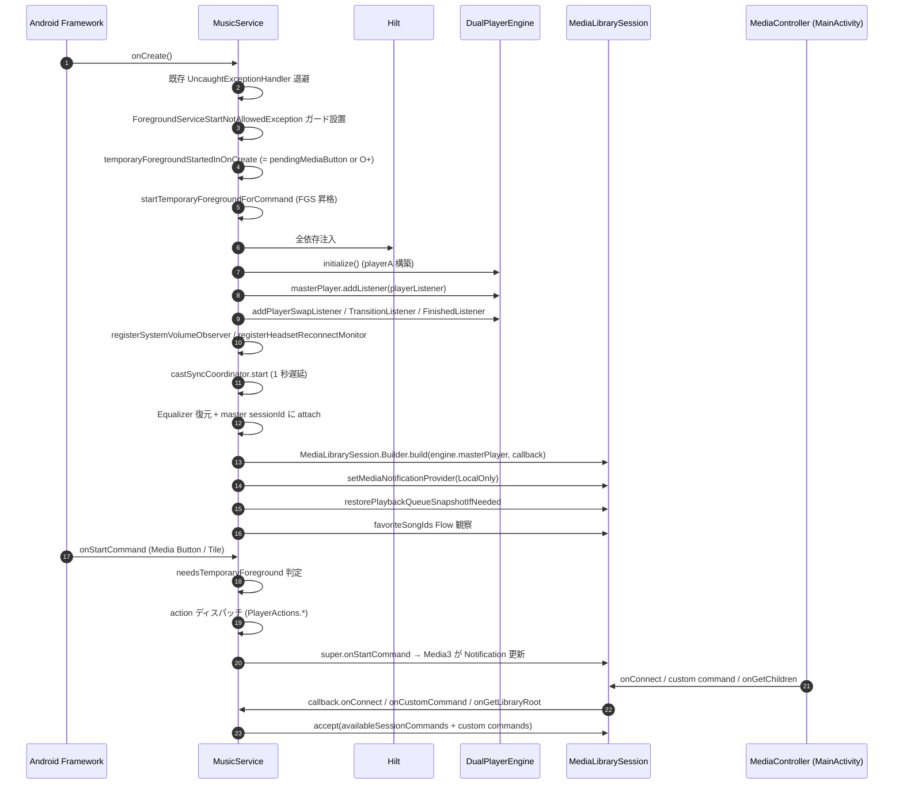

# MusicService — MediaLibraryService 本体

`app/src/main/java/com/theveloper/pixelplay/data/service/MusicService.kt` (2916 行)。Media3 の `MediaLibraryService` を継承し、Android Auto 対応、Chromecast 状態同期、ReplayGain、Widget 反映、Wear OS 状態発行、ヘッドセット再接続、Sleep timer、Cast 通知の Local-only 化など多くの責務を持つ巨大クラス。

---

## MusicService.kt

**パッケージ**: `com.theveloper.pixelplay.data.service`
**役割**: 再生サービスの中核。`MediaLibrarySession` を構築し、MediaController / Android Auto / ロック画面 / Wear からのすべてのコマンドを集約する。

**依存 (上流)**: `MainActivity` (MediaController bind), Android Auto / Android Automotive (`com.google.android.projection.gearhead`, `com.google.android.gms.car`, `com.google.android.apps.automotive`), Wear OS (拒絶される), Glance widget (consumes), Google Cast SDK (`CastSyncCoordinator`), `SyncManager`
**依存 (下流)**: `DualPlayerEngine`, `TransitionController`, `MusicRepository`, `UserPreferencesRepository`, `EqualizerPreferencesRepository`, `ThemePreferencesRepository`, `EqualizerManager`, `ColorSchemeProcessor`, `AutoMediaBrowseTree`, `WearStatePublisher`, `ReplayGainManager`, `NavidromeRepository`, `ListeningStatsTracker`, `CoilBitmapLoader`, `LocalOnlyMediaNotificationProvider`, `CastSyncCoordinator`, `WidgetUpdateManager`, `ReplayGainProcessor`, `ReplayingGainManager`

### トップレベル (ファイルスコープ)

| 名前 | 種類 | 説明 |
|------|------|------|
| `loadArtworkBytesViaCoil(context: Context, uri: Uri)` | `suspend fun` | Coil 経由でアートワークを取得し JPEG バイトへ変換 + sanitize |

### クラス / オブジェクト / Enum

| 名前 | 種類 | 説明 |
|------|------|------|
| `MusicService` | `class : MediaLibraryService()` (`@UnstableApi @AndroidEntryPoint`) | 再生サービス本体 |
| `ContextQueueResolution` | `private data class` | 自動付与するコンテキスト付きキューの解決結果 (`mediaItems: MutableList<MediaItem>`, `startIndex: Int`) |
| (companion) `TAG` | `private const val String` | `"MusicService_PixelPlay"` |
| (companion) `NOTIFICATION_ID` | `const val Int` | `101` |
| (companion) `ACTION_SLEEP_TIMER_EXPIRED` | `const val String` | `"com.theveloper.pixelplay.ACTION_SLEEP_TIMER_EXPIRED"` |
| (companion) `EXTRA_FORCE_FOREGROUND_ON_START` | `const val String` | `"com.theveloper.pixelplay.extra.FORCE_FOREGROUND_ON_START"` |
| (companion) `markPendingMediaButtonForegroundStart()` | `fun` | FGS 昇格ヒント カウンタを increment (`AtomicInteger`) |
| (companion) `unmarkPendingMediaButtonForegroundStart()` | `fun` | カウンタを 0 までデcrement (CAS ループ) |
| (companion) `consumePendingMediaButtonForegroundStart()` | `private fun` | 1 消費して true を返す |

### Hilt @Inject フィールド

| フィールド | 型 | 備考 |
|-----------|----|----|
| `engine` | `DualPlayerEngine` | 再生エンジン本体 |
| `controller` | `TransitionController` | クロスフェード制御 |
| `musicRepository` | `MusicRepository` | 楽曲リポジトリ |
| `userPreferencesRepository` | `UserPreferencesRepository` | 設定 |
| `equalizerPreferencesRepository` | `EqualizerPreferencesRepository` | EQ 設定 |
| `themePreferencesRepository` | `ThemePreferencesRepository` | テーマ |
| `equalizerManager` | `EqualizerManager` | EQ / BassBoost / Virtualizer / LoudnessEnhancer |
| `colorSchemeProcessor` | `ColorSchemeProcessor` | アルバムアート → カラースキーム |
| `autoMediaBrowseTree` | `AutoMediaBrowseTree` | Android Auto 用 |
| `wearStatePublisher` | `WearStatePublisher` | Wear 同期 |
| `replayGainManager` | `ReplayGainManager` | RG タグ読み出し |
| `navidromeRepository` | `NavidromeRepository` | Scrobble / reportPlayback |
| `listeningStatsTracker` | `ListeningStatsTracker` | 聴取統計 |
| `appScope` | `CoroutineScope` (`@AppScope`) | アプリ寿命スコープ |

### 内部状態

| フィールド | 型 | 備考 |
|-----------|----|----|
| `replayGainProcessor` | `lazy ReplayGainProcessor` | engine / manager / scope / `mediaSession?.player?.currentMediaItem` を供給 |
| `favoriteSongIds` | `Set<String>` | MediaController の通知表示用にお気に入り ID をキャッシュ |
| `mediaSession` | `MediaLibrarySession?` | null なら未構築 |
| `controllerLastBrowsedParent` | `Map<String, String>` (同期) | Auto ブラウズ時に最後の親を記録 (ControllerInfo キーごと) |
| `serviceScope` | `CoroutineScope` | `SupervisorJob + Dispatchers.Main` |
| `keepPlayingInBackground` | `Boolean` | 設定 |
| `isManualShuffleEnabled` | `Boolean` | プレイヤー shuffleMode とは別管理のシャッフル |
| `persistentShuffleEnabled` | `Boolean` | 永続化設定 |
| `previousMainThreadExceptionHandler` | `Thread.UncaughtExceptionHandler?` | `onCreate` で退避、`onDestroy` で復元 |
| `countedPlayActive`, `countedPlayTarget`, `countedPlayCount`, `countedOriginalId`, `countedPlayListener` | Boolean/Int/String/Player.Listener? | "N 回再生" モード用 |
| `endOfTrackTimerSongId` | `String?` | end-of-track Sleep timer |
| `castSyncCoordinator` | `lazy CastSyncCoordinator` | Cast セッション同期 |
| `widgetUpdateManager` | `lazy WidgetUpdateManager` | Glance + Wear 更新 |
| `playbackSnapshotPersistJob`, `playbackSnapshotUnloadWriteJob` | `Job?` | キュースナップショット永続化 |
| `isRestoringPlaybackSnapshot` | `Boolean` | 復元中フラグ |
| `isPlaybackUnloadInProgress` | `Boolean` | unload 中フラグ |
| `audioManager` | `AudioManager` | `getSystemService(AUDIO_SERVICE)` |
| `headsetReconnectCallback` | `AudioDeviceCallback?` | 再接続検出 |
| `shouldResumeAfterHeadsetReconnect` | `Boolean` | ノイジィポーズからの復帰 |
| `lastNoisyPauseRealtimeMs` | `Long` | 15 秒ウィンドウ判定用 |
| `resumeOnHeadsetReconnectEnabled` | `Boolean` | 設定 |
| `pauseOnVolumeZeroEnabled` | `Boolean` | 設定 |
| `temporaryForegroundStartedInOnCreate` | `Boolean` | FGS 昇格状態 |
| `systemVolumeObserver` | `lazy ContentObserver` | Settings.System 観察で volume 0 → pause |
| `cachedSchemeArtUri`, `cachedSchemePaletteStyle`, `cachedSchemeColorAccuracy`, `cachedColorSchemePair` | キャッシュ | ColorScheme 再計算抑制 |
| `cachedWidgetArt*` | キャッシュ | Widget アートワーク |

### 主要 public/protected API

| シグネチャ | 戻り値 | 目的 |
|------------|--------|------|
| `onCreate()` | `Unit` | UncaughtException ハンドラ注入 → FGS 昇格 (`startTemporaryForegroundForCommand`) → super.onCreate → `listeningStatsTracker.initialize` → `engine.initialize` → `replayGainProcessor.captureUserVolume` → `engine.masterPlayer.addListener(playerListener)` → `registerSystemVolumeObserver` → `controller.initialize` → 1 秒遅延で `castSyncCoordinator.start` → `registerHeadsetReconnectMonitor` → Equalizer 復元 + session attach → 多数の `userPreferencesRepository.*Flow.collect` → `MediaLibrarySession.Builder.build()` + `setMediaNotificationProvider` → favorites Flow 観察 |
| `onStartCommand(intent: Intent?, flags: Int, startId: Int)` | `Int` | ① media button / タイル / foreground 昇格必要性を判定し `startTemporaryForegroundForCommand` ② カスタム action (`PlayerActions.*`, `ACTION_SLEEP_TIMER_EXPIRED`) をディスパッチ ③ `super.onStartCommand` ④ FGS が不要なら `stopForeground(STOP_FOREGROUND_REMOVE)` + `stopSelfResult` |
| `onGetSession(controllerInfo)` | `MediaLibrarySession?` | `mediaSession` を返す (構築前なら null) |
| `onDestroy()` | `Unit` | `PlaybackActivityTracker.setPlaybackActive(false)` → listeningStats 確定 → navidrome "stopped" → 各種 Job cancel / unregister → mediaSession.release → engine.release → controller.release → serviceScope.cancel → UncaughtExceptionHandler 復元 |
| `onTaskRemoved(rootIntent: Intent?)` | `Unit` | `keepPlayingInBackground` が false または再生中でなければ `stopPlaybackAndUnload` |
| `onUpdateNotification(session, startInForegroundRequired)` | `Unit` | API 31+ で `hasPlaybackIntent` も加えて FGS 維持。`super.onUpdateNotification` を try-catch で被覆 |
| `startForegroundService(serviceIntent: Intent?)` | `ComponentName?` | API 31+ で `ForegroundServiceStartNotAllowedException` / `BackgroundServiceStartNotAllowedException` を吸収 (return することで process 終了を防ぐ) |

### 内部実装メモ

- **UncaughtException ハンドラ介入**: `ForegroundServiceStartNotAllowedException` を catch して suppress (`MusicService.kt:407-415`)。Media3 の Cast SDK 経由の `startForeground()` が `final` のためオーバーライド不可なので、main thread の例外でクラッシュする経路を塞ぐ。
- **MediaButton FGS 昇格ヒント**: `pendingMediaButtonForegroundStarts` (AtomicInteger) で `PixelPlayMediaButtonReceiver.onReceive` から increment、`onStartCommand` で consume。5 秒 FGS deadline を救う (`MusicService.kt:422-426`, `1077-1098`)。
- **Wear コントローラ拒否**: 接続時に `shouldRejectWearController` で `packageName` が `com.google.android.wearable`, `com.google.android.clockwork`, `wear` / `clockwork` / `companion` ヒントキーを持っていれば `MediaSession.ConnectionResult.reject()` (`MusicService.kt:571-577`, `936-954`)。
- **MediaButtonPreferences シグネチャ**: `buildMediaButtonPreferencesSignature(session)` は `(currentMediaItem.mediaId, isFavorite, isManualShuffleEnabled, repeatMode)` の連結文字列。変化があった時のみ `setMediaButtonPreferences` を再発行し、内部の通知更新 (`MediaControllerListener.onMediaButtonPreferencesChanged → onUpdateNotificationInternal`) 経由で再描画 (`MusicService.kt:2453-2483`)。
- **ボタン構成**: like / close / shuffle / repeat の 4 つを `SLOT_OVERFLOW` に置く。Media3 が prev/play-next を提供するため SLOT_BACK/SLOT_FORWARD はわざと宣言しない (ColorOS Control Center 互換性、`MusicService.kt:2820`)。
- **ReplayGain 委譲**: すべての RG ロジックは `ReplayGainProcessor` に委譲。`MediaService` 側は Flow 監視 → `processor.setEnabled` / `processor.setUseAlbumGain` / `processor.apply(item)` / `processor.prepareForTransition(player)` / `processor.onTransitionFinished()` の薄い呼び出しのみ (`MusicService.kt:531-545`)。
- **Player swap リスナー**: `playerSwapListener` (`MusicService.kt:324-327`) が `DualPlayerEngine` の `addPlayerSwapListener` に登録され、新しい master player を MediaSession に publish。`transitionDisplayPlayerListener` も同様。
- **Recording / Scrobble**: Navidrome リモート再生中 (`isNavidromeMediaItem`) は 30 秒ごとに `reportPlayback("playing")` を `appScope` で送信。STATE_ENDED と AUTO_TRANSITION で `scrobble(navidromeId, submission = true)` (`MusicService.kt:1231-1247`, `1314-1333`, `1356-1367`)。
- **PlayWhenReady 変更 (`AUDIO_BECOMING_NOISY`)**: 15 秒以内なら `shouldResumeAfterHeadsetReconnect = true` を立て、`AudioDeviceCallback.onAudioDevicesAdded` で Bluetooth A2DP / 有線 / BLE ヘッドセットが再接続したら `play()` を再開 (`MusicService.kt:1296-1306`, `1579-1623`)。
- **pauseOnVolumeZero**: 2 経路で監視 — `Player.Listener.onVolumeChanged` (Engine 経由の音量変化) と `systemVolumeObserver.onChange` (Settings.System 経由のハードウェア変化)。両方で `pause()` (`MusicService.kt:242-256`, `1250-1258`)。
- **End-of-track Sleep timer**: `endOfTrackTimerSongId` を設定 → `onMediaItemTransition` で REASON_AUTO のときにこの ID なら pause + seekTo(0) + clear。manual track change の場合は単にクリア (`MusicService.kt:1397-1417`)。
- **Duration Sleep timer**: `AlarmManager` で PendingIntent (`SleepTimerReceiver`)。`canScheduleExactAlarms()` を見、不可なら inexact にフォールバック (`MusicService.kt:982-1008`)。
- **counted play (N 回再生)**: `repeatMode = ONE` を強制し、`Player.Listener` で `onPositionDiscontinuity(REASON_AUTO_TRANSITION)` でカウント。`onMediaItemTransition` で別トラックなら cancel、`onRepeatModeChanged` で repeat が他に変えられたら `stopCountedPlay(restoreRepeatMode = false)` (`MusicService.kt:2827-2900`)。
- **Playback snapshot**: 1500ms debounce (`PLAYBACK_SNAPSHOT_DEBOUNCE_MS`) で `userPreferencesRepository.setPlaybackQueueSnapshot(snapshot)` を永続化。`STATE_IDLE` / 空 timeline は `immediate = true` で即時。`restorePlaybackQueueSnapshotIfNeeded` でプロセス死後の復元時に 50 件以内なら `prepare()` まで実施 (`MusicService.kt:1631-1851`)。
- **Playback unload (`stopPlaybackAndUnload`)**: `preservePlaybackSnapshot = true` (既定) なら snapshot 永続化、`false` ならクリア。`clearHeadsetReconnectResume / cancelDurationSleepTimerInternal / endOfTrackTimerSongId = null` などを総リセット → `playWhenReady = false; stop(); clearMediaItems()` → `widgetUpdateManager.requestFullUpdate(true)` → `stopForeground(STOP_FOREGROUND_REMOVE)` → `stopSelf()` (`MusicService.kt:2492-2529`)。
- **Android Auto**: `onGetLibraryRoot` → `onGetChildren` (parent_id ごとに `autoMediaBrowseTree.getChildren(parentId, page, pageSize)`) → `onGetItem` → `onSearch` → `onGetSearchResult` (ページネーション) → `onAddMediaItems` / `onSetMediaItems` (`contextQueue` 解決: Auto がルート browse → アルバム/プレイリスト等の親から来た要求には対応するキューを返す)。`grantArtworkUriPermissions` で `com.theveloper.pixelplay.provider` と `com.theveloper.pixelplay.artwork` の authority に `FLAG_GRANT_READ_URI_PERMISSION` を Auto に付与 (`MusicService.kt:728-848`, `2710-2738`)。
- **Widget update flow**: 250ms (`force`) / 300ms (`normal`) debounce → `buildPlayerInfo` → diff (曲名 / アーティスト / artwork null 変化 / fav / queue / theme / shuffle / repeat / duration > 3000ms drift) → Glance Widget 4 種 + `WearStatePublisher.publishState` (`WidgetUpdateManager.kt`)。
- **Color scheme cache**: `cachedSchemeArtUri + cachedSchemePaletteStyle + cachedSchemeColorAccuracy` が一致すればスキップ。`ColorSchemeProcessor.getOrGenerateColorScheme` を直接呼ぶ (`MusicService.kt:2016-2036`)。
- **Widget artwork cache**: ソースキー (`mediaId + 候補 uri csv`) でキャッシュ、失敗 30 秒以内はリトライ抑制 (`MusicService.kt:2152-2244`)。
- **`loadArtworkBytesViaCoil`**: ファイル冒頭 (L103-137) の suspend fun。Coil で decode → JPEG 92% → `ArtworkTransportSanitizer.sanitizeEncodedBytes`。
- **`CoroutineScope.future`**: Media3 callback で suspend を ListenableFuture へ橋渡し (`MusicService.kt:2905-2915`)。
- **`publishMediaSessionPlayer`**: `session.player !== player` なら old listener 解除 → `session.player = player` → new listener 追加 → `widgetUpdateManager.requestFullUpdate(true)` → `refreshMediaSessionUi` (`MusicService.kt:341-354`)。
- **`syncLocalListeningStatsFromPlayer`**: `songId` が blank なら `listeningStatsTracker.onPlaybackStopped()`。`forceNewSession` で `onTrackChanged`、そうでなければ `ensureSession` (`MusicService.kt:356-396`)。
- **`buildPlayerInfo`**: master player から一括 snapshot (current item / isPlaying / repeat / position / duration / timeline) → Cast snapshot で上書き可能 → artwork → theme + palette 生成 → queue 上位 4 件 → lyrics → `PlayerInfo` を return (`MusicService.kt:1939-2126`)。
- **`buildWearQueueRevision`**: Cast 接続中は remote queue items から、`mediaId` → `customData.songId` → `contentId` → `itemId` の順で token 列を作って hash。ローカル再生中は timeline を舐めて同様 (`MusicService.kt:1883-1925`)。
- **`resolveContextQueueForRequestedItem`**: Auto が context なしで item だけ要求してきた時に `lastBrowsedParent` から逆引き (`MusicService.kt:2654-2694`)。
- **`grantArtworkUriPermissions`**: `artworkUri.authority ∈ {provider, artwork}` のみ grant。それ以外はスキップ (ContentResolver が許可していない uri を grant しようとして SecurityException になるため) (`MusicService.kt:2710-2738`)。
- **`resolveAutoContextFromParentId`**: parent_id のプレフィックスから `(contextType, contextId)` を逆引き (`MusicService.kt:2740-2756`)。
- **`loadArtworkBytesForWidget` (public)**: ローカル / content / file / android.resource → `AlbumArtUtils.openArtworkInputStream`、http(s) → `HttpURLConnection` (4 s connect, 6 s read)、それ以外 (telegram_art://, navidrome:// 等) → Coil (`MusicService.kt:2331-2379`)。
- **`resolveRepositoryArtworkUri`**: mediaId → `musicRepository.getSong(songId)` → `song.albumArtUriString` を URI に変換 (`MusicService.kt:2316-2329`)。
- **`resolveStoredArtworkUriString`**: `MediaItemBuilder.EXTERNAL_EXTRA_ALBUM_ART` extra を優先、無ければ `metadata.artworkUri` (`MusicService.kt:2246-2254`)。
- **`shouldRejectWearController`**: `BLOCKED_WEAR_CONTROLLER_PREFIXES` で prefix マッチ + `WEAR_HINT_KEY_MARKERS` (wear/clockwork/companion/node/remote_device) のいずれかが connectionHints にあれば reject (`MusicService.kt:936-954`)。
- **PerformanceMetrics**: 外部 Auto / Wear コントローラを `PerformanceMetrics.recordControllerConnected` で記録。`audio_decoder_init` 等の細かい timing もすべて PerformanceMetrics へ。

### サービス起動シーケンス (Mermaid)



### 関連ファイル
- 上流: `MainActivity.kt`, `MainActivityIntentContract.kt`, `tile/*`, Android Auto, Wear OS (拒絶), `app/src/main/AndroidManifest.xml`
- 下流:
  - エンジン: `player/DualPlayerEngine.kt`, `player/TransitionController.kt`
  - 周辺: `CoilBitmapLoader.kt`, `LocalOnlyMediaNotificationProvider.kt`, `MusicNotificationProvider.kt`, `PixelPlayMediaButtonReceiver.kt`, `PlaybackActivityTracker.kt`, `ReplayGainProcessor.kt`, `SleepTimerReceiver.kt`, `TrustedMediaItemsResolution.kt`, `WidgetUpdateManager.kt`, `CastSyncCoordinator.kt`
  - Auto / Cast / HTTP: `auto/AutoMediaBrowseTree.kt`, `cast/CastAudioMimeUtils.kt`, `cast/IsoBmffAudioCodecDetector.kt`, `http/CastSessionSecurity.kt`
  - Wear: `wear/WearStatePublisher.kt`, `wear/WearThemePaletteFactory.kt`
- 関連: `di/AppModule.kt` (SessionToken 提供), `presentation/viewmodel/PlayerViewModel.kt` (MediaController 利用)

---

## 補足: 状態 / ライフサイクル詳細

### 起動から MediaSession 確立までの完全な流れ

1. **onCreate (Media3 起動前)**:
   - 既存 UncaughtExceptionHandler 退避 → `ForegroundServiceStartNotAllowedException` を intercept する handler 設置
   - `consumePendingMediaButtonForegroundStart()` でキュー消化 (`PixelPlayMediaButtonReceiver` 由来)
   - API 26+ では自動的に `temporaryForegroundStartedInOnCreate = true` (メディア再生 Service のため)
   - `startTemporaryForegroundForCommand()` で `ServiceCompat.startForeground` 呼び出し

2. **super.onCreate 後**:
   - `listeningStatsTracker.initialize(appScope)` — 統計の DataStore ロード開始
   - `engine.initialize()` — `playerA` 構築 (Hilt 注入済の dependency を使う)
   - `replayGainProcessor.captureUserVolume(engine.masterPlayer.volume)` — 現音量を保存
   - `syncLocalListeningStatsFromPlayer(engine.masterPlayer)` — 統計に現セッションを通知
   - `engine.masterPlayer.addListener(playerListener)` — master のイベント購読開始
   - `registerSystemVolumeObserver()` — `Settings.System` の `ContentObserver` 登録

3. **1 秒後 (Deferred work)**:
   - `castSyncCoordinator.start()` で Cast SDK 接続開始
   - `registerHeadsetReconnectMonitor()` で AudioDeviceCallback 登録
   - `musicRepository.telegramRepository.downloadCompleted` 購読 (Telegram ダウンロード完了で widget 再描画)

4. **同期セクション**:
   - `EqualizerManager.restoreState(...)` で EQ / BassBoost / Virtualizer / LoudnessEnhancer 復元
   - `engine.getAudioSessionId()` で取得後 `equalizerManager.attachToAudioSessionIfNeeded(sessionId)`
   - `engine.activeAudioSessionId` Flow を購読し、crossfade 後に EQ 再 attach
   - `keepPlayingInBackgroundFlow` / `hiFiModeEnabledFlow` / `resumeOnHeadsetReconnectFlow` / `pauseOnVolumeZeroFlow` / `persistentShuffleEnabledFlow` / `replayGainEnabledFlow` / `replayGainUseAlbumGainFlow` / `isShuffleOnFlow` を購読

5. **MediaLibrarySession 構築**:
   - `MediaLibrarySession.Builder(this, engine.masterPlayer, callback)`
   - `.setSessionActivity(getOpenAppPendingIntent())`
   - `.setBitmapLoader(CoilBitmapLoader(this, serviceScope))`
   - `.build()`
   - `setMediaNotificationProvider(LocalOnlyMediaNotificationProvider(this).also { it.setSmallIcon(R.drawable.monochrome_player) })`

6. **キュー永続化復元**:
   - 2 秒 delay (`temporaryForegroundStartedInOnCreate` の場合) で `stopForeground(STOP_FOREGROUND_REMOVE)`
   - `restorePlaybackQueueSnapshotIfNeeded()` で DataStore から復元

### onStartCommand のアクション ディスパッチ

```kotlin
intent?.action?.let { action ->
    when (action) {
        PlayerActions.PLAY_PAUSE -> { ... }
        PlayerActions.NEXT -> { ... }
        PlayerActions.PREVIOUS -> { ... }
        PlayerActions.FAVORITE -> { musicRepository.toggleFavoriteStatus(songId) }
        PlayerActions.PLAY_FROM_QUEUE -> { ... seek by song_id ... }
        PlayerActions.SHUFFLE -> { updateManualShuffleState(...) }
        PlayerActions.REPEAT -> { cycle repeat mode }
        ACTION_SLEEP_TIMER_EXPIRED -> { cancelDurationSleepTimerInternal(); player.pause() }
    }
}
```

`PlayerActions.PLAY_PAUSE/NEXT/PREVIOUS/FAVORITE/PLAY_FROM_QUEUE/SHUFFLE/REPEAT` は `ui/glancewidget/PlayerActions.kt` で定義 (../07-ui-system/glance-widgets.md 参照)。

### `startTemporaryForegroundForCommand` の使い分け

| 状況 | 一時 FGS 昇格 |
|------|------------|
| Media Button 受信 (`ACTION_MEDIA_BUTTON`) でまだ foreground でない | ✅ |
| `EXTRA_FORCE_FOREGROUND_ON_START` extra | ✅ |
| `pendingMediaButtonForegroundStarts` カウンタ > 0 | ✅ |
| Widget action (`PlayerActions.*`) | ✅ |
| 既に `hasForegroundPlaybackIntent()` | ❌ |

一時 foreground の解除:
```kotlin
if (mediaSession?.player?.hasForegroundPlaybackIntent() != true) {
    stopForeground(STOP_FOREGROUND_REMOVE)
    if (needsTemporaryForeground) stopSelfResult(startId)
}
```

### 起動モードの分岐

| 状態 | 動作 |
|------|------|
| アプリ起動 (`LAUNCHER`) | 通常通り |
| ヘッドセットから media button | PixelPlayMediaButtonReceiver 経由、FGS 昇格ヒント |
| ロック画面ウィジェット ボタン | onStartCommand で `PlayerActions.*` をディスパッチ |
| Android Auto / Wear 接続 | callback.onConnect → 認可コマンド公開 |
| Cast 接続 | `castSyncCoordinator.attachRemoteClient` → MediaSession は master player のまま、UI 表示は Cast state を優先 |

### Android Auto 接続時の挙動

`shouldRejectWearController` で Wear コントローラを弾いた後、それ以外 (Auto / Automotive / 他アプリ) には:

1. `defaultResult.availableSessionCommands` + 12 個の `customCommand` を `SessionCommands.Builder` に追加
2. `currentMediaItem` に対する `grantArtworkUriPermissions` で `FLAG_GRANT_READ_URI_PERMISSION` を Auto に付与
3. `recordControllerConnected(packageName, isAuto, isWear, elapsedRealtimeMs)` で PerformanceMetrics に記録
4. `MediaSession.ConnectionResult.accept(sessionCommands, playerCommands)` で accept

### Custom Command 一覧 (再掲)

| Custom Command | Bundle extra | 動作 |
|----------------|-------------|------|
| `CLOSE_PLAYER` | - | `closeNotificationPlayer()` → `stopPlaybackAndUnload` |
| `COUNTED_PLAY` | `count: Int` | `startCountedPlay(count)` |
| `CANCEL_COUNTED_PLAY` | - | `stopCountedPlay()` |
| `SET_SLEEP_TIMER_DURATION` | `minutes: Int` | `setDurationSleepTimer` |
| `SET_SLEEP_TIMER_END_OF_TRACK` | `enabled: Boolean` | `setEndOfTrackSleepTimer` |
| `CANCEL_SLEEP_TIMER` | - | `cancelSleepTimers` |
| `TOGGLE_SHUFFLE` | - | `isManualShuffleEnabled` を toggle |
| `SHUFFLE_ON` | - | shuffle on |
| `SHUFFLE_OFF` | - | shuffle off |
| `SET_SHUFFLE_STATE` | `enabled: Boolean` | sync 用、内部で broadcastCustomCommand 呼び出し |
| `CYCLE_REPEAT_MODE` | - | OFF → ONE → ALL → OFF |
| `LIKE` | - | current song の toggle |
| `SET_FAVORITE_STATE` | `enabled: Boolean` | 状態同期 |

### ColorSchemeProcessor と動的テーマ

`buildPlayerInfo` 内で:

1. `themePreferencesRepository.playerThemePreferenceFlow.first()` で preference を取得
2. API 31+ + `ThemePreference.DYNAMIC` → `dynamicLight/DarkColorScheme(applicationContext)` を直接使用
3. それ以外 → `colorSchemeProcessor.getOrGenerateColorScheme(albumArtUri, paletteStyle, colorAccuracyLevel)`
4. 結果が前回と同じなら cache から返す (`cachedSchemeArtUri + cachedSchemePaletteStyle + cachedSchemeColorAccuracy` の三重キー)

### Wear queue revision の意義

`buildWearQueueRevision(timeline, currentIndex, currentMediaId)` は queue の revision ハッシュを生成し、`hashCode().toString()` を返す。Wear 側はこの revision を見て queue が変化したかを検知する。Cast がアクティブなら remote queue の token 列を使い、そうでなければ timeline を舐める。

### MediaSession Callback からの Artwork URI Permission

`grantArtworkUriPermissions(packageName, mediaItems)` は:

- `artworkUri.authority` が `com.theveloper.pixelplay.provider` または `com.theveloper.pixelplay.artwork` のいずれか
- `scheme == "content"` の場合のみ
- `grantUriPermission(targetPackage, artworkUri, FLAG_GRANT_READ_URI_PERMISSION)` を `runCatching` で呼ぶ

それ以外の URI (http/https など) は grant 不要 (元からアクセス可能)。

### まとめ: MusicService のアーキテクチャ要点

| 要件 | 実装 |
|------|----|
| 再生エンジン統合 | `DualPlayerEngine` を MediaLibrarySession.player として使う |
| クロスフェード | `TransitionController` が onMediaItemTransition でスケジューリング |
| Auto / Cast / Wear | callback 一式 + 状態投影 + permission grant |
| ReplayGain | `ReplayGainProcessor` に分離 (Pass 5 リファクタ) |
| Widget 更新 | `WidgetUpdateManager` (debounce + diff) |
| ヘッドセット | AudioDeviceCallback + 15 秒以内 resume |
| 音量ゼロで pause | `Player.Listener.onVolumeChanged` + `Settings.System` ContentObserver の二段 |
| Sleep timer | `AlarmManager` (duration) / `endOfTrackTimerSongId` (EOT) |
| Counted play | `Player.Listener` で AUTO_TRANSITION カウント |
| バックグラウンド再生 | `keepPlayingInBackground` 設定で分岐 |
| プロセス死後の再生復元 | DataStore snapshot 1500ms debounce 永続化 |
| Media Button 5 秒 FGS deadline | AtomicInteger ヒント + main thread での一時 foreground |
| Wear コントローラ拒絶 | package prefix + connectionHints 検査 |