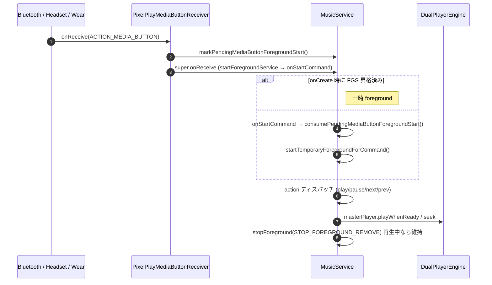
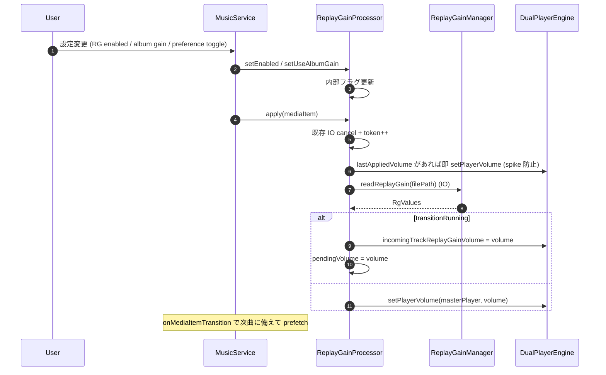
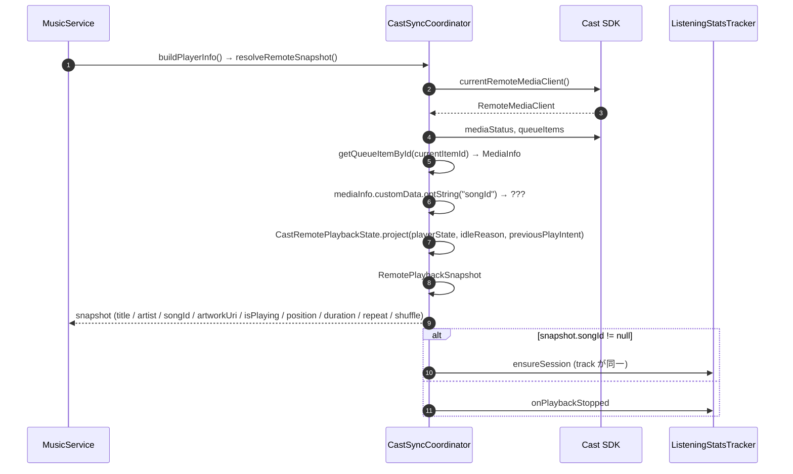
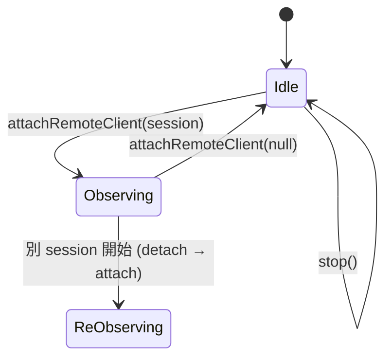

# ReplayGain / Cast Sync / Media Button / 雑多 Service

Engine 層のうち、上記章でカバーしなかった補助的な Service / ユーティリティ群。

---

## ReplayGainProcessor.kt

**パッケージ**: `com.theveloper.pixelplay.data.service`
**役割**: ReplayGain ボリュームノーマライズの全ロジック。ユーザー音量 / プログラム音量 / クロスフェード中の適用遅延 / 最後の適用ボリューム キャッシュ を管理する。

**依存 (上流)**: `MusicService` (lazy 構築され、各種 Flow → apply トリガ)
**依存 (下流)**: `DualPlayerEngine`, `ReplayGainManager`, `MediaItemBuilder.EXTERNAL_EXTRA_FILE_PATH`

### クラス

| 名前 | 種類 | 説明 |
|------|------|------|
| `ReplayGainProcessor` | `class (engine, replayGainManager, scope, currentSessionMediaItem)` | RG ロジック |

### 内部状態

| フィールド | 意味 |
|-----------|------|
| `enabled`, `useAlbumGain` | 設定 |
| `job`, `requestToken` | 進行中の IO + 世代カウンタ (cancel-safe) |
| `userSelectedVolume` | ユーザー指定音量 (RG off 時に復元) |
| `expectedVolume` | プログラム側で set した値 (`onVolumeChanged` で echo 抑止) |
| `pendingVolume` | クロスフェード中に計算済みで遷移後に適用する値 |
| `lastAppliedVolume`, `lastMediaId` | 次回即適用用キャッシュ |

### public API

| シグネチャ | 戻り値 | 目的 |
|------------|--------|------|
| `setEnabled(value)` | `Unit` | フラグ更新 |
| `setUseAlbumGain(value)` | `Unit` | フラグ更新 |
| `captureUserVolume(volume)` | `Unit` | 起動時に user volume を記録 |
| `cancel()` | `Unit` | 進行中 IO を cancel |
| `onPlayerVolumeChanged(volume)` | `Unit` | Player.Listener から。expected と一致すればエコー、無ければユーザー操作とみなして `userSelectedVolume` 更新 |
| `setPlayerVolume(player, volume)` (private) | `Unit` | `expectedVolume = clampedVolume` をセットしてから `player.volume = clampedVolume` |
| `reapplyLastAppliedVolume(player)` | `Unit` | `lastAppliedVolume` を即適用 (resume / seek で spike 防止) |
| `prepareForTransition(player)` | `Unit` | 補助 player の RG をキャッシュから取得し `engine.incomingTrackReplayGainVolume` にシード。`apply` を呼んで進行中は pending に |
| `apply(mediaItem)` | `Unit` | `enabled` なら IO で RG タグ読み出し → ボリューム計算 → 適用 or pending |
| `onTransitionFinished()` | `Unit` | `pendingVolume` があれば適用、無ければ `apply(currentSessionMediaItem())` で再計算 |
| `onMediaMetadataChanged(currentItem)` | `Unit` | track 変化時のみ `apply`、それ以外は `reapplyLastAppliedVolume` |
| `prefetch(mediaItem)` | `Unit` | IO で RG タグ読み出しのみ (キャッシュ warm) |
| `cachedVolumeFor(mediaItem)` (private) | `Float?` | キャッシュヒット時のみ返す (IO なし) |

### 内部実装メモ

- `requestToken` を increment して stale 結果を破棄 (`currentRequestToken != requestToken` で早期 return)。
- クロスフェード中 (`engine.isTransitionRunning()`):
  - `apply` → `pendingVolume = volume` + `engine.incomingTrackReplayGainVolume = volume` をセットし、crossfade loop が終端 volume として読む
  - `onTransitionFinished` → `lastAppliedVolume = pending` → `setPlayerVolume(player, pending)`
- クロスフェード外:
  - `lastAppliedVolume` を即適用してから IO 結果で上書き (resume spike 防止)
- `onPositionDiscontinuity` 経由の `apply(currentItem)` で `(same track)` か判定し、同一 track は `reapplyLastAppliedVolume` で IO を避ける (`MusicService.kt:1371-1384`)。

### 関連ファイル
- 上流: `MusicService.kt:177-184` (lazy 生成), 各種 `userPreferencesRepository.*Flow.collect`
- 下流: `DualPlayerEngine.incomingTrackReplayGainVolume`, `ReplayGainManager.readReplayGain`, `ReplayGainManager.getVolumeMultiplier`, `MediaItemBuilder.EXTERNAL_EXTRA_FILE_PATH`
- 関連: `data/media/ReplayGainManager.kt`

---

## PlaybackActivityTracker.kt

**パッケージ**: `com.theveloper.pixelplay.data.service`
**役割**: プロセス全体で「現在再生中か」を示す軽量フラグ。AI ワーカー / 同期ワーカー が「今は再生中だから重い処理は控えよう」と defer するために読む。

### オブジェクト

| 名前 | 種類 | 説明 |
|------|------|------|
| `PlaybackActivityTracker` | `object` | グローバル フラグ |

### API

| シグネチャ | 戻り値 | 目的 |
|------------|--------|------|
| `isPlaybackActive` | `Boolean` | `AtomicBoolean.get()` |
| `setPlaybackActive(active: Boolean)` | `Unit` | フラグ更新 (Hilt 不要の素の static) |

### 内部実装メモ

- 28 行。
- `AtomicBoolean` で複数スレッド安全。
- ワーカー側は `CoroutineWorker.doWork()` の先頭で `if (PlaybackActivityTracker.isPlaybackActive) delay(...)` のような defer 戦略に使う想定。

### 関連ファイル
- 上流: `MusicService.kt:1267-1289` (`onIsPlayingChanged`), `MusicService.onDestroy` (`setPlaybackActive(false)`)
- 下流: `data/worker/*`, AI 系 Worker

---

## SleepTimerReceiver.kt

**パッケージ**: `com.theveloper.pixelplay.data.service`
**役割**: AlarmManager から発火するスリープタイマー切れの `BroadcastReceiver`。`MusicService` を `ACTION_SLEEP_TIMER_EXPIRED` で起こす。

### クラス

| 名前 | 種類 | 説明 |
|------|------|------|
| `SleepTimerReceiver` | `class : BroadcastReceiver` | スリープタイマー切れ |

### API

| シグネチャ | 戻り値 | 目的 |
|------------|--------|------|
| `onReceive(context, intent)` | `Unit` | `MusicService` を `ACTION_SLEEP_TIMER_EXPIRED` で `startService` |

### 内部実装メモ

- 20 行。
- `startService` 失敗時は `try/catch` で握りつぶし (タイマー切れ失敗は致命的ではない)。

### 関連ファイル
- 上流: `MusicService.kt:982-1008` (`AlarmManager.setExactAndAllowWhileIdle`)
- 下流: `MusicService.onStartCommand` (`ACTION_SLEEP_TIMER_EXPIRED` で pause)

---

## PixelPlayMediaButtonReceiver.kt

**パッケージ**: `com.theveloper.pixelplay.data.service`
**役割**: メディアボタン (Bluetooth / ヘッドセット / Wear) のエントリ レシーバー。Media3 の `MediaButtonReceiver` を継承し、FGS 昇格ヒント + 例外を吸収する。

### クラス

| 名前 | 種類 | 説明 |
|------|------|------|
| `PixelPlayMediaButtonReceiver` | `class : MediaButtonReceiver()` (`@OptIn(UnstableApi)`) | メディアボタン受信 |

### API

| シグネチャ | 戻り値 | 目的 |
|------------|--------|------|
| `onReceive(context, intent)` | `Unit` | `Intent.ACTION_MEDIA_BUTTON` 以外は何もしない (スーパークラス)。本 action の場合: `MusicService.markPendingMediaButtonForegroundStart` を increment → スーパークラス → 例外 (`IllegalStateException` / `Throwable`) 時は unmark して再 throw |

### 内部実装メモ

- 40 行。
- `BackgroundServiceStartNotAllowedException` (app がキャッシュ時) は androidx の `MediaButtonReceiver` では処理されないため、catch して unmark のみ (`IllegalStateException` として届く)。
- 他の `Throwable` は unmark + 再 throw でアプリのクラッシュレポートに任せる。

### 関連ファイル
- 上流: `AndroidManifest.xml` の `<receiver>` 宣言
- 下流: `MusicService.markPendingMediaButtonForegroundStart`, `MediaButtonReceiver` (Media3)
- 関連: `app/src/main/AndroidManifest.xml`

---

## CastSyncCoordinator.kt

**パッケージ**: `com.theveloper.pixelplay.data.service`
**役割**: Google Cast セッションへの同期を統合する coordinator。`MusicService` 内の Pass 5 リファクタで抽出。

**依存 (上流)**: `MusicService` (lazy 生成 + 1 秒遅延 start)
**依存 (下流)**: `CastContext`, `SessionManager`, `RemoteMediaClient`, `ListeningStatsTracker`, WidgetUpdater

### データクラス

| 名前 | 種類 | 説明 |
|------|------|------|
| `RemotePlaybackSnapshot` | `internal data class` | `occurrenceId, songId, title, artist, artworkUri, isPlaying, isActuallyPlaying, currentPositionMs, totalDurationMs, repeatMode, isShuffleEnabled` |

### クラス

| 名前 | 種類 | 説明 |
|------|------|------|
| `CastSyncCoordinator` | `internal class (context, listeningStatsTracker, requestWidgetUpdate)` | セッション同期 |

### public API

| シグネチャ | 戻り値 | 目的 |
|------------|--------|------|
| `currentRemoteMediaClient()` | `RemoteMediaClient?` | 観測中セッション → 現在のセッション にフォールバック |
| `start()` | `Unit` | `CastContext.getSharedInstance(context).sessionManager` から listener 登録、現在セッションへ attach |
| `stop()` | `Unit` | listener / callback 解除 |
| `syncListeningStatsFromRemote()` | `Unit` | `resolveRemoteSnapshot` を取得 → `ListeningStatsTracker.onTrackChanged` / `ensureSession` / `onPlaybackStopped` |
| `resolveRemoteSnapshot()` | `RemotePlaybackSnapshot?` | `MediaStatus` → 投影 |

### 内部実装メモ

- **`RemoteMediaClient.Callback`**:
  - `onStatusUpdated` / `onMetadataUpdated` / `onQueueStatusUpdated` → `syncListeningStatsFromRemote()` + `requestWidgetUpdate(false)`
  - `onPreloadStatusUpdated` → `requestWidgetUpdate(false)`
- **`SessionManagerListener`**:
  - `onSessionStarted` / `onSessionResumed` → `attachRemoteClient(session)`
  - `onSessionEnded` → 観測中なら detach、それ以外は widget 更新
- **`attachRemoteClient(session)`**:
  - 旧 callback を解除 → `observedSession = session` → 新 callback 登録 → `remoteClient.requestStatus()` → widget 更新
  - session == null なら `activeStatsOccurrenceId = null` + `listeningStatsTracker.onPlaybackStopped()`
- **`resolveRemoteSnapshot`**:
  - `PLAYER_STATE_UNKNOWN` は null
  - `currentItem.media.customData.optString("songId")` を優先、なければ `mediaInfo.contentId`
  - repeat / shuffle は `MediaStatus.queueRepeatMode` から ExoPlayer 定数へマッピング
  - `isActuallyPlaying = playerState == PLAYER_STATE_PLAYING`、`isPlaying = CastRemotePlaybackState.project` で投影
- `runCatching` で Cast SDK 障害 (Play Services なし等) を握りつぶす。

### 関連ファイル
- 上流: `MusicService.kt:206-213` (lazy 生成 + start/stop)
- 下流: Google Cast SDK, `ListeningStatsTracker`, `WidgetUpdateManager`, `CastRemotePlaybackState`
- 関連: `cast/CastOptionsProvider.kt`, `cast/CastPlayer.kt`

---

## TrustedMediaItemsResolution.kt

**パッケージ**: `com.theveloper.pixelplay.data.service`
**役割**: Auto / 外部 コントローラから渡された `MediaItem` を、信頼できる repository 由来のものと外部由来に分別して解決する小さなヘルパー。

### データクラス / 関数

| 名前 | 種類 | 説明 |
|------|------|------|
| `TrustedMediaItemsResolution` | `internal data class` | `mediaItems: MutableList<MediaItem>`, `trustedArtworkGrantItems: List<MediaItem>` |
| `resolveMediaItemsWithTrustedArtworkGrants(requestedItems, trustedItemResolver)` (top-level) | `fun` | 各 id でリポジトリ検索 → ヒットなら trustedItem (artwork URI 信頼)、無ければ元 item を採用 |

### 内部実装メモ

- 32 行。
- **セキュリティ意図**: 外部 コントローラが渡した metadata の URI は信頼できないため、`artworkGrantItems` (= uri 権限 grant 対象) は `trustedItemResolver` で解決できた場合のみ。`resolveMediaItemsByIds` (`MusicService.kt:2696-2708`) から利用され、`grantArtworkUriPermissions` に渡される。

### 関連ファイル
- 上流: `MusicService.kt:840-848` (`onAddMediaItems` / `onSetMediaItems`)
- 関連: なし

---

## その他 (補足)

### `service/` 直下の補助

| ファイル | 行数 | 役割 |
|---------|------|------|
| `service/CastSyncCoordinator.kt` | 278 | (上記) Cast 同期 |
| `service/CoilBitmapLoader.kt` | 84 | Media3 BitmapLoader の Coil 実装 |
| `service/LocalOnlyMediaNotificationProvider.kt` | 59 | 通知の Local-only 化 |
| `service/MusicNotificationProvider.kt` | 21 | custom command 定数 |
| `service/PixelPlayMediaButtonReceiver.kt` | 40 | MediaButtonReceiver 拡張 |
| `service/PlaybackActivityTracker.kt` | 28 | プロセス フラグ |
| `service/ReplayGainProcessor.kt` | 274 | RG ロジック |
| `service/SleepTimerReceiver.kt` | 20 | スリープタイマー切れ |
| `service/TrustedMediaItemsResolution.kt` | 32 | Auto 信頼解決 |
| `service/WidgetUpdateManager.kt` | 200 | Glance + Wear 更新 |

### Mermaid: Media Button 経路



### Mermaid: ReplayGain 適用フロー



---

## Cast Sync / Media Button / 補助 Service 詳細

### CastSyncCoordinator の `resolveRemoteSnapshot` 詳細



`occurrenceId` は `currentItem.itemId > 0 ? itemId.toString() : songId ?: mediaInfo.contentId`。これが `stats` 側で track change 検出に使う。

### repeat / shuffle のマッピング

| Cast `MediaStatus.queueRepeatMode` | ExoPlayer `Player.REPEAT_MODE_*` |
|------------------------------------|---------------------------------|
| `REPEAT_MODE_REPEAT_SINGLE` | `REPEAT_MODE_ONE` |
| `REPEAT_MODE_REPEAT_ALL` | `REPEAT_MODE_ALL` |
| `REPEAT_MODE_REPEAT_ALL_AND_SHUFFLE` | `REPEAT_MODE_ALL` + `isShuffleEnabled = true` |
| (それ以外) | `REPEAT_MODE_OFF` + `isShuffleEnabled = false` |

### `CastSyncCoordinator.attachRemoteClient` の状態遷移



attach 時は旧 callback を unregister し、新 callback を register。`requestStatus()` で初回の状態を取得。null セッション時は `activeStatsOccurrenceId = null` + `listeningStatsTracker.onPlaybackStopped()`。

### PixelPlayMediaButtonReceiver の 5 秒 deadline 戦略

Android 12+ (API 31+) の foreground service start 制限:
- アプリが foreground → startForegroundService OK
- アプリが background → 5 秒以内に startForeground() しないと ForegroundServiceStartNotAllowedException

`PixelPlayMediaButtonReceiver.onReceive` で:

1. `MusicService.markPendingMediaButtonForegroundStart()` で AtomicInteger を increment
2. `super.onReceive(context, intent)` が `MediaSession` を構築し `startForegroundService` を呼ぶ
3. `MusicService.onStartCommand` が `consumePendingMediaButtonForegroundStart()` でカウンタ消費 → `startTemporaryForegroundForCommand()` で startForeground
4. 失敗時は `IllegalStateException` ハンドリングで unmark

これにより media button → FGS 昇格までのレースを吸収。

### PixelPlayMediaButtonReceiver の例外吸収

`onReceive` は `IllegalStateException` (= `BackgroundServiceStartNotAllowedException` 等) を catch して `MusicService.unmarkPendingMediaButtonForegroundStart()` のみ実行 (再 throw しない)。それ以外の `Throwable` は unmark + 再 throw。

### PlaybackActivityTracker の使い方 (worker 側)

`CoroutineWorker.doWork()` 内で:

```kotlin
override suspend fun doWork(): Result {
    if (PlaybackActivityTracker.isPlaybackActive) {
        // 再生中なので重い処理はスキップ
        return Result.success()
    }
    // 再生中でないので重い処理OK
    performHeavyWork()
    return Result.success()
}
```

これで「ユーザーが音楽を聴いている時にバッテリー / 熱を抑える」戦略。

### SleepTimerReceiver → MusicService の経路

```mermaid
sequenceDiagram
    autonumber
    participant AM as AlarmManager
    participant Recv as SleepTimerReceiver
    participant Svc as MusicService

    Note over Svc: setDurationSleepTimer(minutes)
    Svc->>AM: setExactAndAllowWhileIdle(triggerAtMillis, PendingIntent)
    AM-->>Recv: onReceive (alarm fire)
    Recv->>Svc: startService(ACTION_SLEEP_TIMER_EXPIRED)
    Svc->>Svc: onStartCommand → cancelDurationSleepTimerInternal(); player.pause()
```

`PendingIntent.FLAG_IMMUTABLE | FLAG_UPDATE_CURRENT` で immutable に。

### TrustedMediaItemsResolution の使い方

`MusicService.onAddMediaItems` で:

```kotlin
val resolvedItems = resolveMediaItemsByIds(mediaItems)
grantArtworkUriPermissions(
    controller.packageName,
    resolvedItems.trustedArtworkGrantItems  // 信頼できる songId 由来のみ
)
```

外部 Auto コントローラが独自の metadata URI を持っていても、`trustedArtworkGrantItems` には含まれないため grant 対象外 → セキュリティ強化。

### MediaButton FGS の完全な失敗ケース

| ケース | 動作 |
|--------|------|
| app foreground で media button | 通常通り FGS 昇格 OK |
| app background で media button | 5 秒以内なら OK、超過で `ForegroundServiceStartNotAllowedException` → suppress (main thread handler で吸収) |
| app cached で media button | `BackgroundServiceStartNotAllowedException` が `IllegalStateException` として届く → catch して unmark のみ |
| 通常 service が foreground | `mediaSession?.player.hasForegroundPlaybackIntent()` で判定 → 不要なら stopForeground |

### まとめ: 補助 Service の役割

| Service / コンポーネント | 役割 |
|---------------------------|------|
| `ReplayGainProcessor` | RG ボリューム適用、crossfade 対応、cancel-safe |
| `PlaybackActivityTracker` | プロセス全体で再生中かを軽量に公開 |
| `SleepTimerReceiver` | AlarmManager → MusicService へのブロードキャスト |
| `PixelPlayMediaButtonReceiver` | 5 秒 deadline を hint で救う |
| `CastSyncCoordinator` | Cast ↔ Local listening stats / widget 同期 |
| `TrustedMediaItemsResolution` | Auto metadata の信頼境界 |