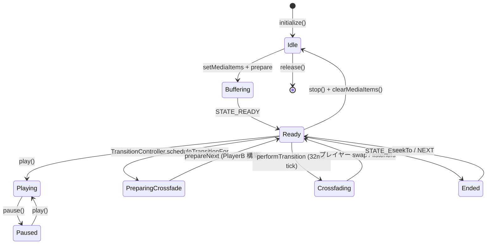

# Player Engine — DualPlayerEngine / CastPlayer / TransitionController / AudioProcessor

再生プレイヤーのコア。`DualPlayerEngine` は 2 台の ExoPlayer をクロスフェード用に持ち、HiFi / offload / proxy 解決 / AudioFocus / 状態通知を担当する。`CastPlayer` は Google Cast へのキュー転送、Decoder 判別、トランスコード判定、`TransitionController` は TransitionSettings 解決 + タイマーベースの発火タイミングを担当する。

---

## player/DualPlayerEngine.kt

**パッケージ**: `com.theveloper.pixelplay.data.service.player`
**役割**: マスター (A) + 補助 (B) の 2 台の ExoPlayer を管理し、クロスフェード / ゲイン / HiFi / WakeMode / AudioFocus を統合する。

**依存 (上流)**: `MusicService`, `MusicService.onStartCommand` (action 経由), Wear からの session コマンド
**依存 (下流)**: 6 種類の `StreamProxy` (Telegram / Netease / QQ / Navidrome / Jellyfin / GDrive), `TelegramRepository`, `TelegramCacheManager`, `ConnectivityStateHolder`, `PerformanceMetrics`, `AdvancedPerformanceDiagnostics`, `AudioDecoderPolicy`, `ActivityManager` (low-RAM), `MediaCodecSelector`, `DefaultRenderersFactory`, `DefaultAudioSink`, `HiResSampleRateCapAudioProcessor`, `SurroundDownmixProcessor`, `ResolvingDataSource`, `DefaultDataSource`, `DefaultMediaSourceFactory`, `DefaultExtractorsFactory`

### ファイル先頭の型 / 関数 (file-private)

| 名前 | 種類 | 説明 |
|------|------|------|
| `ActiveDecoderInfo` | `data class` | `name: String`, `isHardware: Boolean` — 現在使用中のデコーダ |
| `shouldResumeAfterTransientAudioFocusLoss(...)` | `internal fun` | master / auxiliary のいずれかが再生中なら resume と判定 |
| `shouldDisableAudioOffloadByDefaultForDevice(manufacturer, brand, model, hardware, sdkInt)` | `internal fun` | Xiaomi(SDK 36+), Pixel(SDK 37+), Lava MTK LXX 系の HAL バグ時のみ offload を既定 off |
| `shouldTriggerAudioOffloadStallFallback(...)` | `internal fun` | 4 秒経過しても再生が始まらない時の fallback 判定 |
| `shouldDisableAudioOffloadOnEarlyBuffering(...)` | `internal fun` | 再生開始 500ms 以内に BUFFERING に入った (seek/transition ではない) 場合にのみ offload 無効化 |
| `LoadControlBufferProfile` | `internal data class` | メモリ階層別の buffer duration 設定 |
| `loadControlBufferProfileFor(isLowRamDevice)` | `internal fun` | low-RAM は半分に縮小 |

### クラス

| 名前 | 種類 | 説明 |
|------|------|------|
| `DualPlayerEngine` | `class @Inject constructor(...)` (`@Singleton @OptIn(UnstableApi)`) | 2 台の ExoPlayer を統合管理 |

### DualPlayerEngine の注入依存

| 名前 | 用途 |
|------|------|
| `@ApplicationContext context: Context` | ExoPlayer.Builder / ActivityManager |
| `telegramRepository: TelegramRepository` | `resolveTelegramUri` |
| `telegramStreamProxy: Lazy<TelegramStreamProxy>` | Telegram stream URL 取得 |
| `neteaseStreamProxy: NeteaseStreamProxy` | Netease stream URL |
| `qqMusicStreamProxy: QqMusicStreamProxy` | QQ Music stream URL |
| `navidromeStreamProxy: NavidromeStreamProxy` | Navidrome stream URL |
| `jellyfinStreamProxy: JellyfinStreamProxy` | Jellyfin stream URL |
| `gdriveStreamProxy: GDriveStreamProxy` | GDrive stream URL |
| `telegramCacheManager: TelegramCacheManager` | アクティブ再生 mark |
| `connectivityStateHolder: ConnectivityStateHolder` | オフライン時 offline イベント発火 |

### DualPlayerEngine の定数

| 定数 | 値 | 用途 |
|------|----|----|
| `AUDIO_OFFLOAD_STALL_FALLBACK_MS` | `4_000L` | オフロード stall 検出 |
| `POST_TRANSITION_OFFLOAD_GUARD_MS` | `2_000L` | クロスフェード直後の誤検出抑制 |
| `MAX_AUXILIARY_TIMELINE_ITEMS` | `200` | 補助プレイヤーのウィンドウ幅 |
| `LOCAL_MEDIA_SCHEMES` | `{content, file, android.resource}` | オフロード対象判定 |
| `REMOTE_MEDIA_SCHEMES` | `{http, https, telegram, netease, qqmusic, navidrome, jellyfin, gdrive}` | WakeMode = NETWORK 判定 |
| `CLOUD_PROXY_SCHEMES` | `{telegram, netease, qqmusic, navidrome, jellyfin, gdrive}` | proxy 解決対象 |

### DualPlayerEngine のネスト型

| 名前 | 種類 | 説明 |
|------|------|------|
| `TransitionTarget` | `data class` | クロスフェード先 (`mediaItem`, `absoluteIndex`, `queueSize`) |
| `AudioFormatSnapshot` | `data class` | 診断用 (`sampleMimeType`, `sampleRate`, `channelCount`, `pcmEncoding`, `bitrate`) |

### DualPlayerEngine の状態

| フィールド | 型 | 備考 |
|-----------|----|----|
| `hiFiModeEnabled` | `var Boolean` (private set) | PCM_FLOAT 出力の on/off |
| `audioOffloadEnabled` | `var Boolean` | 実行時切替 |
| `transitionJob`, `bufferingFallbackJob`, `preResolutionJob` | `Job?` | コルーチン管理 |
| `transitionRunning` | `Boolean` | クロスフェード実行中 |
| `queueSnapshot`, `activeWindowStartIndex`, `activePlayerUsesWindowedQueue`, `preparedWindowStartIndex`, `preparedPlayerUsesWindowedQueue` | ウィンドウ管理 | |
| `playerA` | `lateinit ExoPlayer` | master |
| `playerB` | `ExoPlayer?` | auxiliary (クロスフェード時のみ存在) |
| `onPlayerSwappedListeners`, `onTransitionDisplayPlayerListeners`, `onTransitionFinishedListeners` | `MutableList` | callback 群 |
| `onPlayerAboutToBeReleasedListener` | `((Player) -> Unit)?` | release 直前 hook |
| `_activeAudioSessionId`, `_activeDecoderInfo` | `MutableStateFlow` | 外部公開 |
| `activeAudioSessionId`, `activeDecoderInfo` | `StateFlow` (公開) | |
| `audioFocusRequest`, `isFocusLossPause`, `lastPlayWhenReadyAtMs`, `lastPlayingAtMs` | focus 状態 | |
| `lastSeekAtMs`, `lastMediaItemTransitionAtMs`, `bufferingStartedAtMs`, `transitionStartedAtMs`, `lastTransitionFinishedAtMs` | 診断用 timestamp | |
| `isReleased`, `resolvedUriCache` (LruCache(100)), `isLowRamDevice` (lazy) | | |
| `incomingTrackReplayGainVolume` | `var Float?` | crossfade ループが読む。MusicService.ReplayGainProcessor から set |

### DualPlayerEngine の public API

| シグネチャ | 戻り値 | 目的 |
|------------|--------|------|
| `setOnPlayerAboutToBeReleasedListener(listener: (Player) -> Unit)` | `Unit` | 旧 master リリース直前に呼ばれる |
| `addPlayerSwapListener(listener: (Player) -> Unit)` / `removePlayerSwapListener` | `Unit` | swap listener 管理 |
| `addTransitionDisplayPlayerListener(listener: (Player) -> Unit)` / `removeTransitionDisplayPlayerListener` | `Unit` | fade 中に display 用に表示する player を通知 |
| `addTransitionFinishedListener(listener: () -> Unit)` / `removeTransitionFinishedListener` | `Unit` | 終了通知 |
| `notifyExternalSeekInitiated()` | `Unit` | UI からの seek を HAL-reset ヒューリスティックに事前通知 |
| `masterPlayer` (getter) | `Player` | 遅延 `initialize()` して `playerA` を返す |
| `isTransitionRunning()` | `Boolean` | |
| `isUsingWindowedQueue()` | `Boolean` | |
| `getFullQueue()` | `List<MediaItem>` | `ensureQueueSnapshot()` |
| `getCurrentAbsoluteIndex()` | `Int` | playerIndex + windowStart 解決 |
| `triggerAdjacentPreResolution()` | `Unit` | 隣接曲の cloud URI を 600ms debounce で事前解決 |
| `getAudioSessionId()` | `Int` | master player の sessionId (EQ 連携) |
| `initialize()` | `Unit` | 初回 / 再構築 (playerA 破棄 → build → addListener)。既に生きていれば何もしない |
| `setPauseAtEndOfMediaItems(shouldPause: Boolean)` | `Unit` | クロスフェード中に手動制御するため `pauseAtEndOfMediaItems` を制御 |
| `getNextTransitionTarget(currentMediaItem, repeatMode)` | `TransitionTarget?` | snapshot から次の target を決定 |
| `setHiFiMode(enabled: Boolean)` | `Unit` | `HiFiCapabilityChecker.isSupported()` 確認後 `rebuildPlayersPreservingMasterState` |
| `resolveCloudUri(uri: Uri)` (suspend) | `Uri` | scheme 別に各 StreamProxy で解決、LruCache に格納 |
| `resolveMediaItem(mediaItem: MediaItem)` (suspend) | `MediaItem` | cloud scheme のみ `resolveCloudUri` |
| `prepareNext(target: TransitionTarget, startPositionMs)` (suspend) | `Unit` | B に media items をセット、target を中心に 200 ウィンドウ、prepare / volume=0 / pause |
| `prepareNext(mediaItem, startPositionMs)` (suspend) | `Unit` | index を内部で探してから `prepareNext` |
| `cancelNext()` | `Unit` | transitionJob cancel / B 停止 / master volume 復帰 / `pauseAtEndOfMediaItems=false` |
| `performTransition(settings: TransitionSettings)` | `Unit` | 32ms ステップで envelope フェード、終了時に player swap、listeners 通知 |
| `release()` | `Unit` | 全コルーチン cancel / audioFocus abandon / A・B release / isReleased=true |

### 内部実装メモ

- **`buildPlayer()`**: `MediaCodecSelector` を `AudioDecoderPolicy.selectPlatformDecoders` でラップし、ALAC / MIDI は extension renderer へ。それ以外は platform decoder。`DefaultRenderersFactory` を継承し `buildAudioSink` で `HiResSampleRateCapAudioProcessor` と `SurroundDownmixProcessor` を chain する。`buildVideoRenderers` / `buildTextRenderers` / `buildCameraMotionRenderers` は空実装でメモリ節約。`setMediaSourceFactory` で `ResolvingDataSource` を挟んで cloud URI を実行時に解決。`Mp3Extractor.FLAG_ENABLE_CONSTANT_BITRATE_SEEKING` (Opus 編集リスト問題回避のため `FLAG_WORKAROUND_IGNORE_EDIT_LISTS` は意図的に未付与) + `FlacExtractor.FLAG_DISABLE_ID3_METADATA` (`DualPlayerEngine.kt:1031-1150`)。
- **`buildAdaptiveLoadControl()`**: low-RAM は `minBuffer=15s, maxBuffer=30s, bufferForPlayback=2.5s, bufferForPlaybackAfterRebuffer=5s`、通常は `30s / 60s`。`setPrioritizeTimeOverSizeThresholds(true)` で byte threshold ではなく duration threshold を使う (`DualPlayerEngine.kt:997-1029`)。
- **`requestAudioFocus()`**: API 26+。`AudioFocusRequest.Builder` で `setAcceptsDelayedFocusGain(true)` (遅延取得を許容) → `AUDIOFOCUS_REQUEST_DELAYED` のときは `isFocusLossPause = true` にして pause。
- **`scheduleAudioOffloadFallbackIfNeeded`**: ローカル再生中、`playWhenReady=true && !isPlaying` で 4 秒経過したら offload を切る (LOCAL_MEDIA_SCHEMES のみ対象)。
- **`shouldDisableAudioOffloadOnEarlyBuffering`**: seek 後 1.5s / transition 後 2s / media item transition 後 2s なら offload 切替を抑止。HAL offload reset と seek buffering を区別。
- **`shouldTriggerAudioOffloadStallFallback`**: `isCurrentMasterPlayer && mediaIdMatches && playWhenReady && !isPlaying && playbackSuppressionReason == NONE && state != IDLE/ENDED` で true。
- **`masterPlayerListener`**: `Player.Listener` + `AnalyticsListener` + `AudioOffloadListener` を 1 オブジェクトで実装。`onPlayWhenReadyChanged` で focus 要求 / fallback スケジュール、`onIsPlayingChanged` で `lastPlayingAtMs` 更新、`onSleepingForOffloadChanged` で wake mode を NONE に切替 (LOCAL 限定)、`onAudioDecoderInitialized` で `_activeDecoderInfo` 更新 + PerformanceMetrics 計測、`onAudioInputFormatChanged` で format 計測、`onAudioSessionIdChanged` で EQ 側に通知、`onMediaItemTransition` で Telegram キャッシュ mark + wake mode 更新 + 600ms debounce で隣接 cloud URI pre-resolution、`onTimelineChanged` で queue snapshot 再構築、`onPlaybackStateChanged` で early buffering heuristic、`onPositionDiscontinuity` で seek 検出。
- **`rebuildPlayersPreservingMasterState`**: master state (playWhenReady / position / mediaItems / repeat / shuffle / volume / pauseAtEnd / playbackParameters) を保存 → A release → 新 A build → 復元 → `setMediaItems` → listeners 通知。`position > 5_000L` を保証してオフロード stall rebuild 時の position ノイズ (5s 以下) を切る (`DualPlayerEngine.kt:930-987`)。
- **`resolveTelegramUriAsync`**: `telegramRepository.awaitReady` (10s) → `resolveTelegramUri` で fileId 取得 → local ダウンロード済みなら `Uri.fromFile`、それ以外は `connectivityStateHolder.isOnline` チェック → `telegramStreamProxy.ensureReady(5_000L)` → `getProxyUrl(fileId, 0L)`。
- **`prepareNext` (private)**: 補助 B に media items をセット。`targetIndex` を中心に ±100 ウィンドウ。`MAX_AUXILIARY_TIMELINE_ITEMS = 200`。`preparedWindowStartIndex` / `preparedPlayerUsesWindowedQueue` を記録。
- **`performOverlapTransition`**: outgoing start volume 取得 → incoming volume=0 → `incoming.playWhenReady = true; play()` → repeat/shuffle 引き継ぎ → 32ms ステップで `volIn = envelope(progress, settings.curveIn)` / `volOut = 1 - envelope(progress, settings.curveOut)` 計算。`incomingTrackReplayGainVolume` を終端 volume として尊重。swap 後 `playerA = incoming, playerB = outgoing`、A の audioSessionId 更新、swap listeners 発火、B を stop / clearMediaItems。
- **`envelope`**: `utils/envelope.kt` の関数。crossfade / fade-out のイージング (linear / cubic / sigmoid 等)。

### プレイヤーステートマシン (Mermaid)



### 関連ファイル
- 上流: `MusicService.kt`, `service/auto/AutoMediaBrowseTree.kt` (queue 解決)
- 下流: `data/network/telegram/TelegramStreamProxy.kt`, `data/network/netease/NeteaseStreamProxy.kt`, `data/network/qqmusic/QqMusicStreamProxy.kt`, `data/network/navidrome/NavidromeStreamProxy.kt`, `data/network/jellyfin/JellyfinStreamProxy.kt`, `data/network/gdrive/GDriveStreamProxy.kt`, `data/telegram/TelegramRepository.kt`, `data/equalizer/EqualizerManager.kt` (sessionId 取得), `presentation/viewmodel/ColorSchemeProcessor.kt`
- 関連: `player/CastPlayer.kt`, `player/TransitionController.kt`, `player/AudioDecoderPolicy.kt`, `player/HiFiCapabilityChecker.kt`, `player/HiResSampleRateCapAudioProcessor.kt`, `player/SurroundDownmixProcessor.kt`

---

## player/CastPlayer.kt

**パッケージ**: `com.theveloper.pixelplay.data.service.player`
**役割**: Google Cast デバイスへのキュー転送 (Cast DMR)。MIME 検出、トランスコード要否判定、待ち行列制御、コマンドパイプライン、再試行を担当する。`CastSyncCoordinator` 経由で `MusicService` から呼ばれる (本ファイル単体ではサービスではない)。

**依存 (上流)**: `CastSyncCoordinator`, `MusicService` (状態を preview)
**依存 (下流)**: `CastSession`, `RemoteMediaClient`, `MediaExtractor`, `MediaMetadataRetriever`, `MediaCodecList`, `FfmpegLibrary`, `CastAudioMimeUtils`, `IsoBmffAudioCodecDetector`, `CastSessionSecurity`, `MediaFileHttpServerService` (URL 生成時の address 提供)

### クラス

| 名前 | 種類 | 説明 |
|------|------|------|
| `CastPlayer` | `class (castSession: CastSession, contentResolver: ContentResolver?)` | Cast リモート クライアント ラッパ |
| `QueuedCommand` | `private data class` | コマンドパイプラインの 1 件 (`name`, `retryAttempts`, `action`) |

### 定数

| 定数 | 値 | 用途 |
|------|----|----|
| `MIME_NONE` | `""` | MIME 不明時のセンチネル |
| `ISO_BMFF_CODEC_PROBE_BYTES` | `1 MB` | ISO BMFF codec 検出時の読込上限 |
| `queueLoadTimeoutMs` | `25_000L` | queue ロード タイムアウト |
| `commandTimeoutMs` | `3_500L` | コマンド応答タイムアウト |
| `commandRetryDelayMs` | `220L` | 再試行遅延 |
| `minCommandSpacingMs` | `120L` | 最小コマンド間隔 (rate limit) |
| `seekDebounceMs` | `140L` | seek debounce |
| `extractorMimeCache`, `retrieverMimeCache`, `signatureMimeCache` | `ConcurrentHashMap<String, String>` | MIME 検出キャッシュ |

### public API

| シグネチャ | 戻り値 | 目的 |
|------------|--------|------|
| `canSeekCurrentItem()` | `Boolean` | 現在の queue item が seek 可能 (Cast で OGG 系は不安定) |
| `seek(position: Long)` | `Boolean` | 140ms debounce + `seekDebounceMs` で最新位置へ seek |
| `play()` / `pause()` / `next()` / `previous()` | `Unit` | queue の前後移動 / 再生制御 |
| `jumpToItem(itemId: Int, position: Long)` | `Unit` | 任意 itemId へジャンプ |
| `setRepeatMode(repeatMode: Int)` | `Unit` | `MediaStatus.REPEAT_MODE_*` を ExoPlayer 定数へマッピング |
| `release()` | `Unit` | パイプライン停止 |
| `loadQueue(songs, startIndex, startPositionMs, songTitlesById)` | `Unit` | 25 秒 timeout で queue ロード、`forceMimeTypeBySongId` で強制上書き |

### 内部実装メモ

- **MIME 検出 3 段フォールバック**: ① metadata / resolver MIME ② MediaExtractor で track format 検出 ③ MediaMetadataRetriever → ④ `detectAudioMimeTypeBySignature` で magic bytes 検査。FLAC / ALAC / AC3 は Cast DMR がネイティブ再生できないため AAC-ADTS へのトランスコード要否を `isAlacTranscodeSupported` / `isFlacTranscodeSupported` / `isAc3TranscodeSupported` で判定。
- **トランスコード要否マトリクス**:
  - ALAC: ffmpeg あれば AAC、そうでなければ raw M4A (`audio/mp4`)
  - FLAC: AAC (VBR seek が壊れるため)
  - AC3 / EAC3: AAC
- **コマンドパイプライン**: `ArrayDeque<QueuedCommand>` で順序保証 + 120ms 間隔で dispatch。失敗時は `commandRetryDelayMs` 後に再試行 (timeout 内)、3.5 秒で諦める。
- **Seek debounce**: 短期間に複数の seek 要求が来ても最後だけを Cast に送る (`CastPlayer.kt:636-673`)。
- **Stream revision**: `buildCastStreamRevision(contentType, queueLoadNonce)` で再ロード検出用トークンを生成。`CastSessionSecurity.buildSongUrl(serverAddress, songId, streamRevision, authToken)` で URL 化、`authToken` を query param `auth` に載せる。
- **`detectAudioMimeTypeBySignature`**: MP3 (ID3 skip + frame sync `0xFFFB` 等) / Ogg (`OggS` + `OpusHead` / `vorbis`) / FLAC (`fLaC`) / RIFF / M4A (`ftyp`) を判別。
- **`isMimeTypeDecoderSupported`**: `MediaCodecList.REGULAR_CODECS` を回して supportedTypes を見る。
- **`logQueueDiagnostics`**: 7 つの代表的 index で MIME / URL / duration を log する診断。

### 関連ファイル
- 上流: `CastSyncCoordinator.kt`, `MusicService.kt`
- 下流: Google Cast SDK, `cast/CastAudioMimeUtils.kt`, `cast/IsoBmffAudioCodecDetector.kt`, `http/CastSessionSecurity.kt`, `http/MediaFileHttpServerService.kt`

---

## player/TransitionController.kt

**パッケージ**: `com.theveloper.pixelplay.data.service.player`
**役割**: `TransitionSettings` (playlistId 別 or global) を解決し、`duration` のクロスフェードが `transitionPoint = duration - fadeDuration` になるよう adaptive polling で待ち、`engine.performTransition` を発火する。

**依存 (上流)**: `MusicService` (initialize/release), `engine` からの swap listener
**依存 (下流)**: `DualPlayerEngine`, `TransitionRepository`, `UserPreferencesRepository`

### クラス

| 名前 | 種類 | 説明 |
|------|------|------|
| `TransitionController` | `class @Inject constructor(engine, transitionRepository, userPreferencesRepository)` (`@Singleton @OptIn(UnstableApi)`) | クロスフェード制御 |

### public API

| シグネチャ | 戻り値 | 目的 |
|------------|--------|------|
| `initialize()` | `Unit` | 既に初期化済みなら何もしない。`Player.Listener` を `engine.masterPlayer` に attach。`swapListener` を `engine.addPlayerSwapListener` に登録 |
| `release()` | `Unit` | job cancel / swap listener 解除 / Player.Listener 解除 / scope cancel |

### 内部実装メモ

- **swap listener** (`TransitionController.kt:46-77`): player swap 後に 1 秒 delay → 同じ track か確認 → `scheduleTransitionFor(item)` を再スケジュール。
- **`Player.Listener`**: `onMediaItemTransition` で `pauseAtEnd = false` → scheduleTransitionFor / `onIsPlayingChanged` で再開時に schedule / `onTimelineChanged` で playlist 変更時に cancel + 再 schedule / `onRepeatModeChanged` で再 schedule。
- **`scheduleTransitionFor` (private)**:
  1. 既存 scheduler job cancel + `pauseAtEnd = false`
  2. 1500ms debounce (rapid skip 抑制)
  3. `transitionTarget = engine.getNextTransitionTarget(item, repeatMode)` → null なら cancel + return
  4. `combine(settingsFlow, isCrossfadeEnabledFlow)` を `collectLatest`
  5. global disabled / mode=NONE / duration<=0 なら cancel + return
  6. `engine.prepareNext(target)`
  7. `player.duration` が `TIME_UNSET` の間 500ms polling
  8. `effectiveDuration = settings.durationMs.coerceIn(500, duration - 150)` (minFade=500, guardWindow=150)
  9. `transitionPoint = duration - effectiveDuration`
  10. `pauseAtEnd = true` (手動制御)
  11. adaptive sleep loop: `> 5s: 1000ms`, `> 1s: 250ms`, `< 1s: 50ms`
  12. `transitionPoint <= currentPosition` なら即時発火 (`adjustedDuration = remaining`)
  13. `engine.performTransition(settings.copy(durationMs = adjustedDuration))`
- **例外ケース**: duration が `minFade + guardWindow` 未満ならスキップ、残り < 0ms もスキップ、cancellation 時は reset。

### 関連ファイル
- 上流: `MusicService.kt` (initialize/release)
- 下流: `DualPlayerEngine.kt`, `data/repository/TransitionRepository.kt`, `data/preferences/UserPreferencesRepository.kt`

---

## player/AudioDecoderPolicy.kt

**パッケージ**: `com.theveloper.pixelplay.data.service.player`
**役割**: デコーダ選択ポリシー。MIME で extension renderer を必須にするか、decoder 名から hardware / software を判別する。

**依存 (上流)**: `DualPlayerEngine.buildPlayer` の `MediaCodecSelector` 経由
**依存 (下流)**: なし

### オブジェクト

| 名前 | 種類 | 説明 |
|------|------|------|
| `AudioDecoderPolicy` | `internal object` | ポリシー判定 |

### API

| シグネチャ | 戻り値 | 目的 |
|------------|--------|------|
| `shouldUseExtensionRenderer(mimeType: String)` | `Boolean` | ALAC / MIDI なら true |
| `selectPlatformDecoders<T>(mimeType, decoderInfos)` | `List<T>` | extension-only なら空リスト (platform decoder 抑制)、それ以外はそのまま |
| `isLikelyHardwareDecoder(decoderName: String)` | `Boolean` | 名前が `omx.google.` / `c2.android.` / `ffmpeg` / `midi` / `jsyn` / `libgav1` / `dav1d` を含まなければ hardware 候補 (`omx.*`, `c2.*`, `.qti.`, `.qcom.`, `.sec.`, `.mtk.`, `.exynos.`, `.dolby.`) |

### 内部実装メモ

- 51 行と極小だが、すべての ExoPlayer 構築に影響する重要な policy。

### 関連ファイル
- 利用: `DualPlayerEngine.kt:1031-1040`
- 関連: なし

---

## player/HiFiCapabilityChecker.kt

**パッケージ**: `com.theveloper.pixelplay.data.service.player`
**役割**: 端末が `PCM_FLOAT` AudioTrack を受け付けられるかを 2 段階で検査する。

### オブジェクト

| 名前 | 種類 | 説明 |
|------|------|------|
| `HiFiCapabilityChecker` | `object` | 結果キャッシュ付 capability 検査 |

### API

| シグネチャ | 戻り値 | 目的 |
|------------|--------|------|
| `isSupported()` | `Boolean` | 初回呼び出しで結果をキャッシュし永続化 |
| `runCheck()` (private) | `Boolean` | ① `AudioTrack.getMinBufferSize(44_100, STEREO, PCM_FLOAT)` が 0 / ERROR / ERROR_BAD_VALUE なら false ② `AudioTrack.Builder().setEncoding(PCM_FLOAT).build().state == STATE_INITIALIZED` なら true |

### 内部実装メモ

- `@Volatile cachedResult: Boolean?` で複数スレッドからの同時呼び出しを安全化。
- 結果は端末 capabilities で変化しないので一回だけ。

### 関連ファイル
- 利用: `DualPlayerEngine.setHiFiMode` (`DualPlayerEngine.kt:1188`)
- 関連: `DualPlayerEngine.buildPlayer` の `setEnableAudioFloatOutput(hiFiModeEnabled)` (`DualPlayerEngine.kt:1089`)

---

## player/HiResSampleRateCapAudioProcessor.kt

**パッケージ**: `com.theveloper.pixelplay.data.service.player`
**役割**: 192 kHz を超える PCM (352.8 / 384 kHz) を `maxOutputSampleRateHz` (既定 192000) にダウンサンプルする AudioProcessor。

**依存 (上流)**: `DualPlayerEngine.buildPlayer` の `DefaultAudioSink.DefaultAudioProcessorChain`
**依存 (下流)**: なし (pure AudioProcessor)

### クラス

| 名前 | 種類 | 説明 |
|------|------|------|
| `HiResSampleRateCapAudioProcessor` | `class : AudioProcessor` (`@UnstableApi`) | PCM 16-bit / PCM FLOAT ダウンサンプル |

### public API (Media3 AudioProcessor)

| シグネチャ | 戻り値 | 目的 |
|------------|--------|------|
| `configure(inputAudioFormat)` | `AudioFormat` | 超えていれば `ceil(sampleRate / max) >= 2` の factor で downsample / 出力 sampleRate を返す。超えていなければ入力そのまま |
| `isActive()` | `Boolean` | outputFormat != NOT_SET |
| `queueInput(inputBuffer)` | `Unit` | 16-bit / Float で分岐し accumulate + 平均出力 |
| `getOutput()` | `ByteBuffer` | 内部 buffer を EMPTY_BUFFER と swap |
| `isEnded()` | `Boolean` | EOS + pending 0 + output 空 |
| `queueEndOfStream()` | `Unit` | pending をクリア + inputEnded = true |
| `flush()` (deprecated) | `Unit` | 内部 state クリア |
| `reset()` | `Unit` | 全 state リセット |

### 内部実装メモ

- **Average downsampling**: `downsampleFactor` 個サンプルを合計して factor で割る (整数化 → clamp)。
- **Native byte order 対応**: `NATIVE_ORDER_IS_BIG_ENDIAN` で read 時に byte swap。
- **Pending accumulator**: フレーム単位でアラインし、入力が factor 倍数で終わらない場合は余りを次回に持ち越し。
- **352.8 / 384 kHz 起因の "loading audio" ハング** を回避するのが主目的 (`HiResSampleRateCapAudioProcessor.kt:11-17`)。

### 関連ファイル
- 利用: `DualPlayerEngine.kt:1052`

---

## player/SurroundDownmixProcessor.kt

**パッケージ**: `com.theveloper.pixelplay.data.service.player`
**役割**: 5.1 (6ch) / 7.1 (8ch) PCM を Dolby 標準のダウンミックス行列でステレオ (2ch) に変換する AudioProcessor。

### クラス

| 名前 | 種類 | 説明 |
|------|------|------|
| `SurroundDownmixProcessor` | `class : AudioProcessor` (`@UnstableApi`) | サラウンド → ステレオ |

### API (Media3 AudioProcessor)

| シグネチャ | 戻り値 | 目的 |
|------------|--------|------|
| `configure(inputAudioFormat)` | `AudioFormat` | 6 or 8 channel かつ 16-bit / Float なら 2ch に変換 / それ以外は pass-through |
| `isActive()`, `queueInput(buf)`, `getOutput()`, `isEnded()`, `queueEndOfStream()`, `flush()`, `reset()` | AudioProcessor 標準 | |

### 内部実装メモ

- **Dolby downmix 行列** (surround=0.707, LFE=0.707):
  ```
  L = FL + 0.707·FC + 0.707·SL [+ 0.707·SBL] + 0.707·LFE
  R = FR + 0.707·FC + 0.707·SR [+ 0.707·SBR] + 0.707·LFE
  ```
- FFmpeg の channel order 想定: 5.1 = [FL, FR, FC, LFE, SL, SR], 7.1 = [FL, FR, FC, LFE, SL, SR, SBL, SBR]。
- Float / Short 両対応の `downmix51/71Left/Right` を 4 種類ずつ。
- 出力は `-1f..1f` (Float) / `Short.MIN..MAX` (Short) にクランプ。

### 関連ファイル
- 利用: `DualPlayerEngine.kt:1053`
- 関連: なし (pure AudioProcessor)