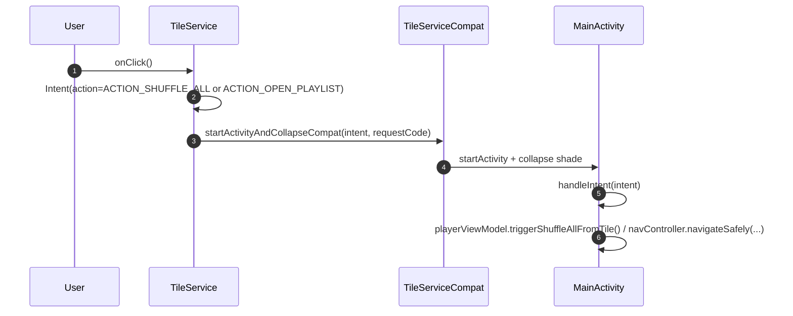
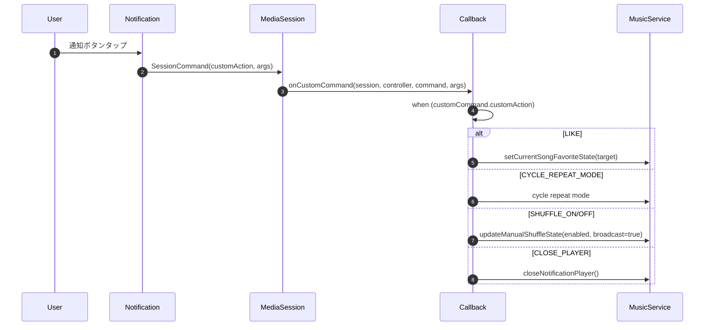

# Quick Settings Tile / MediaNotification / Glance Widget 更新

Quick Settings Tile 2 種、Tile 互換ヘルパー、Media3 通知抽象、ノーティフィケーション、Glance Widget 更新パイプライン、Coil ベースの BitmapLoader をまとめる。

---

## tile/TileServiceCompat.kt

**パッケージ**: `com.theveloper.pixelplay.data.service.tile`
**役割**: Tile から Activity を起動する API のバージョン互換ラッパー。

**依存 (上流)**: `LastPlaylistTileService.onClick`, `ShuffleAllTileService.onClick`
**依存 (下流)**: なし

### 関数

| シグネチャ | 戻り値 | 目的 |
|------------|--------|------|
| `TileService.startActivityAndCollapseCompat(intent: Intent, requestCode: Int)` | `Unit` | API 34+ は `PendingIntent` 版、それ未満は deprecated `Intent` 版 |

### 内部実装メモ

- 29 行。
- `SuppressLint("StartActivityAndCollapseDeprecated")` でビルド警告を抑制。

### 関連ファイル
- 上流: `LastPlaylistTileService.kt`, `ShuffleAllTileService.kt`
- 関連: なし

---

## tile/ShuffleAllTileService.kt

**パッケージ**: `com.theveloper.pixelplay.data.service.tile`
**役割**: Quick Settings の "Shuffle All" タイル。クリックで `MainActivity` を `ACTION_SHUFFLE_ALL` で起動する。

**依存 (上流)**: ユーザー
**依存 (下流)**: `MainActivity.handleIntent`, `MainActivityIntentContract.ACTION_SHUFFLE_ALL`

### クラス

| 名前 | 種類 | 説明 |
|------|------|------|
| `ShuffleAllTileService` | `class : TileService()` (`@RequiresApi(N)`) | シャッフル タイル |

### API

| シグネチャ | 戻り値 | 目的 |
|------------|--------|------|
| `onStartListening()` | `Unit` | タイルを `STATE_INACTIVE` に |
| `onClick()` | `Unit` | `MainActivity` を `ACTION_SHUFFLE_ALL` で起動 → `startActivityAndCollapseCompat` |

### 定数

| 定数 | 値 |
|------|----|
| `REQUEST_CODE_SHUFFLE_ALL` | `1001` |

### 内部実装メモ

- 41 行。
- `MainActivity` が `ACTION_SHUFFLE_ALL` を受けると `playerViewModel.triggerShuffleAllFromTile()` (`MainActivity.kt:367-371`)。

### 関連ファイル
- 上流: なし (ユーザー入力)
- 下流: `MainActivity.kt:362-414`, `MainActivityIntentContract.kt`

---

## tile/LastPlaylistTileService.kt

**パッケージ**: `com.theveloper.pixelplay.data.service.tile`
**役割**: Quick Settings の "Last Playlist" タイル。DataStore から保存済み playlist id を読んで `MainActivity` を `ACTION_OPEN_PLAYLIST` で起動する。

**依存 (上流)**: ユーザー
**依存 (下流)**: `UserPreferencesRepository.lastPlaylistIdFlow`, `PlaylistPreferencesRepository.getPlaylistsOnce`, `MusicRepository.getMusicFolders`, `MainActivityIntentContract.ACTION_OPEN_PLAYLIST`, `TileServiceCompat`

### クラス

| 名前 | 種類 | 説明 |
|------|------|------|
| `LastPlaylistTileService` | `class : TileService()` (`@RequiresApi(N)`) | 最終プレイリスト タイル |
| `LastPlaylistTileEntryPoint` | `interface` (`@EntryPoint @InstallIn(SingletonComponent)`) | Hilt EntryPoint (TileService は Hilt が直接動かないため) |

### API

| シグネチャ | 戻り値 | 目的 |
|------------|--------|------|
| `onStartListening()` | `Unit` | coroutines で DataStore 読み出し → 存在すれば `STATE_INACTIVE`、無ければ `STATE_UNAVAILABLE` |
| `onClick()` | `Unit` | playlist id 解決 → MainActivity を ACTION_OPEN_PLAYLIST で起動 |
| `resolveLaunchablePlaylistId()` (private, suspend) | `String?` | 保存済み id が user playlist / folder playlist として有効か検査 |
| `hasExistingFolderPlaylist(playlistId)` (private, suspend) | `Boolean` | folder playlist なら `MusicRepository.getMusicFolders` から検索 |
| `findFolder(targetPath, folders)` (private) | `MusicFolder?` | BFS で folder 検索 |

### 定数

| 定数 | 値 |
|------|----|
| `FOLDER_PLAYLIST_PREFIX` | `"folder_playlist:"` |
| `REQUEST_CODE_LAST_PLAYLIST` | `1002` |

### 内部実装メモ

- 165 行。
- **P0-2 修正**: `runBlocking` を使わず coroutines (`Dispatchers.IO`) で DataStore 読み出し。binder thread ブロックによる ANR 回避。
- Hilt EntryPoint で Application から repository 取得。

### 関連ファイル
- 上流: なし (ユーザー入力)
- 下流: `UserPreferencesRepository.lastPlaylistIdFlow`, `PlaylistPreferencesRepository.getPlaylistsOnce`, `MusicRepository.getMusicFolders`, `MainActivity.handleIntent`, `MainActivityIntentContract.ACTION_OPEN_PLAYLIST`

---

## MusicNotificationProvider.kt

**パッケージ**: `com.theveloper.pixelplay.data.service`
**役割**: `MediaSession` カスタム コマンドと extra key の定数 object。MediaController / Wear / 通知ボタンが利用する。

**依存 (上流)**: `MusicService.onCustomCommand`, `MusicService.buildMediaButtonPreferences`, `MusicService.refreshMediaSessionUi`
**依存 (下流)**: なし

### オブジェクト

| 定数 | 値 | 用途 |
|------|----|----|
| `CUSTOM_COMMAND_CLOSE_PLAYER` | `"com.theveloper.pixelplay.CLOSE_PLAYER"` | 通知の close ボタン |
| `CUSTOM_COMMAND_TOGGLE_SHUFFLE` | `"com.theveloper.pixelplay.TOGGLE_SHUFFLE"` | |
| `CUSTOM_COMMAND_SHUFFLE_ON` | `"com.theveloper.pixelplay.SHUFFLE_ON"` | |
| `CUSTOM_COMMAND_SHUFFLE_OFF` | `"com.theveloper.pixelplay.SHUFFLE_OFF"` | |
| `CUSTOM_COMMAND_SET_SHUFFLE_STATE` | `"com.theveloper.pixelplay.SET_SHUFFLE_STATE"` | sync broadcast |
| `EXTRA_SHUFFLE_ENABLED` | `"com.theveloper.pixelplay.extra.SHUFFLE_ENABLED"` | 上記 extra |
| `CUSTOM_COMMAND_CYCLE_REPEAT_MODE` | `"com.theveloper.pixelplay.CYCLE_REPEAT"` | |
| `CUSTOM_COMMAND_LIKE` | `"com.theveloper.pixelplay.LIKE"` | お気に入り toggle |
| `CUSTOM_COMMAND_SET_FAVORITE_STATE` | `"com.theveloper.pixelplay.SET_FAVORITE_STATE"` | 状態同期 |
| `EXTRA_FAVORITE_ENABLED` | `"com.theveloper.pixelplay.extra.FAVORITE_ENABLED"` | |
| `CUSTOM_COMMAND_COUNTED_PLAY` | `"com.theveloper.pixelplay.COUNTED_PLAY"` | N 回再生モード |
| `CUSTOM_COMMAND_CANCEL_COUNTED_PLAY` | `"com.theveloper.pixelplay.CANCEL_COUNTED_PLAY"` | |
| `CUSTOM_COMMAND_SET_SLEEP_TIMER_DURATION` | `"com.theveloper.pixelplay.SET_SLEEP_TIMER_DURATION"` | |
| `CUSTOM_COMMAND_SET_SLEEP_TIMER_END_OF_TRACK` | `"com.theveloper.pixelplay.SET_SLEEP_TIMER_END_OF_TRACK"` | |
| `CUSTOM_COMMAND_CANCEL_SLEEP_TIMER` | `"com.theveloper.pixelplay.CANCEL_SLEEP_TIMER"` | |
| `EXTRA_SLEEP_TIMER_MINUTES` | `"com.theveloper.pixelplay.extra.SLEEP_TIMER_MINUTES"` | |
| `EXTRA_END_OF_TRACK_ENABLED` | `"com.theveloper.pixelplay.extra.END_OF_TRACK_ENABLED"` | |

### 内部実装メモ

- 21 行の純定数 object。
- 同じ文字列が `presentation/components/PlayerViewModel.kt` 等でも文字列リテラルとして参照されているため、検索時の起点。

### 関連ファイル
- 利用: `MusicService.kt:580-723`, `tile/*`, `wear/WearCommandReceiver.kt`

---

## LocalOnlyMediaNotificationProvider.kt

**パッケージ**: `com.theveloper.pixelplay.data.service`
**役割**: Media3 の `DefaultMediaNotificationProvider` をラップし、`setLocalOnly(true)` で通知を Wear OS 側に bridged させない。

**依存 (上流)**: `MusicService.setMediaNotificationProvider`
**依存 (下流)**: Media3 `DefaultMediaNotificationProvider`

### クラス

| 名前 | 種類 | 説明 |
|------|------|------|
| `LocalOnlyMediaNotificationProvider` | `class : MediaNotification.Provider` (`@UnstableApi`) | Local-only ラッパ |

### API

| シグネチャ | 戻り値 | 目的 |
|------------|--------|------|
| `setSmallIcon(iconResId: Int)` | `Unit` | delegate に移譲 |
| `createNotification(...)` | `MediaNotification` | delegate で作成 → `Notification.Builder.recoverBuilder(...).setLocalOnly(true).build()` |
| `handleCustomCommand(session, action, extras)` | `Boolean` | delegate |
| `getNotificationChannelInfo()` | `NotificationChannelInfo` | delegate |

### 内部実装メモ

- 59 行。
- `runCatching` で `recoverBuilder` 失敗時は元の notification を返す。

### 関連ファイル
- 上流: `MusicService.kt:897-900`
- 関連: なし

---

## WidgetUpdateManager.kt

**パッケージ**: `com.theveloper.pixelplay.data.service`
**役割**: Glance widget 4 種と Wear state publish の統合パイプライン (debounce + diff)。

**依存 (上流)**: `MusicService` (`requestFullUpdate`, `requestWithFollowUp`, `cancel`)
**依存 (下流)**: `GlanceAppWidgetManager`, `PixelPlayGlanceWidget`, `BarWidget4x1`, `ControlWidget4x2`, `GridWidget2x2`, `PlayerInfoStateDefinition`, `WearStatePublisher`

### クラス

| 名前 | 種類 | 説明 |
|------|------|------|
| `WidgetUpdateManager` | `internal class` | pipeline マネージャ |

### 定数

| 定数 | 値 | 用途 |
|------|----|----|
| `FORCED_DEBOUNCE_MS` | `250L` | `force=true` 用 |
| `NORMAL_DEBOUNCE_MS` | `300L` | 通常 |
| `FOLLOW_UP_DELAY_MS` | `250L` | follow-up 再描画 |
| `QUEUE_PREVIEW_LIMIT` | `4` | widget に載せる queue preview 数 |

### public API

| シグネチャ | 戻り値 | 目的 |
|------------|--------|------|
| `requestFullUpdate(force: Boolean = false)` | `Unit` | debounce 後に `processUpdateInternal` |
| `requestWithFollowUp()` | `Unit` | 強制 + 250ms 後に再強制 |
| `cancel()` | `Unit` | job cancel |
| `clearCachedState()` | `Unit` | `lastWidgetPlayerInfo = null` + `wearStatePublisher.clearCache()` |

### 内部実装メモ

- `processUpdateInternal`:
  1. `buildPlayerInfo()` (service 側の suspend lambda)
  2. `shouldUpdateWidget(old, new)` で diff 判定 (title / artist / isPlaying / art uri / art bytes null 変化 / isFavorite / queue / themeColors / shuffle / repeat / duration / palette / position drift > 3000ms)
  3. `shouldPublishWearState` は上記 + `wearQueueRevision` / `lyrics` / `isLoadingLyrics`
  4. 必要なら `updateGlanceWidgets(playerInfo)` で 4 種全部更新 + `PerformanceMetrics.setWidgetActive` + `WIDGET_UPDATE` timing 記録
  5. 必要なら `wearStatePublisher.publishState(currentMediaId, playerInfo)`
- `toWidgetTransportState` で widget 用の subset (`lyrics = null`, `queue.take(4)`, `wearThemePalette = null`, `wearQueueRevision = ""`) を作成。

### 関連ファイル
- 上流: `MusicService.kt:217-225`, `service/auto/*`, `service/cast/*`
- 下流: `ui/glancewidget/*` (../07-ui-system/glance-widgets.md), `WearStatePublisher`

---

## CoilBitmapLoader.kt

**パッケージ**: `com.theveloper.pixelplay.data.service`
**役割**: Media3 `BitmapLoader` の Coil 実装。通知 / MediaSession 用アートワーク供給。

**依存 (上流)**: `MusicService.MediaLibrarySession.Builder.setBitmapLoader`
**依存 (下流)**: Coil `imageLoader`, `PerformanceMetrics`

### クラス

| 名前 | 種類 | 説明 |
|------|------|------|
| `CoilBitmapLoader` | `class (context: Context, scope: CoroutineScope)` (`@OptIn(UnstableApi)`) | Coil → Bitmap |

### API (Media3 BitmapLoader)

| シグネチャ | 戻り値 | 目的 |
|------------|--------|------|
| `loadBitmap(uri: Uri)` | `ListenableFuture<Bitmap>` | Coil 経由で Bitmap 取得 (max 1024px) |
| `decodeBitmap(data: ByteArray)` | `ListenableFuture<Bitmap>` | 同上 (バイト列) |
| `supportsMimeType(mimeType: String)` | `Boolean` | 常に true |

### 内部実装メモ

- `MAX_NOTIFICATION_ARTWORK_SIZE_PX = 1024` で上限を固定。
- `precision = INEXACT`, `allowHardware = false` (MediaSession IPC は software bitmap 必須)。
- `memoryCachePolicy = DISABLED` で Coil キャッシュからの recycling を防ぎ、`Can't copy a recycled bitmap` を回避。disk cache は有効。
- `PerformanceMetrics.ARTWORK_DECODE` 計測 + 寸法記録。

### 関連ファイル
- 上流: `MusicService.kt:894`
- 関連: `presentation/viewmodel/PlayerViewModel.kt` (Coil 経由の view 用)

---

## Glance Widget 更新パイプライン詳細

### 4 つの Glance Widget 一覧

| Widget | クラス | 用途 |
|--------|--------|------|
| メイン | `PixelPlayGlanceWidget` | 大型 / 全機能 |
| バー 4x1 | `BarWidget4x1` | コンパクト |
| コントロール 4x2 | `ControlWidget4x2` | ボタン多め |
| グリッド 2x2 | `GridWidget2x2` | グリッド表示 |

すべて `PlayerInfoStateDefinition` を介して同じ `PlayerInfo` を共有する。

### updateAppWidgetState の流れ

```kotlin
glanceIds.forEach { id ->
    updateAppWidgetState(context, PlayerInfoStateDefinition, id) { widgetPlayerInfo }
    PixelPlayGlanceWidget().update(context, id)
}
```

`PlayerInfoStateDefinition` は `PreferencesGlanceStateDefinition` 系で、Glance state として JSON serialize されて IPC される。`toWidgetTransportState` で lyrics / wear theme / queue (上位 4 件) を widget 用に間引いた版を保存。

### debounce タイミング

| トリガ | debounce |
|--------|---------|
| `requestFullUpdate(force = false)` | 300 ms |
| `requestFullUpdate(force = true)` | 250 ms |
| `requestWithFollowUp()` | 即時 + 250 ms 後にもう一度 |
| `cancel()` | - (job cancel) |

`widgetUpdateManager.requestFullUpdate(true)` が `MusicService` 内で多用される (`onIsPlayingChanged` / `onMediaItemTransition` / `onTimelineChanged` 等)。

### 状態 diff

`shouldUpdateWidget(old: PlayerInfo, new: PlayerInfo): Boolean`:
1. songTitle
2. artistName
3. isPlaying
4. albumArtUri
5. albumArtBitmapData null 変化 (null → non-null または逆)
6. isFavorite
7. queue (List equality)
8. themeColors
9. isShuffleEnabled
10. repeatMode
11. totalDurationMs
12. wearThemePalette
13. `abs(currentPositionMs - old) > 3000L`

どれか 1 つでも違えば widget 更新。Position drift が 3 秒以内なら position 自体は更新しない (tick 毎の更新を避ける)。

`shouldPublishWearState` は上記 + `wearQueueRevision` / `lyrics` / `isLoadingLyrics`。

### `PerformanceMetrics` 計測

- `setWidgetActive(anyWidgets: Boolean)` — 1 個でも widget が配置されていれば true
- `recordTiming(WIDGET_UPDATE, elapsedMs)` — 全 widget の update に要した時間

### CoilBitmapLoader のメモリ管理

- **Memory cache disabled**: Coil の cache に Bitmap の参照を持たせない。MediaSession が IPC で参照している間も Coil が勝手に recycle しないため。
- **Disk cache enabled**: 繰り返し load の高速化
- **allowHardware = false**: MediaSession IPC は software bitmap 必須
- **max 1024px**: lock screen / notification に十分な解像度を確保しつつ大きすぎないサイズ
- **ARTWORK_DECODE timing**: `System.nanoTime()` で計測
- **decoded dimensions 記録**: `PerformanceMetrics.recordDecodedArtworkDimensions(w, h)` でレポートに同梱

---

## Tile / Notification のアーキテクチャ詳細

### Quick Settings Tile 登録 (AndroidManifest.xml)

```xml
<service
    android:name=".data.service.tile.ShuffleAllTileService"
    android:label="@string/tile_shuffle_all_label"
    android:icon="@drawable/ic_shuffle"
    android:permission="android.permission.BIND_QUICK_SETTINGS_TILE">
    <intent-filter>
        <action android:name="android.service.quicksettings.action.QS_TILE" />
    </intent-filter>
</service>
```

両 Tile クラスとも `@RequiresApi(Build.VERSION_CODES.N)` (= API 24) で、TileService は API 24+ でしか存在しない。

### Tile から MainActivity へのフロー



### MediaSession Notification ボタン → CustomCommand 経路

通知上のボタン (like / shuffle / repeat / close) をタップすると Media3 の callback chain を通って `onCustomCommand` が呼ばれる:



`broadcast = true` のときは `setManualShuffleState` が内部で `session.broadcastCustomCommand(SET_SHUFFLE_STATE)` を投げ、複数 MediaController へ同期する。

### SET_SHUFFLE_STATE の broadcast 経路

`updateManualShuffleState` は `persistentShuffleEnabled` 設定時のみ DataStore に書き込む。`broadcast=true` の場合、`session.broadcastCustomCommand(SET_SHUFFLE_STATE, {enabled: true|false})` で同一セッションの全 Controller に通知 → Wear / Auto / Widget が同期。

### Coil BitmapLoader の cycle

1. Media3 `MediaLibrarySession` が artwork URI を必要とする
2. `CoilBitmapLoader.loadBitmap(uri)` 呼び出し
3. Coil ImageRequest で `MAX_NOTIFICATION_ARTWORK_SIZE_PX = 1024`、`precision = INEXACT`、`allowHardware = false`、`memoryCachePolicy = DISABLED`
4. Coil 経由で `AlbumArtUtils.openArtworkInputStream` などが URI 解決 → Bitmap decode
5. `PerformanceMetrics.recordTiming(ARTWORK_DECODE)` で timing 計測
6. `MediaNotification` 経由で Notification に渡す

### Tile の状態表示

`onStartListening` は Quick Settings panel を開いた時に呼ばれる。両 Tile とも `qsTile?.state = Tile.STATE_INACTIVE` をセット。`LastPlaylistTileService` のみ、playlist id が見つかれば INACTIVE、無ければ UNAVAILABLE を表示。

### tile listener の cancel

`LastPlaylistTileService.onDestroy` で `serviceScope.cancel()` を呼ぶ。`ShuffleAllTileService` は scope を持たない (同期処理のみ)。