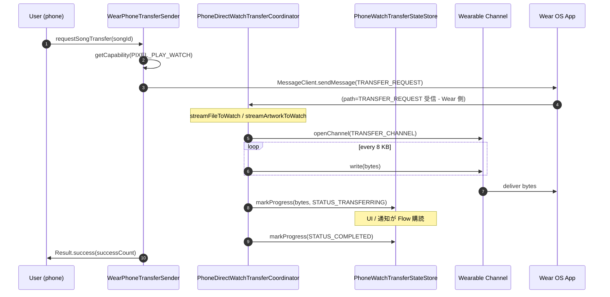

# Wear OS 連携 (phone 側)

Wear OS アプリとの通信・データ転送を行う phone 側のコンポーネント 8 ファイル。`shared/` モジュール (`../08-shared-module.md`) のデータモデルを使用。

---

## wear/PhoneDirectWatchTransferCoordinator.kt

**パッケージ**: `com.theveloper.pixelplay.data.service.wear`
**役割**: Wear OS へ楽曲ファイル + アルバムアート + テーマパレットを直接転送 (Channel API) する高レベル コーディネーター。

**依存 (上流)**: `WearPhoneTransferSender.requestSongTransfer` (電話 → 腕時計 の依頼), ViewModel からの call
**依存 (下流)**: `Wearable.getMessageClient(application)`, `Wearable.getChannelClient(application)`, `MusicRepository`, `ThemePreferencesRepository`, `ColorSchemeProcessor`, `PhoneWatchTransferStateStore`, `PhoneWatchTransferCancellationStore`, `TelegramRepository`, `TelegramStreamProxy`, `NeteaseStreamProxy`, `QqMusicStreamProxy`, `NavidromeStreamProxy`, `JellyfinStreamProxy`, `GDriveStreamProxy`, `AlbumArtUtils`, `MediaMetadataRetriever`, `BitmapFactory`, `OkHttpClient`

### クラス

| 名前 | 種類 | 説明 |
|------|------|------|
| `PhoneDirectWatchTransferCoordinator` | `class @Inject constructor(...)` (`@Singleton`) | 楽曲・アルバムアートを Wear に転送 |
| `OpenedSongSource` | `private data class` | 開いた入力ストリーム + ファイルサイズ + closeable |
| (companion) `TAG` | `const "PhoneDirectTransfer"` | |
| `TRANSFER_CHUNK_SIZE` | `const 8192` | |
| `PROGRESS_UPDATE_INTERVAL_BYTES` | `const 65536L` | 進捗送信間隔 |
| `TRANSFER_ARTWORK_MAX_DIMENSION` | `const 1024` | |
| `TRANSFER_ARTWORK_QUALITY` | `const 95` | JPEG 品質 |
| `TRANSFER_ARTWORK_MAX_BYTES` | `const 1_500_000` | |
| `METADATA_GUARD_DELAY_MS` | `const 250L` | 重複メタデータ guard |

### public API

| シグネチャ | 戻り値 | 目的 |
|------------|--------|------|
| `startTransferToWatch(songId, songTitle, source, targetNodes, allowDuplicate)` | `Unit` | 転送開始 (非同期)。`allowDuplicate = false` で同一 songId 進行中なら 409 で拒否 |
| `isSongTransferEligible(song: Song)` | `Boolean` | ローカルファイル / 直接アクセス可能か。`http(s)` / `telegram` / `netease` / `qqmusic` / `navidrome` / `jellyfin` / `gdrive` 等のスキーム依存 |

### 内部実装メモ

- **データ取得戦略** (`openSongSource`):
  1. `song.path` がファイルなら直接開く
  2. `song.contentUriString` が `content://` なら `ContentResolver.openInputStream`
  3. `telegram://` → Telegram stream proxy で URL 取得 → `OkHttpClient` で GET
  4. 他 cloud scheme → `resolveStreamUrl` で対応 proxy URL → 同上
  5. GDrive は別途 `ensureGDriveProxyReady`
- **`resolveStreamUrl`**: スキーム別分岐。telegram は `awaitReady(10s)`、`fileInfo.local.path` がローカル DL 済みなら `Uri.fromFile` へ。
- **重複拒否**: `transferStateStore.transfers.value[requestId]?.let` で既存 entry を確認し、`status == TRANSFERRING && songId == newSongId` なら 409。
- **アルバムアート抽出** (`resolveTransferArtworkBytes`): `albumArtUriString` から decode (sample size で縮小) → JPEG 95% で 1.5 MB 以内。fallback で embedded picture。
- **テーマパレット** (`resolveTransferThemePalette`): `ColorSchemeProcessor.getOrGenerateColorScheme` で `AlbumArtPaletteStyle` / `AlbumArtColorAccuracy` 込みの `WearThemePalette` を生成。bitmap がない場合は `buildWearThemePalette(darkScheme)` にフォールバック。
- **`extractSeedColorArgb`**: bitmap の 24 分割サンプリングで seed color 抽出 (Wear 側パレット生成用)。
- **`streamFileToWatch`**: `Wearable.ChannelClient.openChannel` → `getOutputStream` → 4 byte length prefix + UTF-8 requestId → 8 KB chunk → progress を 64 KB ごとに送信。`transferCancellationStore.consumeCancellation(requestId)` を 100 chunk ごとにチェック。完了後 `transferStateStore.markProgress(... STATUS_COMPLETED)`。
- **`streamArtworkToWatch`**: 別チャンネル (`WearDataPaths.TRANSFER_ARTWORK_CHANNEL`)。`requestId + songId` ヘッダ、本体バイト列。
- **キャンセル**: `sendTransferProgress(STATUS_FAILED, error)` 経由。

### 関連ファイル
- 上流: `WearPhoneTransferSender.requestSongTransfer`
- 下流: Google Wearable Data Layer / Channel API, `PhoneWatchTransferStateStore`, `PhoneWatchTransferCancellationStore`
- 関連: `PhoneWatchTransferStateStore.kt`, `PhoneWatchTransferCancellationStore.kt`, `WatchTransferForegroundService.kt`

---

## wear/PhoneWatchTransferStateStore.kt

**パッケージ**: `com.theveloper.pixelplay.data.service.wear`
**役割**: 電話 → 腕時計 転送の状態を一元管理する StateFlow。UI (通知含む) と Coordinator の両方がこれを購読する。

### データクラス / クラス

| 名前 | 種類 | 説明 |
|------|------|------|
| `PhoneWatchTransferState` | `data class` | `requestId`, `songId`, `songTitle`, `bytesTransferred`, `totalBytes`, `status`, `error`, `updatedAtMillis` + computed `progress: Float` |
| `PhoneWatchTransferStateStore` | `class @Inject constructor()` (`@Singleton`) | StateFlow ストア |

### StateFlow

| 名前 | 意味 |
|------|------|
| `transfers` | `Map<String, PhoneWatchTransferState>` 全転送状態 |
| `reachableWatchNodeIds` | 到達可能な Wear ノード ID 集合 |
| `watchLibrarySyncedNodeIds` | ライブラリ同期済み Wear ノード ID 集合 |
| `isWatchLibraryResolved` | Wear ライブラリ状態判定済みか |
| `watchSongIds` | 全 Wear に保存されている songId 集合 |

### public API

| シグネチャ | 戻り値 | 目的 |
|------------|--------|------|
| `markRequested(requestId, songId, songTitle, totalBytes)` | `Unit` | TRANSFERRING 開始 |
| `markMetadata(requestId, songTitle, totalBytes)` | `Unit` | メタ到着で更新 |
| `markProgress(requestId, bytes)` | `Unit` | 進捗更新、64 KB 未満はスキップ |
| `updateWatchSongIds(nodeId, songIds)` | `Unit` | Wear ライブラリ反映 |
| `beginWatchLibraryRefresh(nodeIds)` | `Unit` | 解決中フラグ |
| `markSongPresentOnWatch(nodeId, songId)` | `Unit` | 1 件追加 |
| `markCancelled(requestId, error?)` | `Unit` | キャンセル |
| `retainReachableWatchNodes(nodeIds)` | `Unit` | 到達可能ノード更新 |
| `isSongSavedOnAllReachableWatches(songId)` | `Boolean` | 全 Wear に保存済みか |
| `updateWatchLibraryResolution()` (private) | `Unit` | ライブラリ同期済みフラグ再評価 |
| `scheduleTerminalCleanup(requestId)` (private) | `Unit` | 3.5 秒後に COMPLETED / FAILED / CANCELLED を削除 |

### 定数

| 定数 | 値 |
|------|----|
| `TERMINAL_STATE_VISIBILITY_MS` | `3500L` |

### 内部実装メモ

- `status` は `WearTransferProgress.STATUS_*` (shared モジュール)。
- terminal state (COMPLETED / FAILED / CANCELLED) は 3.5 秒間表示してから `transfers` Map から削除。

### 関連ファイル
- 上流: `PhoneDirectWatchTransferCoordinator`, `WearPhoneTransferSender`
- 下流: `WatchTransferForegroundService` (通知生成), UI

---

## wear/PhoneWatchTransferCancellationStore.kt

**パッケージ**: `com.theveloper.pixelplay.data.service.wear`
**役割**: 進行中 transfer へのキャンセル要求を記録し、Coordinator が読み取る。

### クラス

| 名前 | 種類 | 説明 |
|------|------|------|
| `PhoneWatchTransferCancellationStore` | `class @Inject constructor()` (`@Singleton`) | キャンセル セット |

### API

| シグネチャ | 戻り値 | 目的 |
|------------|--------|------|
| `markCancelled(requestId)` | `Unit` | キャンセル予約 (空文字は skip) |
| `consumeCancellation(requestId)` | `Boolean` | 読み出して削除 (CAS で 1 度だけ) |
| `clear(requestId)` | `Unit` | 単に削除 |

### 内部実装メモ

- 24 行の最小クラス。`ConcurrentHashMap.newKeySet<String>` を使用。
- `consumeCancellation` は 1 度だけ true を返す → 進捗ループで「このリクエストはキャンセルされた」と 1 回検知。

### 関連ファイル
- 上流: `WearPhoneTransferSender.cancelTransfer`, UI
- 下流: `PhoneDirectWatchTransferCoordinator`

---

## wear/WatchTransferForegroundService.kt

**パッケージ**: `com.theveloper.pixelplay.data.service.wear`
**役割**: 楽曲転送の進捗を通知 + foreground Service で永続化。

### クラス

| 名前 | 種類 | 説明 |
|------|------|------|
| `WatchTransferForegroundService` | `class : Service()` (`@AndroidEntryPoint`) | 転送通知 Service |

### API

| シグネチャ | 戻り値 | 目的 |
|------------|--------|------|
| `onCreate()` | `Unit` | notification channel 作成 |
| `onStartCommand(intent, flags, startId)` | `Int` | 通知構築 + startForeground (FOREGROUND_SERVICE_TYPE_DATA_SYNC for API 29+, 通常は lower) |
| `onDestroy()` | `Unit` | observer job cancel |
| `onBind(intent)` | `IBinder?` | null |
| `observeTransfers()` (private) | `Unit` | `transfers` Flow を購読し変化時に通知更新 |
| `startInForeground(notification)` (private) | `Unit` | startForeground |
| `stopForegroundCompat()` (private) | `Unit` | API 24+ とそれ以外を分岐 |
| `buildNotification(transfers)` (private) | `Notification` | 最新の進行中 transfer を主タイトル + InboxStyle で最大 5 件 |
| `buildContentText(transfer, activeCount)` (private) | `String` | 「Transferring X — 4.2 MB / 12.4 MB」 |
| `buildDetailedText(transfer)` (private) | `String` | ステータス / バイト / エラー |
| `formatTransferLine(transfer)` (private) | `String` | `Title — Status: 50%` |
| `formatBytesText(transfer)` (private) | `String?` | `Formatter.formatShortFileSize` |
| `createOpenAppPendingIntent()` (private) | `PendingIntent` | MainActivity 起動 |
| `ensureNotificationChannel()` (private) | `Unit` | `pixelplay_watch_transfers` |
| `notificationManager()` (private) | `NotificationManager` | 取得 |
| (companion) `start(context)` | `fun` | 外部からの手動起動 |

### 定数

| 定数 | 値 |
|------|----|
| `NOTIFICATION_CHANNEL_ID` | `"pixelplay_watch_transfers"` |
| `NOTIFICATION_ID` | `1003` |
| `MAX_STYLE_LINES` | `5` |

### 内部実装メモ

- 280 行。
- `MainActivity` 起動 PendingIntent (`FLAG_IMMUTABLE`) を含む。
- `Intent.action == null` なら通知作成のみ。

### 関連ファイル
- 上流: `PhoneWatchTransferStateStore.transfers`
- 下流: 通知 UI, MainActivity

---

## wear/WearCommandReceiver.kt

**パッケージ**: `com.theveloper.pixelplay.data.service.wear`
**役割**: Wear からのメッセージ (playback / browse / volume / transfer) を受信し、MediaController 経由で `MusicService` を制御する `WearableListenerService`。

**依存 (上流)**: Wear OS アプリからの MessageEvent
**依存 (下流)**: `MusicService` (MediaController bind), `MusicRepository`, `PlaylistPreferencesRepository`, `MediaItemBuilder`, Google Wearable SDK

### クラス

| 名前 | 種類 | 説明 |
|------|------|------|
| `WearCommandReceiver` | `class : WearableListenerService()` (`@AndroidEntryPoint`) | 受信 Service |

### 定数

| 定数 | 値 | 用途 |
|------|----|----|
| `MAX_SONGS` | `500` | browse 上限 |
| `MAX_ALBUMS` | `200` | browse 上限 |
| `MAX_ARTISTS` | `200` | browse 上限 |
| `MAX_QUEUE_ITEMS` | `20` | queue 上限 |
| `TRANSFER_CHUNK_SIZE` | `8192` | 8 KB chunk |
| `PROGRESS_UPDATE_INTERVAL_BYTES` | `65536L` | 64 KB 間隔 |

### public API

| シグネチャ | 戻り値 | 目的 |
|------------|--------|------|
| `onMessageReceived(messageEvent)` | `Unit` | path ごとに `handlePlaybackCommand` / `handleBrowseRequest` / `handleVolumeCommand` / `handleTransferRequest` / `handleTransferCancel` / `handlePlayFromContext` |

### 内部実装メモ

- **Wear メッセージ path** (`com.theveloper.pixelplay.shared.WearDataPaths`):
  - `PLAYBACK_COMMAND`
  - `BROWSE_REQUEST`
  - `VOLUME_COMMAND`
  - `TRANSFER_REQUEST`
  - `TRANSFER_CANCEL`
- **MediaController bind**: `getOrBuildMediaController` で lazy 初期化。`MediaController.Builder.buildAsync` を `Future.get()` で同期的に待ち、`action(MediaController)` を実行。
- **`handlePlaybackCommand`**: `WearPlaybackCommand` を JSON parse → play/pause/toggle/next/prev/queue_index/seek/favorite/repeat/shuffle を `sessionCommand` で投げる。`runOnMainThread` で Dispatch。
- **`handlePlayFromContext`**: `(songId, contextType, contextId)` で曲を `MediaItemBuilder.build` してキューに積む。
- **`handleBrowseRequest`**: `getBrowseItems(browseType, contextId)` で 500 曲 / 200 album / 200 artist / 20 queue までを返却。
- **`handleVolumeCommand`**: `AudioManager.STREAM_MUSIC` の index を 0..maxVolume にマップして `setStreamVolume`。
- **`handleTransferRequest` / `handleTransferCancel`**: 旧世代経路。`openSongFile` で local ファイル → 8 KB chunk + `requestId` ヘッダ → channel で stream。`PhoneDirectWatchTransferCoordinator` の前身。
- **`streamFileToWatch`**: channel client で送信、`PROGRESS_UPDATE_INTERVAL_BYTES` ごとに `WearTransferProgress` をメッセージ送信。
- **`releaseController()`** は receiver 破棄時に呼ばれる。

### 関連ファイル
- 上流: Wear OS アプリ (../09-wear-module.md)
- 下流: `MusicService`, `MusicRepository`, Google Wearable SDK

---

## wear/WearPhoneTransferSender.kt

**パッケージ**: `com.theveloper.pixelplay.data.service.wear`
**役割**: 電話 → Wear への楽曲転送依頼 (request/cancel) と capability 問い合わせのシンプルな facade。

### クラス

| 名前 | 種類 | 説明 |
|------|------|------|
| `WearPhoneTransferSender` | `class @Inject constructor(...)` (`@Singleton`) | 転送依頼 |

### public API

| シグネチャ | 戻り値 | 目的 |
|------------|--------|------|
| `isPixelPlayWatchAvailable()` (suspend) | `Boolean` | `getCapability(WearCapabilities.PIXEL_PLAY_WATCH)` でノード存在確認 |
| `refreshWatchLibraryState()` (suspend) | `Result<Unit>` | watch library 状態を更新し `transferStateStore.updateWatchSongIds` に渡す |
| `requestSongTransfer(songId, songTitle)` (suspend) | `Result<Int>` | requestId 生成 → 全 Wear ノードに `TRANSFER_REQUEST` メッセージ → 成功カウントを返す |
| `cancelTransfer(requestId)` (suspend) | `Unit` | 全 Wear にキャンセル通知 + `transferStateStore.markCancelled` |

### 内部実装メモ

- 171 行。
- `CapabilityClient.getCapability(WearCapabilities.PIXEL_PLAY_WATCH, CAPABILITY_FILTER_ALL)` で find node。
- メッセージ本体は JSON (`kotlinx.serialization`)。
- capability に到達可能なノードが 0 なら request は即失敗。

### 関連ファイル
- 上流: UI (transfers)
- 下流: `PhoneDirectWatchTransferCoordinator` (実転送), `PhoneWatchTransferStateStore`

---

## wear/WearStatePublisher.kt

**パッケージ**: `com.theveloper.pixelplay.data.service.wear`
**役割**: 現在の再生状態を Wear Data Layer に publish (`PutDataMapRequest`)、アートワークは `Asset` として同梱。

**依存 (上流)**: `MusicService` → `WidgetUpdateManager.publishState`
**依存 (下流)**: `Wearable.getDataClient(application)`, `AudioManager`, `AlbumArtUtils`, `ArtworkTransportSanitizer`

### クラス

| 名前 | 種類 | 説明 |
|------|------|------|
| `WearStatePublisher` | `class @Inject constructor(...)` (`@Singleton`) | State publisher |

### 定数

| 定数 | 値 |
|------|----|
| `MAX_WEAR_LYRIC_LINES` | `180` |

### public API

| シグネチャ | 戻り値 | 目的 |
|------------|--------|------|
| `publishState(songId: String?, playerInfo: PlayerInfo)` | `Unit` | 起動: `publishStateInternal(songId, playerInfo)` |
| `clearState()` | `Unit` | `PLAYER_STATE` パスを空の `PutDataMapRequest` で上書き |
| `clearCache()` | `Unit` | artwork キャッシュ (lastArtworkUri, lastRawBitmapData, cachedWearArtAsset) 解放 |

### 内部実装メモ

- **`publishStateInternal`**:
  1. DataStore から `show_lyrics_translation` / `show_lyrics_romanization` を読み出し
  2. AudioManager から volume level / max
  3. `playerInfo.lyrics.toWearLyrics(showTranslation, showRomanization)` で 180 行以内にカット
  4. `WearPlayerState` を JSON serialize
  5. `PutDataMapRequest.create(WearDataPaths.PLAYER_STATE)` に `state_json` / `volume_level` / `volume_max` / art asset をセット
  6. `Wearable.DataClient.putDataItem` (Fire-and-forget)
- **Artwork asset**: 同一 URI / 同一バイト列なら Asset を再キャッシュ。`ArtworkTransportSanitizer` でサイズ + 寸法キャップ。content/file は `AlbumArtUtils`、http(s) は `URL.openConnection`、それ以外は `MediaFileHttpServerService` のローカルサーバ URL。
- **`buildWearThemePalette(playerInfo)`**: `themeColors.dark*` を読み、グラデーション 3 色 + surface 5 色 + 各役割色を生成。`shiftHue` でアクセント (favorite / shuffle / repeat)。
- **`ensureReadable`**: 背景に対して WCAG コントラストを満たさなければ白 / 黒のフォールバック。
- **`Lyrics.toWearLyrics`**: タイムスタンプ付き行を優先、なければ plain。

### 関連ファイル
- 上流: `MusicService.WidgetUpdateManager`, `MusicService.buildPlayerInfo`
- 下流: Google Wearable Data Layer
- 関連: `WearThemePaletteFactory.kt`

---

## wear/WearThemePaletteFactory.kt

**パッケージ**: `com.theveloper.pixelplay.data.service.wear`
**役割**: Wear 用 `WearThemePalette` の factory。Compose `ColorScheme` または Bitmap seed の両方から生成。

### 関数

| シグネチャ | 戻り値 | 目的 |
|------------|--------|------|
| `buildWearThemePalette(darkScheme: ColorScheme)` | `WearThemePalette` | M3 ダークスキームから各 role 色を決定 |
| `buildWearThemePalette(bitmap: Bitmap)` | `WearThemePalette` | bitmap から seed 色抽出 → 派生 |
| `buildWearThemePaletteFromSeed(seedColor: Int)` (private) | `WearThemePalette` | seed 色 → HSL 調整 → グラデーション / surface 派生 |
| `shiftWearHue(color, hueShift)` (private) | `Int` | HSL hue シフト + sat/light ブースト |
| `ensureWearReadable(preferred, background)` (private) | `Int` | コントラスト保証 |
| `buildWearSeedAccent(seedColor, hueShift)` (private) | `Int` | bitmap seed のアクセント派生 |
| `bestContrastWearContent(background)` (private) | `Int` | 背景に対する最高コントラスト |
| `extractWearSeedColor(bitmap)` (private) | `Int` | bitmap サンプリングで seed color (透明 / 黒スキップ) |

### 内部実装メモ

- 224 行。
- `darkScheme` 版は M3 role (`onPrimaryContainer`, `primaryContainer`, `primary`, `onPrimary`, `secondaryContainer`, `onSecondaryContainer`, `onSurface`, `onSurfaceVariant`) を Wear 役割にマッピング。
- `bitmap` 版は `extractWearSeedColor` で 24 ステップ サンプリング → HSL で sat/light を調整 → 3 段階の黒 lerp でグラデーション生成。
- いずれの経路も `ensureReadable` で WCAG 3.0 コントラスト保証。

### 関連ファイル
- 上流: `MusicService.buildPlayerInfo` (`WearThemePalette` 生成), `WearStatePublisher.publishStateInternal` (`buildWearThemePalette`)
- 関連: なし

---

### Mermaid: Wear 楽曲転送フロー

