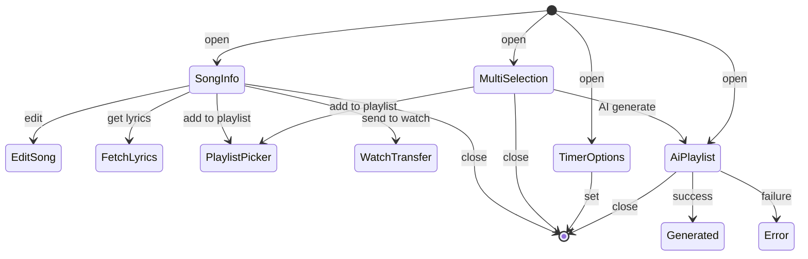

# BottomSheet / Dialog 仕様

> 各画面から呼び出される「楽曲情報 / 編集 / 同期 / 歌詞取得 / AI プレイリスト / タイマー / インポート / ソート / 等」の BottomSheet・Dialog を集約。

---

## SongInfoBottomSheet

- **パッケージ**: `app/src/main/java/com/theveloper/pixelplay/presentation/components/SongInfoBottomSheet.kt` (1797 行)
- **用途**: 選択中の曲の詳細情報・タグ編集・歌詞取得・お気に入り・Wear OS 転送・再生操作の統合シート。

### 状態ホルダー連携

| Holder | 役割 |
|---|---|
| `PlayerViewModel` | `selectedSongForInfo`, `favoriteSongIds`, `playlistViewModel`, `playbackHistory` |
| `PlaylistViewModel` | プレイリストへの追加 |
| `SongInfoBottomSheetViewModel` | Wear 転送 / タグ編集 |

### 主要 Composable

| Composable | 場所 | 目的 | 呼び出し元 |
|---|---|---|---|
| `SongInfoBottomSheet(...)` | 同 (エントリ) | 曲情報シート本体 | 各種 Detail / Library / Search / Player |
| 内部: `tag editor section` / `lyrics action` / `transfer section` / `queue actions` | — | タグ / 歌詞 / 転送 / キュー | SongInfoBottomSheet |

### 内部実装メモ

- タグ編集 (`MetadataEditStateHolder`) 経由で ID3 タグ更新。
- 歌詞操作は `FetchLyricsDialog` を起動。
- Wear OS 転送は `SongInfoBottomSheetViewModel.isSendingToWatch` を購読し、進捗ダイアログ (`WatchTransferProgressDialog`) を表示。

---

## EditSongSheet

- **パッケージ**: `app/src/main/java/com/theveloper/pixelplay/presentation/components/EditSongSheet.kt` (1138 行)
- **用途**: 単一楽曲のタグ編集シート。

### 状態ホルダー連携

| Holder | 役割 |
|---|---|
| `MetadataEditStateHolder` | 編集中のフィールド |

### 主要 Composable

| Composable | 場所 | 目的 | 呼び出し元 |
|---|---|---|---|
| `EditSongSheet(song, onDismiss, onSaved)` | 同 | 編集シート | SongInfoBottomSheet 等 |

### 内部実装メモ

- タイトル / アーティスト / アルバム / ジャンル / トラック / ディスク番号 / 年 / 歌詞 フィールドを編集。
- 保存時に `MusicRepository.updateSongMetadata` を呼ぶ。

---

## EditMultipleSongsSheet

- **パッケージ**: `app/src/main/java/com/theveloper/pixelplay/presentation/components/EditMultipleSongsSheet.kt` (658 行)
- **用途**: 複数楽曲の一括タグ編集。

### 状態ホルダー連携

| Holder | 役割 |
|---|---|
| `MetadataEditStateHolder` | 編集中フィールド + 共通値セット |

### 内部実装メモ

- 「アルバム = (空白)」「アーティスト = (空白)」「年 = 共通値のみ上書き」のような判定ロジック。
- アルバムアート変更: 1 枚選択時のみ。

---

## AiPlaylistSheet

- **パッケージ**: `app/src/main/java/com/theveloper/pixelplay/presentation/components/AiPlaylistSheet.kt` (504 行)
- **用途**: AI によるプレイリスト生成シート。プロンプト入力 / 候補表示 / 生成ステータス。

### 状態ホルダー連携

| Holder | 役割 |
|---|---|
| `PlayerViewModel` | `showAiPlaylistSheet`, `isGeneratingAiPlaylist`, `aiStatus`, `aiError`, `aiSuccess` |
| `SettingsViewModel` | AI プロンプト / モデル / API キー |

### 内部実装メモ

- `isGeneratingAiPlaylist` の間、生成ステータス / エラー / 成功を表示。
- 完了時に `aiSuccess` プレイリスト ID でライブラリに追加。

---

## FetchLyricsDialog

- **パッケージ**: `app/src/main/java/com/theveloper/pixelplay/presentation/components/subcomps/FetchLyricsDialog.kt`
- **用途**: 歌詞取得ダイアログ。LyricsSheet / FullPlayer / SongInfoBottomSheet から起動。

### 状態ホルダー連携

| Holder | 役割 |
|---|---|
| `LyricsSearchUiState` (PlayerViewModel) | 検索・取得中 / 候補 / 適用 |

### 内部実装メモ

- 検索ソース: `LyricsSourcePreference` (Local file / LRCLIB / Spotify / Apple Music etc.) を `SettingsViewModel` から取得。
- 検証: `LyricsImportSecurity` / `LyricsImportValidationResult` (`utils/`)。

---

## TimerOptionsBottomSheet

- **パッケージ**: `app/src/main/java/com/theveloper/pixelplay/presentation/components/TimerOptionsBottomSheet.kt` (451 行)
- **用途**: スリープタイマー設定 (15 分 / 30 分 / 1 時間 / カスタム / オフ)。

### 状態ホルダー連携

| Holder | 役割 |
|---|---|
| `SleepTimerStateHolder` | タイマー状態 |

### 内部実装メモ

- 残り時間をライブ表示 (`mm:ss`) + プログレスリング。
- 「現在の曲で停止」「N 分後に停止」オプション。

---

## ChangelogBottomSheet / BetaInfoBottomSheet

(前述: `components-controls.md`)

---

## AppRebrandDialog / PlayStoreAnnouncementDialog / CrashReportDialog / Beta05CleanInstallDisclaimerDialog

(前述: `components-controls.md`)

---

## StreamingProviderSheet

- **パッケージ**: `app/src/main/java/com/theveloper/pixelplay/presentation/components/StreamingProviderSheet.kt`
- **用途**: ストリーミングプロバイダ一覧 + 連携 / ログイン。

### 状態ホルダー連携

各プロバイダ Dashboard ViewModel。

---

## HomeOptionsBottomSheet

- **パッケージ**: `app/src/main/java/com/theveloper/pixelplay/presentation/components/HomeOptionsBottomSheet.kt`
- **用途**: Home 画面右上のメニュー (更新 / 設定 / About / 統計 等)。

---

## PermissionIconCollage

- **パッケージ**: `app/src/main/java/com/theveloper/pixelplay/presentation/components/PermissionIconCollage.kt`
- **用途**: アイコンコラージュ (SineWaveLine + ベクターアイコン)。

---

## AllFilesAccessDialog

(前述: `components-library.md`)

---

## PlaylistCreationDialogs

(前述: `components-library.md`)

---

## BackupModuleSelectionDialog

(前述: `components-controls.md`)

---

## SavePresetDialog / RenamePresetDialog / CustomPresetsSheet / ReorderPresetsSheet

(前述: `components-controls.md`)

---

## 全体遷移図

