# カスタム UI コントロール仕様

> PixelPlayer は Material 3 標準コンポーネントに加えて、多数の独自 Compose コントロールを持つ。
> ここではスライダー / テキスト / リスト要素 / 形状切替 / カスタムボタン等のカスタム UI をまとめる。

---

## WavySliderExpressive

- **パッケージ**: `app/src/main/java/com/theveloper/pixelplay/presentation/components/WavySliderExpressive.kt`
- **用途**: 波形トラックを持つエクスプレッシブなスライダー。フルプレイヤーのプログレスバーに使用。
- **視覚**: トラックがサイン波で描画され、現在位置が強調色 + 円形サム。
- **タッチ**: `detectDragGestures` で値更新、ハプティクス連動 (EfficientSlider でラップ)。

### 状態ホルダー連携

| Holder | 役割 |
|---|---|
| `PlayerViewModel` | プログレス現在値 / duration |

### 内部実装メモ

- `Material3 Slider` をベースに、`drawBehind` で波トラックを描画。
- `LocalMaterialTheme.current` の `onPrimaryContainer` / `primary` を使用。
- スムース更新: `rememberSmoothProgress` (`components/scoped/rememberSmoothProgress`) で高頻度更新をフレーム間で補間。

---

## WavyMusicSlider

- **パッケージ**: `app/src/main/java/com/theveloper/pixelplay/presentation/components/WavyMusicSlider.kt` (561 行)
- **用途**: アルバム単位の "Wavy" スライダー UI。曲の進捗を波形アート上に重ねる。フルプレイヤーの別バリアント。

### 内部実装メモ

- `Canvas` で波形 + 進捗を描画。
- `pointerInput { detectDragGestures }` で操作。

---

## WavyArcSlider

- **パッケージ**: `app/src/main/java/com/theveloper/pixelplay/presentation/components/WavyArcSlider.kt`
- **用途**: 円弧上の波形スライダー。EqualizerScreen の `CustomVerticalSlider` の親指部分に使用。
- **形状**: `RoundedStarShape(sides=8, curve=0.1)` の星型親指。

---

## ToggleSegmentButton

- **パッケージ**: `app/src/main/java/com/theveloper/pixelplay/presentation/components/ToggleSegmentButton.kt`
- **用途**: 2 値以上のセグメント切替ボタン (Expressive Morphing Toggle)。Equalizer の Crossfade/None、FullPlayer の Shuffle/Repeat 等。

### 内部実装メモ

- `AnimatedContent` + 形状モーフ。
- インジケータ: `BoxWithConstraints` で `indicatorWidth = maxWidth / options.size` を `animateDpAsState` でオフセット移動。
- `Material You` カラーで active/inactive 切替。

---

## MarqueeText

- **パッケージ**: `app/src/main/java/com/theveloper/pixelplay/presentation/components/MarqueeText.kt`
- **用途**: テキストが領域を超えるとき自動でスクロール表示する Marquee テキスト。

### 内部実装メモ

- `basicMarquee` をベースに `Modifier.marquee` を制御。
- `rememberSaveable` で一時停止状態を保存。

---

## AutoScrollingText / AutoScrollingTextOnDemand

- **パッケージ**: `app/src/main/java/com/theveloper/pixelplay/presentation/components/AutoScrollingText.kt` / `AutoScrollingTextOnDemand.kt`
- **用途**: タイトル領域が長い時にゆっくりスクロール。Lyrics / Album / Playlist で利用。

---

## EnhancedSongListItem

- **パッケージ**: `app/src/main/java/com/theveloper/pixelplay/presentation/components/subcomps/EnhancedSongListItem.kt`
- **用途**: 拡張曲 1 行コンポーネント。アルバムアート + タイトル + アーティスト + 再生中 EQ アイコン + ドラッグハンドル / コンテキストメニュー。

### 状態ホルダー連携

| Holder | 役割 |
|---|---|
| `PlayerViewModel` | `stablePlayerState`, `favoriteSongIds` |
| `MultiSelectionStateHolder` | 選択モード表示 |

### 内部実装メモ

- `PlayingEqIcon` (再生中 EQ 波形) を曲の左側に表示。
- `combinedClickable` で short click (再生) / long click (複数選択)。
- `LyricsMoreBottomSheet` / `SongInfoBottomSheet` への導線。

---

## PlayingEqIcon

- **パッケージ**: `app/src/main/java/com/theveloper/pixelplay/presentation/components/subcomps/PlayingEqIcon.kt`
- **用途**: 再生中の曲に表示する 4 つのバーの EQ アイコンアニメーション。

---

## PlayerSeekBar

- **パッケージ**: `app/src/main/java/com/theveloper/pixelplay/presentation/components/subcomps/PlayerSeekBar.kt`
- **用途**: `LyricsSheet` のプレビューシークバー。

---

## LyricsSyncControls

- **パッケージ**: `app/src/main/java/com/theveloper/pixelplay/presentation/components/LyricsSyncControls.kt`
- **用途**: 歌詞タイミング同期の調整 UI (LyricsSheet の `showSyncControls` 時に表示)。

---

## LyricsFloatingToolbar

- **パッケージ**: `app/src/main/java/com/theveloper/pixelplay/presentation/components/LyricsFloatingToolbar.kt`
- **用途**: 歌詞表示中、画面下部にフローティングで表示されるツールバー (フェッチ / 検索 / 設定 等)。

---

## LyricsMoreBottomSheet

- **パッケージ**: `app/src/main/java/com/theveloper/pixelplay/presentation/components/subcomps/LyricsMoreBottomSheet.kt`
- **用途**: 歌詞のメニューシート。検索 / フェッチ / インポート / 翻訳 / ローマ字 / 自動スクロール切替。

---

## PlayerProgressBarSection

- **パッケージ**: `app/src/main/java/com/theveloper/pixelplay/presentation/components/subcomps/PlayerProgressBarSection.kt`
- **用途**: フルプレイヤーのプログレスバー領域 (WavySliderExpressive + 時間ラベル)。

---

## AutoSizingText / AutoSizingTextGlance

- **パッケージ**: `presentation/components/subcomps/AutoSizingText.kt` / `AutoSizingTextGlance.kt`
- **用途**: 領域に収まるよう `sp` を自動調整するテキスト。Glance (Wear OS 用) 版あり。

---

## TightWrapText

- **パッケージ**: `app/src/main/java/com/theveloper/pixelplay/presentation/components/subcomps/TightWrapText.kt`
- **用途**: 行間を詰めたラップテキスト (PlaylistDetail, GenreDetail で曲名表示等)。

---

## MaterialYouVectorDrawable

- **パッケージ**: `app/src/main/java/com/theveloper/pixelplay/presentation/components/subcomps/MaterialYouVectorDrawable.kt`
- **用途**: ベクター Drawable を Material You カラーで描画。SetupScreen のアプリ紹介画面等。

---

## SineWaveLine

- **パッケージ**: `app/src/main/java/com/theveloper/pixelplay/presentation/components/subcomps/SineWaveLine.kt`
- **用途**: サイン波のライン描画。`PermissionIconCollage` 等で利用。

---

## SelectionActionRow / SelectionCountPill

- **パッケージ**: `presentation/components/subcomps/SelectionActionRow.kt` / `SelectionCountPill.kt`
- **用途**: 複数選択時に下端に表示するアクション行 + 選択件数ピル。

---

## LibraryActionRow

- **パッケージ**: `app/src/main/java/com/theveloper/pixelplay/presentation/components/subcomps/LibraryActionRow.kt`
- **用途**: Library タブ上部のアクションバー (選択 / 並び替え / 移動 / 設定)。

---

## PermissionIconCollage

- **パッケージ**: `app/src/main/java/com/theveloper/pixelplay/presentation/components/PermissionIconCollage.kt`
- **用途**: 権限アイコンのコラージュ。`SineWaveLine` + アイコンを並べる。

---

## FetchLyricsDialog

- **パッケージ**: `app/src/main/java/com/theveloper/pixelplay/presentation/components/subcomps/FetchLyricsDialog.kt`
- **用途**: 歌詞検索・取得ダイアログ。オンライン LRCLIB / ローカルファイル / Spotify / Apple Music 等のソースから取得。

### 状態ホルダー連携

| Holder | 役割 |
|---|---|
| `LyricsSearchUiState` | 検索結果状態 |

---

## SmartImage

- **パッケージ**: `app/src/main/java/com/theveloper/pixelplay/presentation/components/SmartImage.kt`
- **用途**: Coil ベースの画像表示。`Modifier.size` + ターゲットサイズ + コンテンツスケールを抽象化。アルバムアート用 `SmartImageListTargetSize` / `SmartImageCompactListTargetSize` 定数を持つ。

---

## OptimizedAlbumArt

- **パッケージ**: `app/src/main/java/com/theveloper/pixelplay/presentation/components/OptimizedAlbumArt.kt`
- **用途**: アルバムアートの最適化版。キャッシュ / メモリ管理を強化。

---

## ShimmerBox

- **パッケージ**: `app/src/main/java/com/theveloper/pixelplay/presentation/components/ShimmerBox.kt`
- **用途**: ロード中の Shimmer プレースホルダ矩形。

---

## ExpressiveScrollBar + 補助

- **パッケージ**: `app/src/main/java/com/theveloper/pixelplay/presentation/components/ExpressiveScrollBar.kt` (742 行)
- **用途**: Material 3 Expressive なスクロールバー (FAB 形状 / ロングプレスで高速スクロール)。
- **補助**:
  - `ExpressiveScrollBarMetrics.kt` — メトリクス (height/width/offset) 算出。
  - `ExpressiveScrollBarLabelResolvers.kt` — ファストスクロール時のラベル生成。

### 関連ファイル

- `app/src/main/java/com/theveloper/pixelplay/ui/theme/LocalShowScrollbar.kt` (設定で制御)

---

## ExpressiveTopBarContent

- **パッケージ**: `app/src/main/java/com/theveloper/pixelplay/presentation/components/ExpressiveTopBarContent.kt`
- **用途**: スクロール連動 Expressive な TopBar コンテンツ (タイトル / サブタイトル / スクロール位置で α フェード)。

---

## CollapsibleCommonTopBar

- **パッケージ**: `app/src/main/java/com/theveloper/pixelplay/presentation/components/CollapsibleCommonTopBar.kt`
- **用途**: スクロールで Collapse / Expand する共通 TopBar。

### 内部実装メモ

- `nestedScroll` で `topBarHeight` を縮小。
- `useSmoothCorners` 設定で角丸スタイルを切替。
- `collapseFraction` を他の Composable に公開。

---

## GradientTopBar

- **パッケージ**: `app/src/main/java/com/theveloper/pixelplay/presentation/components/GradientTopBar.kt`
- **用途**: グラデーション背景の TopBar。`HomeGradientTopBar` エイリアスあり (HomeScreen で使用)。

---

## RoundedParallaxCarousell

- **パッケージ**: `app/src/main/java/com/theveloper/pixelplay/presentation/components/RoundedParallaxCarousell.kt` (1565 行)
- **用途**: 角丸 + パララックス な大型カルーセル。HomeScreen の DailyMix / RecentlyPlayed Hero で使用。

---

## BrickBreakerOverlay

- **パッケージ**: `app/src/main/java/com/theveloper/pixelplay/presentation/components/brickbreaker/BrickBreakerOverlay.kt`
- **用途**: ブロック崩しゲーム。EasterEggScreen から起動。

---

## ExternalPlayerOverlay

- **パッケージ**: `app/src/main/java/com/theveloper/pixelplay/presentation/components/external/ExternalPlayerOverlay.kt`
- **用途**: 外部プレイヤー通知 (Android Auto 等) 検出時の UI オーバーレイ。

---

## ImageCropView

- **パッケージ**: `app/src/main/java/com/theveloper/pixelplay/presentation/components/ImageCropView.kt`
- **用途**: プレイリストカバー画像用クロップ UI。`CreatePlaylistScreen` から利用。

---

## InfiniteListHandler

- **パッケージ**: `app/src/main/java/com/theveloper/pixelplay/presentation/components/InfiniteListHandler.kt`
- **用途**: LazyColumn の末尾到達でプリフェッチ / 追加読込をトリガ。

---

## Snapping (LazyList Snapper)

- **パッケージ**: `app/src/main/java/com/theveloper/pixelplay/presentation/components/snapping/LazyListSnapper.kt`
- **用途**: LazyList のスナップ挙動。LyricsSheet の `SyncedLyricsList` 等で利用。

### 内部実装メモ

- `rememberLazyListSnapperLayoutInfo` + `rememberSnapperFlingBehavior`。
- `ExperimentalSnapperApi` 注釈付き。

---

## StatsOverviewCard

- **パッケージ**: `app/src/main/java/com/theveloper/pixelplay/presentation/components/StatsOverviewCard.kt`
- **用途**: Home の統計サマリーカード。

---

## ChangelogBottomSheet

- **パッケージ**: `app/src/main/java/com/theveloper/pixelplay/presentation/components/ChangelogBottomSheet.kt`
- **用途**: 変更履歴シート (Home で初回起動時に表示)。

---

## BetaInfoBottomSheet

- **パッケージ**: `app/src/main/java/com/theveloper/pixelplay/presentation/components/BetaInfoBottomSheet.kt` (725 行)
- **用途**: ベータ版の告知。

---

## Beta05CleanInstallDisclaimerDialog

- **パッケージ**: `app/src/main/java/com/theveloper/pixelplay/presentation/components/Beta05CleanInstallDisclaimerDialog.kt`
- **用途**: クリーンインストール時の免責事項。

---

## PlayStoreAnnouncementDialog

- **パッケージ**: `app/src/main/java/com/theveloper/pixelplay/presentation/components/PlayStoreAnnouncementDialog.kt`
- **用途**: Play Store 移行告知。

---

## AppRebrandDialog

- **パッケージ**: `app/src/main/java/com/theveloper/pixelplay/presentation/components/AppRebrandDialog.kt`
- **用途**: リブランディング告知。

---

## CrashReportDialog

- **パッケージ**: `app/src/main/java/com/theveloper/pixelplay/presentation/components/CrashReportDialog.kt`
- **用途**: クラッシュレポート送信ダイアログ。

---

## BackupModuleSelectionDialog

- **パッケージ**: `app/src/main/java/com/theveloper/pixelplay/presentation/components/BackupModuleSelectionDialog.kt` (568 行)
- **用途**: バックアップ対象モジュール選択ダイアログ。

### 内部実装メモ

- `BackupSection` enum 単位のチェックボックス。
- 「全選択 / 全解除」ボタン + 選択数表示。

---

## PermissionIconCollage

(前述 — `components/PermissionIconCollage.kt`)

---

## CollagePatterns

- **パッケージ**: `app/src/main/java/com/theveloper/pixelplay/presentation/components/CollagePatterns.kt`
- **用途**: コラージュパターン (`CollagePattern` enum) のレイアウト生成ヘルパ。

---

## ExpressiveScrollBarMetrics / ExpressiveScrollBarLabelResolvers

(前述)

---

## NoInternetComponents / ExpressiveOfflineState

- **パッケージ**: `app/src/main/java/com/theveloper/pixelplay/presentation/components/NoInternetComponents.kt` / `ExpressiveOfflineState.kt`
- **用途**: オフライン状態の UI 表現 (アイコン + メッセージ)。

---

## DismissUndoBar

- **パッケージ**: `app/src/main/java/com/theveloper/pixelplay/presentation/components/DismissUndoBar.kt`
- **用途**: キュー / プレイリストで削除した際の Undo バー (Snackbar-like)。`QueueUndoStateHolder` / `PlaylistDismissUndoStateHolder` などと組み合わせ。

---

## 全体概略図

```mermaid
graph TB
  FullPlayer --> WavySliderExpressive
  FullPlayer --> WavyMusicSlider
  FullPlayer --> ToggleSegmentButton
  FullPlayer --> AutoScrollingTextOnDemand
  FullPlayer --> PlayerProgressBarSection

  LyricsSheet --> LyricsFloatingToolbar
  LyricsSheet --> LyricsSyncControls
  LyricsSheet --> LyricsMoreBottomSheet
  LyricsSheet --> PlayerSeekBar
  LyricsSheet --> FetchLyricsDialog
  LyricsSheet --> AutoScrollingText

  Equalizer --> WavyArcSlider
  Equalizer --> SavePresetDialog
  Equalizer --> ReorderPresetsSheet
  Equalizer --> CustomPresetsSheet

  HomeScreen --> RoundedParallaxCarousell
  HomeScreen --> AlbumArtCollage
  HomeScreen --> MarqueeText
  HomeScreen --> StatsOverviewCard
  HomeScreen --> HomeOptionsBottomSheet
  HomeScreen --> StreamingProviderSheet
  HomeScreen --> ChangelogBottomSheet
  HomeScreen --> BetaInfoBottomSheet
  HomeScreen --> GradientTopBar

  LibraryScreen --> EnhancedSongListItem
  LibraryScreen --> LibraryActionRow
  LibraryScreen --> SelectionActionRow
  LibraryScreen --> SelectionCountPill
  LibraryScreen --> ExpressiveScrollBar
```

