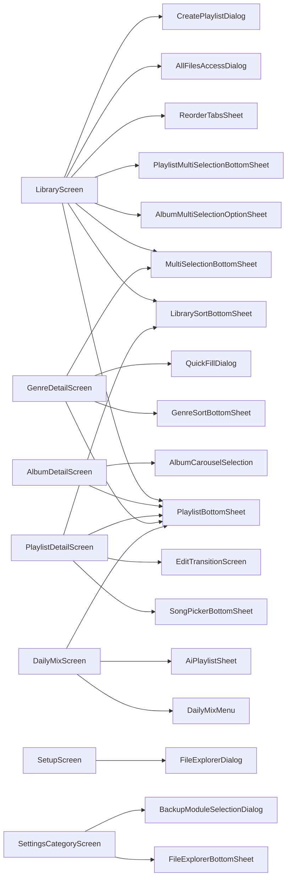

# Library / 選択系コンポーネント仕様

> Library・Search・プレイリスト詳細画面から再利用される「複数選択」「プレイリストピッカー」「アルバムカークル」「フォルダ参照」関連のコンポーネントを集約。

---

## PlaylistBottomSheet

- **パッケージ**: `app/src/main/java/com/theveloper/pixelplay/presentation/components/PlaylistBottomSheet.kt`
- **用途**: 選択中の曲をプレイリストに追加する BottomSheet。Library / Search / AlbumDetail / PlaylistDetail / GenreDetail / DailyMix 等の各画面から起動。

### 状態ホルダー連携

| Holder | 役割 |
|---|---|
| `PlaylistViewModel` | プレイリスト一覧 / 作成 |
| `PlayerViewModel` | 現在の選択曲群 (呼び出し側から渡す) |

### 主要 Composable

| Composable | 場所 | 目的 | 呼び出し元 |
|---|---|---|---|
| `PlaylistBottomSheet(songs, onDismiss)` | 同 | プレイリスト選択シート | 各種 Detail / Library |
| 内部で `CreatePlaylistDialog` 等のサブレイヤーを表示 | — | 新規作成 | PlaylistBottomSheet |

### 内部実装メモ

- 曲を `songs: List<Song>` で受け取り、各プレイリストに追加 (`PlaylistViewModel.addSongsToPlaylist`).
- 新規作成フローは `CreatePlaylistDialog` / `EditPlaylistDialog` (`CreatePlaylistScreen.kt`) を共有。

---

## PlaylistMultiSelectionBottomSheet

- **パッケージ**: `app/src/main/java/com/theveloper/pixelplay/presentation/components/PlaylistMultiSelectionBottomSheet.kt`
- **用途**: 選択された複数プレイリストに対する一括操作 (削除 / 統合 / M3U エクスポート)。

### 状態ホルダー連携

| Holder | 役割 |
|---|---|
| `PlaylistSelectionStateHolder` | 選択されたプレイリスト群 |
| `PlaylistViewModel` | 一括操作 |

### 関連ファイル

- `app/src/main/java/com/theveloper/pixelplay/presentation/components/MultiSelectionBottomSheet.kt`
- `app/src/main/java/com/theveloper/pixelplay/presentation/components/AlbumMultiSelectionOptionSheet.kt`
- `app/src/main/java/com/theveloper/pixelplay/presentation/components/GenreMultiSelectionOptionSheet.kt`

---

## AlbumMultiSelectionOptionSheet

- **パッケージ**: `app/src/main/java/com/theveloper/pixelplay/presentation/components/AlbumMultiSelectionOptionSheet.kt`
- **用途**: 複数アルバム選択時の操作 (シャッフル再生 / プレイリスト作成 / キュー追加)。

### 状態ホルダー連携

| Holder | 役割 |
|---|---|
| `PlayerViewModel` | `getSongsForAlbums` |
| `PlaylistViewModel` | プレイリスト作成 |

---

## GenreMultiSelectionOptionSheet

- **パッケージ**: `app/src/main/java/com/theveloper/pixelplay/presentation/components/GenreMultiSelectionOptionSheet.kt`
- **用途**: 複数ジャンル選択時の操作。

---

## MultiSelectionBottomSheet

- **パッケージ**: `app/src/main/java/com/theveloper/pixelplay/presentation/components/MultiSelectionBottomSheet.kt` (533 行)
- **用途**: 楽曲を複数選択した際の操作 (プレイリスト追加 / キュー再生 / 共有 / お気に入り / アルバムアート編集 / 次に再生 / アルバム情報)。

### 状態ホルダー連携

| Holder | 役割 |
|---|---|
| `MultiSelectionStateHolder` (PlayerViewModel 内) | `selectedSongs`, `selectedSongIds`, `isSelectionMode` |

### 内部実装メモ

- `SelectionActionRow` + `SelectionCountPill` (`subcomps/`) で件数表示。
- `MAX_ALBUM_MULTI_SELECTION = 6` 上限 (LibraryScreen/SearchScreen 共有)。

---

## AlbumCarouselSelection

- **パッケージ**: `app/src/main/java/com/theveloper/pixelplay/presentation/components/AlbumCarouselSelection.kt`
- **用途**: アルバム単位のカルーセル (フルプレイヤー内部)。横スワイプで同一アーティストのアルバムへ移動し「アルバム連続再生」を実現。

### 状態ホルダー連携

| Holder | 役割 |
|---|---|
| `PlayerViewModel` | `albumsForCurrentArtist`, `carouselStyle`, `currentAlbumCarouselIndex` |

---

## AlbumArtCollage

- **パッケージ**: `app/src/main/java/com/theveloper/pixelplay/presentation/components/AlbumArtCollage.kt`
- **用途**: 複数曲のアルバムアートをコラージュ表示 (Home, Daily Mix 等)。

### 状態ホルダー連携

| Holder | 役割 |
|---|---|
| `SettingsViewModel.uiState.collagePattern` | コラージュパターン |
| `SettingsViewModel.uiState.collageAutoRotate` | 自動ローテーション |

### 関連ファイル

- `app/src/main/java/com/theveloper/pixelplay/presentation/components/CollagePatterns.kt`

---

## PlaylistArtCollage

- **パッケージ**: `app/src/main/java/com/theveloper/pixelplay/presentation/components/PlaylistArtCollage.kt`
- **用途**: プレイリストカバー用コラージュ。`AlbumArtCollage` と同様のパターン。

---

## PlaylistCover

- **パッケージ**: `app/src/main/java/com/theveloper/pixelplay/presentation/components/PlaylistCover.kt`
- **用途**: 単一プレイリストカバー表示。画像 / 色 / アイコン / 形状を統合。

---

## FileExplorerBottomSheet

- **パッケージ**: `app/src/main/java/com/theveloper/pixelplay/presentation/components/FileExplorerBottomSheet.kt` (821 行)
- **用途**: ファイルエクスプローラ形式のフォルダ/ファイル参照。SetupScreen・SettingsCategoryScreen から利用。

### 状態ホルダー連携

| Holder | 役割 |
|---|---|
| `SettingsViewModel` | `currentPath`, `currentDirectoryChildren`, `availableStorages`, `selectedStorageIndex`, `isLoadingDirectories`, `isExplorerPriming`, `isExplorerReady`, `isCurrentDirectoryResolved` |
| `SetupViewModel` (SetupScreen) | 同じエクスプローラ API |

---

## FileExplorerDialog

- **パッケージ**: `app/src/main/java/com/theveloper/pixelplay/presentation/components/FileExplorerDialog.kt`
- **用途**: `FileExplorerBottomSheet` の Dialog 版。

---

## AllFilesAccessDialog

- **パッケージ**: `app/src/main/java/com/theveloper/pixelplay/presentation/components/AllFilesAccessDialog.kt`
- **用途**: Android 11+ の MANAGE_EXTERNAL_STORAGE 権限要求ダイアログ。

---

## PlaylistCreationDialogs

- **パッケージ**: `app/src/main/java/com/theveloper/pixelplay/presentation/components/PlaylistCreationDialogs.kt` (1145 行)
- **用途**: プレイリスト作成ダイアログ群 (AI 用 / Manual 用 / Type 選択)。

### 主要 Composable

| Composable | 場所 | 目的 |
|---|---|---|
| `CreatePlaylistDialog` | `PlaylistCreationDialogs.kt` 内 | 基本ダイアログ (CreatePlaylistScreen と共有される別バリアント) |
| `PlaylistCreationTypeDialog` | 同 | Manual / AI 選択ダイアログ |
| `CreateAiPlaylistDialog` | 同 | AI プロンプト入力ダイアログ |

### 関連ファイル

- `app/src/main/java/com/theveloper/pixelplay/presentation/components/AiPlaylistSheet.kt`
- `app/src/main/java/com/theveloper/pixelplay/presentation/screens/CreatePlaylistScreen.kt`

---

## AiPlaylistSheet

- **パッケージ**: `app/src/main/java/com/theveloper/pixelplay/presentation/components/AiPlaylistSheet.kt` (504 行)
- **用途**: AI によるプレイリスト生成。ステータス / エラー / 成功を表示。

### 状態ホルダー連携

| Holder | 役割 |
|---|---|
| `PlayerViewModel` | `showAiPlaylistSheet`, `isGeneratingAiPlaylist`, `aiStatus`, `aiError`, `aiSuccess` |
| `SettingsViewModel` | AI プロンプト / モデル / API キー |

---

## LibrarySortBottomSheet

- **パッケージ**: `app/src/main/java/com/theveloper/pixelplay/presentation/components/LibrarySortBottomSheet.kt` (464 行)
- **用途**: ライブラリの並び替えオプション (Songs / Albums / Artists / Favorites / Folders)。

### 状態ホルダー連携

| Holder | 役割 |
|---|---|
| `PlayerViewModel` | `availableSortOptions`, `isSortingSheetVisible` |

---

## GenreSortBottomSheet

- **パッケージ**: `app/src/main/java/com/theveloper/pixelplay/presentation/components/GenreSortBottomSheet.kt`
- **用途**: ジャンル詳細画面の並び替え。

---

## ReorderTabsSheet

- **パッケージ**: `app/src/main/java/com/theveloper/pixelplay/presentation/components/ReorderTabsSheet.kt`
- **用途**: Library タブの順序変更シート。

---

## ReorderPresetsSheet

- **パッケージ**: `app/src/main/java/com/theveloper/pixelplay/presentation/components/ReorderPresetsSheet.kt`
- **用途**: EQ カスタムプリセットの並び替え。

---

## CustomPresetsSheet

- **パッケージ**: `app/src/main/java/com/theveloper/pixelplay/presentation/components/CustomPresetsSheet.kt`
- **用途**: EQ のカスタムプリセット管理シート。

---

## SavePresetDialog

- **パッケージ**: `app/src/main/java/com/theveloper/pixelplay/presentation/components/SavePresetDialog.kt`
- **用途**: EQ の現在設定をプリセットとして保存するダイアログ。

### 関連

- `app/src/main/java/com/theveloper/pixelplay/presentation/components/subcomps/RenamePresetDialog.kt` (同パッケージ内)

---

## DailyMixMenu

- **パッケージ**: `app/src/main/java/com/theveloper/pixelplay/presentation/components/DailyMixMenu.kt`
- **用途**: DailyMix のオプションメニュー (再生成 / 共有 / AI プレイリスト生成等)。

---

## DailyMixSection

- **パッケージ**: `app/src/main/java/com/theveloper/pixelplay/presentation/components/DailyMixSection.kt`
- **用途**: Home 画面の Daily Mix カード部分。

---

## RecentlyPlayedSection

- **パッケージ**: `app/src/main/java/com/theveloper/pixelplay/presentation/components/RecentlyPlayedSection.kt`
- **用途**: Home 画面の最近再生した曲セクション。

---

## RecentlyPlayedRangeSelector

- **パッケージ**: `app/src/main/java/com/theveloper/pixelplay/presentation/components/RecentlyPlayedRangeSelector.kt`
- **用途**: `RecentlyPlayedScreen` の期間タブ (DAY/WEEK/MONTH)。

---

## HomeOptionsBottomSheet

- **パッケージ**: `app/src/main/java/com/theveloper/pixelplay/presentation/components/HomeOptionsBottomSheet.kt`
- **用途**: Home 画面右上の 3 点メニュー (更新・設定・About 等)。

---

## StreamingProviderSheet

- **パッケージ**: `app/src/main/java/com/theveloper/pixelplay/presentation/components/StreamingProviderSheet.kt`
- **用途**: Home / Settings で表示するストリーミング プロバイダ (Netease / QQ / Navidrome / Jellyfin / Telegram) 選択シート。

### 状態ホルダー連携

| Holder | 役割 |
|---|---|
| 各プロバイダ Dashboard ViewModel | ログイン状態 |

---

## StatsOverviewCard

- **パッケージ**: `app/src/main/java/com/theveloper/pixelplay/presentation/components/StatsOverviewCard.kt`
- **用途**: Home 画面で統計概要を 1 枚カードで表示。

### 状態ホルダー連携

| Holder | 役割 |
|---|---|
| `StatsViewModel.homeOverview` | 統計概要 |

---

## SyncProgressBar

- **パッケージ**: `app/src/main/java/com/theveloper/pixelplay/presentation/components/SyncProgressBar.kt`
- **用途**: ライブラリ同期中、上部にインライン プログレスを表示。

---

## Subcomponents (Library 系)

| ファイル | 用途 |
|---|---|
| `presentation/components/subcomps/LibraryActionRow.kt` | ライブラリタブ上部のアクションバー |
| `presentation/components/subcomps/SelectionActionRow.kt` | 複数選択時の下端アクションバー |
| `presentation/components/subcomps/EnhancedSongListItem.kt` | 拡張された曲 1 行 (Playing Eq, ドラッグ等) |
| `presentation/components/subcomps/PlayerSeekBar.kt` | シークバー (LyricsSheet プレビュー用) |
| `presentation/components/subcomps/PlayingEqIcon.kt` | 再生中アイコン (音符 + イコライザ) |
| `presentation/components/subcomps/LyricsMoreBottomSheet.kt` | 歌詞メニュー (検索 / フェッチ / インポート / オフセット調整) |
| `presentation/components/subcomps/PlayerProgressBarSection.kt` | フルプレイヤーのプログレスバー領域 |
| `presentation/components/subcomps/AutoSizingText.kt` / `AutoSizingTextGlance.kt` | 自動サイズ調整テキスト |
| `presentation/components/subcomps/MaterialYouVectorDrawable.kt` | Material You Vector Drawable 描画 |
| `presentation/components/subcomps/SineWaveLine.kt` | サイン波ライン (Permission Icon Collage 等) |
| `presentation/components/subcomps/TightWrapText.kt` | Tight ラップテキスト |
| `presentation/components/subcomps/FetchLyricsDialog.kt` | 歌詞検索・取得ダイアログ |

---

## 全体アーキテクチャ図

