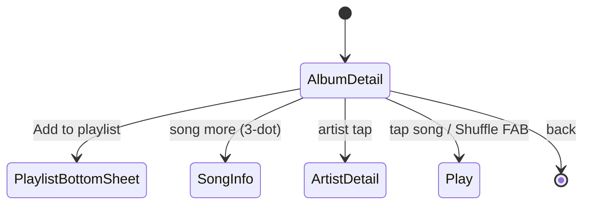
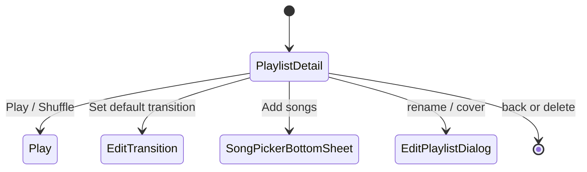
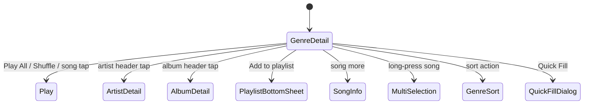

# 詳細画面仕様 (Album / Artist / Playlist / Genre Detail)

> いずれの画面も「Collapse する大型 TopBar + アルバムアートを主役に持つ Hero + SongList」の共通骨格を持つ。

---

## AlbumDetailScreen

- **パッケージ**: `app/src/main/java/com/theveloper/pixelplay/presentation/screens/AlbumDetailScreen.kt` (795 行)
- **ルート**: `Screen.AlbumDetail.route` (`"album_detail/{albumId}"`) (`AppNavigation.kt:351`)
- **概要**: アルバム単位の再生・曲一覧・シャッフル・アルバムアートから抽出した ColorScheme を全体 UI に反映する「Dynamic Palette」体験の中核画面。

### 状態ホルダー連携

| Holder | 役割 |
|---|---|
| `AlbumDetailViewModel` (`hiltViewModel`) | `uiState`, `album`, `songs` (Hilt-injected ViewModel) |
| `PlayerViewModel` | `stablePlayerState`, `favoriteSongIds`, `selectedSongForInfo`, `navBarCompactMode` |
| `PlaylistViewModel` | プレイリストへの追加 (PlaylistBottomSheet) |
| `ColorSchemeProcessor` (`ColorSchemePair`) | アルバムアートから抽出した `ColorScheme` |

### 主要 Composable

| Composable | 場所 | 目的 | 呼び出し元 |
|---|---|---|---|
| `AlbumDetailScreen(albumId, navController, playerViewModel)` | `AlbumDetailScreen.kt:113` | アルバム詳細メイン。 | `AppNavigation.kt:358` |
| `SharedAlbumTopBarProbe(...)` (private) | `AlbumDetailScreen.kt:501` | 共有 Collapsible TopBar プローブ (背景・タイポグラフィ共有テスト) | AlbumDetailScreen |
| `CollapsingAlbumTopBar(...)` (private) | `AlbumDetailScreen.kt:622` | 実験的カスタム Collapse トップバー | AlbumDetailScreen |

### 内部実装メモ

- `topBarHeight` は `Animatable(maxTopBarHeightPx)`、min 64dp+statusBar, max 300dp。`nestedScroll` でリアルタイム縮小。
- `useSharedCollapsibleTopBarProbe = true` (AlbumDetailScreen.kt:108) で `CollapsibleCommonTopBar` の shared variant を採用可能。
- アルバムアート → ColorScheme 抽出: `albumColorSchemeFlow` (PlayerViewModel 経由 or 内部生成)。`albumColorScheme = remember(albumColorSchemePair, isDarkTheme, baseColorScheme)` で dark/light 切替。
- Disc 番号でグルーピング: `songsByDisc = songs.groupBy { it.discNumber ?: 1 }`。
- シャッフル FAB: アルバムからランダム再生 (`onShuffle` → PlayerVM `playSongListWithShuffle`)。
- SongListItem: `EnhancedSongListItem` を再利用 (`subcomps/EnhancedSongListItem.kt`)。
- `SelectedSong` から曲情報シートを表示可能 (`SongInfoBottomSheet`)。

### 画面遷移

### 関連ファイル

- `app/src/main/java/com/theveloper/pixelplay/presentation/components/CollapsibleCommonTopBar.kt`
- `app/src/main/java/com/theveloper/pixelplay/presentation/components/ExpressiveScrollBar.kt`
- `app/src/main/java/com/theveloper/pixelplay/presentation/components/SmartImage.kt`
- `app/src/main/java/com/theveloper/pixelplay/presentation/components/PlaylistBottomSheet.kt`
- `app/src/main/java/com/theveloper/pixelplay/presentation/components/SongInfoBottomSheet.kt`
- `app/src/main/java/com/theveloper/pixelplay/presentation/components/subcomps/EnhancedSongListItem.kt`
- `app/src/main/java/com/theveloper/pixelplay/presentation/viewmodel/AlbumDetailViewModel.kt`
- `app/src/main/java/com/theveloper/pixelplay/presentation/viewmodel/ColorSchemeProcessor.kt`
- 詳細: `specs/06-state-navigation/viewmodels.md`

---

## ArtistDetailScreen

- **パッケージ**: `app/src/main/java/com/theveloper/pixelplay/presentation/screens/ArtistDetailScreen.kt` (1200 行)
- **ルート**: `Screen.ArtistDetail.route` (`"artist_detail/{artistId}"`) (`AppNavigation.kt:366`)
- **概要**: アーティスト単位の曲一覧 (アルバム別セクション)、画像アップロード、アルバムへナビゲート、シャッフル/連続再生。`ArtistAlbumSection` でアルバムごとに折り畳み可能。

### 状態ホルダー連携

| Holder | 役割 |
|---|---|
| `ArtistDetailViewModel` | `uiState`, `artist`, `songs`, `albumSections`, `artistColorScheme` (Flow) |
| `PlayerViewModel` | `stablePlayerState`, `favoriteSongIds`, `selectedSongForInfo`, `navBarCompactMode` |
| `PlaylistViewModel` | プレイリスト追加 |
| `ColorSchemeProcessor` | アーティスト画像 → ColorScheme |

### 主要 Composable

| Composable | 場所 | 目的 | 呼び出し元 |
|---|---|---|---|
| `ArtistDetailScreen(artistId, navController, playerViewModel)` | `ArtistDetailScreen.kt:109` | アーティスト詳細メイン。 | `AppNavigation.kt:373` |
| `ArtistAlbumSection.collapseKey()` (private ext) | `ArtistDetailScreen.kt:556` | `artist_album_<id>_<title>` を生成 | ArtistDetailScreen |
| `CollapsibleAlbumSectionHeader(section, isExpanded, onToggle)` (private) | `ArtistDetailScreen.kt:559` | アルバム セクション ヘッダー | ArtistDetailScreen |
| `ArtistAlbumSectionSongItem(...)` (private) | `ArtistDetailScreen.kt:659` | アルバム内の曲 1 行表示 | ArtistDetailScreen |
| `SharedArtistTopBarProbe(...)` (private) | `ArtistDetailScreen.kt:729` | 共有 Collapsible TopBar (画像ピッカー含む) | ArtistDetailScreen |
| `CustomCollapsingTopBar(...)` (private) | `ArtistDetailScreen.kt:908` | 実験的 Collapse TopBar | ArtistDetailScreen |
| `MusicIconPattern(modifier)` (private) | `ArtistDetailScreen.kt:1130` | デフォルト画像 (音符パターン) | ArtistDetailScreen |

### 内部実装メモ

- `isTransitionFinished` (ArtistDetailScreen.kt:120) フラグで初回 5 件までに限定 → フル展開後は全件 (パフォーマンス)。
- 折り畳み状態: `expandedSections = remember { mutableStateMapOf<String, Boolean>() }` (ArtistDetailScreen.kt:273)。
- `currentKeys = albumSections.map { it.collapseKey() }.toSet()` で古いキーを削除しメモリリーク防止。
- 画像ピッカー: `rememberLauncherForActivityResult(ActivityResultContracts.PickVisualMedia())` でアーティスト画像更新。
- `nestedScroll` ベースのカスタム Collapse TopBar (`CustomCollapsingTopBar`) と shared (`CollapsibleCommonTopBar`) をフラグで切替 (`UseSharedCollapsibleTopBarProbe = true` で shared 優先)。
- `ArtistAlbumSectionSongItem` は最初の曲・最後の曲で `Shape` を動的変更し、連続アルバム内の角丸を共有。

### 関連ファイル

- `app/src/main/java/com/theveloper/pixelplay/presentation/components/CollapsibleCommonTopBar.kt`
- `app/src/main/java/com/theveloper/pixelplay/presentation/components/ExpressiveScrollBar.kt`
- `app/src/main/java/com/theveloper/pixelplay/presentation/components/PlaylistBottomSheet.kt`
- `app/src/main/java/com/theveloper/pixelplay/presentation/components/SongInfoBottomSheet.kt`
- `app/src/main/java/com/theveloper/pixelplay/presentation/components/subcomps/EnhancedSongListItem.kt`
- `app/src/main/java/com/theveloper/pixelplay/presentation/viewmodel/ArtistDetailViewModel.kt`
- `app/src/main/java/com/theveloper/pixelplay/presentation/viewmodel/ArtistDetailViewModel.kt` (`ArtistAlbumSection` データクラス)
- `app/src/main/java/com/theveloper/pixelplay/presentation/viewmodel/ColorSchemeProcessor.kt`
- 詳細: `specs/06-state-navigation/viewmodels.md`

---

## PlaylistDetailScreen

- **パッケージ**: `app/src/main/java/com/theveloper/pixelplay/presentation/screens/PlaylistDetailScreen.kt` (1155 行)
- **ルート**: `Screen.PlaylistDetail.route` (`"playlist_detail/{playlistId}"`) (`AppNavigation.kt:307`)
- **概要**: プレイリスト単位の曲操作 (再生順入れ替え/削除/追加)、メタ編集、M3U エクスポート、Telegram / AI 連携、デフォルト遷移 (EditTransition) 設定。

### 状態ホルダー連携

| Holder | 役割 |
|---|---|
| `PlaylistViewModel` (`hiltViewModel`) | `uiState`, `currentPlaylistDetails`, `currentPlaylistSongs`, `playlistSongsOrderMode`, `currentPlaylistSongsSortOption` |
| `PlayerViewModel` | `stablePlayerState`, `favoriteSongIds`, `selectedSongForInfo`, `isSortingSheetVisible`, `navBarCompactMode` |
| `MultiSelectionStateHolder` (PlayerVM) | 複数選択 (オプション) |

### 主要 Composable

| Composable | 場所 | 目的 | 呼び出し元 |
|---|---|---|---|
| `PlaylistDetailScreen(playlistId, playerViewModel, playlistViewModel, onBackClick, onDeletePlayListClick, navController)` | `PlaylistDetailScreen.kt:151` | プレイリスト詳細エントリ。 | `AppNavigation.kt:315` |
| `PlaylistActionItem(icon, title, onClick, ...)` (private) | `PlaylistDetailScreen.kt:1119` | プレイリスト操作メニュー項目 | PlaylistDetailScreen |

### 内部実装メモ

- 手動並べ替え: `rememberReorderableLazyListState` (`sh.calvin.reorderable`) + `localReorderableSongs` ローカル状態 + `ReorderableItem`。確定時に ViewModel にコミット。
- 削除モード: `isRemoveModeEnabled` で各曲の左にチェックボックス表示。
- 並び替え: `LibrarySortBottomSheet` を共通利用 (PlayerVM 経由の `isSortingSheetVisible` で表示制御)。
- M3U エクスポート: `rememberLauncherForActivityResult(ActivityResultContracts.CreateDocument("audio/x-mpegurl"))` (PlaylistDetailScreen.kt:204)。
- フォルダ由来プレイリスト (`FOLDER_PLAYLIST_PREFIX` で id 先頭一致) では並び替え UI を抑制。
- `PlaylistShapeType` に応じたカバー表示 (`PlaylistCover` コンポーネント)。
- `EditTransitionScreen` への遷移: `EditTransition.createRoute(playlistId)`。
- `LinkedAction` FAB で `Play` / `Shuffle` / `Play Next` 等を選択。

### 画面遷移

### 関連ファイル

- `app/src/main/java/com/theveloper/pixelplay/presentation/components/PlaylistBottomSheet.kt`
- `app/src/main/java/com/theveloper/pixelplay/presentation/components/SongInfoBottomSheet.kt`
- `app/src/main/java/com/theveloper/pixelplay/presentation/components/SongPickerBottomSheet.kt`
- `app/src/main/java/com/theveloper/pixelplay/presentation/components/LibrarySortBottomSheet.kt`
- `app/src/main/java/com/theveloper/pixelplay/presentation/components/QueuePlaylistSongItem.kt`
- `app/src/main/java/com/theveloper/pixelplay/presentation/components/ExpressiveScrollBar.kt`
- `app/src/main/java/com/theveloper/pixelplay/presentation/components/PlaylistCover.kt`
- `app/src/main/java/com/theveloper/pixelplay/presentation/components/subcomps/TightWrapText.kt`
- `app/src/main/java/com/theveloper/pixelplay/presentation/viewmodel/PlaylistViewModel.kt`
- `app/src/main/java/com/theveloper/pixelplay/presentation/viewmodel/PlayerViewModel.kt`
- 詳細: `specs/06-state-navigation/viewmodels.md`

---

## GenreDetailScreen

- **パッケージ**: `app/src/main/java/com/theveloper/pixelplay/presentation/screens/GenreDetailScreen.kt` (1070 行)
- **ルート**: `Screen.GenreDetail.route` (`"genre_detail/{genreId}"`) (`AppNavigation.kt:335`)
- **概要**: ジャンル単位の曲/アーティスト/アルバム横断表示。アルバム単位でグルーピング、`Artist`-style セクションヘッダ (ジャンルカラースキーム反映)、クイックフィル (QuickFillDialog)、曲情報シート、複数選択。

### 状態ホルダー連携

| Holder | 役割 |
|---|---|
| `GenreDetailViewModel` | `uiState`, `genre`, `flattenedItems`, `sortOption`, `customGenres`, `customGenreIcons`, `albumArtPaletteStyle` |
| `PlayerViewModel` | `stablePlayerState`, `favoriteSongIds`, `selectedSongForInfo`, `customGenres`, `customGenreIcons`, `albumArtPaletteStyle`, `multiSelectionStateHolder`, `getSongsForGenres`, `navBarCompactMode` |
| `PlaylistViewModel` | プレイリスト追加 |
| `LibraryViewModel` | `libraryGenres` |

### 主要 Composable

| Composable | 場所 | 目的 | 呼び出し元 |
|---|---|---|---|
| `GenreDetailScreen(navController, genreId, playerViewModel)` | `GenreDetailScreen.kt:100` | ジャンル詳細メイン。 | `AppNavigation.kt:341` |
| `genreFastScrollLabel(index, items, sortOption)` (private) | `GenreDetailScreen.kt:714` | ファストスクロールの文字を返す | GenreDetailScreen |
| `GenreDetailListItem.fastScrollLabel(sortOption)` (private ext) | `GenreDetailScreen.kt:732` | アイテムごとのラベル計算 | GenreDetailScreen |
| `GenreCollapsibleTopBar(...)` (public) | `GenreDetailScreen.kt:761` | ジャンルカラー反映 Collapse TopBar | GenreDetailScreen |
| `GenreArtistHeader(...)` (public) | `GenreDetailScreen.kt:842` | アーティスト見出し (画像 + 名前 + 曲数) | GenreDetailScreen |
| `GenreAlbumHeader(...)` (public) | `GenreDetailScreen.kt:919` | アルバム見出し | GenreDetailScreen |
| `GenreSongItemWrapper(...)` (public) | `GenreDetailScreen.kt:999` | 曲 1 行 (アルバム/アーティスト両スタイル) | GenreDetailScreen |

### 内部実装メモ

- `themeColor` は `remember(themeGenre, decodedGenreId, darkMode, defaultContainer, defaultOnContainer)` でジャンルごとに計算 → 動的 `genreColorScheme` を組み立て (`LocalPixelPlayDarkTheme` 連動)。
- `decodedGenreId` を `URLEncoder.encode/decode` でルートパラメータ復号 (`encodedGenreId`)。
- `displayItems = if (isTransitionFinished || uiState.flattenedItems.size < 20) uiState.flattenedItems else uiState.flattenedItems.take(20)` で初回描画制限。
- `QuickFillDialog` (screens/QuickFillScreen.kt) でジャンルから自動プレイリスト生成。
- `GenreSortBottomSheet` (`components/GenreSortBottomSheet.kt`) で表示順変更。
- ファストスクロール: `extractFastScrollGlyph` で取得したラベルを Jump ターゲットに。

### 画面遷移

### 関連ファイル

- `app/src/main/java/com/theveloper/pixelplay/presentation/screens/QuickFillScreen.kt` (`QuickFillDialog`)
- `app/src/main/java/com/theveloper/pixelplay/presentation/components/GenreSortBottomSheet.kt`
- `app/src/main/java/com/theveloper/pixelplay/presentation/components/AutoScrollingTextOnDemand.kt`
- `app/src/main/java/com/theveloper/pixelplay/presentation/components/ExpressiveTopBarContent.kt`
- `app/src/main/java/com/theveloper/pixelplay/presentation/components/ExpressiveScrollBar.kt`
- `app/src/main/java/com/theveloper/pixelplay/presentation/components/SmartImage.kt`
- `app/src/main/java/com/theveloper/pixelplay/presentation/components/PlaylistBottomSheet.kt`
- `app/src/main/java/com/theveloper/pixelplay/presentation/components/SongInfoBottomSheet.kt`
- `app/src/main/java/com/theveloper/pixelplay/presentation/components/MultiSelectionBottomSheet.kt`
- `app/src/main/java/com/theveloper/pixelplay/presentation/components/subcomps/EnhancedSongListItem.kt`
- `app/src/main/java/com/theveloper/pixelplay/presentation/components/subcomps/TightWrapText.kt`
- `app/src/main/java/com/theveloper/pixelplay/presentation/viewmodel/GenreDetailViewModel.kt`
- `app/src/main/java/com/theveloper/pixelplay/presentation/viewmodel/PlayerViewModel.kt`
- `app/src/main/java/com/theveloper/pixelplay/presentation/viewmodel/PlaylistViewModel.kt`
- 詳細: `specs/06-state-navigation/viewmodels.md`