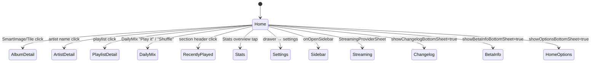
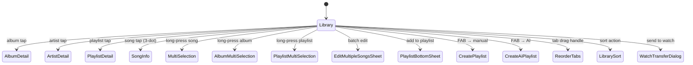

# 主要画面仕様 (Home / Library / Search)

> ナビゲーションのルートは `presentation/navigation/Screen.kt` 参照。  
> すべての Screen は `presentation/components/ScreenWrapper.kt` 経由でラップされ、フルプレイヤー BottomSheet (`UnifiedPlayerSheetV2.kt`) と状態同期される。

---

## HomeScreen

- **パッケージ**: `app/src/main/java/com/theveloper/pixelplay/presentation/screens/HomeScreen.kt`
- **ルート**: `Screen.Home.route` (`"home"`) (`AppNavigation.kt:93`)
- **概要**: アプリ起動直後のメイン画面。Your Mix（今日のミックス）、再生履歴、サジェスション、Daily Mix セクション、統計概要、サイドバードロワー、各種 BottomSheet（オプションメニュー・変更履歴・ベータ告知・クリーンインストール免責・ストリーミングプロバイダ）をホスト。

### 状態ホルダー連携

| Holder | 役割 |
|---|---|
| `PlayerViewModel` | `dailyMixSongs`, `yourMixSongs`, `homeMixPreviewSongs`, `playbackHistory`, `stablePlayerState`, `navBarCompactMode`, `libraryTabsFlow`, `aiPlaylistSheet` 関連 |
| `SettingsViewModel` | `uiState` (`collagePattern`, `collageAutoRotate`) |
| `StatsViewModel` | `homeOverview` (統計サマリー) |
| `DailyMixStateHolder` | フィード状態 (PlayerViewModel 内) |
| `NeteaseDashboardViewModel` / `QqMusicDashboardViewModel` / `NavidromeDashboardViewModel` / `JellyfinDashboardViewModel` | ログイン状態 |
| `mainViewModel` | `dailyMixSongs` |

### 主要 Composable

| Composable | 場所 | 目的 | 呼び出し元 |
|---|---|---|---|
| `HomeScreen(navController, paddingValuesParent, playerViewModel, onOpenSidebar)` | `HomeScreen.kt:129` | Home 画面のエントリ。LazyColumn + Drawer + 各種 BottomSheet。 | `AppNavigation.kt:124` |
| `YourMixLoadingPlaceholder()` | `HomeScreen.kt:590` | Your Mix ロード中スケルトン (>= 1.2s 最低表示) | HomeScreen |
| `YourMixEmptyPlaceholder()` | `HomeScreen.kt:606` | Your Mix 空状態 CTA | HomeScreen |
| `YourMixHeader(onShuffleAll, onPlayAll)` | `HomeScreen.kt:693` | Expressive タイトル + Shuffle/Play FAB | HomeScreen |
| `SongListItemFavs(...)` | `HomeScreen.kt:761` | リスト用 1 行 | HomeScreen |
| `SongListItemFavsWrapper(playerViewModel, song, isCurrent, ...)` | `HomeScreen.kt:836` | Wrapper。安定再生状態を `stablePlayerState` で参照し、現在曲ハイライト | HomeScreen |
| `rememberYourMixTitleStyle()` | `HomeScreen.kt:866` | `ExpTitleTypography` ベース動的スタイル生成 | HomeScreen |

### 内部実装メモ

- `homePlaceholderRefreshGeneration` と `hasHomeLoadingMinimumElapsed` (HomeScreen.kt:163-164) で最低 1.2s ローディング演出を保証 (`HomeLoadingPlaceholderMinDurationMillis`)。
- スクロール位置は `rememberSaveable(saver = LazyListState.Saver)` で保存 (HomeScreen.kt:262)。 `savedScrollIndex` / `savedScrollOffset` を `rememberSaveable` し、`LaunchedEffect` で復元 (HomeScreen.kt:277)。
- `CollagePattern` 自動ローテーション: `isAutoRotate` が true なら 60 秒周期 (rotationIndex ローテーション)。
- ドロワー状態は `rememberDrawerState(initialValue = DrawerValue.Closed)`。`onOpenSidebar` コールバックから開く。
- 各 BottomSheet は個別 `var ... by remember { mutableStateOf(false) }` フラグ + `rememberModalBottomSheetState()` で制御。

### 画面遷移

### 関連ファイル

- `app/src/main/java/com/theveloper/pixelplay/presentation/components/HomeOptionsBottomSheet.kt`
- `app/src/main/java/com/theveloper/pixelplay/presentation/components/CollapsibleCommonTopBar.kt` (`HomeGradientTopBar` 内部で利用)
- `app/src/main/java/com/theveloper/pixelplay/presentation/components/AppSidebarDrawer.kt`
- `app/src/main/java/com/theveloper/pixelplay/presentation/components/AlbumArtCollage.kt`
- `app/src/main/java/com/theveloper/pixelplay/presentation/components/DailyMixSection.kt`
- `app/src/main/java/com/theveloper/pixelplay/presentation/components/RecentlyPlayedSection.kt`
- `app/src/main/java/com/theveloper/pixelplay/presentation/components/StatsOverviewCard.kt`
- `app/src/main/java/com/theveloper/pixelplay/presentation/components/ChangelogBottomSheet.kt`
- `app/src/main/java/com/theveloper/pixelplay/presentation/components/BetaInfoBottomSheet.kt`
- `app/src/main/java/com/theveloper/pixelplay/presentation/components/Beta05CleanInstallDisclaimerDialog.kt`
- `app/src/main/java/com/theveloper/pixelplay/presentation/components/StreamingProviderSheet.kt`
- `app/src/main/java/com/theveloper/pixelplay/presentation/viewmodel/MainViewModel.kt`
- `app/src/main/java/com/theveloper/pixelplay/presentation/viewmodel/PlayerViewModel.kt`
- `app/src/main/java/com/theveloper/pixelplay/presentation/viewmodel/SettingsViewModel.kt`
- `app/src/main/java/com/theveloper/pixelplay/presentation/viewmodel/StatsViewModel.kt`
- 詳細: `specs/06-state-navigation/viewmodels.md`

---

## LibraryScreen

- **パッケージ**: `app/src/main/java/com/theveloper/pixelplay/presentation/screens/LibraryScreen.kt` (3760 行 — ライブラリ機能の主要 Composable 集約)
- **ルート**: `Screen.Library.route` (`"library"`) (`AppNavigation.kt:172`)
- **概要**: 曲の参照・複数選択・並び替え・プレイリスト管理・フォルダナビゲーション・お気に入り・Wear OS 転送を行う中央画面。タブ切替 (`Songs`/`Albums`/`Artists`/`Favorites`/`Folders`)、FAB からの作成・AI 生成対応。

### 状態ホルダー連携

| Holder | 役割 |
|---|---|
| `PlayerViewModel` | `favoriteSongIds`, `syncManager`, `libraryTabsFlow`, `currentLibraryTabId`, `libraryNavigationMode`, `navBarCompactMode`, `multiSelectionStateHolder`, `playlistSelectionStateHolder`, `selectedSongForInfo`, `hasActiveAiProviderApiKey`, `isGeneratingAiPlaylist`, `aiError`, `playlistPickerStorageFilter` |
| `PlaylistViewModel` | `uiState`, `playlists`, `telegramTopicDisplayMode` |
| `LibraryViewModel` | `songsPagingFlow`, `albumsPagingFlow`, `artistsPagingFlow`, `favoritesPagingFlow`, `isLoadingLibrary` |
| `SongInfoBottomSheetViewModel` | `isSendingToWatch`, `activeWatchTransfer` |
| `PlayerUiState` | `(private 投影) LibraryScreenPlayerProjection` 経由でフォルダ状態・並び替え・曲数・ロード可否 |

### 主要 Composable

| Composable | 場所 | 目的 | 呼び出し元 |
|---|---|---|---|
| `LibraryScreen(navController, playerViewModel)` | `LibraryScreen.kt:433` | ライブラリ全体エントリ。タブページャ + FAB + 各種 BottomSheet。 | `AppNavigation.kt:204` |
| `WatchTransferProgressDialog(transfer)` | `LibraryScreen.kt:267` | Wear OS への曲転送進捗ダイアログ | LibraryScreen |
| `CompactLibraryPagerIndicator(currentIndex, pageCount)` | `LibraryScreen.kt:2178` | Compact Pill モード用ページネータ | LibraryScreen |
| `LibraryInlineSyncIndicator(...)` | `LibraryScreen.kt:2225` | ライブラリ同期中インライン スピナー | LibraryScreen |
| `LibrarySyncOverlay(syncManager)` | `LibraryScreen.kt:2294` | 同期状態フルスクリーンオーバーレイ | LibraryScreen |
| (private) `PlayerUiState.toLibraryScreenProjection(): LibraryScreenPlayerProjection` | `LibraryScreen.kt:408` | UI 状態 → Library 用プロジェクション (フォルダ・曲/アルバム/アーティスト/お気に入り/同期状態) | LibraryScreen |

データクラス:

| Name | 場所 | 内容 |
|---|---|---|
| `LibraryScreenPlayerProjection` | `LibraryScreen.kt:388` | フォルダ階層・現在フォルダ・並び替え・曲数・ロード可否・同期状態を UI 用に正規化 |

### 内部実装メモ

- `PlayerUiState.toLibraryScreenProjection()` で UI 層が必要とする形に集約。`FolderNavigationStateHolder` を経由して `currentFolder` / `folderSourceRootPath` を構築。
- `CompactLibraryPagerIndicator` は `LibraryNavigationMode.COMPACT_PILL` モード時のみ表示。`HorizontalPager` + ドットインジケータをアニメーション。
- スクロール状態は `LazyListState.Saver` で `rememberSaveable`。タブ切替時に `currentTabIndex` を保存。
- 複数選択のコンテキスト: `multiSelectionStateHolder.selectedSongs`/`selectedSongIds`/`isSelectionMode`、`playlistSelectionStateHolder.selectedPlaylists`/`selectedPlaylistIds`/`isSelectionMode`。
- 各シートの開閉フラグ (`showSongInfoBottomSheet`, `showPlaylistBottomSheet`, `showMultiSelectionSheet`, `showAlbumMultiSelectionSheet`, `showBatchEditSheet`, `showPlaylistMultiSelectionSheet`, `showMergePlaylistDialog`, `showReorderTabsSheet`, `showTabSwitcherSheet`, `showCreatePlaylistDialog`, `showPlaylistCreationTypeDialog`, `showCreateAiPlaylistDialog`, `showWatchTransferDialog`) を個別管理。
- 並び替え: `currentSelectedSortOption` を `LibraryTabId` ごとに切替 (`LibraryScreen.kt:1134`)。
- 「Locate」ボタン (曲をお気に入りフォルダへ): `songsShowLocateButton` / `likedShowLocateButton` / `foldersShowLocateButton` の 3 タブ別制御。
- Pull-to-refresh: `rememberPullToRefreshState()` + `syncManager.requestSync(...)`。最低 900ms / 最大 1500ms 表示 (`PULL_REFRESH_MIN_VISIBLE_MS` / `PULL_REFRESH_MAX_VISIBLE_MS`)。
- 「SyncManager」の `isFetchingChanges` / `isSyncing` を購読 (`LibraryScreen.kt:451-453`)。
- 「Locate」: `pendingFoldersLocatePath` で遷移先管理。

### 画面遷移

### 関連ファイル

- `app/src/main/java/com/theveloper/pixelplay/presentation/screens/LibraryMediaTabs.kt`
- `app/src/main/java/com/theveloper/pixelplay/presentation/screens/LibrarySongsTab.kt`
- `app/src/main/java/com/theveloper/pixelplay/presentation/screens/LibrarySongsAndFavoritesTabs.kt`
- `app/src/main/java/com/theveloper/pixelplay/presentation/screens/LibraryPlaybackAwareSongItem.kt`
- `app/src/main/java/com/theveloper/pixelplay/presentation/screens/LibraryEmptyState.kt`
- `app/src/main/java/com/theveloper/pixelplay/presentation/components/PlaylistContainer.kt`
- `app/src/main/java/com/theveloper/pixelplay/presentation/components/SongInfoBottomSheet.kt`
- `app/src/main/java/com/theveloper/pixelplay/presentation/components/MultiSelectionBottomSheet.kt`
- `app/src/main/java/com/theveloper/pixelplay/presentation/components/AlbumMultiSelectionOptionSheet.kt`
- `app/src/main/java/com/theveloper/pixelplay/presentation/components/PlaylistMultiSelectionBottomSheet.kt`
- `app/src/main/java/com/theveloper/pixelplay/presentation/components/PlaylistBottomSheet.kt`
- `app/src/main/java/com/theveloper/pixelplay/presentation/components/PlaylistCreationDialogs.kt`
- `app/src/main/java/com/theveloper/pixelplay/presentation/components/AiPlaylistSheet.kt`
- `app/src/main/java/com/theveloper/pixelplay/presentation/components/EditMultipleSongsSheet.kt`
- `app/src/main/java/com/theveloper/pixelplay/presentation/components/LibrarySortBottomSheet.kt`
- `app/src/main/java/com/theveloper/pixelplay/presentation/components/ReorderTabsSheet.kt`
- `app/src/main/java/com/theveloper/pixelplay/presentation/components/SyncProgressBar.kt`
- `app/src/main/java/com/theveloper/pixelplay/presentation/components/AllFilesAccessDialog.kt`
- `app/src/main/java/com/theveloper/pixelplay/presentation/components/subcomps/EnhancedSongListItem.kt`
- `app/src/main/java/com/theveloper/pixelplay/presentation/components/subcomps/LibraryActionRow.kt`
- `app/src/main/java/com/theveloper/pixelplay/presentation/viewmodel/LibraryViewModel.kt`
- `app/src/main/java/com/theveloper/pixelplay/presentation/viewmodel/LibraryTabsStateHolder.kt`
- `app/src/main/java/com/theveloper/pixelplay/presentation/viewmodel/LibraryStateHolder.kt`
- `app/src/main/java/com/theveloper/pixelplay/presentation/viewmodel/FolderNavigationStateHolder.kt`
- `app/src/main/java/com/theveloper/pixelplay/presentation/viewmodel/PlayerViewModel.kt`
- `app/src/main/java/com/theveloper/pixelplay/presentation/viewmodel/PlaylistViewModel.kt`
- 詳細: `specs/06-state-navigation/viewmodels.md`

---

## SearchScreen

- **パッケージ**: `app/src/main/java/com/theveloper/pixelplay/presentation/screens/SearchScreen.kt` (1744 行)
- **ルート**: `Screen.Search.route` (`"search"`) (`AppNavigation.kt:132`)
- **概要**: アプリ内ライブラリ全体 (Songs/Albums/Artists/Playlists/Genres) の全文検索。ジャンルブラウズ (空クエリ時)、履歴、`FilterChip` による結果セクション切替、複数選択 (楽曲/アルバム/アーティスト/プレイリスト/ジャンル)、曲情報シート、AI プレイリストシート統合。

### 状態ホルダー連携

| Holder | 役割 |
|---|---|
| `PlayerViewModel` | `searchQuery`, `searchResults`, `genres`, `stablePlayerState`, `favoriteSongIds`, `selectedSongForInfo`, `multiSelectionStateHolder`, `playlistSelectionStateHolder`, `navBarCompactMode`, `getSongsForAlbums`, `getSongsForGenres` |
| `PlaylistViewModel` | `uiState` (プレイリストへの追加) |
| `MusicRepository` (直接参照) | `searchAll(...)` (SearchScreen.kt で利用) |
| `SearchStateHolder` | 検索状態フロー |

### 主要 Composable

| Composable | 場所 | 目的 | 呼び出し元 |
|---|---|---|---|
| `SearchScreen(paddingValues, playerViewModel, navController, onSearchBarActiveChange)` | `SearchScreen.kt:162` | 検索画面エントリ。DockedSearchBar + 結果リスト + ジャンルブラウズ + BottomSheet 群。 | `AppNavigation.kt:164` |
| `SearchResultSectionHeader(title)` | `SearchScreen.kt:935` | 結果セクション見出し (「Songs」「Albums」…) | SearchScreen |
| `SearchHistoryList(items, onClick, onDelete, onClear)` | `SearchScreen.kt:946` | 検索履歴リスト | SearchScreen |
| `SearchHistoryListItem(query, onClick, onDelete)` | `SearchScreen.kt:991` | 履歴 1 行 | SearchHistoryList |
| `EmptySearchResults(searchQuery, colorScheme)` | `SearchScreen.kt:1031` | 結果ゼロ時の空状態 | SearchScreen |
| `SearchResultsList(results, onItemSelected, ...)` | `SearchScreen.kt:1072` | グルーピング済み結果を表示 | SearchScreen |
| `SearchResultAlbumItem(item, ...)` | `SearchScreen.kt:1344` | アルバム結果アイテム | SearchResultsList |
| `SearchResultArtistItem(item, ...)` | `SearchScreen.kt:1482` | アーティスト結果アイテム | SearchResultsList |
| `SearchResultPlaylistItem(item, ...)` | `SearchScreen.kt:1566` | プレイリスト結果アイテム | SearchResultsList |
| `SearchFilterChip(filterType, currentFilter, onSelected)` | `SearchScreen.kt:1697` | 結果タイプ フィルタチップ | SearchScreen |

データクラス:

| Name | 場所 | 内容 |
|---|---|---|
| `SearchUiSlice` | `SearchScreen.kt:154` | `selectedSearchFilter`, `searchResults` (UI 専用の正規化された検索スライス) |

### 内部実装メモ

- 検索バー: `DockedSearchBar` (Material3) + `SearchBarDefaults.inputFieldColors` で active / inactive カラー制御。
- 検索実行: `LaunchedEffect(searchQuery)` で `playerViewModel` に委譲。`onQueryChange` で即時更新 (`searchQuery` は `rememberSaveable`)。
- ジャンルブラウズ: `showGenreBrowse` が `derivedStateOf { searchQuery.isBlank() }` で true なら `GenreCategoriesGrid` (`presentation/screens/search/components/GenreCategoriesGrid.kt`) を表示。
- 結果グルーピング: `SearchResultItem` の sealed type を `SearchFilterType` (ALL/SONGS/ALBUMS/ARTISTS/PLAYLISTS/GENRES) でソートしセクション分け。
- 複数選択: 楽曲 (PlayerVM の `multiSelectionStateHolder`)、アルバム (ローカル `selectedAlbums` 上限 6)、プレイリスト (`playlistSelectionStateHolder`)、ジャンル (ローカル `selectedGenres`)。
- `MAX_ALBUM_MULTI_SELECTION = 6` 定数 (SearchScreen.kt:152) で上限管理。
- AI プレイリスト: `AiPlaylistSheet` 経由。`createPlaylistWithAI` をハンドラ。

### 関連ファイル

- `app/src/main/java/com/theveloper/pixelplay/presentation/screens/search/components/GenreCategoriesGrid.kt`
- `app/src/main/java/com/theveloper/pixelplay/presentation/screens/search/components/GenreTypography.kt`
- `app/src/main/java/com/theveloper/pixelplay/presentation/screens/search/components/GenreiconProvider.kt`
- `app/src/main/java/com/theveloper/pixelplay/presentation/components/MultiSelectionBottomSheet.kt`
- `app/src/main/java/com/theveloper/pixelplay/presentation/components/AlbumMultiSelectionOptionSheet.kt`
- `app/src/main/java/com/theveloper/pixelplay/presentation/components/PlaylistMultiSelectionBottomSheet.kt`
- `app/src/main/java/com/theveloper/pixelplay/presentation/components/GenreMultiSelectionOptionSheet.kt`
- `app/src/main/java/com/theveloper/pixelplay/presentation/components/PlaylistBottomSheet.kt`
- `app/src/main/java/com/theveloper/pixelplay/presentation/components/PlaylistCover.kt`
- `app/src/main/java/com/theveloper/pixelplay/presentation/components/SongInfoBottomSheet.kt`
- `app/src/main/java/com/theveloper/pixelplay/presentation/components/AiPlaylistSheet.kt`
- `app/src/main/java/com/theveloper/pixelplay/presentation/components/subcomps/EnhancedSongListItem.kt`
- `app/src/main/java/com/theveloper/pixelplay/presentation/viewmodel/PlayerViewModel.kt`
- `app/src/main/java/com/theveloper/pixelplay/presentation/viewmodel/PlaylistViewModel.kt`
- `app/src/main/java/com/theveloper/pixelplay/presentation/viewmodel/SearchStateHolder.kt`
- 詳細: `specs/06-state-navigation/viewmodels.md`