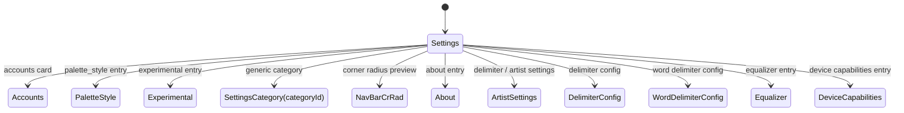

# 設定画面仕様 (Settings / Accounts / Experimental / Equalizer / DeviceCapabilities 等)

> 設定は `presentation/model/SettingsCategory` の enum でカテゴリ ID 化され、`SettingsScreen` から動的にリンク表示される。各カテゴリの詳細は `SettingsCategoryScreen` が `categoryId` ごとに分岐する。

---

## SettingsScreen

- **パッケージ**: `app/src/main/java/com/theveloper/pixelplay/presentation/screens/SettingsScreen.kt` (507 行)
- **ルート**: `Screen.Settings.route` (`"settings"`) (`AppNavigation.kt:207`)
- **概要**: 設定のトップ画面。アカウント追加ボタン + `SettingsCategory` enum のエントリ (`Home`, `Library & Playlists`, `Player & Audio`, `AI`, `Personalization`, `Backup & Restore`, `Experimental`, `About`) を `ExpressiveSettingsGroup` のリストで表示。各カテゴリはサブ画面に遷移する。

### 状態ホルダー連携

| Holder | 役割 |
|---|---|
| `PlayerViewModel` | `useSmoothCorners` 設定、ナビ用 |
| `SettingsViewModel` | `uiState`, `launchTab` |
| `SettingsCategory` enum | カテゴリ ID/タイトル/アイコン |

### 主要 Composable

| Composable | 場所 | 目的 | 呼び出し元 |
|---|---|---|---|
| `SettingsScreen(navController, playerViewModel, onNavigationIconClick)` | `SettingsScreen.kt:95` | 設定トップ。 | `AppNavigation.kt:211` |
| `ExpressiveNavigationItem(icon, label, onClick, ...)` (public) | `SettingsScreen.kt:319` | ナビ向けカテゴリカード | SettingsScreen |
| `ExpressiveCategoryItem(category, isDark, onClick)` (public) | `SettingsScreen.kt:376` | `SettingsCategory` を表示する大型カード | SettingsScreen |
| `ExpressiveSettingsGroup(content)` (public) | `SettingsScreen.kt:467` | グループ化コンテナ | SettingsScreen |
| `getCategoryColors(category, isDark)` (private) | `SettingsScreen.kt:478` | カテゴリごとのグラデーション色 | SettingsScreen |
| `getAccountsColors(isDark)` (private) | `SettingsScreen.kt:458` | Accounts 専用のカラー | SettingsScreen |

### 内部実装メモ

- `MutableTransitionState` + `rememberTransition` でマウント時のフェードイン/スライドイン演出。
- カテゴリリンク遷移: `navController.navigateSafely(Screen.SettingsCategory.createRoute(category.id))`。
- 「Accounts」エントリは別ルート (`Screen.Accounts`) へ直リンク。

### 画面遷移

### 関連ファイル

- `app/src/main/java/com/theveloper/pixelplay/presentation/screens/SettingsCategoryScreen.kt`
- `app/src/main/java/com/theveloper/pixelplay/presentation/screens/SettingsComponents.kt`
- `app/src/main/java/com/theveloper/pixelplay/presentation/model/SettingsCategory.kt` (enum / sealed)
- `app/src/main/java/com/theveloper/pixelplay/presentation/viewmodel/SettingsViewModel.kt`
- 詳細: `specs/06-state-navigation/viewmodels.md`

---

## AccountsScreen

- **パッケージ**: `app/src/main/java/com/theveloper/pixelplay/presentation/screens/AccountsScreen.kt` (798 行)
- **ルート**: `Screen.Accounts.route` (`"settings_accounts"`) (`AppNavigation.kt:220`)
- **概要**: 外部サービス (Netease / QQ Music / Navidrome / Jellyfin / Google Drive[coming soon]) へのログイン状態一覧と、連携用のダッシュボード遷移ボタン。

### 状態ホルダー連携

| Holder | 役割 |
|---|---|
| `AccountsViewModel` | `uiState` (各サービス接続状態) |
| `NeteaseDashboardViewModel` / `JellyfinDashboardViewModel` / `NavidromeDashboardViewModel` / `QqMusicDashboardViewModel` | ログイン Activity 起動判定 |

### 主要 Composable

| Composable | 場所 | 目的 | 呼び出し元 |
|---|---|---|---|
| `AccountsScreen(onBackClick, onOpenNeteaseDashboard, onOpenQqMusicDashboard, onOpenNavidromeDashboard, onOpenJellyfinDashboard)` | `AccountsScreen.kt:95` | Accounts 画面のエントリ。 | `AppNavigation.kt:224` |
| `AccountsHeroSection(...)` (private) | `AccountsScreen.kt:265` | 接続済み件数 Hero | AccountsScreen |
| `HeroStatTile(...)` (private) | `AccountsScreen.kt:315` | 統計タイル | AccountsHeroSection |
| `ConnectedAccountCard(account, onClick, onLogout)` (private) | `AccountsScreen.kt:345` | 連携済みサービスカード | AccountsScreen |
| `EmptyAccountsCard(onConnect)` (private) | `AccountsScreen.kt:528` | 未連携時の空状態 | AccountsScreen |
| `ServiceIcon(service, tint, modifier)` (private) | `AccountsScreen.kt:673` | サービスアイコン | AccountsScreen |
| `serviceDisplayName(service)` (private) | `AccountsScreen.kt:716` | 表示名 | AccountsScreen |
| `openService(context, service)` (private) | `AccountsScreen.kt:727` | Dashboard Activity 起動 | AccountsScreen |
| `safeStartActivity(context, intent)` (private) | `AccountsScreen.kt:789` | ActivityNotFoundException ハンドリング | openService |

### 内部実装メモ

- `servicePalette(service)` で各サービス用のカラー定義 (ダーク/ライト両対応)。
- `ExternalServiceAccount.GOOGLE_DRIVE` は「近日公開」フラグ (`isComingSoon`)。
- ログアウト: `onLogout` 経由で `viewModel.logout(service)`。

### 関連ファイル

- `app/src/main/java/com/theveloper/pixelplay/presentation/netease/dashboard/NeteaseDashboardScreen.kt`
- `app/src/main/java/com/theveloper/pixelplay/presentation/qqmusic/dashboard/QqMusicDashboardScreen.kt`
- `app/src/main/java/com/theveloper/pixelplay/presentation/navidrome/dashboard/NavidromeDashboardScreen.kt`
- `app/src/main/java/com/theveloper/pixelplay/presentation/jellyfin/dashboard/JellyfinDashboardScreen.kt`
- `app/src/main/java/com/theveloper/pixelplay/presentation/netease/auth/NeteaseLoginActivity.kt`
- `app/src/main/java/com/theveloper/pixelplay/presentation/qqmusic/auth/QqMusicLoginActivity.kt`
- `app/src/main/java/com/theveloper/pixelplay/presentation/navidrome/auth/NavidromeLoginActivity.kt`
- `app/src/main/java/com/theveloper/pixelplay/presentation/jellyfin/auth/JellyfinLoginActivity.kt`
- `app/src/main/java/com/theveloper/pixelplay/presentation/telegram/auth/TelegramLoginActivity.kt`
- `app/src/main/java/com/theveloper/pixelplay/presentation/viewmodel/AccountsViewModel.kt`
- 詳細: `specs/06-state-navigation/viewmodels.md`

---

## SettingsCategoryScreen

- **パッケージ**: `app/src/main/java/com/theveloper/pixelplay/presentation/screens/SettingsCategoryScreen.kt` (2930 行 — 設定カテゴリ全般)
- **ルート**: `Screen.SettingsCategory.route` (`"settings_category/{categoryId}"`) (`AppNavigation.kt:241`)
- **概要**: `SettingsCategory` enum の `id` を受け取り、各カテゴリの設定 UI を出力する「万能画面」。ライブラリ同期、AI プロンプト/モデル、バックアップ/リストア、テーマ、歌詞ソース、アルバムアート品質などを含む。

### 状態ホルダー連携

| Holder | 役割 |
|---|---|
| `SettingsViewModel` | `uiState`, `currentAiApiKey`, `currentAiModel`, `currentAiSystemPrompt`, `aiProvider`, `customBaseUrl`, `currentPath`, `currentDirectoryChildren`, `availableStorages`, `selectedStorageIndex`, `isLoadingDirectories`, `isExplorerPriming`, `isExplorerReady`, `isCurrentDirectoryResolved`, `isSyncing`, `syncProgress`, `dataTransferProgress`, `recentAiUsage`, `totalPromptTokens`, `totalOutputTokens`, `totalThoughtTokens`, `aiSampleSize`, `restorePlan`, `useSmoothCorners`, `explorerRoot()` |
| `PlayerViewModel` | `paletteRegenerationTargets`, `forceRegenerateAlbumPaletteForSong` |
| `AiPreferencesRepository` | 直接参照 (API キー保存など) |
| `LyricsRefreshProgress` | 歌詞一括更新 |

### 主要 Composable

| Composable | 場所 | 目的 | 呼び出し元 |
|---|---|---|---|
| `SettingsCategoryScreen(categoryId, navController, playerViewModel, onBackClick)` | `SettingsCategoryScreen.kt:184` | カテゴリ詳細メイン。 | `AppNavigation.kt:248` |
| `buildBackupSelectionSummary(context, selected)` (private) | `SettingsCategoryScreen.kt:1791` | バックアップモジュールの選択概要文字列 | SettingsCategoryScreen |
| `backupSectionIconRes(section)` (private) | `SettingsCategoryScreen.kt:1801` | セクションアイコン取得 | SettingsCategoryScreen |
| `BackupInfoNoticeCard(...)` (private) | `SettingsCategoryScreen.kt:1806` | バックアップの注意書きカード | SettingsCategoryScreen |
| `BackupSectionSelectionDialog(...)` (private) | `SettingsCategoryScreen.kt:1865` | バックアップ対象セクション選択ダイアログ | SettingsCategoryScreen |
| `BackupSectionSelectableCard(...)` (private) | `SettingsCategoryScreen.kt:2127` | セクション選択カード | BackupSectionSelectionDialog |
| `BackupTransferProgressDialogHost(progress)` (private) | `SettingsCategoryScreen.kt:2258` | 転送進捗ダイアログ (最低表示時間保証) | SettingsCategoryScreen |
| `BackupTransferProgressDialog(progress)` (private) | `SettingsCategoryScreen.kt:2294` | 進捗ダイアログ本体 | BackupTransferProgressDialogHost |
| `ImportFileSelectionDialog(...)` (private) | `SettingsCategoryScreen.kt:2416` | インポート用ファイル選択ダイアログ | SettingsCategoryScreen |
| `BackupHistoryCard(entry)` (private) | `SettingsCategoryScreen.kt:2637` | バックアップ履歴 1 行 | SettingsCategoryScreen |
| `ImportModuleSelectionDialog(...)` (private) | `SettingsCategoryScreen.kt:2747` | リストア対象モジュール選択ダイアログ | SettingsCategoryScreen |
| `PaletteRegenerateSongSheetContent(...)` (private) | `SettingsCategoryScreen.kt:2765` | パレット再生成曲選択シート | SettingsCategoryScreen |
| `SettingsSubsectionHeader(title)` (private) | `SettingsCategoryScreen.kt:2901` | セクション見出し | SettingsCategoryScreen |
| `SettingsSubsection(content)` (private) | `SettingsCategoryScreen.kt:2911` | セクション本体 | SettingsCategoryScreen |

### 内部実装メモ

- `categoryId` を `SettingsCategory.fromId(categoryId)` で enum にマップし、null なら `return` で空レンダー。
- 共通: `nestedScroll` で `topBarHeight` を `Animatable` 制御 (`min 64dp+statusBar, max 180dp or 200dp`)。
- バッテリー最適化例外設定 (`SettingsCategoryScreen.kt:751`) は Android 14+ で `ACTION_REQUEST_IGNORE_BATTERY_OPTIMIZATIONS` Intent を発行し、`fallbackIntent` をチェーン。
- AI セクション: トークン使用量 (`recentAiUsage`) を `groupBy { ... }` で日付ごとにまとめ、`dateFormat = SimpleDateFormat("MMMM d, yyyy", Locale.getDefault())` で表示。
- バックアップリストア: `BackupSection.defaultSelection` から選択可能、`BackupTransferProgressUpdate` を購読。
- パレット再生成: `forceRegenerateAlbumPaletteForSong(song)` を一括/単曲で実行。
- File Explorer (`FileExplorerDialog` / `FileExplorerBottomSheet`) 連携。

---

## PaletteStyleSettingsScreen

- **パッケージ**: `app/src/main/java/com/theveloper/pixelplay/presentation/screens/PaletteStyleSettingsScreen.kt` (758 行)
- **ルート**: `Screen.PaletteStyle.route` (`"palette_style_settings"`) (`AppNavigation.kt:257`)
- **概要**: アルバムアートから生成する ColorScheme のスタイル設定 (鮮やか / モノクロ / カスタム等)。詳細仕様は画面本体参照。

### 状態ホルダー連携

| Holder | 役割 |
|---|---|
| `SettingsViewModel` | パレット生成設定 |
| `PlayerViewModel` | 既存パレットキャッシュ |

---

## ExperimentalSettingsScreen

- **パッケージ**: `app/src/main/java/com/theveloper/pixelplay/presentation/screens/ExperimentalSettingsScreen.kt` (871 行)
- **ルート**: `Screen.Experimental.route` (`"experimental_settings"`) (`AppNavigation.kt:267`)
- **概要**: フルプレイヤー Loading Tweaks (delayAll / appearThreshold / closeThreshold / switchOnDragRelease / showPlaceholders)、アルバムアート品質 (`AlbumArtQuality.LOW/MEDIUM/HIGH`) などのデバッグ・最適化設定。

### 状態ホルダー連携

| Holder | 役割 |
|---|---|
| `SettingsViewModel` | `uiState.fullPlayerLoadingTweaks`, `albumArtQuality` |
| `PlayerViewModel` | `navBarCompactMode` 等 |

### 主要 Composable

| Composable | 場所 | 目的 | 呼び出し元 |
|---|---|---|---|
| `ExperimentalSettingsScreen(navController, playerViewModel, onNavigationIconClick)` | `ExperimentalSettingsScreen.kt:86` | 設定画面エントリ | `AppNavigation.kt:271` |
| `albumArtQualityLine(quality)` (private) | `ExperimentalSettingsScreen.kt:809` | 品質ごとの説明文字列 | ExperimentalSettingsScreen |
| `TriggerModeOptionCard(...)` (private) | `ExperimentalSettingsScreen.kt:820` | Trigger Mode オプションカード | ExperimentalSettingsScreen |

### 内部実装メモ

- `FullPlayerLoadingTweaks` パラメータ: `delayAll`, `delayAlbumCarousel`, `delayControls`, `delayProgressBar`, `delaySongMetadata`, `contentAppearThresholdPercent`, `contentCloseThresholdPercent`, `switchOnDragRelease`, `showPlaceholders`。
- `canUseTriggerMode = isAnyDelayEnabled && placeholdersEnabled` で Trigger Mode 選択を有効化。
- `AlbumArtQuality` のサフィックス説明を表示する文字列プロバイダ `albumArtQualityLine`。

### 関連ファイル

- `app/src/main/java/com/theveloper/pixelplay/presentation/viewmodel/SettingsViewModel.kt`
- `app/src/main/java/com/theveloper/pixelplay/data/preferences/FullPlayerLoadingTweaks.kt`
- `app/src/main/java/com/theveloper/pixelplay/data/preferences/AlbumArtQuality.kt`

---

## NavBarCornerRadiusScreen

- **パッケージ**: `app/src/main/java/com/theveloper/pixelplay/presentation/screens/NavBarCornerRadiusScreen.kt`
- **ルート**: `Screen.NavBarCrRad.route` / `"nav_bar_corner_radius"` (`AppNavigation.kt:381`)
- **概要**: Bottom NavBar の角丸をスライダー等でプレビュー・保存する。`useSmoothCorners` 設定と連動。

### 状態ホルダー連携

| Holder | 役割 |
|---|---|
| `SettingsViewModel` | `useSmoothCorners` 設定 |
| `PlayerViewModel` | `navBarCompactMode` |

---

## AboutScreen

- **パッケージ**: `app/src/main/java/com/theveloper/pixelplay/presentation/screens/AboutScreen.kt` (1010 行)
- **ルート**: `Screen.About.route` (`"about"`) (`AppNavigation.kt:399`)
- **概要**: アプリ情報・バージョン・メイン開発者・コミュニティ貢献者リスト (GitHub Contributor Service で動的取得)、SNS リンク。

### 状態ホルダー連携

| Holder | 役割 |
|---|---|
| `PlayerViewModel` | ナビ用 |
| `GitHubContributorService` (直接) | コントリビュータ取得 |

### 主要 Composable

| Composable | 場所 | 目的 | 呼び出し元 |
|---|---|---|---|
| `AboutScreen(navController, viewModel, onNavigationIconClick)` | `AboutScreen.kt:181` | About 画面のエントリ | `AppNavigation.kt:403` |
| `AboutHeroCard(...)` (private) | `AboutScreen.kt:495` | ヒーローカード (バージョン・メイン作者) | AboutScreen |
| `SocialChip(...)` (private) | `AboutScreen.kt:614` | SNS チップ | AboutHeroCard |
| `CommunitySignalsRow()` (private) | `AboutScreen.kt:667` | 統計信号行 | AboutScreen |
| `AboutSectionHeader(text)` (private) | `AboutScreen.kt:708` | セクション見出し | AboutScreen |
| `ContributorCard(contributor, onCardClick)` (private) | `AboutScreen.kt:733` | 貢献者カード | AboutScreen |
| `ContributorLabel(text)` (private) | `AboutScreen.kt:845` | ラベル描画 | ContributorCard |
| `ContributorAvatar(name, avatarUrl)` (private) | `AboutScreen.kt:862` | アバター描画 | ContributorCard |
| `SocialIconButton(...)` (private) | `AboutScreen.kt:944` | SNS アイコンボタン | ContributorCard |
| `expressiveListShape(index, count)` (private) | `AboutScreen.kt:964` | リスト角丸計算 | AboutScreen |
| `openUrl(context, url)` (private) | `AboutScreen.kt:994` | URL 起動ヘルパ | AboutScreen |

データクラス:

| Name | 場所 | 内容 |
|---|---|---|
| `Contributor` (private) | `AboutScreen.kt:115` | id, displayName, role, detail, badge, avatarUrl, githubUrl, telegramUrl, contributions |

### 内部実装メモ

- `CoreMaintainer`, `PinnedCommunityMembers`, `PinnedAliases` を `private val` で保持 (AboutScreen.kt:128)。
- `LaunchedEffect(Unit)` で `githubService.fetchContributors()` → `isLoadingContributors` を false にして動的コントリビュータを表示。
- 整形: `communityContributors = contributors.filter { it.id !in excludedIds }` で Pinned を除外。

---

## EasterEggScreen

- **パッケージ**: `app/src/main/java/com/theveloper/pixelplay/presentation/screens/EasterEggScreen.kt`
- **ルート**: `Screen.EasterEgg.route` (`"easter_egg"`) (`AppNavigation.kt:410`)
- **概要**: 隠し機能。`BrickBreakerOverlay` を含むエンターテインメント UI。

### 状態ホルダー連携

| Holder | 役割 |
|---|---|
| `PlayerViewModel` | 再生状態 (ゲーム中の BGM 等) |

### 関連ファイル

- `app/src/main/java/com/theveloper/pixelplay/presentation/components/brickbreaker/BrickBreakerOverlay.kt`

---

## ArtistSettingsScreen

- **パッケージ**: `app/src/main/java/com/theveloper/pixelplay/presentation/screens/ArtistSettingsScreen.kt` (530 行)
- **ルート**: `Screen.ArtistSettings.route` (`"artist_settings"`) (`AppNavigation.kt:420`)
- **概要**: アーティスト分割ルールのカスタマイズ。`DelimiterConfigScreen` / `WordDelimiterConfigScreen` への導線を含む。

### 状態ホルダー連携

| Holder | 役割 |
|---|---|
| `ArtistSettingsViewModel` | アーティスト分割設定 (区切り文字、ワード区切り) |

### 関連ファイル

- `app/src/main/java/com/theveloper/pixelplay/presentation/screens/DelimiterConfigScreen.kt`
- `app/src/main/java/com/theveloper/pixelplay/presentation/screens/WordDelimiterConfigScreen.kt`
- `app/src/main/java/com/theveloper/pixelplay/presentation/viewmodel/ArtistSettingsViewModel.kt`

---

## DelimiterConfigScreen

- **パッケージ**: `app/src/main/java/com/theveloper/pixelplay/presentation/screens/DelimiterConfigScreen.kt` (477 行)
- **ルート**: `Screen.DelimiterConfig.route` (`"delimiter_config"`) (`AppNavigation.kt:427`)
- **概要**: アーティスト名分割のデリミタ文字列 (`,` `;` `&` 等) を追加・削除。

---

## WordDelimiterConfigScreen

- **パッケージ**: `app/src/main/java/com/theveloper/pixelplay/presentation/screens/WordDelimiterConfigScreen.kt` (437 行)
- **ルート**: `Screen.WordDelimiterConfig.route` (`"word_delimiter_config"`) (`AppNavigation.kt:434`)
- **概要**: ワード区切り文字 (空白やハイフン等) の編集。

---

## EqualizerScreen

- **パッケージ**: `app/src/main/java/com/theveloper/pixelplay/presentation/screens/EqualizerScreen.kt` (1868 行)
- **ルート**: `Screen.Equalizer.route` (`"equalizer"`) (`AppNavigation.kt:441`)
- **概要**: イコライザ。プリセット切替 / カスタム作成 / バンド (10 帯域) 調整 / 仮想化 / 速度 / サラウンド / 音量 / システムボリューム / Bass Boost / メーカー固有エフェクト表示。`WavyArcSlider` 等の独自 UI を採用。

### 状態ホルダー連携

| Holder | 役割 |
|---|---|
| `EqualizerViewModel` | `uiState`, `accessiblePresets`, `systemVolume`, `isEnabled` |
| `PlayerViewModel` | ナビ用、効果適用 |

### 主要 Composable

| Composable | 場所 | 目的 | 呼び出し元 |
|---|---|---|---|
| `EqualizerScreen(navController, playerViewModel)` | `EqualizerScreen.kt:158` | EQ 画面のエントリ | `AppNavigation.kt:445` |
| `PresetTabsRow(presets, selectedPreset, onSelect)` (private) | `EqualizerScreen.kt:442` | プリセット選択タブ | EqualizerScreen |
| `BandSlidersSection(bandLevels, ...)` (private) | `EqualizerScreen.kt:534` | バンドスライダーセクション | EqualizerScreen |
| `GraphBandSliders(...)` (private) | `EqualizerScreen.kt:752` | グラフ表示スライダー | EqualizerScreen |
| `VerticalBandSlider(...)` (private) | `EqualizerScreen.kt:895` | 1 帯域スライダー | BandSlidersSection |
| `CustomVerticalSlider(...)` (private) | `EqualizerScreen.kt:964` | 高さ方向スライダー (星型サム) | BandSlidersSection |
| `EffectControlsSection(...)` (private) | `EqualizerScreen.kt:1164` | 仮想化・サラウンド・スピード | EqualizerScreen |
| `EffectCard(label, value, range, onValueChange, ...)` (private) | `EqualizerScreen.kt:1253` | エフェクトカード | EffectControlsSection |
| `UnsupportedEffectCard(name, reason)` (private) | `EqualizerScreen.kt:1324` | 未対応エフェクト表示 | EffectControlsSection |
| `UnsupportedEffectRow(name, message)` (private) | `EqualizerScreen.kt:1377` | 端末非対応行 | UnsupportedEffectCard |
| `IndividualEffectRow(...)` (private) | `EqualizerScreen.kt:1432` | 単一エフェクト | UnsupportedEffectCard |
| `VolumeControlCard()` (private) | `EqualizerScreen.kt:1496` | システム音量 | EqualizerScreen |
| `HybridBandSliders(...)` (private) | `EqualizerScreen.kt:1572` | ハイブリッド表示 (横 + グラフ) | EqualizerScreen |
| `HybridHorizontalSlider(...)` (private) | `EqualizerScreen.kt:1724` | 横スライダー | HybridBandSliders |
| `HybridFrequencyResponseGraph(...)` (private) | `EqualizerScreen.kt:1791` | 周波数応答グラフ | HybridBandSliders |

### 内部実装メモ

- モード切替: `EqualizerViewMode` enum (CURVES / HYBRID / CLASSIC) → Custom + Graph + Hybrid を切替。
- `WavyArcSlider` をサムとして使用し、`thumbShape` を `RoundedStarShape(sides = 8, curve = 0.1)` で装飾。
- `dispatchValue(touchY, forceHaptic)` でハプティクス連動値更新 (EqualizerScreen.kt:1043)。
- カスタムプリセット保存: `SavePresetDialog` / `RenamePresetDialog` / `ReorderPresetsSheet` / `CustomPresetsSheet`。
- パワー ON/OFF ボタン: `powerButtonCorner` を `animateIntAsState` で角丸補間 (EqualizerScreen.kt:407)。

### 関連ファイル

- `app/src/main/java/com/theveloper/pixelplay/presentation/components/WavyArcSlider.kt`
- `app/src/main/java/com/theveloper/pixelplay/presentation/components/WavySliderExpressive.kt`
- `app/src/main/java/com/theveloper/pixelplay/presentation/components/CustomPresetsSheet.kt`
- `app/src/main/java/com/theveloper/pixelplay/presentation/components/ReorderPresetsSheet.kt`
- `app/src/main/java/com/theveloper/pixelplay/presentation/components/SavePresetDialog.kt`
- `app/src/main/java/com/theveloper/pixelplay/presentation/viewmodel/EqualizerViewModel.kt`
- `app/src/main/java/com/theveloper/pixelplay/data/equalizer/EqualizerPreset.kt`

---

## DeviceCapabilitiesScreen

- **パッケージ**: `app/src/main/java/com/theveloper/pixelplay/presentation/screens/DeviceCapabilitiesScreen.kt` (1497 行)
- **ルート**: `Screen.DeviceCapabilities.route` (`"device_capabilities"`) (`AppNavigation.kt:451`)
- **概要**: 端末のオーディオ性能、ストレージ、メモリ、再生互換性、形式対応状況を可視化。レポートコピー / 共有機能付き。

### 状態ホルダー連携

| Holder | 役割 |
|---|---|
| `DeviceCapabilitiesViewModel` | `state` (`AudioCapabilities`, `LocalMusicStorageSummary`, `MemorySummary`, `PlaybackCompatibilitySummary`, `FormatSupportInfo`, `ExoPlayerInfo`) |

### 主要 Composable

| Composable | 場所 | 目的 | 呼び出し元 |
|---|---|---|---|
| `DeviceCapabilitiesScreen(navController, playerViewModel)` | `DeviceCapabilitiesScreen.kt:116` | 端末能力画面のエントリ | `AppNavigation.kt:455` |
| `DeviceCapabilitiesContent(state)` (private) | `DeviceCapabilitiesScreen.kt:217` | スクロール本体 | DeviceCapabilitiesScreen |
| `PerformanceReportCard(state)` (private) | `DeviceCapabilitiesScreen.kt:296` | パフォーマンスレポートカード | DeviceCapabilitiesContent |
| `AdvancedDiagnosticsToggleRow(state, onToggle)` (private) | `DeviceCapabilitiesScreen.kt:430` | 高度診断トグル | DeviceCapabilitiesScreen |
| `PlaybackReadinessCard(state)` (private) | `DeviceCapabilitiesScreen.kt:478` | 再生準備状況 | DeviceCapabilitiesContent |
| `LocalMusicStorageCard(storageSummary)` (private) | `DeviceCapabilitiesScreen.kt:571` | ローカル音楽ストレージ | DeviceCapabilitiesContent |
| `PlaybackPathCard(memorySummary, audioCapabilities)` (private) | `DeviceCapabilitiesScreen.kt:657` | メモリ使用量とパス | DeviceCapabilitiesContent |
| `FormatCompatibilityCard(formats)` (private) | `DeviceCapabilitiesScreen.kt:759` | 形式互換マトリクス | DeviceCapabilitiesContent |
| `PlaybackFindingsCard(compatibility)` (private) | `DeviceCapabilitiesScreen.kt:822` | 互換性所見 | DeviceCapabilitiesContent |
| `DeviceInfoPanel(deviceInfo)` (private) | `DeviceCapabilitiesScreen.kt:892` | デバイス情報 | DeviceCapabilitiesContent |
| `CapabilityCard(...)` (private) | `DeviceCapabilitiesScreen.kt:931` | 機能カード | DeviceCapabilitiesContent |
| `StatusIcon(state)` (private) | `DeviceCapabilitiesScreen.kt:981` | ステータスアイコン | CapabilityCard |
| `HeroMetricTile(...)` (private) | `DeviceCapabilitiesScreen.kt:1004` | ヒーロー数値タイル | HeroMetricTile |
| `InfoTile(...)` (private) | `DeviceCapabilitiesScreen.kt:1044` | 汎用情報タイル | DeviceCapabilitiesContent |
| `FormatSupportTile(format)` (private) | `DeviceCapabilitiesScreen.kt:1104` | 形式対応タイル | FormatCompatibilityCard |
| `ProgressReadout(percent, label)` (private) | `DeviceCapabilitiesScreen.kt:1186` | 進捗ラベル | LocalMusicStorageCard |
| `storagePercentLabel(fraction)` (private) | `DeviceCapabilitiesScreen.kt:1224` | パーセント文字列 | LocalMusicStorageCard |
| `Float.visibleProgress()` (private ext) | `DeviceCapabilitiesScreen.kt:1233` | クランプ | ProgressReadout |
| `formatDiagnosticsExpiry(epochMs)` (private) | `DeviceCapabilitiesScreen.kt:1238` | 有効期限文字列 | PerformanceReportCard |
| `OutputRouteRow(route, ...)` (private) | `DeviceCapabilitiesScreen.kt:1242` | 出力行 | DeviceCapabilitiesContent |
| `FindingRow(tone, ...)` (private) | `DeviceCapabilitiesScreen.kt:1289` | 互換性所見行 | PlaybackFindingsCard |
| `TonalChip(text, tone)` (private) | `DeviceCapabilitiesScreen.kt:1343` | トーン付きチップ | OutputRouteRow |
| `ChipRow(chips)` (private) | `DeviceCapabilitiesScreen.kt:1385` | チップ列 | OutputRouteRow |
| `SectionLabel(text)` (private) | `DeviceCapabilitiesScreen.kt:1414` | セクションラベル | DeviceCapabilitiesContent |
| `yesNo(value)` (private) | `DeviceCapabilitiesScreen.kt:1425` | bool の yes/no 文字列 | CapabilityCard |
| `audioOutputCategoryLabel(category)` (private) | `DeviceCapabilitiesScreen.kt:1434` | オーディオ出力カテゴリ表示 | OutputRouteRow |
| `localizedDeviceInfoEntries(entries)` (private) | `DeviceCapabilitiesScreen.kt:1446` | 端末情報のローカライズ | DeviceInfoPanel |
| `orderedDeviceInfoEntries(deviceInfo)` (private) | `DeviceCapabilitiesScreen.kt:1470` | 表示順 | DeviceInfoPanel |

enum:

| Name | 場所 | 値 |
|---|---|---|
| `FindingTone` (private) | `DeviceCapabilitiesScreen.kt:1281` | NEUTRAL/POSITIVE/WARNING |

### 内部実装メモ

- レポート共有: `sendIntent = Intent(Intent.ACTION_SEND).apply { ... }` (DeviceCapabilitiesScreen.kt:387)。
- `ClipboardManager` でパフォーマンスレポートをコピー可能。
- `outputRouteRow` が `TonalChip` + `ChipRow` で複数の形式/接続ステータスを表示。
- メモリ・ストレージは `Formatter.formatFileSize` で人間可読文字列化。

---

## SetupScreen (初回セットアップ)

- **パッケージ**: `app/src/main/java/com/theveloper/pixelplay/presentation/screens/SetupScreen.kt` (2456 行)
- **ルート**: 直接ルーティングなし。MainActivity から「初回起動」フラグで表示。
- **概要**: 11 ページの `HorizontalPager` (`Welcome` → `MediaPermission` → `BackupRestore` → `DirectorySelection` → `ThemeSelection` → `NotificationsPermission` → `AlarmsPermission` → `LibraryLayout` → `NavBarLayout` → `BatteryOptimization` → `Finish`) でセットアップを実行。

### 状態ホルダー連携

| Holder | 役割 |
|---|---|
| `SetupViewModel` | `uiState`, `currentPath`, `currentDirectoryChildren`, `availableStorages`, `selectedStorageIndex`, `isExplorerPriming`, `isExplorerReady`, `isCurrentDirectoryResolved`, `restorePlan`, `isInspectingBackup`, `isRestoringBackup`, `backupTransferProgress`, `mediaPermissionGranted`, `notificationsPermissionGranted`, `alarmsPermissionGranted`, `navBarStyle`, `libraryNavigationMode` |

### 主要 Composable

| Composable | 場所 | 目的 | 呼び出し元 |
|---|---|---|---|
| `SetupScreen()` | `SetupScreen.kt:167` | セットアップエントリ | MainActivity / Activity 直呼び |
| `SetupPage` (sealed class) | `SetupScreen.kt:539` | 各ページ識別子 (Welcome / MediaPermission / BackupRestore / DirectorySelection / ThemeSelection / NotificationsPermission / AlarmsPermission / LibraryLayout / NavBarLayout / BatteryOptimization / Finish) | SetupScreen |
| `buildSetupPages(sdkInt)` (private) | `SetupScreen.kt:553` | SDK に応じてページを生成 | SetupScreen |
| `firstBlockedForwardPageIndex(...)` (private) | `SetupScreen.kt:578` | 権限不足で先に進めない最初のページ | SetupScreen |
| `isPermissionGateSatisfied(context, page, uiState)` (private) | `SetupScreen.kt:591` | 次へ進めるか判定 | SetupScreen |
| `allRequiredPermissionsGrantedNow(context)` (private) | `SetupScreen.kt:612` | 必要な権限が全て付与済みか | SetupScreen |
| `hasMediaPermissionNow(context)` (private) | `SetupScreen.kt:623` | SDK 33+ で AUDIO / それ未満で READ_EXTERNAL_STORAGE | SetupScreen |
| `hasExactAlarmPermissionNow(context)` (private) | `SetupScreen.kt:632` | `AlarmManager.canScheduleExactAlarms()` | SetupScreen |
| `isIgnoringBatteryOptimizationsNow(context)` (private) | `SetupScreen.kt:638` | `PowerManager.isIgnoringBatteryOptimizations` | SetupScreen |
| `WelcomePage()` | `SetupScreen.kt:644` | Welcome | SetupScreen |
| `MediaPermissionPage(uiState, setupViewModel)` | `SetupScreen.kt:762` | Media 権限 | SetupScreen |
| `NotificationsPermissionPage(uiState, setupViewModel)` | `SetupScreen.kt:804` | 通知権限 | SetupScreen |
| `AlarmsPermissionPage(uiState, setupViewModel)` | `SetupScreen.kt:842` | Exact Alarm 権限 | SetupScreen |
| `BackupRestorePage(...)` | `SetupScreen.kt:885` | バックアップからの復元 | SetupScreen |
| `DirectorySelectionPage(...)` | `SetupScreen.kt:451` | 音楽ディレクトリ選択 | SetupScreen |
| `ThemeSelectionPage(uiState, setupViewModel)` | `SetupScreen.kt:978` | テーマ選択 | SetupScreen |
| `ThemeModeOptionCard(...)` (private) | `SetupScreen.kt:1057` | 個別テーマカード | ThemeSelectionPage |
| `LibraryLayoutPage(uiState, setupViewModel)` | `SetupScreen.kt:1180` | ライブラリレイアウト選択 | SetupScreen |
| `LibraryHeaderPreview(isCompact)` | `SetupScreen.kt:1282` | プレビュー描画 | LibraryLayoutPage |
| `NavBarLayoutPage(uiState, setupViewModel)` | `SetupScreen.kt:2210` | ナビバーレイアウト選択 | SetupScreen |
| `NavBarPreview(isDefault)` | `SetupScreen.kt:2338` | ナビバープレビュー | NavBarLayoutPage |
| `BatteryOptimizationPage(setupViewModel)` | `SetupScreen.kt:1449` | バッテリー最適化例外 | SetupScreen |
| `FinishPage()` | `SetupScreen.kt:1517` | 完了 | SetupScreen |
| `PermissionPageLayout(...)` | `SetupScreen.kt:1545` | 権限ページ共通レイアウト | MediaPermissionPage, NotificationsPermissionPage, AlarmsPermissionPage, BatteryOptimizationPage |
| `SetupRestoreDialog(...)` (private) | `SetupScreen.kt:1626` | リストア用ダイアログ | SetupScreen |
| `SetupRestoreSectionRow(...)` (private) | `SetupScreen.kt:1822` | リストア対象行 | SetupRestoreDialog |
| `LibraryNavigationPillSetupShow(...)` | `SetupScreen.kt:1895` | Pill モードセットアッププレビュー | LibraryLayoutPage |
| `SetupBottomBar(...)` | `SetupScreen.kt:2044` | 下部ボタン (Skip/Next/Finish) | SetupScreen |

### 内部実装メモ

- `pagerState` + `AnimatedContent` でページ遷移時に形が変わるアニメーション (`animatedTopStart` 等) を実装 (`SetupBottomBar`)。
- `LifecycleEventObserver` で Setup 中に権限付与状態を監視し戻る。
- `ThemeOptionItem` data class で `mode`, `title`, `description`, `icon`, `recommended` を保持。
- `restorePlan` がある場合のみリストア手順を表示。

---

## SetupComponents

`presentation/screens/` 直下の以下の補助 Composable ファイル群:

### LibraryPlaybackAwareSongItem

- パッケージ: `app/src/main/java/com/theveloper/pixelplay/presentation/screens/LibraryPlaybackAwareSongItem.kt`
- 用途: ライブラリ画面内の曲行で、再生中の曲をハイライト表示する Awareness ラッパー。`playerViewModel.stablePlayerState.currentSong?.id == song.id` を比較。

### LibraryMediaTabs

- パッケージ: `app/src/main/java/com/theveloper/pixelplay/presentation/screens/LibraryMediaTabs.kt` (696 行)
- 用途: Songs / Albums / Artists / Favorites のメディアタブ実装。Paging ベースのリスト。

### LibrarySongsTab

- パッケージ: `app/src/main/java/com/theveloper/pixelplay/presentation/screens/LibrarySongsTab.kt`
- 用途: Songs タブ専用 UI 実装。

### LibrarySongsAndFavoritesTabs

- パッケージ: `app/src/main/java/com/theveloper/pixelplay/presentation/screens/LibrarySongsAndFavoritesTabs.kt` (509 行)
- 用途: Songs + Favorites の 2 タブ実装。

### LibraryEmptyState

- パッケージ: `app/src/main/java/com/theveloper/pixelplay/presentation/screens/LibraryEmptyState.kt`
- 用途: ライブラリが空の時の UI。

### SettingsComponents

- パッケージ: `app/src/main/java/com/theveloper/pixelplay/presentation/screens/SettingsComponents.kt` (1016 行)
- 用途: 設定画面用の再利用 Composable 群 (ToggleRow, SliderRow, ColorPicker, IconPicker 等)。

### AiUsageComponents

- パッケージ: `app/src/main/java/com/theveloper/pixelplay/presentation/screens/AiUsageComponents.kt`
- 用途: AI トークン使用量表示用コンポーネント。

### TabAnimation

- パッケージ: `app/src/main/java/com/theveloper/pixelplay/presentation/screens/TabAnimation.kt`
- 用途: タブ切替時のアニメーションプリセット (`enter/exit` transitions)。

### FolderExplorerScreen

- パッケージ: `app/src/main/java/com/theveloper/pixelplay/presentation/screens/FolderExplorerScreen.kt`
- 用途: フォルダツリー単体表示。`FileExplorerDialog` / `FileExplorerBottomSheet` のラッパー。