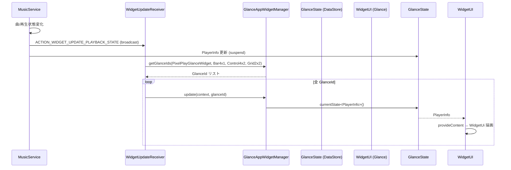

# glancewidget — Glance ホームウィジェット

> **パッケージ**: `com.theveloper.pixelplay.ui.glancewidget`
> **役割**: Android ホーム画面向け Glance ウィジェット (4 種)、State 永続化、アクション配信、アートワークデコード、サブコンポーネント (波形プログレス) を提供する。

## ファイル一覧

| ファイル | 行数 | 役割 |
|----------|------|------|
| `PixelPlayGlanceWidget.kt` | 1401 | 単一可変サイズ ウィジェット (1×1 ～ 4×4+ を内部で 10+ レイアウトに分岐) |
| `BarWidget4x1.kt` | 151 | 横長 4×1 固定 |
| `BarWidget4x1Receiver.kt` | 8 | AppWidget 登録 |
| `ControlWidget4x2.kt` | 203 | 4×2 固定 (Shuffle/Prev/Play/Next/Repeat フルコントロール) |
| `ControlWidget4x2Receiver.kt` | 9 | AppWidget 登録 |
| `GridWidget2x2.kt` | 153 | 2×2 固定 (2×2 グリッド型) |
| `GridWidget2x2Receiver.kt` | 9 | AppWidget 登録 |
| `PixelPlayGlanceWidgetReceiver.kt` | 8 | AppWidget 登録 |
| `PlayerInfoStateDefinition.kt` | 64 | `GlanceStateDefinition<PlayerInfo>` (DataStore + JSON 永続化) |
| `PlayerControlActionCallback.kt` | 80 | アクション受信 → `MusicService` Intent 発行 |
| `WidgetArtworkDecoder.kt` | 81 | Uri からのアルバムアート Bitmap デコード (上限バイト制御) |
| `WidgetComponents.kt` | 280 | 共通 Compose 部品 (`AlbumArtImage`, `PlayPauseButton`, `PreviousButton`, `NextButton`, `ShuffleButton`, `RepeatButton`, `WidgetIconButton`) |
| `WidgetUpdateReceiver.kt` | 53 | ブロードキャスト受信 → 全 widget を `update` |
| `WidgetUtils.kt` | 90 | `AlbumArtBitmapCache` / `WidgetColors` / `PlayerInfo.getWidgetColors()` |
| `IntentProvider.kt` | 23 | `MainActivity` 起動用 Intent ヘルパー |
| `subcomponents/WavyLinearProgressIndicator.kt` | 187 | 波形アニメーション付きリニアプログレスバー |

---

## PixelPlayGlanceWidget.kt

**パッケージ**: `com.theveloper.pixelplay.ui.glancewidget`
**役割**: 1 種類の可変サイズ ウィジェット。`SizeMode.Exact` で渡される `DpSize` に応じて内部で 10 種類以上のレイアウトに分岐する。

### 依存関係

- **上流**: `app/src/main/res/xml/widget_info.xml` (AppWidget プロバイダ設定)
- **下流**: `MainActivity` (クリック時), `PlayerInfoStateDefinition` (状態), `PlayerControlActionCallback` (アクション), `WidgetUtils.WidgetColors`, `WidgetComponents.AlbumArtImage` ほか, `WavyLinearProgressIndicator`, `createScalableBackgroundBitmap` (utils)

### サイズしきい値定数 (private val DpSize)

| 定数 | 値 | 用途 |
|------|-----|------|
| `VERY_THIN_LAYOUT_SIZE` | 200×60 | VeryThin レイアウト |
| `THIN_LAYOUT_SIZE` | 250×80 | Thin レイアウト |
| `SMALL_HORIZONTAL_LAYOUT_SIZE` | 110×60 | SmallHorizontal レイアウト |
| `ONE_BY_ONE_LAYOUT_SIZE` | 110×110 | 1×1 アート中心 |
| `GABE_LAYOUT_SIZE` | 110×220 | Gabe 縦長フル |
| `GABE_TWO_HEIGHT_LAYOUT_SIZE` | 110×200 | Gabe 2 列 |
| `SMALL_LAYOUT_SIZE` | 120×100 | Small |
| `MEDIUM_LAYOUT_SIZE` | 250×150 | Medium |
| `LARGE_LAYOUT_SIZE` | 300×180 | Large |
| `EXTRA_LARGE_LAYOUT_SIZE` | 300×220 | ExtraLarge |
| `EXTRA_LARGE_PLUS_LAYOUT_SIZE` | 350×260 | (large フォールバック) |
| `HUGE_LAYOUT_SIZE` | 400×300 | (extra-large フォールバック) |

### public API

| 名前 | 種類 | 説明 |
|------|------|------|
| `PixelPlayGlanceWidget` | class : `GlanceAppWidget` | ウィジェット本体 |
| `sizeMode` | `override val = SizeMode.Exact` | セル厳密一致モード |
| `stateDefinition` | `override val = PlayerInfoStateDefinition` | 状態定義 |
| `provideGlance(context, id)` | `suspend override fun` | Glance への描画提供。`currentState<PlayerInfo>()` を取得し `WidgetUi` に委譲 |

### private 内部 Composable

| 名前 | 役割 |
|------|------|
| `WidgetUi(playerInfo, size, context)` | サイズに応じて分岐 |
| `VeryThinWidgetLayout` | 200×60 — タイトル + アート + Play/Pause |
| `ThinWidgetLayout` | 250×80 — アート + タイトル + Prev/Play/Next |
| `GabeTwoHeightWidgetLayout` | 110×200 — 縦長 Gabe (1 列アート + 2×1 コントロール) |
| `GabeWidgetLayout` | 110×220 — 縦長 Gabe フル |
| `OneByOneWidgetLayout` | 110×110 — アートのみ (Play/Pause オーバーレイ) |
| `SmallHorizontalWidgetLayout` | 110×60 — コンパクト横長 |
| `SmallWidgetLayout` | 120×100 — アート + Prev/Play/Next |
| `MediumWidgetLayout` | 250×150 — アート + タイトル + Prev/Play/Next + Wavy プログレス |
| `LargeWidgetLayout` | 300×180 — + アルバム名 + シャッフル + リピート |
| `ExtraLargeWidgetLayout` | 300×220 — + キュー 4 件表示 |
| `AlbumArtImageGlance(bitmapData, albumArtUri, size, cornerRadius, modifier)` | 画像表示 (ByteArray → Bitmap キャッシュ → Glance Image) |
| `PlayPauseButtonGlance(isPlaying, backgroundColor, onBackgroundColor, modifier)` | Play/Pause ボタン |
| `NextButtonDGlance(...)` | 装飾付き Next |
| `NextButtonGlance(...)` | シンプル Next |
| `PreviousButtonGlance(...)` | Prev |
| `EndOfQueuePlaceholder()` | キュー末尾表示 |
| `formatDurationGlance(millis: Long): String` | `mm:ss` 形式 (private) |

### 内部実装メモ

- `WidgetUi` の分岐ロジック:
  - `isOneColumn = size.width < SMALL_LAYOUT_SIZE.width`
  - `isSmallHeight = size.height < SMALL_LAYOUT_SIZE.height`
  - 1 列: 110×110 以下 → `OneByOne`、110×200 以下 → `GabeTwoHeight`、それ以上 → `Gabe`
  - 薄高: 200×60 未満 → `SmallHorizontal`、250×80 未満 → `VeryThin`、それ以上 → `Thin`
  - 標準: 120×100 / 250×150 / 300×180 / 300×220 で `Small/Medium/Large/ExtraLarge`
- キュー (Extra Large レイアウト) は `playerInfo.queue.take(4)` で先頭 4 曲。
- アルバムアートは `AlbumArtBitmapCache` 経由で `ByteArray` からデコード。`BitmapFactory.Options.inSampleSize` で density 最適化。
- `formatDurationGlance` は `totalSeconds / 60` / `totalSeconds % 60` で mm:ss 化。

### 関連ファイル

- `app/src/main/res/xml/widget_info.xml` — `resizeMode="horizontal|vertical"` 設定
- `app/src/main/AndroidManifest.xml` — `PixelPlayGlanceWidgetReceiver` 登録

---

## BarWidget4x1.kt

**パッケージ**: `com.theveloper.pixelplay.ui.glancewidget`
**役割**: 横長 4×1 固定のシンプルコントロール (Prev / Play / Next) 付きウィジェット。

### public API

| 名前 | 種類 | 説明 |
|------|------|------|
| `BarWidget4x1` | class : `GlanceAppWidget` | ウィジェット本体 |
| `sizeMode` | `SizeMode.Exact` | 厳密サイズ |
| `stateDefinition` | `PlayerInfoStateDefinition` | 状態定義 |
| `provideGlance(context, id)` | suspend fun | `BarWidget4x1Content` を Glance に提供 |

### private 内部

| 名前 | 役割 |
|------|------|
| `BarWidget4x1Content(playerInfo, context)` | 44dp アート + Title + Artist + Prev/Play/Next |

### 内部実装メモ

- 背景 = `colors.surface` (アルバムアート由来または Glance デフォルト)。
- 角丸: widget=28dp / albumArt=16dp / play button=16-20dp (isPlaying による)。
- アートサイズ 44dp、コントロールボタン 40dp 固定。

### 関連ファイル

- `BarWidget4x1Receiver.kt` — 登録

---

## ControlWidget4x2.kt

**パッケージ**: `com.theveloper.pixelplay.ui.glancewidget`
**役割**: 4×2 固定のフルコントロール (Shuffle / Prev / Play / Next / Repeat) ウィジェット。

### public API

| 名前 | 種類 | 説明 |
|------|------|------|
| `ControlWidget4x2` | class : `GlanceAppWidget` | ウィジェット本体 |
| `sizeMode` | `SizeMode.Exact` | 厳密サイズ |
| `stateDefinition` | `PlayerInfoStateDefinition` | 状態定義 |
| `provideGlance(context, id)` | suspend fun | `ControlWidget4x2Content` を Glance に提供 |

### private 内部

| 名前 | 役割 |
|------|------|
| `ControlWidget4x2Content(playerInfo, context)` | 80dp アート + タイトル + アーティスト + Shuffle/Prev/Play/Next/Repeat |
| `ShuffleButton(...)` | シャッフル (有効時 `onSurface`/`surface` 配色切替) |
| `RepeatButton(...)` | リピート (REPEAT_MODE_ONE で `R.drawable.rounded_repeat_one_24` / それ以外 `rounded_repeat_24`) |

### 内部実装メモ

- 5 つのボタンは `defaultWeight()` で均等幅 (height 48dp)。
- Repeat モード判定は `androidx.media3.common.Player.REPEAT_MODE_OFF` / `_ONE` を使用。
- 角丸: widget=28dp / albumArt=16dp / play button=16-20dp / control=16dp。

### 関連ファイル

- `ControlWidget4x2Receiver.kt` — 登録

---

## GridWidget2x2.kt

**パッケージ**: `com.theveloper.pixelplay.ui.glancewidget`
**役割**: 2×2 固定のグリッド型 (アート + Play / Prev + Next) ウィジェット。サイズに応じてアイコンサイズを動的算出。

### public API

| 名前 | 種類 | 説明 |
|------|------|------|
| `GridWidget2x2` | class : `GlanceAppWidget` | ウィジェット本体 |
| `sizeMode` | `SizeMode.Exact` | 厳密サイズ |
| `stateDefinition` | `PlayerInfoStateDefinition` | 状態定義 |
| `provideGlance(context, id)` | suspend fun | `GridWidget2x2Content` を Glance に提供 |

### private 内部

| 名前 | 役割 |
|------|------|
| `GridWidget2x2Content(playerInfo, context)` | 2×2 グリッド配置 |
| `dynamicIconSize` | `(minSide.value * 0.14f).dp` |
| `dynamicPlayIconSize` | `(minSide.value * 0.16f).dp` |
| `albumArtSize` | `(minSide.value * 0.40f).dp` |

### 内部実装メモ

- `minSide = min(size.width, size.height)` を基準に比率でアイコンサイズ決定。
- 角丸: widget=28dp / item=16dp。
- ボタンは `defaultWeight().fillMaxHeight()` で均等 2×2 配置。

### 関連ファイル

- `GridWidget2x2Receiver.kt` — 登録

---

## PlayerInfoStateDefinition.kt

**パッケージ**: `com.theveloper.pixelplay.ui.glancewidget`
**役割**: `GlanceStateDefinition<PlayerInfo>` 実装。DataStore + kotlinx.serialization JSON で `PlayerInfo` を永続化。

### 公開 API

| 名前 | 種類 | 説明 |
|------|------|------|
| `PlayerInfoStateDefinition` | object : `GlanceStateDefinition<PlayerInfo>` | Glance 状態定義 |
| `PlayerInfoJsonSerializer(json)` | class : `Serializer<PlayerInfo>` | JSON シリアライザ |

| メソッド | 戻り値 | 目的 |
|----------|--------|------|
| `getDataStore(context, fileKey)` | `DataStore<PlayerInfo>` | DataStore 取得 (suspend) |
| `getLocation(context, fileKey)` | `File` | `filesDir/datastore/pixelPlayPlayerInfo_v1_json` を返す |
| `PlayerInfoJsonSerializer.readFrom(input)` | `PlayerInfo` | JSON デコード (空なら `PlayerInfo()`) |
| `PlayerInfoJsonSerializer.writeTo(t, output)` | `Unit` | JSON エンコード |

### 内部実装メモ

- `DATASTORE_FILE_NAME = "pixelPlayPlayerInfo_v1_json"`。
- JSON 設定: `ignoreUnknownKeys = true` / `isLenient = true` / `coerceInputValues = true`。
- 復元失敗時は `CorruptionException` を投げる。
- `dataStore` 委譲プロパティで `Context` ごとに 1 つの DataStore を保持。

### 関連ファイル

- `app/src/main/java/com/theveloper/pixelplay/data/model/PlayerInfo.kt` — 永続化対象
- 上記各 GlanceAppWidget クラス

---

## PlayerControlActionCallback.kt

**パッケージ**: `com.theveloper.pixelplay.ui.glancewidget`
**役割**: Glance `ActionCallback` 実装。アクションキー (`PlayerActions`) を見て `MusicService` への Intent を発行する。

### 公開 API

| 名前 | 種類 | 説明 |
|------|------|------|
| `PlayerControlActionCallback` | class : `ActionCallback` | コールバック本体 |
| `onAction(context, glanceId, parameters)` | `suspend override fun` | パラメータから action 文字列を取り出し `MusicService` に Intent 送信 |
| `PlayerActions` | object | アクションキー定数群 |

### `PlayerActions` 定数

| 名前 | 値 | 説明 |
|------|-----|------|
| `key` | `ActionParameters.Key<String>("playerActionKey_v1")` | アクションキー |
| `songIdKey` | `ActionParameters.Key<Long>("songIdKey_v1")` | 曲 ID キー (キュー再生用) |
| `PLAY_PAUSE` | `com.theveloper.pixelplay.ACTION_WIDGET_PLAY_PAUSE` | 再生/停止 |
| `NEXT` | `com.theveloper.pixelplay.ACTION_WIDGET_NEXT` | 次へ |
| `PREVIOUS` | `com.theveloper.pixelplay.ACTION_WIDGET_PREVIOUS` | 前へ |
| `FAVORITE` | `com.theveloper.pixelplay.ACTION_WIDGET_FAVORITE` | お気に入り |
| `PLAY_FROM_QUEUE` | `com.theveloper.pixelplay.ACTION_WIDGET_PLAY_FROM_QUEUE` | キューから再生 (`song_id` extra) |
| `SHUFFLE` | `com.theveloper.pixelplay.ACTION_WIDGET_SHUFFLE` | シャッフル |
| `REPEAT` | `com.theveloper.pixelplay.ACTION_WIDGET_REPEAT` | リピート |

### 内部実装メモ

- API 26 以上: `startService` を試行し `IllegalStateException` で失敗したら `startForegroundService` + `EXTRA_FORCE_FOREGROUND_ON_START=true` でフォールバック。
- API 31+: `ForegroundServiceStartNotAllowedException` を捕捉してログ。
- `PLAY_FROM_QUEUE` 時は `song_id` extra を `putExtra("song_id", songId)` で添付。songId が null なら no-op。

### 関連ファイル

- `app/src/main/java/com/theveloper/pixelplay/data/service/MusicService.kt` — 受信側

---

## WidgetArtworkDecoder.kt

**パッケージ**: `com.theveloper.pixelplay.ui.glancewidget`
**役割**: アルバムアート Uri 文字列 → `Bitmap?` (デコード済み、inSampleSize 適用済み)。`AlbumArtUtils.openArtworkInputStream` 経由でファイル/ContentResolver/LocalArtworkUri を開く。

### 公開 API

| 名前 | シグネチャ | 戻り値 | 目的 |
|------|-----------|--------|------|
| `decodeWidgetAlbumArtBitmap` | `(context: Context, rawUri: String, targetWidthPx: Int, targetHeightPx: Int)` | `Bitmap?` | Uri を Bitmap にデコード。サポート外スキーム / 上限超過 / 寸法不正なら `null` |

### 内部実装メモ

- サポートスキーム: `content`, `file`, `android.resource`, `LocalArtworkUri.SCHEME`、または scheme 無しで `rawUri.startsWith("/")`。
- バイト上限: `ArtworkTransportSanitizer.WIDGET_CONFIG.sourceBytesLimit` で `readBytesCapped` が打ち切り。
- `inSampleSize` を 2 のべき乗で自動算出。
- `bounds.outWidth <= 0 || bounds.outHeight <= 0` なら `null` 返却。

### 関連ファイル

- `app/src/main/java/com/theveloper/pixelplay/utils/AlbumArtUtils.kt` — 入力ストリーム取得
- `app/src/main/java/com/theveloper/pixelplay/utils/LocalArtworkUri.kt` — LocalArtworkUri scheme
- `app/src/main/java/com/theveloper/pixelplay/utils/ArtworkTransportSanitizer.kt` — 上限バイト定義

---

## WidgetComponents.kt

**パッケージ**: `com.theveloper.pixelplay.ui.glancewidget`
**役割**: Glance ウィジェット間で共有する Compose 部品群。

### 公開 Composable

| 名前 | シグネチャ | 目的 |
|------|-----------|------|
| `AlbumArtImage` | `(modifier, bitmapData: ByteArray?, albumArtUri: String?, size: Dp, context, cornerRadius: Dp)` | アート画像。`bitmapData` → `albumArtUri` の優先順で `ImageProvider` を解決。`AlbumArtBitmapCache` 経由でメモリキャッシュ |
| `WidgetIconButton` | `(modifier, backgroundColor, iconColor, iconRes, contentDescription, onClick, iconSize, cornerRadius)` | 汎用アイコンボタン。背景 + アイコン (ColorFilter tint) + `clickable` |
| `PreviousButton` | `(modifier, backgroundColor, iconColor, cornerRadius, iconSize)` | `R.drawable.rounded_skip_previous_24` のアイコンボタン (`PlayerActions.PREVIOUS`) |
| `NextButton` | `(modifier, backgroundColor, iconColor, cornerRadius, iconSize)` | `R.drawable.rounded_skip_next_24` (`PlayerActions.NEXT`) |
| `PlayPauseButton` | `(modifier, isPlaying, backgroundColor, iconColor, cornerRadius, iconSize)` | `R.drawable.rounded_play_24` / `_pause_24` を切替 (`PlayerActions.PLAY_PAUSE`) |
| `ShuffleButton` | `(modifier, backgroundColor, iconColor, cornerRadius, iconSize)` | `R.drawable.rounded_shuffle_24` (`PlayerActions.SHUFFLE`) |
| `RepeatButton` | `(modifier, backgroundColor, iconRes, iconColor, cornerRadius, iconSize)` | リピート。`iconRes` を引数で受ける (`R.drawable.rounded_repeat_24` / `rounded_repeat_one_24`) |

### private 関数

| 名前 | 役割 |
|------|------|
| `decodeAlbumArtFromUri(context, rawUri, requestedSize)` | `WidgetArtworkDecoder.decodeWidgetAlbumArtBitmap` 経由で Bitmap 取得 (`requestedSize * density`) |

### 内部実装メモ

- `AlbumArtImage` はキャッシュキー: `getKey(byteArray)` = `byteArray.contentHashCode().toString()` または `"uri:$rawUri"`。
- `inSampleSize` 計算は `targetSizePx = (size.value * density).toInt()` で density 対応。
- 画像未指定時は placeholder アイコン (`R.drawable.widget_default_artwork` 想定) を表示。

### 関連ファイル

- `WidgetArtworkDecoder.kt` — Uri デコーダ
- `WidgetUtils.kt` — キャッシュ
- `R.drawable.*` — アイコンリソース

---

## WidgetUpdateReceiver.kt

**パッケージ**: `com.theveloper.pixelplay.ui.glancewidget`
**役割**: 内部ブロードキャスト `com.theveloper.pixelplay.ACTION_WIDGET_UPDATE_PLAYBACK_STATE` を受信し、全 4 種類の Glance ウィジェットを `update` する。

### 公開 API

| 名前 | 種類 | 説明 |
|------|------|------|
| `WidgetUpdateReceiver` | class : `BroadcastReceiver` | 受信本体 |
| `onReceive(context, intent)` | `override fun` | アクション一致時のみ全 GlanceId を取得して `widget.update` を呼び出し |

### 内部実装メモ

- アクション不一致は早期 return。
- `goAsync()` + `CoroutineScope(Dispatchers.Main + SupervisorJob())` で非同期処理。`finally` で `pendingResult.finish()` + `scope.cancel()`。
- 4 種類の GlanceAppWidget すべてを順次 `update` する。

### 関連ファイル

- `app/src/main/AndroidManifest.xml` — receiver 登録
- `app/src/main/java/com/theveloper/pixelplay/data/service/MusicService.kt` — ブロードキャスト送信元

---

## WidgetUtils.kt

**パッケージ**: `com.theveloper.pixelplay.ui.glancewidget`
**役割**: 共通キャッシュ、共通カラーマッピング、Glance ColorProvider ファクトリ。

### 公開型

| 名前 | 種類 | フィールド |
|------|------|-----------|
| `AlbumArtBitmapCache` | object | LruCache<String, Bitmap>(4 MiB) |
| `WidgetColors` | data class | `surface`, `onSurface`, `artist`, `playPauseBackground`, `playPauseIcon`, `prevNextBackground`, `prevNextIcon` (全て `ColorProvider`) |

### `AlbumArtBitmapCache` public API

| 名前 | シグネチャ | 目的 |
|------|-----------|------|
| `getBitmap(key: String)` | `Bitmap?` | キャッシュ取得 |
| `putBitmap(key: String, bitmap: Bitmap)` | `Unit` | 既存時スキップして登録 |
| `getKey(byteArray: ByteArray)` | `String` | `byteArray.contentHashCode().toString()` |

### `PlayerInfo.getWidgetColors()` (拡張関数)

| シグネチャ | 目的 |
|-----------|------|
| `@Composable fun PlayerInfo.getWidgetColors(): WidgetColors` | `PlayerInfo.themeColors` から `ColorProvider(day, night)` を生成。null なら `GlanceTheme.colors` フォールバック |

### 内部実装メモ

- キャッシュ容量: 4 MiB。`sizeOf` で `value.byteCount` を返す。
- 7 つの ColorProvider ロール (surface, onSurface, artist, playPause bg/icon, prev/next bg/icon) を一括提供。
- フォールバック時は `primaryContainer` / `onPrimaryContainer` / `secondaryContainer` / `onSecondaryContainer` を組み合わせ。

### 関連ファイル

- `app/src/main/java/com/theveloper/pixelplay/data/model/PlayerInfo.kt` — 入力 (themeColors フィールド)

---

## IntentProvider.kt

**パッケージ**: `com.theveloper.pixelplay.ui.glancewidget`
**役割**: `MainActivity` 起動用 Intent を生成するヘルパー (object)。

### 公開 API

| 名前 | シグネチャ | 目的 |
|------|-----------|------|
| `mainActivityIntent` | `fun mainActivityIntent(context: Context): Intent` | `Intent(context, MainActivity::class.java)` に `FLAG_ACTIVITY_NEW_TASK \| FLAG_ACTIVITY_CLEAR_TOP` |

### 内部実装メモ

- Glance の `actionStartActivity<MainActivity>()` でも同じ効果が得られるが、`Intent` オブジェクトを直接編集したいケース (extra 付与等) 向けのヘルパー。

### 関連ファイル

- `MainActivity` — 遷移先

---

## WavyLinearProgressIndicator.kt (subcomponents)

**パッケージ**: `com.theveloper.pixelplay.ui.glancewidget.subcomponents`
**役割**: 波形アニメーション付きリニアプログレスバー (Bitmap でレンダリング)。再生中は波形が流れ、停止中はフラット。

### 公開 API

| 名前 | シグネチャ | 目的 |
|------|-----------|------|
| `WavyLinearProgressIndicator` | `@Composable fun WavyLinearProgressIndicator(progress: Float, modifier: GlanceModifier = GlanceModifier, isPlaying: Boolean = false, trackHeight: Dp = 6.dp, thumbRadius: Dp = 4.dp, waveAmplitude: Dp = 2.dp, waveFrequency: Float = 0.08f, phaseShift: Float = 0f, activeColor: Color, inactiveColor: Color, thumbColor: Color)` | Glance 上で波形プログレスを描画 |

### private 関数

| 名前 | 役割 |
|------|------|
| `createWavyProgressBitmap(context, width, height, progress, isPlaying, ...)` | アクティブ / 非アクティブ / 親指 (thumb) 3 つの Paint で Canvas 描画し `Bitmap` を返す |

### 内部実装メモ

- Bitmap サイズは `min(widgetDpSize.width.toPx(), width)` または `1` でフォールバック。
- 波形: `sin(waveFrequency * x + phaseShift)` を `step=5f` 刻みで `lineTo`。
- `progressPercent = (progress * 100f).toInt().coerceIn(0, 100)`。
- `isPlaying` で wave amplitude 適用 (停止時は `0f` でフラット)。

### 関連ファイル

- `R.drawable.rounded_play_24` / `_pause_24` 等のアイコン
- `PixelPlayGlanceWidget.MediumWidgetLayout` から使用 (推定)

---

## Mermaid: ウィジェット更新フロー



## Mermaid: アクション配信フロー

```mermaid
sequenceDiagram
    participant User
    participant Glance Widget Button
    participant PlayerControlActionCallback
    participant MusicService
    participant MediaSession (Player)

    User->>Glance Widget Button: クリック (PLAY_PAUSE / NEXT / ...)
    Glance Widget Button->>PlayerControlActionCallback: onAction(context, id, parameters)
    PlayerControlActionCallback->>PlayerControlActionCallback: action = parameters[PlayerActions.key]
    alt action == PLAY_FROM_QUEUE
        PlayerControlActionCallback->>PlayerControlActionCallback: songId = parameters[songIdKey]; putExtra("song_id", songId)
    end
    alt API >= 26
        PlayerControlActionCallback->>MusicService: startService(intent)
        Note over MusicService: IllegalStateException → startForegroundService(EXTRA_FORCE_FOREGROUND_ON_START)
    else API < 26
        PlayerControlActionCallback->>MusicService: startService(intent)
    end
    MusicService->>MediaSession: onCustomCommand / play / pause / skip
    MediaSession->>MediaSession: 状態変化
    MediaSession-->>MusicService: 通知
```
