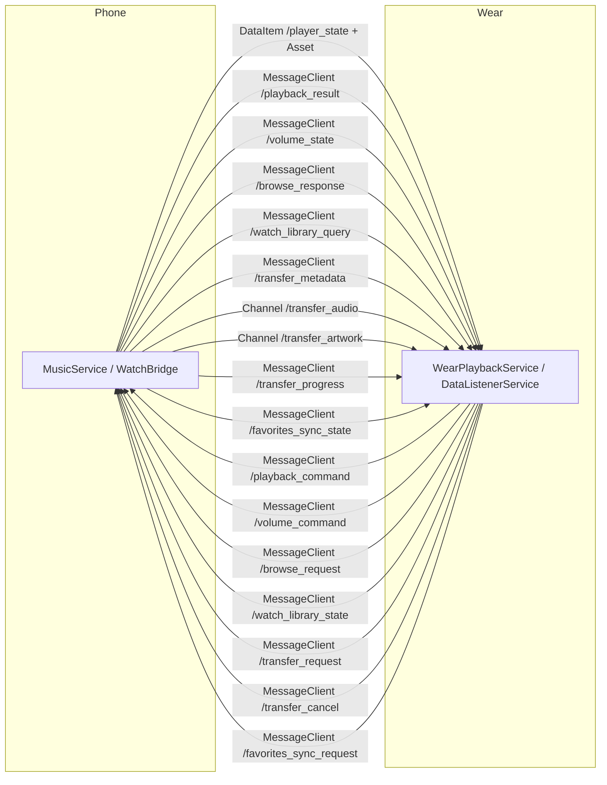

# 08 — 共有モジュール (`shared/`)

> **対象ディレクトリ**: `shared/src/main/java/com/theveloper/pixelplay/shared/`
>
> **phone アプリ** (`app/`) と **Wear OS アプリ** (`wear/`) の両方から参照される、phone↔wear IPC 用のシリアライズ可能モデル群。`@Serializable` 付きのデータクラスと、Android Wear Data Layer / MessageClient で使うパス定数で構成される。

## 含まれるファイル一覧

| ファイル | 行数 | 用途 |
|----------|------|------|
| `WearDataPaths.kt` | 68 | Data Layer / MessageClient のパス定数・キー定数 |
| `WearCapabilities.kt` | 9 | `Wearable.NodeClient` の capability 識別子 |
| `WearIntents.kt` | 5 | Wear から MainActivity 起動用の Intent action |
| `WearPlayerState.kt` | 44 | 軽量 player state DTO (phone → wear) |
| `WearPlaybackCommand.kt` | 53 | 再生制御コマンド (wear → phone) |
| `WearPlaybackResult.kt` | 15 | コマンド結果確認 (phone → wear) |
| `WearVolumeCommand.kt` | 21 | 音量制御コマンド (wear → phone) |
| `WearVolumeState.kt` | 24 | 音量状態の DTO (phone → wear) |
| `WearLyrics.kt` | 20 | 歌詞 (plain / synced) |
| `WearThemePalette.kt` | 35 | パレットスナップショット (ARGB Int 群) |
| `WearLibraryItem.kt` | 30 | ライブラリ参照アイテム (song / album / artist / playlist / category) |
| `WearBrowseRequest.kt` | 30 | ライブラリ参照リクエスト (wear → phone) |
| `WearBrowseResponse.kt` | 17 | ライブラリ参照レスポンス (phone → wear) |
| `WearLibraryState.kt` | 11 | ウォッチに保存済の曲 ID スナップショット |
| `WearTransferRequest.kt` | 24 | 曲転送リクエスト (wear → phone) |
| `WearTransferMetadata.kt` | 36 | 曲メタデータ (phone → wear、転送開始前) |
| `WearTransferProgress.kt` | 25 | 転送進捗 (phone → wear) |
| `WearFavoriteSyncPayload.kt` | 19 | お気に入り同期要求/応答 |

> 全モデルは `kotlinx.serialization.Serializable`。`Json { ignoreUnknownKeys = true; isLenient = true; coerceInputValues = true }` (推定) でデコードされる。

---

## WearDataPaths.kt

**パッケージ**: `com.theveloper.pixelplay.shared`
**役割**: Wear Data Layer / MessageClient で使うパス・キーのグローバル定数。`/player_state` 等、URI 形式のパスは `data` スキームと組み合わせる。

### 公開定数 (object WearDataPaths)

#### パス定数 (`const val String`)

| 名前 | 値 | 方向 / 用途 |
|------|-----|-------------|
| `PLAYER_STATE` | `"/player_state"` | phone → wear DataItem (`onDataChanged`) |
| `PLAYBACK_COMMAND` | `"/playback_command"` | wear → phone MessageClient |
| `PLAYBACK_RESULT` | `"/playback_result"` | phone → wear MessageClient |
| `VOLUME_COMMAND` | `"/volume_command"` | wear → phone MessageClient |
| `VOLUME_STATE` | `"/volume_state"` | phone → wear MessageClient |
| `BROWSE_REQUEST` | `"/browse_request"` | wear → phone MessageClient |
| `BROWSE_RESPONSE` | `"/browse_response"` | phone → wear MessageClient |
| `WATCH_LIBRARY_QUERY` | `"/watch_library_query"` | phone → wear MessageClient |
| `WATCH_LIBRARY_STATE` | `"/watch_library_state"` | wear → phone MessageClient |
| `TRANSFER_REQUEST` | `"/transfer_request"` | wear → phone MessageClient |
| `TRANSFER_METADATA` | `"/transfer_metadata"` | phone → wear MessageClient |
| `TRANSFER_CHANNEL` | `"/transfer_audio"` | phone → wear ChannelClient (音声ファイル) |
| `TRANSFER_ARTWORK_CHANNEL` | `"/transfer_artwork"` | phone → wear ChannelClient (アートワーク) |
| `TRANSFER_PROGRESS` | `"/transfer_progress"` | phone → wear MessageClient |
| `TRANSFER_CANCEL` | `"/transfer_cancel"` | wear → phone MessageClient |
| `FAVORITES_SYNC_REQUEST` | `"/favorites_sync_request"` | wear → phone MessageClient |
| `FAVORITES_SYNC_STATE` | `"/favorites_sync_state"` | phone → wear MessageClient |

#### DataMap キー定数

| 名前 | 値 | 用途 |
|------|-----|------|
| `KEY_ALBUM_ART` | `"album_art"` | アートワーク (Asset) |
| `KEY_STATE_JSON` | `"state_json"` | JSON シリアライズ済み `WearPlayerState` |
| `KEY_TIMESTAMP` | `"timestamp"` | 送信時刻 (ms) |

### 内部実装メモ

- すべての定数は `const val` で inline 化される。
- DataItem の URI は `Wear.getDataClient(ctx).putDataItem(PutDataMapRequest.create(WearDataPaths.PLAYER_STATE).setDataMap(...).asPutDataRequest())` 形式で構築。
- MessageClient は `MessageClient.sendMessage(nodeId, WearDataPaths.PLAYBACK_COMMAND, json.toByteArray())` 形式。
- ChannelClient は `Wearable.getChannelClient(ctx).openChannel(nodeId, WearDataPaths.TRANSFER_CHANNEL)` 形式。

### 呼び出し元

- `app/src/main/java/com/theveloper/pixelplay/data/service/MusicService.kt` (推定) — phone 側送受信
- `wear/src/main/java/com/theveloper/pixelplay/data/WearDataListenerService.kt` — wear 側受信
- 各種 wear `*Repository.kt`

---

## WearCapabilities.kt

**パッケージ**: `com.theveloper.pixelplay.shared`
**役割**: Wear `NodeClient.getCapabilities()` で問い合わせる capability 名。phone 側から「どのノードが PixelPlay Wear アプリを持っているか」を識別する。

### 公開定数

| 名前 | 値 |
|------|-----|
| `PIXELPLAY_WEAR_APP` | `"pixelplay_wear_app"` |

### 内部実装メモ

- `Wearable.getCapabilityClient(ctx).getAllCapabilities(CapabilityClient.FILTER_REACHABLE)` で取得し、`capability.name == PIXELPLAY_WEAR_APP` でフィルタ。
- phone → wear メッセージ送信時の送信先ノード解決に使用。

### 呼び出し元

- `app/src/main/java/com/theveloper/pixelplay/data/service/MusicService.kt` (推定)

---

## WearIntents.kt

**パッケージ**: `com.theveloper.pixelplay.shared`
**役割**: Wear から MainActivity を起動するための Intent action 文字列。

### 公開定数

| 名前 | 値 |
|------|-----|
| `ACTION_OPEN_PLAYER` | `"com.theveloper.pixelplay.action.OPEN_PLAYER"` |

### 内部実装メモ

- `Intent(ACTION_OPEN_PLAYER).setClassName("com.theveloper.pixelplay", "com.theveloper.pixelplay.MainActivity")` のように使用。
- `wear/src/main/AndroidManifest.xml` の `WearMainActivity` にも `<action android:name="com.theveloper.pixelplay.action.OPEN_PLAYER" />` の intent-filter が登録されている。

### 呼び出し元

- `wear/src/main/java/com/theveloper/pixelplay/data/WearDataListenerService.kt:182` (推定) — `maybeAutoLaunchPlayer` からの自動起動

---

## WearPlayerState.kt

**パッケージ**: `com.theveloper.pixelplay.shared`
**役割**: phone → wear に同期する軽量 player state。`PlayerInfo` のサブセット。アルバムアートは `KEY_ALBUM_ART` 経由で別送 (Asset)。

### フィールド (data class, @Serializable)

| 名前 | 型 | デフォルト | 説明 |
|------|----|-----------|------|
| `songId` | `String` | `""` | 曲の ID |
| `songTitle` | `String` | `""` | 曲名 |
| `artistName` | `String` | `""` | アーティスト名 |
| `albumName` | `String` | `""` | アルバム名 |
| `isPlaying` | `Boolean` | `false` | 再生中か |
| `currentPositionMs` | `Long` | `0L` | 現在位置 (ms) |
| `totalDurationMs` | `Long` | `0L` | 曲の長さ (ms) |
| `isFavorite` | `Boolean` | `false` | お気に入り登録 |
| `isShuffleEnabled` | `Boolean` | `false` | シャッフル ON |
| `repeatMode` | `Int` | `0` | 0=OFF, 1=ONE, 2=ALL (Media3.Player.REPEAT_MODE_*) |
| `volumeLevel` | `Int` | `0` | STREAM_MUSIC 現在音量 |
| `volumeMax` | `Int` | `0` | STREAM_MUSIC 最大音量 |
| `themePalette` | `WearThemePalette?` | `null` | パレットスナップショット |
| `queueRevision` | `String` | `""` | キュー更新で変わるリビジョン文字列 |
| `lyrics` | `WearLyrics?` | `null` | 歌詞 |
| `positionUpdatedElapsedRealtimeMs` | `Long` | `0L` | 送信側の elapsedRealtime (transport latency 補正用) |

### 派生プロパティ

| 名前 | 種類 | 説明 |
|------|------|------|
| `isEmpty` | `Boolean` | `songId.isEmpty()` (曲未選択判定) |

### 内部実装メモ

- `positionUpdatedElapsedRealtimeMs` は wear 側で受信時に上書き (`WearDataListenerService.withTransportLatencyApplied`)。
- `queueRevision` は phone 側のキューが変わるたびに increment し、wear 側が必要な時だけ再取得する判定に使う。
- `themePalette` を含めて送ると wear 側は色再計算不要。

### 呼び出し元

- 送信: `app/src/main/java/com/theveloper/pixelplay/data/service/MusicService.kt` (推定)
- 受信: `wear/src/main/java/com/theveloper/pixelplay/data/WearDataListenerService.kt:111`

---

## WearPlaybackCommand.kt

**パッケージ**: `com.theveloper.pixelplay.shared`
**役割**: wear → phone に送る再生制御コマンド。`MessageClient` で JSON バイト列として送信。

### フィールド (data class, @Serializable)

| 名前 | 型 | デフォルト | 説明 |
|------|----|-----------|------|
| `action` | `String` | — | コマンド種別 (下記定数) |
| `songId` | `String?` | `null` | `PLAY_ITEM` / `PLAY_FROM_CONTEXT` 用曲 ID |
| `requestId` | `String?` | `null` | 結果確認が必要なコマンドの相関 ID |
| `targetEnabled` | `Boolean?` | `null` | idempotent トグル (favorite/shuffle) の目標状態 |
| `contextType` | `String?` | `null` | `PLAY_FROM_CONTEXT` のコンテキスト種別 |
| `contextId` | `String?` | `null` | `PLAY_FROM_CONTEXT` のコンテキスト ID |
| `queueIndex` | `Int?` | `null` | `PLAY_QUEUE_INDEX` 用 |
| `durationMinutes` | `Int?` | `null` | `SET_SLEEP_TIMER_DURATION` 用 |

### `companion object` 定数 (action 種別)

| 定数 | 値 | 説明 |
|------|-----|------|
| `PLAY` | `"play"` | 再生開始 |
| `PAUSE` | `"pause"` | 一時停止 |
| `TOGGLE_PLAY_PAUSE` | `"toggle_play_pause"` | トグル |
| `NEXT` | `"next"` | 次へ |
| `PREVIOUS` | `"previous"` | 前へ |
| `TOGGLE_FAVORITE` | `"toggle_favorite"` | お気に入りトグル |
| `TOGGLE_SHUFFLE` | `"toggle_shuffle"` | シャッフルトグル |
| `CYCLE_REPEAT` | `"cycle_repeat"` | リピートサイクル |
| `PLAY_ITEM` | `"play_item"` | 特定曲再生 (songId 必須) |
| `PLAY_FROM_CONTEXT` | `"play_from_context"` | コンテキスト内再生 (contextType/Id) |
| `PLAY_NEXT_FROM_CONTEXT` | `"play_next_from_context"` | キューの次に挿入 |
| `ADD_TO_QUEUE_FROM_CONTEXT` | `"add_to_queue_from_context"` | キュー末尾に追加 |
| `PLAY_QUEUE_INDEX` | `"play_queue_index"` | キューインデックス指定再生 (queueIndex) |
| `SET_SLEEP_TIMER_DURATION` | `"set_sleep_timer_duration"` | スリープタイマー (durationMinutes) |
| `SET_SLEEP_TIMER_END_OF_TRACK` | `"set_sleep_timer_end_of_track"` | 曲終でスリープ |
| `CANCEL_SLEEP_TIMER` | `"cancel_sleep_timer"` | スリープタイマー解除 |

### 内部実装メモ

- `contextType` は `"album"` / `"artist"` / `"playlist"` / `"favorites"` / `"all_songs"` のいずれか。
- `requestId` を付けると phone 側から `WearPlaybackResult` が返る。

### 呼び出し元

- 送信: `wear/src/main/java/com/theveloper/pixelplay/data/WearPlaybackController.kt` (推定)
- 受信: `app/src/main/java/com/theveloper/pixelplay/data/service/MusicService.kt` (推定)

---

## WearPlaybackResult.kt

**パッケージ**: `com.theveloper.pixelplay.shared`
**役割**: コマンド結果確認 (phone → wear)。`requestId` で相関。

### フィールド (data class, @Serializable)

| 名前 | 型 | デフォルト | 説明 |
|------|----|-----------|------|
| `requestId` | `String` | — | リクエスト相関 ID |
| `action` | `String` | — | 元コマンドの action |
| `songId` | `String?` | `null` | 対象曲 ID (あれば) |
| `success` | `Boolean` | — | 成否 |
| `error` | `String?` | `null` | エラー文字列 (成功時 null) |

### 呼び出し元

- 受信: `wear/src/main/java/com/theveloper/pixelplay/data/WearDataListenerService.kt:267`

---

## WearVolumeCommand.kt

**パッケージ**: `com.theveloper.pixelplay.shared`
**役割**: wear → phone の音量コマンド。

### フィールド (data class, @Serializable)

| 名前 | 型 | デフォルト | 説明 |
|------|----|-----------|------|
| `direction` | `String` | — | `UP` / `DOWN` / `SET` / `QUERY` |
| `value` | `Int?` | `null` | `SET` 時の絶対値 (0-100 %) |

### `companion object` 定数

| 定数 | 値 |
|------|-----|
| `UP` | `"up"` |
| `DOWN` | `"down"` |
| `SET` | `"set"` |
| `QUERY` | `"query"` |

### 内部実装メモ

- `value` セット時は `direction` を無視して絶対値設定。

### 呼び出し元

- 送信: `wear/src/main/java/com/theveloper/pixelplay/data/WearVolumeRepository.kt` (推定)
- 受信: phone `MusicService`

---

## WearVolumeState.kt

**パッケージ**: `com.theveloper.pixelplay.shared`
**役割**: phone → wear の音量状態 DTO。

### フィールド (data class, @Serializable)

| 名前 | 型 | デフォルト | 説明 |
|------|----|-----------|------|
| `level` | `Int` | `0` | 現在音量 |
| `max` | `Int` | `0` | 最大音量 |
| `routeType` | `String` | `ROUTE_TYPE_PHONE` | 出力種別 |
| `routeName` | `String` | `""` | 出力名 |

### `companion object` 定数 (route type)

| 定数 | 値 |
|------|-----|
| `ROUTE_TYPE_PHONE` | `"phone"` |
| `ROUTE_TYPE_WATCH` | `"watch"` |
| `ROUTE_TYPE_HEADPHONES` | `"headphones"` |
| `ROUTE_TYPE_SPEAKER` | `"speaker"` |
| `ROUTE_TYPE_BLUETOOTH` | `"bluetooth"` |
| `ROUTE_TYPE_CAST` | `"cast"` |
| `ROUTE_TYPE_OTHER` | `"other"` |

### 内部実装メモ

- 受信側で `routeType` を見てアイコンを出し分け (`OutputRouteIcon.kt`)。

### 呼び出し元

- 受信: `wear/src/main/java/com/theveloper/pixelplay/data/WearDataListenerService.kt:325`

---

## WearLyrics.kt

**パッケージ**: `com.theveloper.pixelplay.shared`
**役割**: 歌詞データ (プレーンテキスト / 同期)。

### 公開型

| 名前 | フィールド |
|------|-----------|
| `WearLyrics` (data class) | `plain: List<String> = emptyList()`, `synced: List<WearSyncedLyricLine> = emptyList()` |
| `WearSyncedLyricLine` (data class) | `timeMs: Int`, `line: String`, `translation: String? = null`, `romanization: String? = null` |

### 派生プロパティ

| 名前 | 種類 | 説明 |
|------|------|------|
| `WearLyrics.hasLyrics` | `Boolean` | `plain.isNotEmpty() || synced.isNotEmpty()` |

### 内部実装メモ

- `timeMs` は曲先頭からのミリ秒。
- `translation` / `romanization` は多言語対応用 (日本語 / 中国語歌詞向け)。

### 呼び出し元

- `WearPlayerState.lyrics` フィールド
- `wear/src/main/java/com/theveloper/pixelplay/presentation/screens/PlayerScreen.kt` (推定)

---

## WearThemePalette.kt

**パッケージ**: `com.theveloper.pixelplay.shared`
**役割**: phone → wear のパレットスナップショット (ARGB Int)。watch 側で再計算せずそのまま使える。

### フィールド (data class, @Serializable, 全て `Int: ARGB`)

| 名前 | デフォルト | 説明 |
|------|-----------|------|
| `gradientTopArgb` | — | グラデーション上端色 |
| `gradientMiddleArgb` | — | グラデーション中央色 |
| `gradientBottomArgb` | — | グラデーション下端色 |
| `surfaceContainerLowestArgb` | `0` | サーフェス最低階層 |
| `surfaceContainerLowArgb` | `0` | サーフェス低階層 |
| `surfaceContainerArgb` | `0` | サーフェス |
| `surfaceContainerHighArgb` | `0` | サーフェス高階層 |
| `surfaceContainerHighestArgb` | `0` | サーフェス最高階層 |
| `textPrimaryArgb` | — | プライマリテキスト |
| `textSecondaryArgb` | — | セカンダリテキスト |
| `textErrorArgb` | — | エラーテキスト |
| `controlContainerArgb` | — | コントロール背景 |
| `controlContentArgb` | — | コントロール内容 |
| `controlDisabledContainerArgb` | — | 無効時コントロール背景 |
| `controlDisabledContentArgb` | — | 無効時コントロール内容 |
| `transportContainerArgb` | `0` | トランスポートコントロール背景 |
| `transportContentArgb` | `0` | トランスポートコントロール内容 |
| `chipContainerArgb` | — | チップ背景 |
| `chipContentArgb` | — | チップ内容 |
| `favoriteActiveArgb` | — | お気に入りアクティブ色 |
| `shuffleActiveArgb` | — | シャッフルアクティブ色 |
| `repeatActiveArgb` | — | リピートアクティブ色 |

### 内部実装メモ

- `surfaceContainer*` / `transport*` は `0` デフォルトでオプショナル (将来の拡張用)。
- `Color(theme.lightSurfaceContainer)` 等に変換して Compose で使用。

### 呼び出し元

- `WearPlayerState.themePalette`
- `WearTransferMetadata.themePalette`
- wear テーマシステム

---

## WearLibraryItem.kt

**パッケージ**: `com.theveloper.pixelplay.shared`
**役割**: ライブラリ参照結果の 1 アイテム。

### フィールド (data class, @Serializable)

| 名前 | 型 | デフォルト | 説明 |
|------|----|-----------|------|
| `id` | `String` | — | アイテム ID |
| `title` | `String` | — | 表示タイトル |
| `subtitle` | `String` | `""` | サブタイトル (アーティスト名等) |
| `type` | `String` | — | 種別 (下記定数) |
| `canSaveToWatch` | `Boolean` | `false` | ウォッチに保存可能か (曲のみ true) |

### `companion object` 定数 (type)

| 定数 | 値 |
|------|-----|
| `TYPE_SONG` | `"song"` |
| `TYPE_ALBUM` | `"album"` |
| `TYPE_ARTIST` | `"artist"` |
| `TYPE_PLAYLIST` | `"playlist"` |
| `TYPE_CATEGORY` | `"category"` |

### 内部実装メモ

- `id` は phone 側 DB の `Song.id` / `Album.id` 等 (String 化されている)。
- `canSaveToWatch` は TYPE_SONG のみ true になる想定。

### 呼び出し元

- `WearBrowseResponse.items`
- `wear/src/main/java/com/theveloper/pixelplay/presentation/screens/BrowseScreen.kt` (推定)

---

## WearBrowseRequest.kt

**パッケージ**: `com.theveloper.pixelplay.shared`
**役割**: wear → phone のライブラリ参照リクエスト。MessageClient で送信。

### フィールド (data class, @Serializable)

| 名前 | 型 | デフォルト | 説明 |
|------|----|-----------|------|
| `requestId` | `String` | — | 相関 ID |
| `browseType` | `String` | — | 参照種別 (下記定数) |
| `contextId` | `String?` | `null` | サブナビ用コンテキスト ID |

### `companion object` 定数 (browseType)

| 定数 | 値 | 説明 |
|------|-----|------|
| `ROOT` | `"root"` | ルート (トップレベル一覧) |
| `QUEUE` | `"queue"` | 現キュー |
| `ALBUMS` | `"albums"` | アルバム一覧 |
| `ARTISTS` | `"artists"` | アーティスト一覧 |
| `PLAYLISTS` | `"playlists"` | プレイリスト一覧 |
| `FAVORITES` | `"favorites"` | お気に入り |
| `ALL_SONGS` | `"all_songs"` | 全曲 |
| `ALBUM_SONGS` | `"album_songs"` | アルバム内曲 (contextId = albumId) |
| `ARTIST_SONGS` | `"artist_songs"` | アーティスト内曲 (contextId = artistId) |
| `PLAYLIST_SONGS` | `"playlist_songs"` | プレイリスト内曲 (contextId = playlistId) |

### 内部実装メモ

- 同一 path の MessageClient で `requestId` を相関キーとして使う。
- DataItem と異なり大容量 (リスト) を扱えるが、応答が必要なため request/response パターン。

### 呼び出し元

- 送信: `wear/src/main/java/com/theveloper/pixelplay/data/WearLibraryRepository.kt` (推定)
- 受信: phone `MusicService` (推定)

---

## WearBrowseResponse.kt

**パッケージ**: `com.theveloper.pixelplay.shared`
**役割**: phone → wear の参照結果。

### フィールド (data class, @Serializable)

| 名前 | 型 | デフォルト | 説明 |
|------|----|-----------|------|
| `requestId` | `String` | — | リクエスト相関 ID |
| `items` | `List<WearLibraryItem>` | `emptyList()` | 結果アイテム |
| `error` | `String?` | `null` | エラー文字列 (成功時 null) |

### 呼び出し元

- 受信: `wear/src/main/java/com/theveloper/pixelplay/data/WearDataListenerService.kt:225`

---

## WearLibraryState.kt

**パッケージ**: `com.theveloper.pixelplay.shared`
**役割**: ウォッチに保存済の曲 ID 一覧のスナップショット。

### フィールド (data class, @Serializable)

| 名前 | 型 | デフォルト | 説明 |
|------|----|-----------|------|
| `songIds` | `List<String>` | `emptyList()` | 曲 ID 一覧 |

### 内部実装メモ

- `WATCH_LIBRARY_QUERY` (phone → wear) で要求、`WATCH_LIBRARY_STATE` (wear → phone) で応答。

### 呼び出し元

- `wear/src/main/java/com/theveloper/pixelplay/data/WearLibraryRepository.kt` (推定)

---

## WearTransferRequest.kt

**パッケージ**: `com.theveloper.pixelplay.shared`
**役割**: wear → phone の曲転送リクエスト。phone が audio file を stream で送る。

### フィールド (data class, @Serializable)

| 名前 | 型 | デフォルト | 説明 |
|------|----|-----------|------|
| `requestId` | `String` | — | 相関 ID |
| `songId` | `String` | — | 対象曲 ID |
| `transferMode` | `String` | `MODE_SAVE_TO_LIBRARY` | 永続化 or 一時再生 |
| `startPositionMs` | `Long` | `0L` | 再生開始位置 |
| `autoPlay` | `Boolean` | `false` | 転送完了後自動再生 |

### `companion object` 定数 (transferMode)

| 定数 | 値 | 説明 |
|------|-----|------|
| `MODE_SAVE_TO_LIBRARY` | `"save_to_library"` | 永続保存 |
| `MODE_TEMPORARY_PLAYBACK` | `"temporary_playback"` | 一時再生 (キャッシュのみ) |

### 内部実装メモ

- 応答は `WearTransferMetadata` (事前) → Channel 経由の audio stream → `WearTransferProgress` (進捗) の 3 段階。
- キャンセルは `TRANSFER_CANCEL` パスに `requestId` メッセージで送信。

### 呼び出し元

- 送信: `wear/src/main/java/com/theveloper/pixelplay/data/WearTransferRepository.kt` (推定)
- 受信: phone `MusicService`

---

## WearTransferMetadata.kt

**パッケージ**: `com.theveloper.pixelplay.shared`
**役割**: 曲メタデータ (phone → wear、転送開始前)。

### フィールド (data class, @Serializable)

| 名前 | 型 | デフォルト | 説明 |
|------|----|-----------|------|
| `requestId` | `String` | — | 相関 ID |
| `songId` | `String` | — | 曲 ID |
| `title` | `String` | — | 曲名 |
| `artist` | `String` | — | アーティスト名 |
| `album` | `String` | — | アルバム名 |
| `albumId` | `Long` | — | アルバム ID |
| `duration` | `Long` | — | 再生時間 (ms) |
| `mimeType` | `String` | — | MIME タイプ (audio/mpeg 等) |
| `fileSize` | `Long` | — | ファイルサイズ (bytes) |
| `bitrate` | `Int` | — | ビットレート |
| `sampleRate` | `Int` | — | サンプルレート |
| `isFavorite` | `Boolean` | `false` | お気に入り状態 |
| `paletteSeedArgb` | `Int?` | `null` | アート由来シード色 |
| `themePalette` | `WearThemePalette?` | `null` | パレットスナップショット |
| `transferMode` | `String` | `MODE_SAVE_TO_LIBRARY` | リクエストのモード反映 |
| `startPositionMs` | `Long` | `0L` | 開始位置 |
| `autoPlay` | `Boolean` | `false` | 自動再生 |
| `error` | `String?` | `null` | エラー (失敗時) |

### 内部実装メモ

- 受信側で `LocalSongEntity` を構築 → `WearMusicDatabase` に挿入。
- `paletteSeedArgb` / `themePalette` を使ってオフラインでも phone と同一テーマを再現。

### 呼び出し元

- 受信: `wear/src/main/java/com/theveloper/pixelplay/data/WearDataListenerService.kt:240`

---

## WearTransferProgress.kt

**パッケージ**: `com.theveloper.pixelplay.shared`
**役割**: 転送進捗 (phone → wear)。

### フィールド (data class, @Serializable)

| 名前 | 型 | デフォルト | 説明 |
|------|----|-----------|------|
| `requestId` | `String` | — | 相関 ID |
| `songId` | `String` | — | 曲 ID |
| `bytesTransferred` | `Long` | — | 転送済バイト |
| `totalBytes` | `Long` | — | 合計バイト |
| `status` | `String` | — | 状態 (下記定数) |
| `error` | `String?` | `null` | エラー文字列 |

### `companion object` 定数

| 定数 | 値 | 説明 |
|------|-----|------|
| `STATUS_TRANSFERRING` | `"transferring"` | 転送中 |
| `STATUS_COMPLETED` | `"completed"` | 完了 |
| `STATUS_FAILED` | `"failed"` | 失敗 |
| `STATUS_CANCELLED` | `"cancelled"` | キャンセル |
| `ERROR_ALREADY_ON_WATCH` | `"Song is already on watch"` | 既に保存済エラー |

### 内部実装メモ

- `bytesTransferred / totalBytes` でプログレスバー描画。
- 完了時に `status = STATUS_COMPLETED` で最終通知。

### 呼び出し元

- 受信: `wear/src/main/java/com/theveloper/pixelplay/data/WearDataListenerService.kt:258`

---

## WearFavoriteSyncPayload.kt

**パッケージ**: `com.theveloper.pixelplay.shared`
**役割**: お気に入り同期 (双方向)。

### 公開型

| 名前 | フィールド |
|------|-----------|
| `WearFavoriteSyncRequest` (data class) | `songIds: List<String>` |
| `WearFavoriteStateEntry` (data class) | `songId: String`, `isFavorite: Boolean` |
| `WearFavoriteSyncResponse` (data class) | `states: List<WearFavoriteStateEntry>` |

### 内部実装メモ

- `WearFavoriteSyncRequest` (wear → phone): 照会したい曲 ID 一覧
- `WearFavoriteSyncResponse` (phone → wear): 各曲 ID のお気に入り状態を返す
- 双方向の "お気に入り" 同期 (どちらかで変更したらもう一方に反映) の基礎データ。

### 呼び出し元

- 受信: `wear/src/main/java/com/theveloper/pixelplay/data/WearDataListenerService.kt:280`
- 送受信: `wear/src/main/java/com/theveloper/pixelplay/data/WearFavoriteSyncRepository.kt` (推定)

---

## Mermaid: phone↔wear 通信全体フロー

