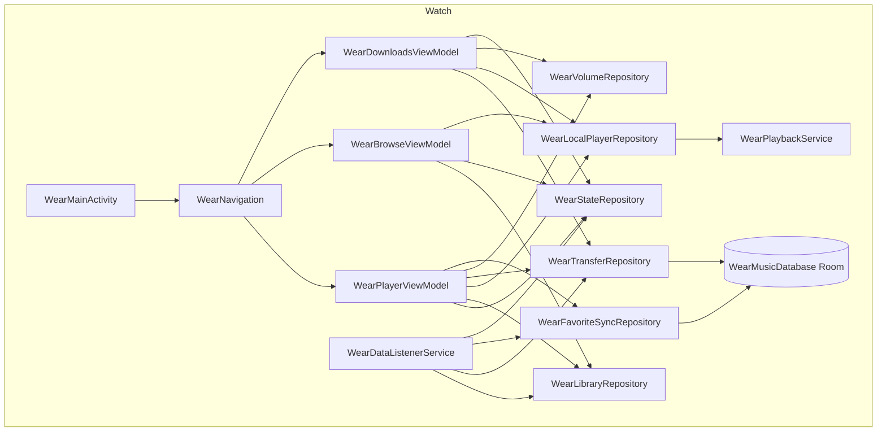
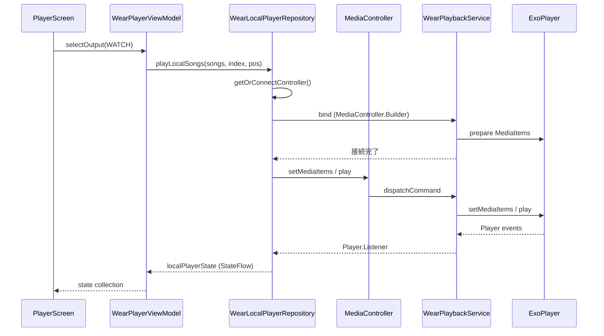

# 09 — Wear OS アプリ (`wear/`)

> **対象ディレクトリ**: `wear/src/main/`
> **パッケージ**: `com.theveloper.pixelplay`
>
> PixelPlayer の Wear OS アプリ全体。phone↔wear IPC、standalone local playback (ExoPlayer + MediaSessionService)、ライブラリ参照、曲転送 (ChannelClient)、お好み同期、Material Compose for Wear UI を統合する。

## ディレクトリ構造

```
wear/src/main/
├── AndroidManifest.xml          # 権限 / サービス / Activity 宣言 (standalone)
├── res/                          # テーマ / フォント / アイコン
└── java/com/theveloper/pixelplay/
    ├── WearApp.kt                # Hilt Application
    ├── di/
    │   └── WearModule.kt         # Wear クライアント + Room の DI 提供
    ├── data/                     # データレイヤ
    │   ├── WearPlaybackService.kt        # MediaSessionService (foreground mediaPlayback)
    │   ├── WearDataListenerService.kt    # WearableListenerService (DataItem / Message / Channel)
    │   ├── WearStateRepository.kt        # phone player state (single source of truth)
    │   ├── WearPlaybackController.kt     # wear → phone コマンド送信
    │   ├── WearLibraryRepository.kt      # ライブラリ参照 request/response
    │   ├── WearTransferRepository.kt     # 曲転送管理 (Channel)
    │   ├── WearFavoriteSyncRepository.kt # お気に入り同期
    │   ├── WearVolumeRepository.kt       # watch 側音量 / MediaRouter
    │   ├── WearLocalPlayerRepository.kt  # standalone local playback (ExoPlayer)
    │   ├── WearLocalQueueState.kt        # ローカルキュー DTO
    │   ├── WearAudioOutputRoute.kt       # 出力ルート DTO
    │   ├── WearDeviceMusicRepository.kt  # MediaStore スキャン
    │   ├── WearLifecycleState.kt         # foreground / ambient StateFlow
    │   └── local/                        # Room (永続化)
    │       ├── WearMusicDatabase.kt
    │       ├── LocalSongDao.kt
    │       └── LocalSongEntity.kt
    └── presentation/             # UI
        ├── WearMainActivity.kt
        ├── WearNavigation.kt    # WearScreens + NavHost
        ├── theme/
        │   ├── WearTheme.kt     # WearPixelPlayTheme / WearPalette / LocalWearPalette
        │   └── WearTitleFonts.kt
        ├── components/          # 共通 Composable
        │   ├── CurvedVolumeIndicator.kt
        │   ├── OutputRouteIcon.kt
        │   ├── PlayingEqIcon.kt
        │   ├── WearIndicators.kt
        │   └── WearTopTimeText.kt
        ├── shapes/
        │   └── RoundedStarShape.kt
        ├── viewmodel/
        │   ├── WearPlayerViewModel.kt       # 統合 player / 出力切替 / スリープタイマー
        │   ├── WearBrowseViewModel.kt       # ライブラリ参照画面用
        │   └── WearDownloadsViewModel.kt    # ダウンロード管理画面用
        └── screens/             # 画面 Composable
            ├── BrowseScreen.kt
            ├── DownloadsScreen.kt
            ├── LibraryListScreen.kt
            ├── MoreScreen.kt
            ├── OutputScreen.kt
            ├── PlayerScreen.kt
            ├── QueueScreen.kt
            ├── SongListScreen.kt
            ├── TimerScreen.kt
            └── VolumeScreen.kt
```

## サブスペック

| ファイル | 内容 |
|----------|------|
| [`app.md`](./app.md) | `WearApp.kt` (Hilt Application) + `AndroidManifest.xml` 全体 |
| [`di.md`](./di.md) | `di/WearModule.kt` (Hilt @Provides) |
| [`data.md`](./data.md) | `data/` 全 Repository / Service / State |
| [`local-db.md`](./local-db.md) | `data/local/` Room (Database / DAO / Entity) |
| [`presentation.md`](./presentation.md) | `presentation/` UI 全体 (Activity / Nav / Theme / ViewModel / Screens / Components) |

## 上位レイヤとの関係

| 依存先 | 用途 |
|--------|------|
| `app/src/main/java/com/theveloper/pixelplay/data/service/MusicService.kt` | phone 側メインサービス (Wear IPC の相手) |
| `shared/src/main/java/com/theveloper/pixelplay/shared/*` | 通信モデル (WearDataPaths, WearPlayerState, …) |

## 下位 (Wear 専用ライブラリ) との関係

| 依存 | 用途 |
|------|------|
| `com.google.android.gms.wearable.*` | DataClient / MessageClient / ChannelClient / NodeClient / WearableListenerService |
| `androidx.media3.*` | ExoPlayer / MediaSession / MediaSessionService / MediaController |
| `androidx.mediarouter.media.*` | MediaRouter / RouteInfo |
| `androidx.wear.compose.*` | MaterialTheme / SwipeDismissableNavHost |
| `com.google.android.horologist.audio.*` | BluetoothSettings / OutputSwitcher |
| `androidx.room.*` | Database / Dao / Entity |
| `dagger.hilt.android.*` | DI |
| `androidx.hilt.navigation.compose.hiltViewModel` | Compose Hilt |

## 概要図

### モジュール間データフロー



### Standalone Local Playback 起動シーケンス


