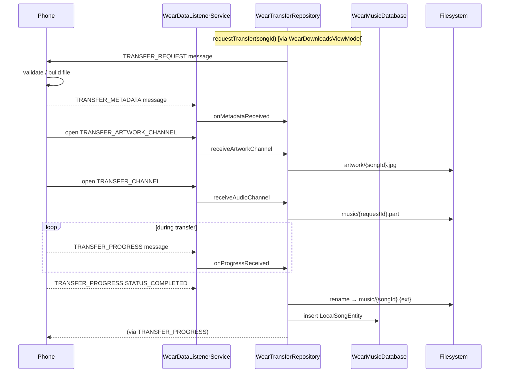
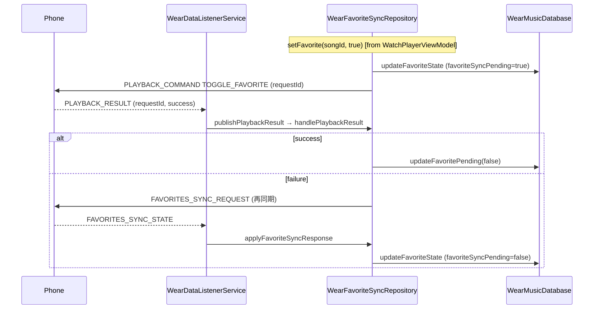

# wear/data — データレイヤ (Service / Repository / State)

> **パッケージ**: `com.theveloper.pixelplay.data`
> **役割**: Wear アプリ全体のデータレイヤ。phone↔wear IPC 受信、standalone local playback 制御、ライブラリ参照、曲転送、お気に入り同期、音量 / 出力ルート管理を担当。

## ファイル一覧

| ファイル | 行数 | 役割 |
|----------|------|------|
| `WearPlaybackService.kt` | 119 | `MediaSessionService` — ExoPlayer + MediaSession を foreground で稼働 |
| `WearDataListenerService.kt` | 370 | `WearableListenerService` — DataItem / Message / Channel 受信 |
| `WearStateRepository.kt` | 108 | phone player state の single source of truth (StateFlow 群) |
| `WearPlaybackController.kt` | 208 | wear → phone への再生 / 音量コマンド送信 |
| `WearLibraryRepository.kt` | 153 | ライブラリ参照 request/response + 2 分 TTL キャッシュ |
| `WearTransferRepository.kt` | 1090 | 曲転送管理 (Channel 経由 audio + artwork) |
| `WearFavoriteSyncRepository.kt` | 265 | お気に入り双方向同期 |
| `WearVolumeRepository.kt` | 431 | watch 側 STREAM_MUSIC 音量 + MediaRouter 出力ルート |
| `WearLocalPlayerRepository.kt` | 928 | standalone local playback (MediaController 経由) |
| `WearLocalQueueState.kt` | 8 | ローカルキュー DTO |
| `WearAudioOutputRoute.kt` | 24 | 出力ルート DTO |
| `WearDeviceMusicRepository.kt` | 75 | MediaStore 楽曲スキャン |
| `WearLifecycleState.kt` | 45 | foreground / ambient StateFlow |
| `local/WearMusicDatabase.kt` | 42 | Room データベース (version 5) |
| `local/LocalSongDao.kt` | 54 | DAO |
| `local/LocalSongEntity.kt` | 29 | `@Entity(tableName = "local_songs")` |

---

## WearPlaybackService.kt

**パッケージ**: `com.theveloper.pixelplay.data`
**役割**: standalone local playback 用 `MediaSessionService`。Wear OS が background プロセスを reaping するのを防ぐため、ExoPlayer + MediaSession を foreground `mediaPlayback` サービスに常駐させる。

### 公開 API

| 名前 | 種類 | 説明 |
|------|------|------|
| `WearPlaybackService` | class : `MediaSessionService` | foreground サービス本体 |
| `onCreate()` | `override fun` | ExoPlayer 構築 + MediaSession 作成 |
| `onGetSession(controllerInfo)` | `override fun` | `mediaSession` を返却 |
| `onTaskRemoved(rootIntent)` | `override fun` | 再生中でなければ `stopSelf()` |
| `onDestroy()` | `override fun` | MediaSession / Player を release |

### 内部実装メモ

- ExoPlayer 設定:
  - `AudioAttributes(USAGE_MEDIA, AUDIO_CONTENT_TYPE_MUSIC)` + `handleAudioFocus = true`
  - `setHandleAudioBecomingNoisy(true)` — ヘッドセット抜け検知
  - `setWakeMode(C.WAKE_MODE_LOCAL)` — 画面オフ時の CPU wake
- `MediaSession`: ID = `"wear-local-playback"`、launch Intent を `setSessionActivity()` に登録。
- `MediaItemUriRestoringCallback` (private class): `onAddMediaItems` で `MediaController` が binder 越しに `localConfiguration` を剥がすため、`requestMetadata.mediaUri` から復元。
- `onTaskRemoved` で再生中なら `stopSelf()` を呼ばず、停止中なら即 `stopSelf()`。
- `buildOpenAppIntent()`: `packageManager.getLaunchIntentForPackage(packageName)` を PendingIntent に変換。

### 呼び出し元 (使用者)

- `WearLocalPlayerRepository.getOrConnectController()` — `SessionToken(application, ComponentName(application, WearPlaybackService::class.java))` 経由で `MediaController` を bind

### 関連ファイル

- `wear/src/main/AndroidManifest.xml` — `<service android:foregroundServiceType="mediaPlayback">`
- `../04-engine/music-service.md` — phone 側 `MusicService` との対比

---

## WearDataListenerService.kt

**パッケージ**: `com.theveloper.pixelplay.data`
**役割**: `WearableListenerService`。`/player_state` データアイテム、メッセージ、Channel を受信して各 Repository に委譲。

### 公開 API

| 名前 | 種類 | 説明 |
|------|------|------|
| `WearDataListenerService` | class : `WearableListenerService`, `@AndroidEntryPoint` | 受信サービス本体 |
| `onDataChanged(dataEvents)` | `override fun` | DataItem 受信。`/player_state` を `processPlayerStateUpdate` に委譲 |
| `onMessageReceived(messageEvent)` | `override fun` | Message 受信。path 別で `libraryRepository` / `transferRepository` / `stateRepository` / `favoriteSyncRepository` を呼び分け |
| `onChannelOpened(channel)` | `override fun` | Channel 受信。`/transfer_audio` / `/transfer_artwork` を `transferRepository` に委譲 |
| `onDestroy()` | `override fun` | scope cancel |

### 注入される依存 (lateinit var)

- `stateRepository: WearStateRepository`
- `libraryRepository: WearLibraryRepository`
- `transferRepository: WearTransferRepository`
- `favoriteSyncRepository: WearFavoriteSyncRepository`

### 受信する path 一覧

| Path | 種別 | 委譲先 |
|------|------|--------|
| `/player_state` | DataItem | `processPlayerStateUpdate` (内部) |
| `/browse_response` | Message | `libraryRepository.onBrowseResponseReceived` |
| `/transfer_metadata` | Message | `transferRepository.onMetadataReceived` |
| `/transfer_progress` | Message | `transferRepository.onProgressReceived` |
| `/playback_result` | Message | `stateRepository.publishPlaybackResult` |
| `/favorites_sync_state` | Message | `favoriteSyncRepository.applyFavoriteSyncResponse` |
| `/transfer_request` | Message | `transferRepository.requestTransfer` (phone → wear からのミラー) |
| `/transfer_cancel` | Message | `transferRepository.cancelTransfer` (notifyPhone=false) |
| `/watch_library_query` | Message | `transferRepository.publishLibraryState` |
| `/volume_state` | Message | `stateRepository.updateVolumeState` |
| `/transfer_audio` | Channel | `transferRepository.receiveAudioChannel` |
| `/transfer_artwork` | Channel | `transferRepository.receiveArtworkChannel` |

### 内部 private 関数

| 名前 | 役割 |
|------|------|
| `processPlayerStateUpdate(dataMap)` | `KEY_STATE_JSON` を取り出し `WearPlayerState` にデコード、`withTransportLatencyApplied` で位置補正後に `stateRepository.updatePlayerState` + `KEY_ALBUM_ART` の Asset をデコードして `updateAlbumArt` |
| `WearPlayerState.withTransportLatencyApplied(dataMap)` | `phonePublishedAtMs` と現在時刻の差分を加算し transport latency 補正 |
| `maybeAutoLaunchPlayer(playerState)` | 再生開始 / 曲変更 / 7 秒 idle 経過時に `WearMainActivity` を `Intent.FLAG_ACTIVITY_NEW_TASK` 起動 (cooldown 2.5 秒) |
| `WearPlayerState.playerIdentity()` | 曲識別子 (songId or "title|artist") |

### 内部実装メモ

- シングルトン `json = Json { ignoreUnknownKeys = true }`。
- スコープ: `CoroutineScope(SupervisorJob() + Dispatchers.IO)`。
- Auto-launch cooldown: `AUTO_LAUNCH_COOLDOWN_MS = 2_500L` / keep-alive `7_000L`。
- Album Art: `Wearable.getDataClient(this).getFdForAsset(asset).await()` → `BitmapFactory.decodeStream(inputStream)`。

### 関連ファイル

- `shared/src/main/java/com/theveloper/pixelplay/shared/WearDataPaths.kt` — path 定義
- `app/src/main/AndroidManifest.xml` — `<service>` 登録

---

## WearStateRepository.kt

**パッケージ**: `com.theveloper.pixelplay.data`
**役割**: phone player state 受信後のアプリ内シングルソース・オブ・トゥルース。`StateFlow` 群で全 UI / ViewModel に公開。

### 公開 enum

| 名前 | 値 |
|------|-----|
| `WearOutputTarget` | `PHONE`, `WATCH` |

### 公開 API

| 名前 | 種類 | 説明 |
|------|------|------|
| `WearStateRepository` | class, `@Singleton @Inject constructor()` | 状態管理 |

### 公開 StateFlow プロパティ

| プロパティ | 型 | 初期値 | 用途 |
|-----------|----|--------|------|
| `playerState` | `StateFlow<WearPlayerState>` | `WearPlayerState()` | phone からの最新 player state |
| `albumArt` | `StateFlow<Bitmap?>` | `null` | 受信したアートワーク Bitmap |
| `isPhoneConnected` | `StateFlow<Boolean>` | `false` | 接続状態 |
| `phoneDeviceName` | `StateFlow<String>` | `"Phone"` | 接続先 phone の表示名 |
| `outputTarget` | `StateFlow<WearOutputTarget>` | `PHONE` | ユーザー選択出力先 (phone / watch) |
| `volumeState` | `StateFlow<WearVolumeState>` | `WearVolumeState()` | 音量 (phone 側基準) |
| `playbackResults` | `SharedFlow<WearPlaybackResult>` (extraBufferCapacity=8) | — | コマンド結果ストリーム |

### 更新 API (public fun)

| 名前 | シグネチャ | 目的 |
|------|-----------|------|
| `updatePlayerState` | `(state: WearPlayerState)` | 状態更新。`positionUpdatedElapsedRealtimeMs = SystemClock.elapsedRealtime()` を自動付与。`volumeMax > 0` なら `updateVolumeState` も連動 |
| `updateAlbumArt` | `(bitmap: Bitmap?)` | アート更新 |
| `setPhoneConnected` | `(connected: Boolean)` | 接続フラグ |
| `setPhoneDeviceName` | `(name: String)` | 空文字以外のみ更新 |
| `setOutputTarget` | `(target: WearOutputTarget)` | 出力先切替 |
| `publishPlaybackResult` | `(result: WearPlaybackResult)` | 結果イベント発行 |
| `updateVolumeState` | `(level, max, routeType, routeName)` | 音量状態更新。level を `[0, max]` にクランプ |
| `nudgePhoneVolumeLevel` | `(delta: Int)` | 現音量に `delta` を加算してクランプ (max=0 なら no-op) |

### 内部実装メモ

- すべて `_xxx: MutableStateFlow` を `asStateFlow()` で公開。
- `updatePlayerState` は `volumeMax > 0` のとき暗黙的に `updateVolumeState` を呼び、route 情報は既存値を維持。
- `positionUpdatedElapsedRealtimeMs` は wear 側で受信時に上書きされ、UI 表示時の「現在位置」計算の基準時刻になる。

### 関連ファイル

- `shared/src/main/java/com/theveloper/pixelplay/shared/WearPlayerState.kt`
- `shared/src/main/java/com/theveloper/pixelplay/shared/WearVolumeState.kt`

---

## WearPlaybackController.kt

**パッケージ**: `com.theveloper.pixelplay.data`
**役割**: wear → phone への再生 / 音量 / スリープタイマーコマンドを MessageClient で送信。

### 公開 API

| 名前 | シグネチャ | 目的 |
|------|-----------|------|
| `sendCommand` | `(command: WearPlaybackCommand)` | 任意の playback command 送信 (path = `/playback_command`) |
| `sendVolumeCommand` | `(command: WearVolumeCommand)` | 音量 command 送信 (path = `/volume_command`) |
| `play` / `pause` / `togglePlayPause` | `()` | 簡易メソッド |
| `next` / `previous` | `()` | 曲送り / 戻し |
| `toggleFavorite` | `(songId, targetEnabled, requestId)` | お気に入りトグル |
| `toggleShuffle` | `(targetEnabled)` | シャッフル |
| `cycleRepeat` | `()` | リピートサイクル |
| `volumeUp` / `volumeDown` | `()` | 音量 +-1 |
| `setPhoneVolume` | `(percent: Int)` | 絶対値設定 (0-100) |
| `requestPhoneVolumeState` | `()` | phone 側音量状態を要求 (path = `/volume_command` with `QUERY`) |
| `playFromContext` | `(songId, contextType, contextId)` | コンテキスト内再生 |
| `playItemAwaitDispatch` | `(songId, requestId): Boolean (suspend)` | 結果待ち再生 (await) |
| `playNextFromContext` / `addToQueueFromContext` | `(songId, contextType, contextId)` | キュー操作 |
| `playQueueIndex` | `(index: Int)` | キュー index 指定 |
| `setSleepTimerDuration` | `(durationMinutes: Int)` | スリープタイマー設定 |
| `setSleepTimerEndOfTrack` | `(enabled: Boolean = true)` | 曲終でスリープ |
| `cancelSleepTimer` | `()` | スリープタイマー解除 |

### 内部実装メモ

- private `sendMessageToPhone(path, data): Boolean` (suspend) で:
  - `nodeClient.connectedNodes.await()` を取得
  - 接続ノード 0 なら `setPhoneConnected(false)` + `false` 返却
  - 1 件目を `setPhoneDeviceName` に登録
  - 全ノードに `messageClient.sendMessage(node.id, path, data).await()` (どれか 1 件成功で `delivered = true`)
  - 失敗時は `setPhoneConnected(false)`
- `json = Json { ignoreUnknownKeys = true }`
- スコープ: `CoroutineScope(SupervisorJob() + Dispatchers.IO)`

### 呼び出し元

- `WearPlayerViewModel` — toggle / play / next / volume など
- `WearBrowseViewModel` — `playFromContext`, `playNextFromContext`, etc.
- `WearDownloadsViewModel` — `playItemAwaitDispatch` (phone 上で再生を試みる)
- `WearTransferRepository` — `pause` (一時再生後に phone を pause)

---

## WearLibraryRepository.kt

**パッケージ**: `com.theveloper.pixelplay.data`
**役割**: phone 側ライブラリへの参照を request/response パターンで実装。`CompletableDeferred` で相関。

### 公開 API

| 名前 | シグネチャ | 目的 |
|------|-----------|------|
| `browse` | `suspend (browseType: String, contextId: String? = null): WearBrowseResponse` | ライブラリ参照。`QUEUE` 以外キャッシュあり (2 分 TTL)。`connectedNodes` 0 件で `error = "Phone not connected"` 返却 |
| `onBrowseResponseReceived` | `(response: WearBrowseResponse)` | `DataListenerService` から呼び出し。`pendingRequests[requestId]` を完了 |
| `invalidateCache` | `()` | キャッシュ全消去 |

### 内部実装メモ

- `CACHE_TTL_MS = 120_000L` (2 分)
- `REQUEST_TIMEOUT_MS = 10_000L`
- キャッシュキー: `"$browseType:${contextId.orEmpty()}"`
- メッセージ path: `WearDataPaths.BROWSE_REQUEST`
- 接続ノード全件に送信 (通常 1 件)
- タイムアウト時は `error = "Request timed out"`

### 関連ファイル

- `shared/src/main/java/com/theveloper/pixelplay/shared/WearBrowseRequest.kt` — 入力
- `shared/src/main/java/com/theveloper/pixelplay/shared/WearBrowseResponse.kt` — 出力

---

## WearTransferRepository.kt

**パッケージ**: `com.theveloper.pixelplay.data`
**役割**: phone → wear 曲転送 (audio + artwork) を Channel 経由で受信し、ローカルファイル + Room に永続化。

### 公開 DTO

| 名前 | フィールド | 派生 |
|------|-----------|------|
| `TransferState` | `requestId`, `songId`, `songTitle`, `bytesTransferred`, `totalBytes`, `status`, `error?` | `progress = bytes / total` (Float, total=0 なら 0) |

### 公開 StateFlow

| 名前 | 型 | 説明 |
|------|----|------|
| `activeTransfers` | `StateFlow<Map<String, TransferState>>` | 進行中転送 (requestId → state) |

### 公開 Flow

| 名前 | 型 | 説明 |
|------|----|------|
| `localSongs` | `Flow<List<LocalSongEntity>>` | ファイルが有効な曲のみ。stale (file なし) は DB から自動削除 |
| `downloadedSongIds` | `Flow<Set<String>>` | ダウンロード済曲 ID セット |

### 公開 API (public fun)

| 名前 | シグネチャ | 目的 |
|------|-----------|------|
| `requestTransfer` | `(songId, requestId = UUID, targetNodeId?, transferMode, startPositionMs, autoPlay)` | phone に転送要求送信 |
| `requestTemporaryPlayback` | `(songId, startPositionMs, autoPlay, pausePhoneAfterStart)` | 一時再生モードで要求 |
| `onMetadataReceived` | `suspend (metadata, sourceNodeId?)` | phone からの `WearTransferMetadata` 受信処理 |
| `onProgressReceived` | `(progress: WearTransferProgress)` | 進捗更新 |
| `receiveAudioChannel` | `(channel: ChannelClient.Channel)` | `/transfer_audio` 受信 → `onAudioChannelOpened` |
| `receiveArtworkChannel` | `(channel: ChannelClient.Channel)` | `/transfer_artwork` 受信 |
| `onArtworkReceived` | `suspend (requestId, songId, artworkBytes)` | artwork バイト列受信 (DB row あれば即永続化、なければキャッシュ) |
| `deleteSong` | `suspend (songId): Result<Unit>` | ファイル + Room エントリ削除 |
| `getStorageUsed` | `suspend (): Long` | DB から `SUM(fileSize)` 取得 |
| `cancelTransfer` | `(requestId, notifyPhone = true)` | キャンセル (phone にも通知) |
| `publishLibraryState` | `suspend (targetNodeId?, songIds?)` | 現在の曲 ID リストを phone に送信 |

### 内部 private 関数 (主要)

| 名前 | 役割 |
|------|------|
| `onAudioChannelOpened(requestId, inputStream)` | 8KB バッファで stream 読み出し、`{requestId}.part` temp に書き出し。完了後 `MODE_TEMPORARY_PLAYBACK` なら cache、`MODE_SAVE_TO_LIBRARY` なら `musicDir/{songId}.{ext}` に rename → Room insert |
| `notifyPhoneTransferFailure(targetNodeId?, requestId, songId, message)` | phone 側へ `STATUS_FAILED` 通知 |
| `awaitMetadata(requestId)` | `pendingMetadata` ポーリング (8s timeout) |
| `armTransferWatchdog(requestId, songId)` | 120 秒タイムアウトの watchdog Job |
| `clearTransferWatchdog(requestId)` | watchdog cancel |
| `resolveTemporaryPlaybackStartPosition(...)` | 一時再生の開始位置を elapsed realtime で補正 |
| `consumeAndPersistPendingArtwork(requestId, artworkKey)` | artwork バイトを `artwork/{key}.jpg` に保存 |
| `persistArtwork(songId, bytes)` | `artwork/{songId}.jpg` 書き込み |
| `readLengthPrefixedString(input, label)` | 4byte length + UTF-8 文字列の読み出し |
| `InputStream.readBytesSafely()` | 8KB chunk で `ByteArrayOutputStream` に集約 |
| `cleanupReplacedSongFiles(previous, currentAudioPath, currentArtworkPath?)` | 旧ファイル / artwork 削除 |
| `rememberCancelledRequest(requestId)` | 5 分間 cancel 状態を保持 (late event 抑止) |
| `cleanupCancelledTransfer(requestId, songId?)` | cancel 時の後始末 |
| `handleTransferError(requestId, songId, message)` | 失敗を State に反映 + リソース解放 |
| `LocalSongEntity.hasPlayableLocalFile()` | 拡張プロパティ: ファイル存在 & サイズ > 0 |

### 内部実装メモ

- DB ストレージ: `application.filesDir/music` (audio) / `application.cacheDir/temporary_playback` (一時) / `application.filesDir/artwork` (artwork)
- 拡張子: `MimeTypeMap.getSingleton().getExtensionFromMimeType(mimeType) ?: "mp3"`
- 進行中フラグ: `songToRequestId` (songId → requestId), `pendingMetadata`, `pendingArtworkByRequestId`, `activeChannelRequestIds`, `cancelledRequestIds`, `pendingTemporaryPlaybackRequests`
- Watchdog: `TRANSFER_IDLE_TIMEOUT_MS = 120_000L`, `WATCHDOG_TOUCH_INTERVAL_MS = 1_500L`
- Local 進捗更新: `LOCAL_PROGRESS_UPDATE_INTERVAL_BYTES = 65_536L`
- 一時再生: 開始時に `localPlayerRepository.playTemporarySong(...)` を呼び、`outputTarget = WATCH` に切替、必要なら phone 側を pause

### 呼び出し元

- `WearDataListenerService.onMessageReceived` — TRANSFER_METADATA, TRANSFER_PROGRESS, TRANSFER_REQUEST, TRANSFER_CANCEL, WATCH_LIBRARY_QUERY
- `WearDataListenerService.onChannelOpened` — TRANSFER_CHANNEL, TRANSFER_ARTWORK_CHANNEL
- `WearDownloadsViewModel` — requestTransfer, cancelTransfer, deleteSong
- `WearPlayerViewModel.selectOutput(WATCH)` — `requestTemporaryPlayback`

---

## WearFavoriteSyncRepository.kt

**パッケージ**: `com.theveloper.pixelplay.data`
**役割**: お気に入り状態の双方向同期。

### 公開 API

| 名前 | シグネチャ | 目的 |
|------|-----------|------|
| `setFavorite` | `(songId, isFavorite)` | ローカル DB を更新 + phone に `TOGGLE_FAVORITE` コマンド送信 (失敗時は再接続 watcher 起動) |
| `requestFavoriteSync` | `(songIds: Collection<String> = emptyList())` | 同期要求送信 (空なら DB 全曲) |
| `applyFavoriteSyncResponse` | `suspend (response: WearFavoriteSyncResponse)` | phone からの応答反映。`favoriteSyncPending` のものは上書きしない |

### 内部 private 関数 (主要)

| 名前 | 役割 |
|------|------|
| `flushPendingFavoriteChanges` | 接続時、未送信のお気に入り変更を一括送信 |
| `dispatchFavoriteUpdate` | 単曲の TOGGLE_FAVORITE コマンド送信 (requestId = UUID) |
| `confirmStateSoon` | 1.2s 後に `favoriteSyncPending` のままなら再同期要求 |
| `sendFavoriteSyncRequest` | `WEAR_FAVORITES_SYNC_REQUEST` メッセージ送信 |
| `ensureReconnectWatcher` | 2.5s 間隔で polling し接続回復時に `flushPendingFavoriteChanges` |
| `handlePlaybackResult` | 結果ストリーム監視。TOGGLE_FAVORITE の requestId を `inFlightFavoriteUpdates` から取得し、`success` で `favoriteSyncPending=false`、失敗なら再同期要求 |
| `getConnectedNodeId` | `nodeClient.connectedNodes.await().firstOrNull()?.id` |

### 内部実装メモ

- `inFlightFavoriteUpdates: ConcurrentHashMap<String, String>` — requestId → songId
- `POST_SEND_CONFIRM_DELAY_MS = 1_200L`
- `RECONNECT_POLL_INTERVAL_MS = 2_500L`
- phone からの応答時、`favoriteSyncPending=true` かつ期待値と一致しないものは上書きしない (ローカルの意図を尊重)

### 呼び出し元

- `WearDataListenerService.onMessageReceived` — FAVORITES_SYNC_STATE
- `WearPlayerViewModel.toggleFavorite` / `refreshCurrentSongFavoriteState`
- `init` — `stateRepository.isPhoneConnected` / `localSongDao.getAllSongIds` / `stateRepository.playbackResults` を `collect`

---

## WearVolumeRepository.kt

**パッケージ**: `com.theveloper.pixelplay.data`
**役割**: watch 側 `STREAM_MUSIC` 音量制御 + `MediaRouter` ベースの出力ルート管理。

### 公開 API

| 名前 | シグネチャ | 目的 |
|------|-----------|------|
| `refreshWatchVolumeState` | `()` | `syncWatchAudioState()` を即時実行 |
| `volumeUpOnWatch` | `()` | `AudioManager.adjustStreamVolume(STREAM_MUSIC, ADJUST_RAISE, 0)` |
| `volumeDownOnWatch` | `()` | ADJUST_LOWER |
| `setWatchVolume` | `(level: Int)` | 絶対値設定 (`[0, max]` クランプ) |
| `selectWatchAudioRoute` | `(routeId: String)` | ルート選択 (無ければシステムピッカーを起動) |
| `launchWatchAudioOutputPicker` | `(closeOnConnect: Boolean = true)` | システムメディア出力切替 UI / Bluetooth 設定起動 (Horologist) |
| `setWatchRouteDiscoveryEnabled` | `(enabled: Boolean)` | MediaRouter コールバックに `CALLBACK_FLAG_REQUEST_DISCOVERY` を付与 |

### 公開 StateFlow

| プロパティ | 型 | 初期値 | 用途 |
|-----------|----|--------|------|
| `watchVolumeState` | `StateFlow<WearVolumeState>` | `readFallbackVolumeState()` | watch 音量 + ルート |
| `watchAudioRoutes` | `StateFlow<List<WearAudioOutputRoute>>` | `emptyList()` | 利用可能ルート一覧 |

### 内部 private 関数 / 拡張

| 名前 | 役割 |
|------|------|
| `routeCallback` (MediaRouter.Callback) | 追加 / 削除 / 変更 / 接続 / 切断 / 音量変更で `syncWatchAudioState()` |
| `syncWatchAudioState` | MediaRouter ルート列挙、`toWearAudioOutputRoute` で変換、active 判定 (Speaker / Bluetooth)、音量読み取り |
| `readFallbackVolumeState` | 初期値 (route = "Watch speaker") |
| `registerRouteCallback` | `addCallback(watchRouteSelector, ...)` (discovery 有効時フラグ付与) |
| `MediaRouter.RouteInfo.isWatchAudioRoute()` | システムルート かつ Bluetooth / スピーカーのみ |
| `MediaRouter.RouteInfo.toWearAudioOutputRoute(...)` | `WearAudioOutputRoute` へ変換 |
| `List<MediaRouter.RouteInfo>.resolveActiveRouteId(...)` | `AudioManager.findActiveMediaOutput(mediaAudioAttributes)` でアクティブ判定 |
| `AudioManager.findActiveMediaOutput(...)` | API 33+ は `getAudioDevicesForAttributes`、それ以外は `isBluetoothA2dpOn` / `getDevices` 経由 |
| `AudioManager.findMatchingBluetoothOutput(routeName)` | route 名から AudioDeviceInfo 解決 |
| `namesLikelyReferToSameDevice(first, second)` | 大文字小文字無視の完全一致 |
| `resolveBluetoothRouteType(audioDevice, deviceName)` | BLE_HEADSET/SCO → HEADPHONES、LE_SPEAKER/BROADCAST → BLUETOOTH、それ以外は `looksLikeBluetoothHeadphones` で名前ヒント判定 |
| `looksLikeBluetoothHeadphones(deviceName)` | "airpods", "buds", "headphone" 等多数のヒントワード |

### 内部実装メモ

- MediaRouter コールバック: `addCallback` → `removeCallback` で再登録
- ルート名: Bluetooth はデバイス名、スピーカーは "Watch speaker"
- アクティブ判定優先順: API 33+ アクティブ出力 → 選択中ルート → スピーカー → Bluetooth 選択中 → Bluetooth 全て

### 呼び出し元

- `WearPlayerViewModel` — volumeUp / volumeDown / setActiveVolume / refreshActiveVolumeState

---

## WearLocalPlayerRepository.kt

**パッケージ**: `com.theveloper.pixelplay.data`
**役割**: standalone local playback を `MediaController` 経由で制御。`WearPlaybackService` の ExoPlayer に bind。

### 公開 DTO

| 名前 | フィールド | 派生 |
|------|-----------|------|
| `WearLocalPlayerState` | `songId`, `songTitle`, `artistName`, `albumName`, `isPlaying`, `currentPositionMs`, `totalDurationMs`, `isFavorite`, `canToggleFavorite`, `isShuffleEnabled`, `repeatMode` | `isEmpty = songId.isEmpty()` |
| `WearQueueSong` | `songId`, `title`, `artist`, `album`, `uri` | — |

### 公開 StateFlow

| プロパティ | 型 | 用途 |
|-----------|----|------|
| `localPlayerState` | `StateFlow<WearLocalPlayerState>` | 現在再生中の曲情報 |
| `isLocalPlaybackActive` | `StateFlow<Boolean>` | アクティブフラグ |
| `localPaletteSeedArgb` | `StateFlow<Int?>` | パレット seed 色 |
| `localThemePalette` | `StateFlow<WearThemePalette?>` | テーマパレット |
| `localAlbumArt` | `StateFlow<Bitmap?>` | アートワーク |
| `localQueueState` | `StateFlow<WearLocalQueueState>` | キュー状態 |

### 公開 API

| 名前 | シグネチャ | 目的 |
|------|-----------|------|
| `playLocalSongs` | `(songs: List<LocalSongEntity>, startIndex, startPositionMs, autoPlay)` | Room から曲を読み込みローカル再生 |
| `playUriSongs` | `(songs: List<WearQueueSong>, startIndex, startPositionMs, autoPlay)` | MediaStore URI 直接再生 |
| `playTemporarySong` | `(song: LocalSongEntity, startPositionMs, autoPlay, cleanupPaths)` | 一時再生 (cache 削除予約) |
| `play` | `()` | 再生 |
| `pause` | `()` | 一時停止 |
| `togglePlayPause` | `()` | トグル |
| `next` | `()` | 次へ (`hasNextMediaItem` 確認) |
| `previous` | `()` | 前へ |
| `seekTo` | `(positionMs: Long)` | シーク |
| `toggleShuffle` | `()` | シャッフルトグル |
| `cycleRepeat` | `()` | リピートサイクル (OFF → ONE → ALL → OFF) |
| `playQueueIndex` | `(index: Int)` | キュー index 指定再生 |
| `removeSongFromActiveQueue` | `suspend (songId)` | キューから削除 (1 件なら `release()`) |
| `release` | `()` | サービス停止 + 全 StateFlow リセット |

### 内部 private 関数 (主要)

| 名前 | 役割 |
|------|------|
| `getOrConnectController` | suspend。`SessionToken(WearPlaybackService)` で `MediaController.Builder.buildAsync()` を接続。`addListener(playerListener)` |
| `startPlayback(queueSongs, queueSongIdToLocal, startIndex, startPositionMs, autoPlay, transientSongIds, transientCleanupPaths)` | MediaItems 構築 → `setMediaItems` → `prepare` → `playWhenReady` / `play` / `pause` |
| `playerListener` (Player.Listener) | `onPlaybackStateChanged`, `onIsPlayingChanged`, `onMediaItemTransition` で `updateState` |
| `updateState` | `mediaController.currentMediaItem` から `WearLocalPlayerState` を組み立て |
| `startPositionUpdates` / `stopPositionUpdates` | 1 秒間隔で `updateState` (UI 非インタラクティブ時はスキップ) |
| `updateQueueState(currentIndex?)` | キュー可視化 (現在 + 次の N 件) |
| `buildVisibleQueueIndices(player, currentIndex)` | timeline から現在→次の順で列挙 |
| `updatePaletteForSong(songId)` | キャッシュ済み `themePaletteJson` (デコード) または `paletteSeedArgb`、なければ `extractSeedFromLocalSong` / `extractSeedFromUri` で抽出 |
| `updateArtworkForSong(songId)` | キャッシュ → ファイル → MediaMetadataRetriever embedded picture の順で取得 |
| `loadLocalAlbumArtBitmap` | artworkPath → MediaMetadataRetriever フォールバック |
| `decodeBoundedBitmapFromFile` / `decodeBoundedBitmapFromBytes` | 1024px 上限で inSampleSize 自動算出 |
| `extractSeedFromLocalSong` / `extractSeedFromUri` | MediaMetadataRetriever で embedded picture 取得 → `extractSeedColorArgb` で 24 ステップサンプリング平均 |
| `extractSeedColorArgb(bitmap)` | `step = min(w,h)/24` で RGB 平均 (alpha ≥ 28 かつ RGB 和 > 36 のピクセルのみ) |
| `clearTransientPlaybackArtifacts` | 一時再生のキャッシュファイル削除 |

### 内部実装メモ

- 内部状態: `currentQueueSongIds`, `currentQueueSongsById`, `currentQueueItemsById`, `lastPaletteSongId`, `lastArtworkSongId`, `transientSongIds`, `transientCleanupPaths`
- `POSITION_UPDATE_INTERVAL_MS = 1000L`
- UI インタラクティブ判定: `WearLifecycleState.isInteractiveNow` を見て `updateState` をスキップ
- `canToggleFavorite = currentLocalSong != null && currentItem.mediaId !in transientSongIds` (一時再生中は false)
- MediaItem 構築で `requestMetadata.mediaUri` に URI を stash (binder 越えで `localConfiguration` が剥がれる対策)

### 呼び出し元

- `WearPlayerViewModel` — play/pause/next/previous/togglePlayPause/seekTo/toggleShuffle/cycleRepeat/playLocalQueueIndex/removeSongFromActiveQueue/stopLocalPlayback

---

## WearLocalQueueState.kt

**パッケージ**: `com.theveloper.pixelplay.data`
**役割**: ローカル再生キューの DTO。

### 公開 API

| 名前 | 種類 | フィールド |
|------|------|-----------|
| `WearLocalQueueState` | data class | `items: List<WearLibraryItem> = emptyList()`, `currentIndex: Int = -1` |

### 関連ファイル

- `WearLocalPlayerRepository.updateQueueState` で生成

---

## WearAudioOutputRoute.kt

**パッケージ**: `com.theveloper.pixelplay.data`
**役割**: 出力ルート DTO。

### 公開 API

| 名前 | 種類 | フィールド |
|------|------|-----------|
| `WearAudioOutputRoute` | data class | `id`, `name`, `routeType`, `connectionState`, `isSelected`, `isActive` |

### 派生プロパティ

| 名前 | 種類 | 値 |
|------|------|-----|
| `isConnecting` | `Boolean` | `connectionState == CONNECTION_STATE_CONNECTING` |
| `isConnected` | `Boolean` | `routeType == ROUTE_TYPE_WATCH || connectionState == CONNECTED` |
| `isBluetooth` | `Boolean` | `routeType == ROUTE_TYPE_BLUETOOTH || routeType == ROUTE_TYPE_HEADPHONES` |

### 関連ファイル

- `WearVolumeRepository.toWearAudioOutputRoute` で生成

---

## WearDeviceMusicRepository.kt

**パッケージ**: `com.theveloper.pixelplay.data`
**役割**: watch 内 MediaStore (`MediaStore.Audio.Media.EXTERNAL_CONTENT_URI`) をスキャンし `WearDeviceSong` リストを返す。

### 公開 DTO

| 名前 | 種類 | フィールド |
|------|------|-----------|
| `WearDeviceSong` | data class | `songId = "device:$id"`, `title`, `artist`, `album`, `durationMs`, `contentUri: Uri` |

### 公開 API

| 名前 | シグネチャ | 目的 |
|------|-----------|------|
| `scanDeviceSongs` | `suspend (): List<WearDeviceSong>` | `Dispatchers.IO` で MediaStore クエリ。`IS_MUSIC != 0 AND DURATION > 0` でフィルタ、タイトル昇順 |

### 内部実装メモ

- 必須パーミッション: `READ_MEDIA_AUDIO` (API 33+) / `READ_EXTERNAL_STORAGE` (API ≤ 32)
- `songId` 形式: `"device:{MediaStore.Audio.Media._ID}"`

### 呼び出し元

- `WearDownloadsViewModel.refreshDeviceLibrary`

---

## WearLifecycleState.kt

**パッケージ**: `com.theveloper.pixelplay.data`
**役割**: Activity の foreground / ambient 状態管理 (object)。

### 公開 StateFlow

| 名前 | 型 | 用途 |
|------|----|------|
| `isForeground` | `StateFlow<Boolean>` | `WearMainActivity.onStart/Stop` で更新 |
| `isAmbient` | `StateFlow<Boolean>` | `AmbientLifecycleObserver` で更新 |
| `isInteractive` | `Flow<Boolean>` | `isForeground && !isAmbient` (distinctUntilChanged) |

### 公開 API

| 名前 | シグネチャ | 目的 |
|------|-----------|------|
| `isInteractiveNow` | `Boolean` (snapshot) | suspending でない場所から `isInteractive` を即時取得 |
| `setForeground(value)` | `(Boolean)` | foreground 設定 |
| `setAmbient(value)` | `(Boolean)` | ambient 設定 |

### 内部実装メモ

- `staticCompositionLocalOf` ではなく `object` 直下の `MutableStateFlow` (Hilt 不要)
- バッテリー消費を抑えるため、ポーリング / アニメーションは `isInteractive` を見る

### 呼び出し元

- `WearMainActivity.onStart/onStop` (setForeground)
- `WearMainActivity` ambientCallback (setAmbient)
- `WearLocalPlayerRepository.startPositionUpdates` (isInteractiveNow)
- `WearPlayerViewModel.init` (isInteractive)

---

## Mermaid: 曲転送シーケンス

---

## Mermaid: お気に入り同期

