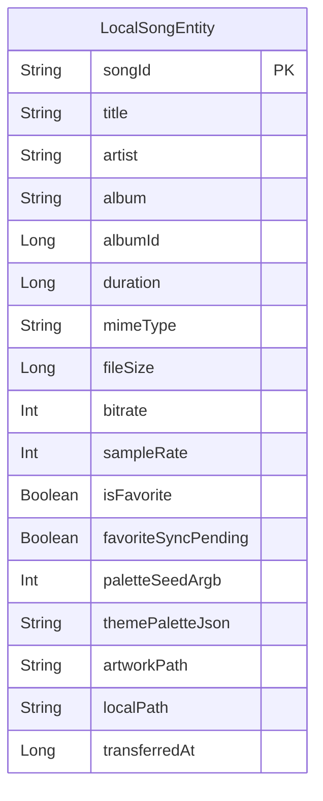

# wear/data/local — Room (永続化)

> **パッケージ**: `com.theveloper.pixelplay.data.local`
> **役割**: phone から転送され watch に永続化された楽曲の Room データベース (version 5)。

## ファイル一覧

| ファイル | 行数 | 役割 |
|----------|------|------|
| `WearMusicDatabase.kt` | 42 | `RoomDatabase` 抽象クラス (version 5) + 4 件のマイグレーション |
| `LocalSongDao.kt` | 54 | DAO (Flow + suspend 混在) |
| `LocalSongEntity.kt` | 29 | `@Entity(tableName = "local_songs")` |

---

## LocalSongEntity.kt

**パッケージ**: `com.theveloper.pixelplay.data.local`
**役割**: watch に永続化された 1 楽曲を表す `@Entity`。

### フィールド (data class, @Entity(tableName = "local_songs"))

| 名前 | 型 | デフォルト | 説明 |
|------|----|-----------|------|
| `songId` | `String` | — | `@PrimaryKey`。phone 側 DB の `Song.id` (String) |
| `title` | `String` | — | 曲名 |
| `artist` | `String` | — | アーティスト名 |
| `album` | `String` | — | アルバム名 |
| `albumId` | `Long` | — | アルバム ID |
| `duration` | `Long` | — | 再生時間 (ms) |
| `mimeType` | `String` | — | MIME タイプ (audio/mpeg 等) |
| `fileSize` | `Long` | — | ファイルサイズ (bytes) |
| `bitrate` | `Int` | — | ビットレート |
| `sampleRate` | `Int` | — | サンプルレート |
| `isFavorite` | `Boolean` | `false` | お気に入り |
| `favoriteSyncPending` | `Boolean` | `false` | お気に入り未同期 (phone への送信待ち) |
| `paletteSeedArgb` | `Int?` | `null` | アート由来シード色 |
| `themePaletteJson` | `String?` | `null` | テーマパレット (JSON 文字列) |
| `artworkPath` | `String?` | `null` | `artwork/{songId}.jpg` への絶対パス |
| `localPath` | `String` | — | `music/{songId}.{ext}` への絶対パス |
| `transferredAt` | `Long` | — | 転送時刻 (ms) |

### 内部実装メモ

- 1 楽曲 = 1 ファイル。Room 1 行。
- インデックスは未定義 (PK のみ)。

---

## LocalSongDao.kt

**パッケージ**: `com.theveloper.pixelplay.data.local`
**役割**: `@Dao interface` — Flow で全曲 / songId 監視 + suspend で単発操作。

### 公開 API

| 関数 | 戻り値 | 種類 | SQL | 目的 |
|------|--------|------|-----|------|
| `getAllSongs` | `Flow<List<LocalSongEntity>>` | Flow | `SELECT * FROM local_songs ORDER BY title ASC` | 全曲監視 |
| `getSongById` | `LocalSongEntity?` | suspend | `SELECT * WHERE songId = :songId` | 単発取得 |
| `getAllSongIds` | `Flow<List<String>>` | Flow | `SELECT songId FROM local_songs` | songId 一覧 |
| `getAllSongIdsOnce` | `List<String>` | suspend | `SELECT songId FROM local_songs` | 一度だけ |
| `insert` | `Unit` | suspend | `@Insert(onConflict = REPLACE)` | 挿入 / 置換 |
| `updateFavoriteState` | `Unit` | suspend | `UPDATE ... SET isFavorite=?, favoriteSyncPending=? WHERE songId=?` | お気に入り更新 |
| `updateFavoritePending` | `Unit` | suspend | `UPDATE ... SET favoriteSyncPending=? WHERE songId=?` | pending フラグのみ |
| `getPendingFavoriteSongs` | `List<LocalSongEntity>` | suspend | `SELECT * WHERE favoriteSyncPending=1` | 未送信取得 |
| `updatePaletteSeed` | `Unit` | suspend | `UPDATE ... SET paletteSeedArgb=? WHERE songId=?` | パレット seed 永続化 |
| `updateArtworkPath` | `Unit` | suspend | `UPDATE ... SET artworkPath=? WHERE songId=?` | artwork パス更新 |
| `deleteById` | `Unit` | suspend | `DELETE WHERE songId=?` | 削除 |
| `getTotalStorageUsed` | `Long?` | suspend | `SELECT SUM(fileSize) FROM local_songs` | ストレージ使用量 |

### 内部実装メモ

- すべて `@Query` または `@Insert` ベース。手書きでシンプル。
- `Flow` 戻り値があるため、`localSongs` 監視で DB 変更時に UI が自動更新。

---

## WearMusicDatabase.kt

**パッケージ**: `com.theveloper.pixelplay.data.local`
**役割**: Room データベース本体 (version 5) + マイグレーション定義。

### 公開 API

| 名前 | 種類 | 説明 |
|------|------|------|
| `WearMusicDatabase` | abstract class : `RoomDatabase`, `@Database(entities = [LocalSongEntity::class], version = 5, exportSchema = false)` | DB クラス |
| `localSongDao()` | abstract fun | DAO 取得 |
| `MIGRATION_1_2` | `Migration(1, 2)` | `ALTER TABLE local_songs ADD COLUMN paletteSeedArgb INTEGER` |
| `MIGRATION_2_3` | `Migration(2, 3)` | `ALTER TABLE local_songs ADD COLUMN artworkPath TEXT` |
| `MIGRATION_3_4` | `Migration(3, 4)` | `ALTER TABLE local_songs ADD COLUMN themePaletteJson TEXT` |
| `MIGRATION_4_5` | `Migration(4, 5)` | `ADD COLUMN isFavorite INTEGER NOT NULL DEFAULT 0` / `ADD COLUMN favoriteSyncPending INTEGER NOT NULL DEFAULT 0` |

### 内部実装メモ

- `exportSchema = false` (Room スキーマ JSON を出力しない)
- マイグレーションは 4 件 (1→2→3→4→5) でカラム追加のみ。データ移行は発生しない。
- `WearModule.provideWearMusicDatabase` で `Room.databaseBuilder(application, WearMusicDatabase::class.java, "wear_music.db").build()` (要確認: マイグレーションは未登録)

### 関連ファイル

- `wear/src/main/java/com/theveloper/pixelplay/di/WearModule.kt` — 構築
- `LocalSongDao.kt` / `LocalSongEntity.kt`

---

## Mermaid: データモデル関係



### ファイルシステム上のレイアウト

```
{app filesDir}/
├── music/                          # 永続化 audio ファイル
│   ├── {songId}.mp3
│   ├── {songId}.flac
│   └── {requestId}.part           # 一時 (転送中)
├── artwork/                        # 永続化 artwork
│   ├── {songId}.jpg
│   └── temp_{requestId}.jpg       # 一時 (転送中)
└── ...

{app cacheDir}/
└── temporary_playback/             # 一時再生用 audio
    └── {requestId}.mp3
```
