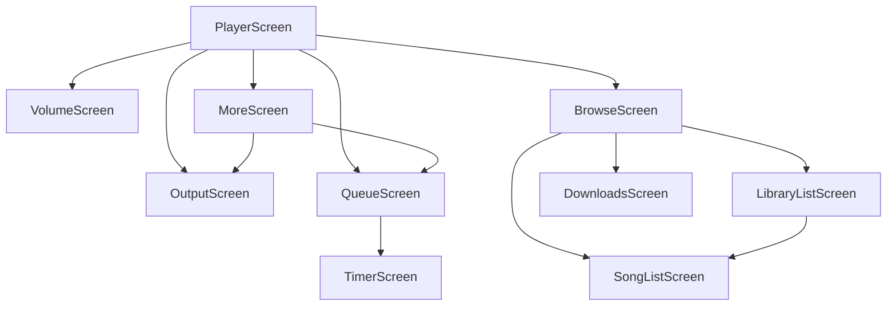

# wear/presentation — UI レイヤ (Activity / Nav / Theme / ViewModel / Screens / Components)

> **パッケージ**: `com.theveloper.pixelplay.presentation`
> **役割**: Wear Compose UI 全体。`WearMainActivity` → `WearNavigation` → 10 画面 + 共通コンポーネント + テーマ。

## ファイル一覧

| ファイル | 行数 | 役割 |
|----------|------|------|
| `WearMainActivity.kt` | 65 | `@AndroidEntryPoint` FragmentActivity (Ambient hook + テーマ適用) |
| `WearNavigation.kt` | 192 | `WearScreens` ルート定数 + `SwipeDismissableNavHost` |
| `theme/WearTheme.kt` | 291 | `WearPixelPlayTheme` / `WearPalette` / `LocalWearPalette` / `DefaultWearPalette` |
| `theme/WearTitleFonts.kt` | 29 | `rememberBrowseSubscreenTitleFont` (gflex_variable) |
| `viewmodel/WearPlayerViewModel.kt` | 510 | 統合 player / 出力切替 / スリープタイマー |
| `viewmodel/WearBrowseViewModel.kt` | 112 | ライブラリ参照画面用 |
| `viewmodel/WearDownloadsViewModel.kt` | 231 | ダウンロード管理画面用 |
| `components/CurvedVolumeIndicator.kt` | (推定) | 円弧ボリュームインジケータ |
| `components/OutputRouteIcon.kt` | (推定) | 出力ルートアイコン |
| `components/PlayingEqIcon.kt` | (推定) | 再生中 EQ アイコン |
| `components/WearIndicators.kt` | (推定) | 接続 / バッファリングインジケータ |
| `components/WearTopTimeText.kt` | (推定) | 時刻表示 |
| `shapes/RoundedStarShape.kt` | (推定) | 角丸星 Shape |
| `screens/BrowseScreen.kt` | (推定) | ライブラリカテゴリ選択 |
| `screens/DownloadsScreen.kt` | (推定) | ダウンロード一覧 |
| `screens/LibraryListScreen.kt` | (推定) | アルバム / アーティスト / プレイリスト一覧 |
| `screens/MoreScreen.kt` | (推定) | 設定 / その他 |
| `screens/OutputScreen.kt` | (推定) | 出力ルート切替 |
| `screens/PlayerScreen.kt` | (推定) | メインプレイヤー |
| `screens/QueueScreen.kt` | (推定) | キュー画面 |
| `screens/SongListScreen.kt` | (推定) | 曲リスト |
| `screens/TimerScreen.kt` | (推定) | スリープタイマー |
| `screens/VolumeScreen.kt` | (推定) | ボリューム画面 |

---

## WearMainActivity.kt

**パッケージ**: `com.theveloper.pixelplay.presentation`
**役割**: Wear アプリのエントリ Activity。Ambient mode 監視 + Hilt ViewModel + テーマ適用。

### 公開 API

| 名前 | 種類 | 説明 |
|------|------|------|
| `WearMainActivity` | class : `FragmentActivity`, `@AndroidEntryPoint` | エントリ Activity |
| `isForeground` (companion) | `Boolean` (getter) | `WearLifecycleState.isForeground.value` スナップショット |
| `onCreate(savedInstanceState)` | `override fun` | `AmbientLifecycleObserver` 登録 + `setContent { WearPixelPlayTheme { WearNavigation() } }` |
| `onStart()` | `override fun` | `WearLifecycleState.setForeground(true)` |
| `onStop()` | `override fun` | `WearLifecycleState.setForeground(false)` |

### 内部実装メモ

- `ambientCallback` で Ambient 入退場時に `setAmbient(true/false)`。
- `setContent` 内で `WearPlayerViewModel` を `hiltViewModel()` 取得し、albumArt / paletteSeed / themePalette を `collectAsState`。
- テーマを切り替えてから `WearNavigation()` を描画。

### 関連ファイル

- `wear/src/main/AndroidManifest.xml` — `<activity>` 登録

---

## WearNavigation.kt

**パッケージ**: `com.theveloper.pixelplay.presentation`
**役割**: `SwipeDismissableNavHost` ベースのナビゲーション定義。10 画面を URL エンコードでルート化。

### 公開 object `WearScreens`

| 定数 | 値 | 用途 |
|------|-----|------|
| `PLAYER` | `"player"` | メインプレイヤー (startDestination) |
| `VOLUME` | `"volume"` | ボリューム |
| `OUTPUT` | `"output"` | 出力ルート |
| `MORE` | `"more"` | 設定 / その他 |
| `QUEUE` | `"queue"` | キュー |
| `TIMER` | `"timer"` | スリープタイマー |
| `BROWSE` | `"browse"` | ライブラリカテゴリ |
| `DOWNLOADS` | `"downloads"` | ダウンロード一覧 |
| `LIBRARY_LIST` | `"library_list/{browseType}/{title}"` | アルバム / アーティスト / プレイリスト一覧 |
| `SONG_LIST` | `"song_list/{browseType}/{contextId}/{title}"` | 曲リスト |

### 公開関数

| 名前 | シグネチャ | 目的 |
|------|-----------|------|
| `libraryListRoute` | `(browseType, title): String` | URL エンコード付きルート文字列 |
| `songListRoute` | `(browseType, contextId, title): String` | URL エンコード付きルート文字列 |

### `WearNavigation` Composable

- `rememberSwipeDismissableNavController()`
- `navigateToBrowseCategory(browseType, title)` — カテゴリ別分岐:
  - `downloads` → `DOWNLOADS`
  - `favorites` / `all_songs` → `SONG_LIST` (contextId="none")
  - その他 → `LIBRARY_LIST`
- 各画面で遷移先へ `navController.navigate(...) { launchSingleTop = true }`

### 内部実装メモ

- `URLEncoder.encode(title, "UTF-8")` / `URLDecoder.decode(title, "UTF-8")` で title の空白等を扱う。
- ナビ先は PlayerScreen からアクセスされる "browse / volume / output / more / queue" の 5 つと、MoreScreen → "queue / output"。

### 関連ファイル

- 全 `screens/*Screen.kt`

---

## theme/WearTheme.kt

**パッケージ**: `com.theveloper.pixelplay.presentation.theme`
**役割**: Wear Compose Material テーマ。`WearPixelPlayTheme` でパレットを組み立て `LocalWearPalette` として CompositionLocal で配布。

### 公開型

| 名前 | 種類 | フィールド |
|------|------|-----------|
| `WearPalette` | `@Immutable data class` | `gradientTop/Middle/Bottom`, `surfaceContainerLowest/Low/Container/High/Highest`, `textPrimary/Secondary/Error`, `controlContainer/Content`, `controlDisabledContainer/Content`, `transportContainer/Content`, `chipContainer/Content`, `favoriteActive`, `shuffleActive`, `repeatActive` (22 色) |
| `DefaultWearPalette` | `val WearPalette` (private) | パープル系デフォルト |
| `LocalWearPalette` | `staticCompositionLocalOf<WearPalette>` | アプリ全体に提供する CompositionLocal |

### 公開 Composable / 拡張

| 名前 | シグネチャ | 目的 |
|------|-----------|------|
| `WearPixelPlayTheme` | `@Composable (albumArt: Bitmap? = null, seedColorArgb: Int? = null, themePalette: WearThemePalette? = null, content)` | パレット決定 → `Colors` 構築 → `MaterialTheme` で提供 |
| `WearPalette.radialBackgroundBrush()` | `Brush` | 4 色 radial gradient (top / middle / bottom / black) |
| `WearPalette.screenBackgroundColor()` | `Color` | 常に Black |
| `WearPalette.surfaceContainer*Color()` | `Color` | 各 surface へのショートカット |

### 内部実装メモ

- パレット決定優先順: ① `themePalette != null` (WearThemePalette → WearPalette) ② `albumArt != null` (アートから seed 抽出) ③ `seedColorArgb != null` (DB の seed) ④ `DefaultWearPalette`
- HSL ベース: `ColorUtils.colorToHSL` → 彩度 / 明度を調整 → `HSLToColor` で再構築
- accent 色は seed 色の hue を ±22〜34 / -72 度シフトして生成
- `bestContrastContent(background)` で W3C コントラスト比に基づき黒 / 白を選択

### 関連ファイル

- `shared/src/main/java/com/theveloper/pixelplay/shared/WearThemePalette.kt`

---

## theme/WearTitleFonts.kt

**パッケージ**: `com.theveloper.pixelplay.presentation.theme`
**役割**: サブ画面タイトル用 Variable Font 設定。

### 公開 API

| 名前 | シグネチャ | 目的 |
|------|-----------|------|
| `rememberBrowseSubscreenTitleFont` | `@Composable (): FontFamily` | `gflex_variable` を weight=700, width=134, ROND=74, XTRA=540, YOPQ=92, YTLC=510 で生成 |

### 内部実装メモ

- `ExperimentalTextApi` opt-in
- `remember` で 1 度だけ構築

---

## viewmodel/WearPlayerViewModel.kt

**パッケージ**: `com.theveloper.pixelplay.presentation.viewmodel`
**役割**: メインプレイヤー ViewModel。**dual-mode** (phone remote / watch local) を統合し、出力切替 / スリープタイマー / 音量 / 接続状態管理を行う。

### 公開型

| 名前 | 種類 | フィールド |
|------|------|-----------|
| `WearSleepTimerUiState` | data class | `mode: WearSleepTimerMode`, `durationMinutes: Int` |
| `WearSleepTimerMode` | enum | `OFF`, `DURATION`, `END_OF_TRACK` |

### 注入される依存 (constructor)

- `stateRepository: WearStateRepository`
- `playbackController: WearPlaybackController`
- `localPlayerRepository: WearLocalPlayerRepository`
- `transferRepository: WearTransferRepository`
- `volumeRepository: WearVolumeRepository`
- `favoriteSyncRepository: WearFavoriteSyncRepository`

### 公開 StateFlow

| プロパティ | 型 | 説明 |
|-----------|----|------|
| `sleepTimerUiState` | `StateFlow<WearSleepTimerUiState>` | スリープタイマー状態 |
| `isLocalPlaybackActive` | `StateFlow<Boolean>` | ローカル再生中か |
| `localQueueState` | `StateFlow<WearLocalQueueState>` | ローカルキュー |
| `outputTarget` | `StateFlow<WearOutputTarget>` | 出力先 |
| `isWatchOutputSelected` | `StateFlow<Boolean>` | `outputTarget == WATCH` |
| `playerState` | `StateFlow<WearPlayerState>` | 出力先に応じて local or remote を選択 |
| `albumArt` | `StateFlow<Bitmap?>` | 出力先に応じてアート |
| `paletteSeedArgb` | `StateFlow<Int?>` | WATCH 時のみ |
| `themePalette` | `StateFlow<WearThemePalette?>` | 出力先に応じてパレット |
| `isPhoneConnected` | `StateFlow<Boolean>` | 接続状態 |
| `phoneVolumeState` | `StateFlow<WearVolumeState>` | phone 音量 |
| `watchVolumeState` | `StateFlow<WearVolumeState>` | watch 音量 |
| `watchAudioRoutes` | `StateFlow<List<WearAudioOutputRoute>>` | watch 出力ルート |
| `activeVolumeState` | `StateFlow<WearVolumeState>` | 出力先に応じて音量 |
| `activeVolumePercent` | `StateFlow<Int>` | 0-100 % |
| `activeVolumeDeviceName` | `StateFlow<String>` | 表示用デバイス名 |
| `activeOutputRouteType` | `StateFlow<String>` | `ROUTE_TYPE_WATCH` or `ROUTE_TYPE_PHONE` |
| `canCurrentSongPlayOnWatch` | `StateFlow<Boolean>` | 現在の曲を watch で再生可能か |
| `canCurrentSongBeFavorited` | `StateFlow<Boolean>` | お気に入り操作可能か |

### 公開 API

| 名前 | シグネチャ | 目的 |
|------|-----------|------|
| `selectOutput` | `(target: WearOutputTarget)` | PHONE / WATCH 切替。WATCH 選択時: ① 既に同じ曲ローカル再生中なら位置同期 ② ローカル DB に曲があれば `playLocalSongs` + phone pause ③ なければ `requestTemporaryPlayback` |
| `selectWatchOutput` | `(routeId: String)` | watch 出力ルート切替 (`volumeRepository.selectWatchAudioRoute` 経由) |
| `openWatchOutputPicker` | `()` | システム出力切替 UI |
| `playLocalQueueIndex` | `(index: Int)` | ローカルキュー index 指定再生 |
| `setWatchRouteDiscoveryEnabled` | `(enabled: Boolean)` | MediaRouter 検出 ON/OFF |
| `refreshWatchAudioState` | `()` | watch オーディオ状態再取得 |
| `togglePlayPause` | `()` | 出力先に応じて local/remote に委譲 |
| `next` / `previous` | `()` | 同上 |
| `toggleFavorite` | `()` | WATCH: `favoriteSyncRepository.setFavorite` / PHONE: 即 UI 更新 + `playbackController.toggleFavorite` |
| `refreshCurrentSongFavoriteState` | `()` | WATCH + 接続時のみ、現在曲のお気に入りを再取得 |
| `toggleShuffle` / `cycleRepeat` | `()` | 出力先に応じて |
| `volumeUp` / `volumeDown` | `()` | 同上 |
| `setActiveVolume` | `(level: Int)` | WATCH: `setWatchVolume` / PHONE: `setPhoneVolume(percent)` |
| `refreshActiveVolumeState` | `()` | 出力先に応じて再取得 |
| `setSleepTimerDuration` | `(durationMinutes: Int)` | phone にコマンド + UI 状態更新 |
| `setSleepTimerEndOfTrack` | `(enabled: Boolean = true)` | 同上 |
| `cancelSleepTimer` | `()` | 同上 |
| `stopLocalPlayback` | `()` | `localPlayerRepository.release()` |

### 内部 private 関数

| 名前 | 役割 |
|------|------|
| `bootstrapPhoneStateSync` | 起動時 3 回まで `requestPhoneVolumeState` を試行 (1.2s 間隔) |
| `hasRemotePhoneState` | phone からの player state が空でないか判定 |

### 内部実装メモ

- `init` で 3 つのコルーチン:
  1. `outputTarget.collect { refreshActiveVolumeState() }`
  2. `isInteractive` 中のみ 30 秒間隔で `refreshWatchVolumeState` or `requestPhoneVolumeState`
  3. WATCH + phone 接続 + 再生中曲でお気に入り同期要求
- `PHONE_SYNC_BOOTSTRAP_ATTEMPTS = 3` / `PHONE_SYNC_BOOTSTRAP_RETRY_DELAY_MS = 1200L`
- `PHONE_ROUTE_REFRESH_INTERVAL_MS = 30_000L` (バッテリー配慮)

### 関連ファイル

- `data/WearStateRepository.kt`
- `data/WearPlaybackController.kt`
- `data/WearLocalPlayerRepository.kt`
- `data/WearVolumeRepository.kt`
- `data/WearTransferRepository.kt`
- `data/WearFavoriteSyncRepository.kt`

---

## viewmodel/WearBrowseViewModel.kt

**パッケージ**: `com.theveloper.pixelplay.presentation.viewmodel`
**役割**: ライブラリ参照画面用 ViewModel。

### 公開 sealed interface `BrowseUiState`

| 種類 | フィールド |
|------|-----------|
| `Loading` | data object |
| `Success` | `items: List<WearLibraryItem>` |
| `Error` | `message: String` |

### 注入される依存

- `libraryRepository: WearLibraryRepository`
- `playbackController: WearPlaybackController`
- `stateRepository: WearStateRepository`
- `localPlayerRepository: WearLocalPlayerRepository`

### 公開 StateFlow

| プロパティ | 型 | 説明 |
|-----------|----|------|
| `uiState` | `StateFlow<BrowseUiState>` | 初期: `Loading` |

### 公開 API

| 名前 | シグネチャ | 目的 |
|------|-----------|------|
| `loadItems` | `(browseType, contextId? = null)` | `libraryRepository.browse` 呼び出し → Success/Error |
| `playFromContext` | `(songId, contextType, contextId?)` | phone 再生準備 + `playbackController.playFromContext` |
| `playNextFromContext` | `(songId, contextType, contextId?)` | キュー次に挿入 |
| `addToQueueFromContext` | `(songId, contextType, contextId?)` | キュー末尾に追加 |
| `playQueueIndex` | `(index: Int)` | キュー index 指定 |
| `refresh` | `()` | キャッシュ無効化 + 再 load |

### 内部 private 関数

| 名前 | 役割 |
|------|------|
| `prepareForPhonePlayback` | `outputTarget = PHONE` に切替 + ローカル pause + phone 音量要求 |

---

## viewmodel/WearDownloadsViewModel.kt

**パッケージ**: `com.theveloper.pixelplay.presentation.viewmodel`
**役割**: ダウンロード管理画面用 ViewModel。

### 公開 sealed interface `WearDownloadsUiEvent`

| 種類 | フィールド |
|------|-----------|
| `Message` | `value: String` |

### 注入される依存

- `transferRepository: WearTransferRepository`
- `deviceMusicRepository: WearDeviceMusicRepository`
- `localPlayerRepository: WearLocalPlayerRepository`
- `playbackController: WearPlaybackController`
- `stateRepository: WearStateRepository`

### 公開 StateFlow / SharedFlow

| プロパティ | 型 | 説明 |
|-----------|----|------|
| `localSongs` | `StateFlow<List<LocalSongEntity>>` | ダウンロード済曲 |
| `activeTransfers` | `StateFlow<Map<String, TransferState>>` | 進行中 |
| `downloadedSongIds` | `StateFlow<Set<String>>` | songId セット |
| `deviceSongs` | `StateFlow<List<WearDeviceSong>>` | MediaStore |
| `isDeviceLibraryLoading` | `StateFlow<Boolean>` | スキャン中 |
| `deviceLibraryError` | `StateFlow<String?>` | エラー |
| `pendingPhonePlaybackSongId` | `StateFlow<String?>` | phone 上で再生試行中の曲 |
| `events` | `SharedFlow<WearDownloadsUiEvent>` | UI イベント |

### 公開 API

| 名前 | シグネチャ | 目的 |
|------|-----------|------|
| `requestDownload` | `(songId: String)` | phone への転送要求 |
| `playLocalSong` | `(songId: String)` | ローカル再生 (全曲をキューに) |
| `playSongOnPhone` | `(songId: String)` | phone 上で再生 (`PLAY_ITEM` + requestId、結果待ち) |
| `playDeviceSong` | `(songId: String)` | MediaStore 曲をローカル再生 |
| `refreshDeviceLibrary` | `(hasPermission: Boolean)` | MediaStore 再スキャン |
| `deleteSong` | `(songId: String)` | ファイル + DB 削除 |
| `cancelTransfer` | `(requestId: String)` | 転送キャンセル |

### 内部実装メモ

- `PHONE_PLAYBACK_TIMEOUT_MS = 6_000L` — `playSongOnPhone` の応答待ちタイムアウト
- `init` で `stateRepository.playbackResults.collect` して PLAY_ITEM の結果を相関

---

## screens/ 概要

| ファイル | 役割 | 主な引数 |
|----------|------|---------|
| `PlayerScreen.kt` | メインプレイヤー UI (タイトル / アート / 再生 / キュー / 音量 / 出力 / More 遷移) | `onBrowseCategoryClick`, `onVolumeClick`, `onOutputClick`, `onMoreClick`, `onQueueClick` |
| `BrowseScreen.kt` | ライブラリカテゴリ一覧 (Albums / Artists / Playlists / Favorites / All Songs / Downloads) | `onCategoryClick` |
| `LibraryListScreen.kt` | アルバム / アーティスト / プレイリスト一覧 | `browseType`, `title`, `onItemClick` |
| `SongListScreen.kt` | 曲リスト (アルバム内 / アーティスト内 / プレイリスト内 / 全曲 / お気に入り) | `browseType`, `contextId`, `title` |
| `QueueScreen.kt` | ローカルキュー / sleep timer 遷移 | `onTimerClick` |
| `TimerScreen.kt` | スリープタイマー設定 (OFF / DURATION / END_OF_TRACK) | — |
| `VolumeScreen.kt` | ボリューム調整 (`CurvedVolumeIndicator` 使用) | — |
| `OutputScreen.kt` | 出力先 (phone / watch) 切替 + watch 出力ルート一覧 | — |
| `MoreScreen.kt` | 設定 / Queue / Output 遷移 | `onQueueClick`, `onSettingsClick` |
| `DownloadsScreen.kt` | ダウンロード済曲一覧 + 転送中インジケータ + 削除 | — |

> 画面 Composable の詳細は推定を含む。各画面は ViewModel を `hiltViewModel()` で取得し、上記 StateFlow を `collectAsState` して UI を組み立てる。

---

## components/ 概要

| ファイル | 役割 |
|----------|------|
| `CurvedVolumeIndicator.kt` | Wear Compose `CurvedLayout` を使った円弧ボリュームインジケータ |
| `OutputRouteIcon.kt` | 出力ルート種別 (`ROUTE_TYPE_BLUETOOTH`, `ROUTE_TYPE_SPEAKER` 等) に応じたアイコン |
| `PlayingEqIcon.kt` | 再生中 EQ アイコン (アニメ) |
| `WearIndicators.kt` | 接続 / バッファリング / 同期中インジケータ群 |
| `WearTopTimeText.kt` | Wear の TopTimeText 拡張 (時刻 + 状態) |

---

## shapes/

| ファイル | 役割 |
|----------|------|
| `RoundedStarShape.kt` | 角丸星 Shape (Composable 修飾用) |

> 詳細未確認。`PolygonShape` / `RoundedStarShape` と同様の API を持つと推定。

---

## 画面遷移図

