# 99 — 相関図・依存関係図集

> PixelPlayer のモジュール間・クラス間・データフローの相関を 1 箇所に集約した図集。
> 各図は対応するスペックへ `../<path>` 形式でリンク。

## 目次

1. [レイヤー間 全体俯瞰図](#1-レイヤー間-全体俯瞰図)
2. [モジュール間 依存関係](#2-モジュール間-依存関係)
3. [データレイヤー — Repository → Service 接続](#3-データレイヤー--repository--service-接続)
4. [DB (songs) テーブル ER 図](#4-db-songs-テーブル-er-図)
5. [MusicService ↔ Engine ↔ Player 内部](#5-musicservice--engine--player-内部)
6. [DualPlayerEngine 状態遷移](#6-dualplayerengine-状態遷移)
7. [Cast 連携シーケンス](#7-cast-連携シーケンス)
8. [Wear OS Phone ↔ Watch データフロー](#8-wear-os-phone--watch-データフロー)
9. [WorkManager 同期ジョブ](#9-workmanager-同期ジョブ)
10. [ViewModel / StateHolder 依存ネットワーク](#10-viewmodel--stateholder-依存ネットワーク)
11. [Navigation グラフ](#11-navigation-グラフ)
12. [バックアップ / リストア パイプライン](#12-バックアップ--リストア-パイプライン)
13. [AI プロバイダ 抽象化](#13-ai-プロバイダ-抽象化)
14. [Glance Widget 更新フロー](#14-glance-widget-更新フロー)
15. [ストリーミング プロキシ統合](#15-ストリーミング-プロキシ統合)
16. [HTTP サーバー (Ktor) 内部](#16-http-サーバー-ktor-内部)
17. [設定 (DataStore) 読み書き](#17-設定-datastore-読み書き)
18. [イコライザー パイプライン](#18-イコライザー-パイプライン)
19. [歌詞解決フロー](#19-歌詞解決フロー)
20. [Android Auto Browse Tree](#20-android-auto-browse-tree)

---

## 1. レイヤー間 全体俯瞰図

```mermaid
graph TB
    subgraph Pres[presentation 層]
        S[Screen / Component]
        N[Navigation]
    end
    subgraph State[state 層]
        VM[ViewModel<br/>HiltViewModel]
        SH[StateHolder<br/>@Singleton]
    end
    subgraph Engine[engine 層]
        Act[MainActivity]
        Svc[MusicService]
        Eng[DualPlayerEngine / CastPlayer]
        Cast[CastOptionsProvider]
        Auto[AutoMediaBrowseTree]
        HTTP[MediaFileHttpServerService]
    end
    subgraph Data[data 層]
        R[Repository]
        API[network/ Retrofit]
        Prov[<provider>/Repository<br/>Jellyfin/Navidrome/...]
        AI[ai/ Handler]
    end
    subgraph DB[database 層]
        Room[Room: PixelPlayDatabase]
        Dao[MusicDao etc.]
        Pref[DataStore Preferences]
    end

    S --> VM
    S --> SH
    N --> S
    VM --> SH
    VM --> R
    SH --> R
    Act --> Svc
    Svc --> Eng
    Svc --> Cast
    Svc --> Auto
    Svc --> HTTP
    Eng --> ExoPlayer
    R --> Dao
    R --> API
    R --> Prov
    R --> AI
    Prov --> API
    Prov --> HTTP
    Dao --> Room
    R --> Pref
```

参照: [00-architecture.md](00-architecture.md), [04-engine/](04-engine/README.md), [06-state-navigation/](06-state-navigation/README.md)

---

## 2. モジュール間 依存関係

```mermaid
graph LR
    App[app/]
    Shared[shared/]
    Wear[wear/]

    App -->|uses| Shared
    Wear -->|uses| Shared

    App -.->|not direct<br/>(Wear is separate APK)| Wear
```

- `app/build.gradle.kts` で `implementation(project(":shared"))`
- `wear/build.gradle.kts` で `implementation(project(":shared"))`
- `app` は wear を直接参照しない (Wearable Data Layer 経由 IPC)

---

## 3. データレイヤー — Repository → Service 接続

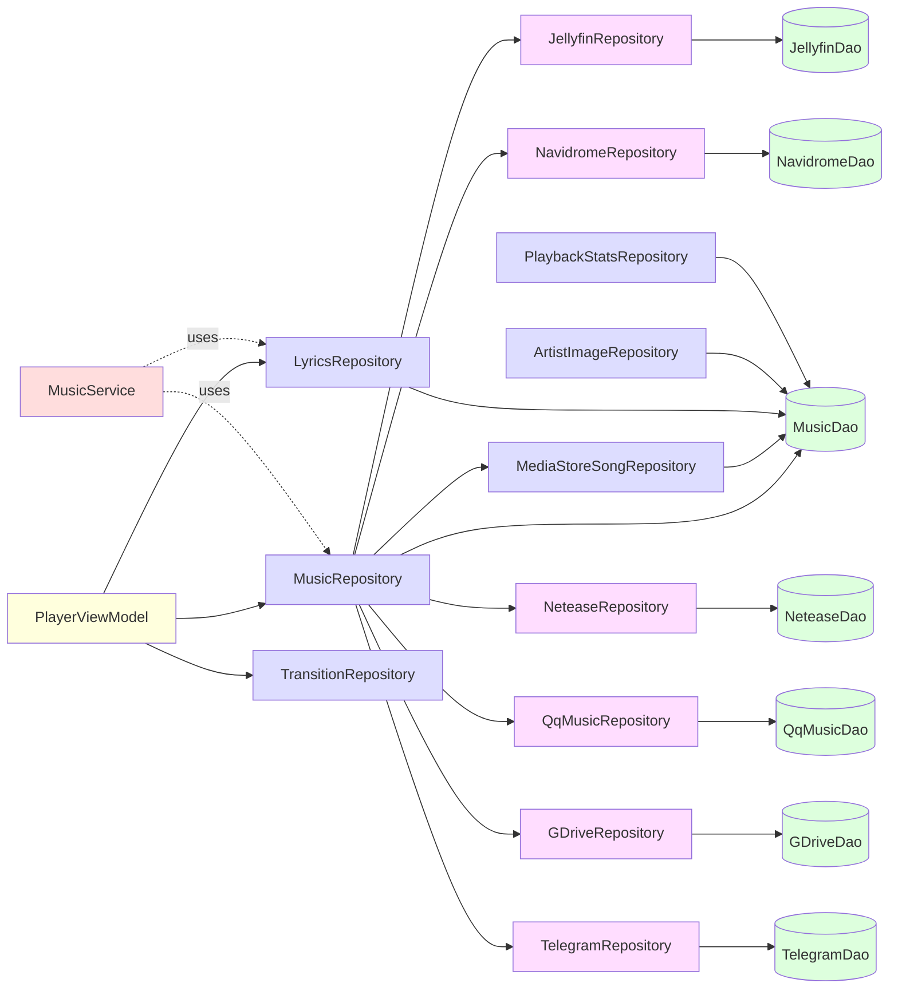

詳細: [03-data-services/repositories.md](03-data-services/repositories.md), [02-data-network/streaming-*.md](02-data-network/README.md)

---

## 4. DB (songs) テーブル ER 図

```mermaid
erDiagram
    songs ||--o{ song_artist_cross_ref : "FK"
    artists ||--o{ song_artist_cross_ref : "FK"
    songs ||--o{ favorites : "FK"
    songs ||--o{ song_engagement : "FK"
    songs ||--o{ lyrics : "1:1"
    songs ||--o{ search_history_fts : "FTS"
    albums ||--o{ songs : "FK"
    artists ||--o{ albums : "FK"
    playlist_songs }o--|| songs : "FK"
    playlist_songs }o--|| playlists : "FK"
    ai_usage ||--o{ ai_cache : "関連"
    songs ||--o| telegram_songs : "1:1"
    songs ||--o| netease_songs : "1:1"
    songs ||--o| qq_music_songs : "1:1"
    songs ||--o| gdrive_songs : "1:1"
    songs ||--o| navidrome_songs : "1:1"
    songs ||--o| jellyfin_songs : "1:1"
    telegram_channels ||--o{ telegram_topics : "FK"
    telegram_channels ||--o{ telegram_songs : "FK"

    songs {
        long id PK
        string title
        string path
        long album_id FK
        long duration_ms
        string source_type
        long source_id
        int track_number
        int year
        int bitrate
        int sample_rate
        string mime_type
        string artists_json
        int play_count
        long last_played_at
    }
    albums {
        long id PK
        string title
        long primary_artist_id FK
        int song_count
        int album_art_path
    }
    artists {
        long id PK
        string name
        int song_count
        int album_count
    }
    song_artist_cross_ref {
        long song_id FK
        long artist_id FK
        string role
    }
    playlists {
        long id PK
        string name
        long created_at
        int is_ai_generated
        int is_queue_generated
    }
    playlist_songs {
        long playlist_id FK
        long song_id FK
        int position
    }
    favorites {
        long song_id FK
        long added_at
    }
    song_engagement {
        long song_id FK
        int skip_count
        int completion_count
        long total_play_time_ms
    }
    lyrics {
        long song_id PK_FK
        string text
        string source
        long synced_at
    }
```

詳細: [01-data-foundation/database-system.md](01-data-foundation/database-system.md), [01-data-foundation/database-entities.md](01-data-foundation/database-entities.md)

---

## 5. MusicService ↔ Engine ↔ Player 内部

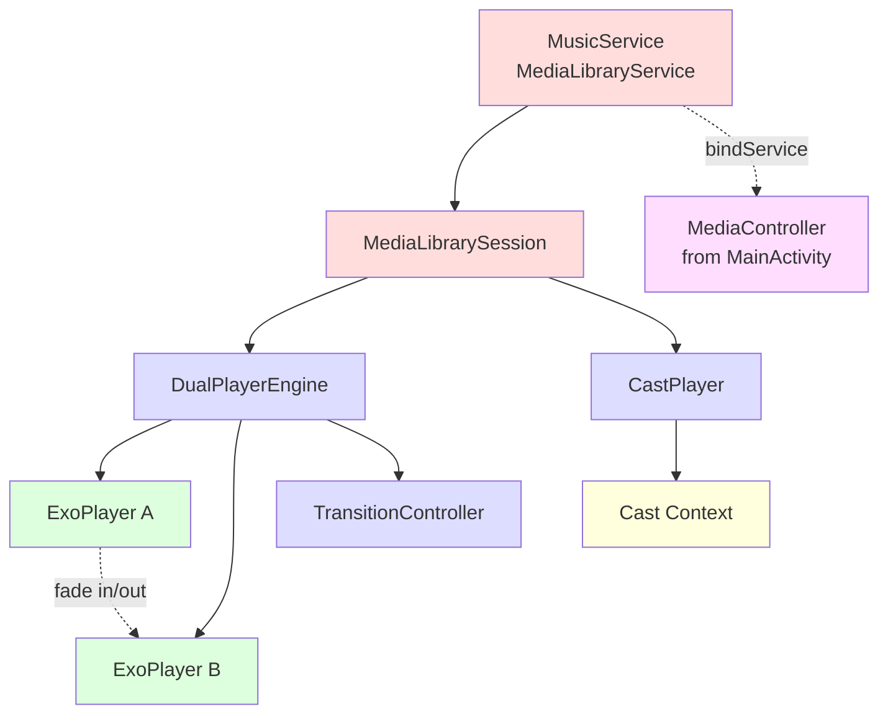

詳細: [04-engine/music-service.md](04-engine/music-service.md), [04-engine/player-engine.md](04-engine/player-engine.md)

---

## 6. DualPlayerEngine 状態遷移

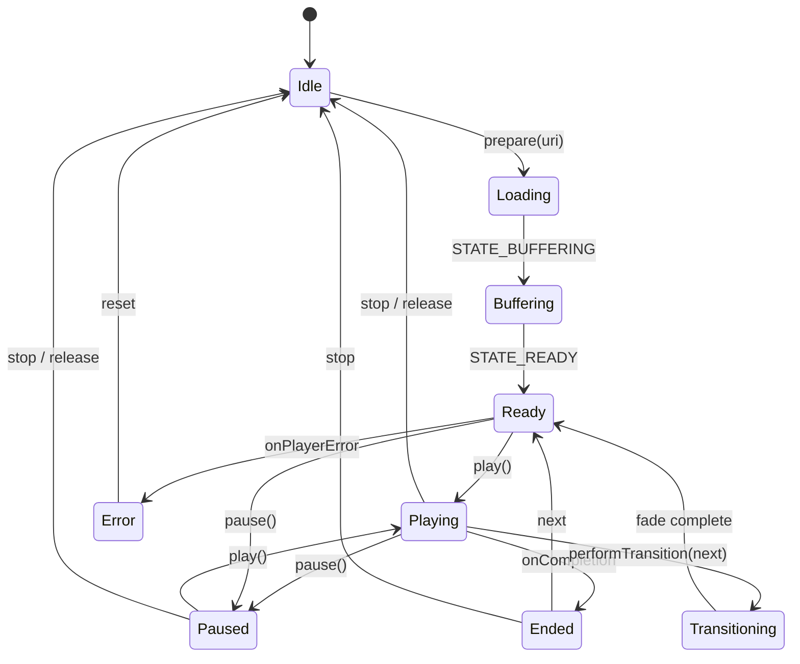

詳細: [04-engine/player-engine.md](04-engine/player-engine.md)

---

## 7. Cast 連携シーケンス

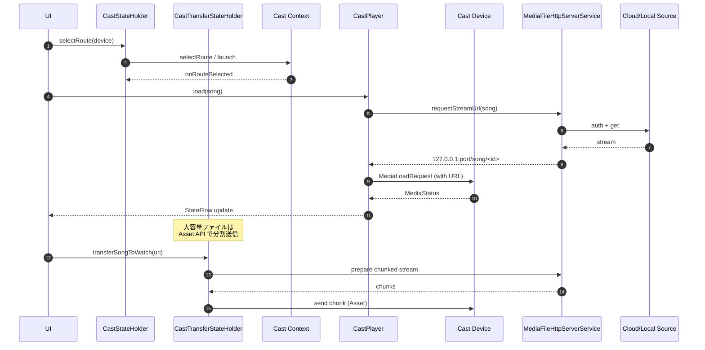

詳細: [04-engine/auto-cast-http.md](04-engine/auto-cast-http.md), [04-engine/wear-bridge.md](04-engine/wear-bridge.md), [06-state-navigation/viewmodels-ai-extra.md](06-state-navigation/viewmodels-ai-extra.md)

---

## 8. Wear OS Phone ↔ Watch データフロー

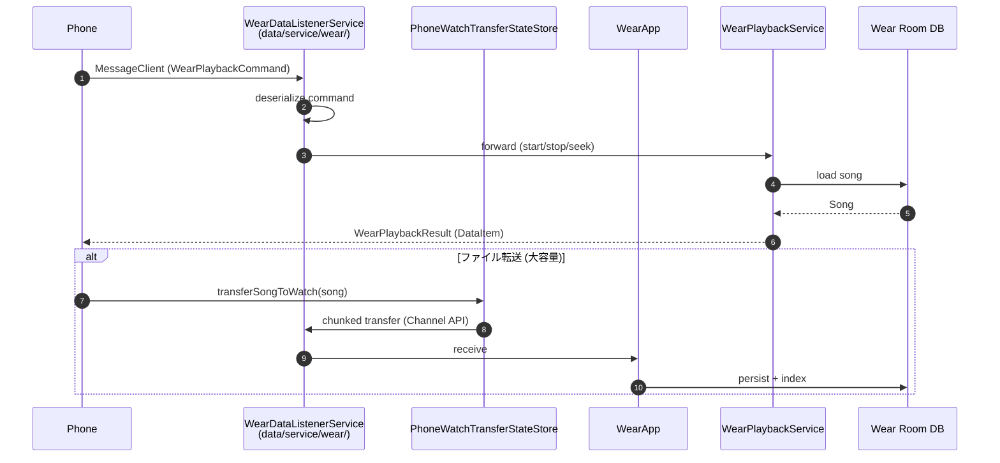

詳細: [04-engine/wear-bridge.md](04-engine/wear-bridge.md), [09-wear-module/](09-wear-module/README.md), [08-shared-module.md](08-shared-module.md)

---

## 9. WorkManager 同期ジョブ

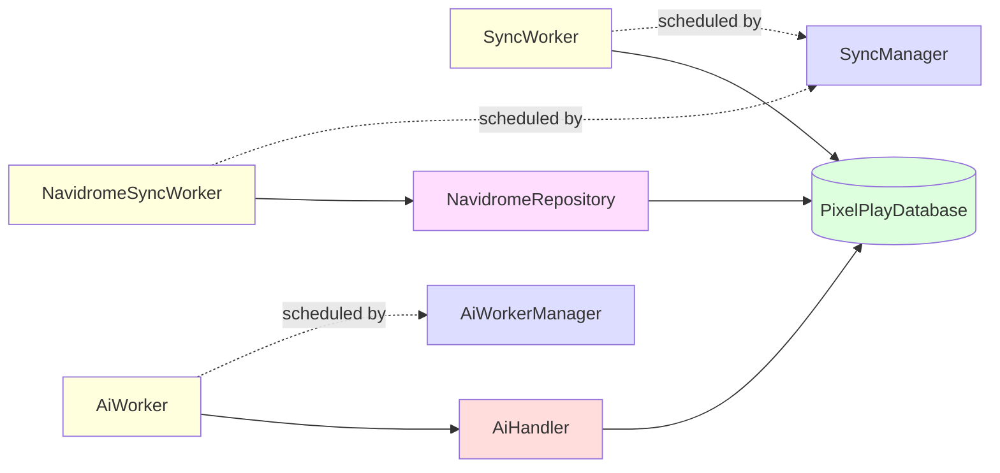

詳細: [03-data-services/workers.md](03-data-services/workers.md)

---

## 10. ViewModel / StateHolder 依存ネットワーク

```mermaid
graph TD
    PlayerVM[PlayerViewModel<br/>@HiltViewModel]:::vm
    PBV[PlaybackStateHolder<br/>@Singleton]:::sh
    PDV[PlaybackDispatchStateHolder<br/>@ViewModelScoped]:::sh
    QV[QueueStateHolder<br/>@Singleton]:::sh
    LV[LibraryStateHolder<br/>@Singleton]:::sh
    SV[SearchStateHolder<br/>@Singleton]:::sh
    LyrV[LyricsStateHolder<br/>@Singleton]:::sh
    SleepV[SleepTimerStateHolder<br/>@Singleton]:::sh
    CastV[CastStateHolder<br/>@Singleton]:::sh
    CastTV[CastTransferStateHolder<br/>@Singleton]:::sh
    CastRV[CastRouteStateHolder<br/>@ViewModelScoped]:::sh
    MCV[MediaControllerSyncStateHolder<br/>@ViewModelScoped]:::sh
    EMV[ExternalMediaStateHolder<br/>@Singleton]:::sh
    FNV[FolderNavigationStateHolder<br/>@ViewModelScoped]:::sh
    LTV[LibraryTabsStateHolder<br/>@ViewModelScoped]:::sh
    DMV[DailyMixStateHolder<br/>@Singleton]:::sh
    AiV[AiStateHolder<br/>@Singleton]:::sh
    TV[ThemeStateHolder<br/>@Singleton]:::sh
    CV[ConnectivityStateHolder<br/>@Singleton]:::sh
    MSV[MultiSelectionStateHolder<br/>@Singleton]:::sh
    PLV[PlaylistViewModel<br/>@HiltViewModel]:::vm
    PSV[PlaylistSelectionStateHolder<br/>@ViewModelScoped]:::sh
    PUV[PlaylistDismissUndoStateHolder<br/>@ViewModelScoped]:::sh
    SRV[SongRemovalStateHolder<br/>@ViewModelScoped]:::sh
    MUV[MetadataEditStateHolder<br/>@ViewModelScoped]:::sh
    SIBV[SongInfoBottomSheetViewModel<br/>@HiltViewModel]:::vm
    ADV[AlbumDetailViewModel<br/>@HiltViewModel]:::vm
    ARV[ArtistDetailViewModel<br/>@HiltViewModel]:::vm
    GDV[GenreDetailViewModel<br/>@HiltViewModel]:::vm
    EQV[EqualizerViewModel<br/>@HiltViewModel]:::vm
    DMV2[DailyMixStateHolder<br/>@Singleton]:::sh
    LSTV[ListeningStatsTracker<br/>@Singleton]:::sh
    FEV[FileExplorerStateHolder<br/>@ViewModelScoped]:::sh
    SETV[SettingsViewModel<br/>@HiltViewModel]:::vm
    SUPV[SetupViewModel<br/>@HiltViewModel]:::vm
    STV[StatsViewModel<br/>@HiltViewModel]:::vm
    DCV[DeviceCapabilitiesViewModel<br/>@HiltViewModel]:::vm
    ASV[ArtistSettingsViewModel<br/>@HiltViewModel]:::vm
    ACV[AccountsViewModel<br/>@HiltViewModel]:::vm
    MV[MashupViewModel<br/>@HiltViewModel]:::vm
    TRV[TransitionViewModel<br/>@HiltViewModel]:::vm
    QUV[QueueUndoStateHolder<br/>@ViewModelScoped]:::sh
    LSPV[LyricsSearchUiState]:::support
    PVU[PlayerUiState]:::support
    PSS[PlayerSheetState]:::support
    SPV[StablePlayerState]:::support
    CSP[ColorSchemePair]:::support
    CSPP[ColorSchemeProcessor<br/>@Singleton]:::sh
    DC[DeckController]:::support

    PlayerVM --> PBV
    PlayerVM --> PDV
    PlayerVM --> QV
    PlayerVM --> LV
    PlayerVM --> SV
    PlayerVM --> LyrV
    PlayerVM --> SleepV
    PlayerVM --> CastV
    PlayerVM --> CastTV
    PlayerVM --> CastRV
    PlayerVM --> MCV
    PlayerVM --> EMV
    PlayerVM --> FNV
    PlayerVM --> LTV
    PlayerVM --> DMV
    PlayerVM --> AiV
    PlayerVM --> TV
    PlayerVM --> CV
    PlayerVM --> MSV
    PlayerVM --> DC
    PLV --> PSV
    PLV --> PUV
    PLV --> SRV
    PLV --> MUV
    PLV --> QUV
    SIBV --> MUV
    ADV --> LV
    ARV --> LV
    GDV --> LV
    EQV --> PBV
    DMV --> LSTV
    SETV --> TV
    SETV --> PBV
    SETV --> EQV
    SETV --> AiV
    SETV --> CASTV[CastV]
    SUPV --> FEV
    STV --> LSTV
    STV --> PSR[PlaybackStatsRepository]
    DCV --> EQV
    ASV --> AIR[ArtistImageRepository]
    TRV --> TR[TransitionRepository]
    PlayerVM --> CSPP
    PlayerVM --> LSPV
    PlayerVM --> PVU
    PlayerVM --> PSS
    PlayerVM --> SPV

    classDef vm fill:#ffd
    classDef sh fill:#ddf
    classDef support fill:#dfd
```

詳細: [06-state-navigation/README.md](06-state-navigation/README.md)

---

## 11. Navigation グラフ

```mermaid
graph TB
    Splash[SetupScreen] --> Home
    Splash --> Main[MainActivity]
    Main --> Home[HomeScreen]
    Main --> Library[LibraryScreen]
    Main --> Search[SearchScreen]
    Main --> DailyMix[DailyMixScreen]
    Main --> Recently[RecentlyPlayedScreen]
    Main --> Stats[StatsScreen]
    Main --> Settings[SettingsScreen]
    Main --> Equalizer[EqualizerScreen]
    Main --> Accounts[AccountsScreen]
    Main --> About[AboutScreen]

    Library --> Album[AlbumDetailScreen]
    Library --> Artist[ArtistDetailScreen]
    Library --> Genre[GenreDetailScreen]
    Library --> Folder[FolderExplorerScreen]
    Library --> Playlist[PlaylistDetailScreen]
    Library --> CreatePL[CreatePlaylistScreen]
    Library --> SongInfo[SongInfoBottomSheet]

    Album --> Artist
    Playlist --> SongInfo

    Home --> QuickFill[QuickFillScreen]
    Home --> Mashup[MashupScreen]
    Home --> EditTrans[EditTransitionScreen]
    Home --> Library
    Home --> Search

    Search --> SongInfo
    Search --> Album
    Search --> Artist
    Search --> Playlist
    Search --> CreatePL

    Settings --> SettingsCat[SettingsCategoryScreen]
    Settings --> Setup[SetupScreen]
    Settings --> Palette[PaletteStyleSettingsScreen]
    Settings --> NavBar[NavBarCornerRadiusScreen]
    Settings --> Delim[DelimiterConfigScreen]
    Settings --> WordDelim[WordDelimiterConfigScreen]
    Settings --> Artist[ArtistSettingsScreen]
    Settings --> DevCap[DeviceCapabilitiesScreen]
    Settings --> Exp[ExperimentalSettingsScreen]
    Settings --> Easter[EasterEggScreen]

    Accounts --> Jellyfin[JellyfinDashboardScreen]
    Accounts --> Navidrome[NavidromeDashboardScreen]
    Accounts --> Netease[NeteaseDashboardScreen]
    Accounts --> QQ[QqMusicDashboardScreen]
    Accounts --> GDrive[GDriveDashboardScreen]
    Accounts --> Telegram[TelegramDashboardScreen]

    Note1[BottomSheets:<br/>PlayerUI / Lyrics / Queue / Cast / EditSong /<br/>AiPlaylist / FetchLyrics / SongPicker / Timer /<br/>Playlist / Streaming / MultiSelection]
    Home -.-> Note1
    Library -.-> Note1
    Search -.-> Note1
```

詳細: [06-state-navigation/navigation.md](06-state-navigation/navigation.md)

---

## 12. バックアップ / リストア パイプライン

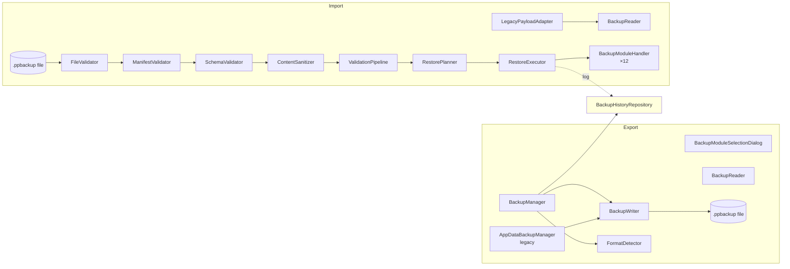

詳細: [03-data-services/backup-system.md](03-data-services/backup-system.md)

---

## 13. AI プロバイダ 抽象化

```mermaid
graph LR
    Ui[AiStateHolder]:::ui
    AW[AiWorker]:::worker
    AH[AiHandler]:::core
    ACF[AiClientFactory]:::core
    API[AiProvider.kt interface]:::core
    GC[GeminiAiClient]:::impl
    GO[GenericOpenAiClient]:::impl
    Geo[GeminiModelService]:::core
    PG[AiPlaylistGenerator]:::core
    RC[AiResponseCleaner]:::core
    SP[AiSystemPromptEngine]:::core
    Cache[(AiCacheDao)]:::db
    Usage[(AiUsageDao)]:::db

    Ui --> AH
    AW --> AH
    AH --> ACF
    AH --> PG
    AH --> RC
    ACF --> API
    API <|--> GC
    API <|--> GO
    GC --> Geo
    PG --> SP
    PG --> Cache
    AH --> Usage

    classDef ui fill:#ffd
    classDef worker fill:#dfd
    classDef core fill:#ddf
    classDef impl fill:#fdf
    classDef db fill:#fdd
```

詳細: [02-data-network/ai-system.md](02-data-network/ai-system.md)

---

## 14. Glance Widget 更新フロー

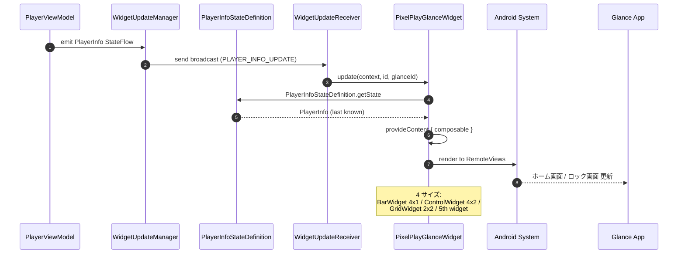

詳細: [07-ui-system/widgets.md](07-ui-system/widgets.md), [04-engine/tile-widgets.md](04-engine/tile-widgets.md)

---

## 15. ストリーミング プロキシ統合

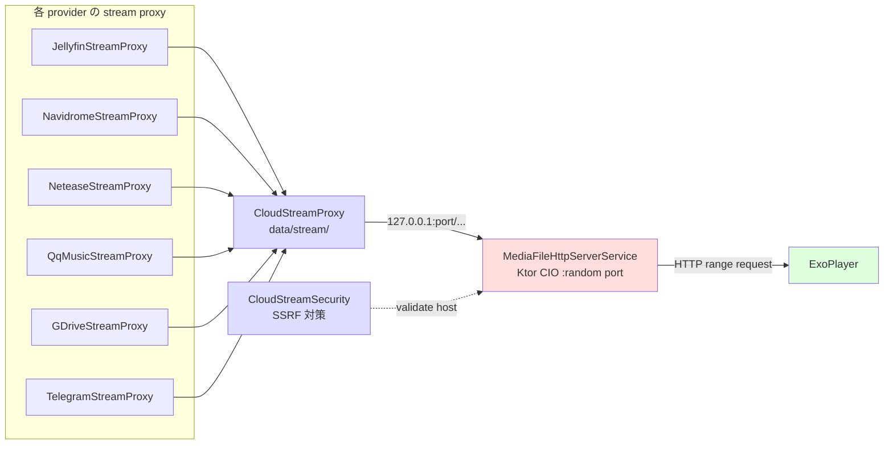

詳細: [02-data-network/streaming-cloud.md](02-data-network/streaming-cloud.md), [04-engine/auto-cast-http.md](04-engine/auto-cast-http.md)

---

## 16. HTTP サーバー (Ktor) 内部

```mermaid
graph TB
    Start[onStartCommand]:::lifecycle
    Port[bind 127.0.0.1:randomPort]:::lifecycle
    Route{route}:::route

    Start --> Port
    Port --> Route

    Route -->|GET /song/{id}| LocalSong[Song path serve<br/>file range]:::handler
    Route -->|GET /stream/{id}| Cloud[CloudSong serve<br/>range + auth]:::handler
    Route -->|GET /artwork/{id}| Artwork[AlbumArt]:::handler
    Route -->|GET /cast/{id}| CastProxy[CastSessionSecurity]:::handler
    Route -->|GET /lyrics/{id}| LyricsProxy[Lyrics file]:::handler
    Route -->|GET /health| Health[200 OK]:::handler

    subgraph Codec[オプション トランスコード]
        AAC[transcodeToAacAdts<br/>MediaCodec]:::handler
        FFM[transcodeToAacAdts<br/>FFmpeg fallback]:::handler
    end

    Cloud -.FLAC/HiRes.-> Codec
    Codec --> AAC
    Codec --> FFM

    classDef lifecycle fill:#ffd
    classDef route fill:#ddf
    classDef handler fill:#dfd
```

詳細: [04-engine/auto-cast-http.md](04-engine/auto-cast-http.md)

---

## 17. 設定 (DataStore) 読み書き

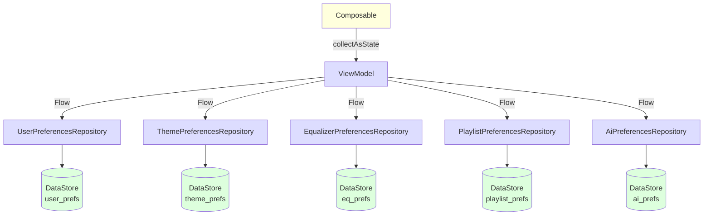

詳細: [03-data-services/preferences.md](03-data-services/preferences.md)

---

## 18. イコライザー パイプライン

```mermaid
graph LR
    EM[EqualizerManager<br/>@Singleton]:::mgr
    EO[Android AudioEffect.Equalizer]:::system
    Bass[Preset Bass Boost]:::system
    Virtual[Preset Virtualizer]:::system
    Loud[Preset Loudness Enhancer]:::system
    EPR[EqualizerPreferencesRepository]:::repo
    EQV[EqualizerViewModel]:::vm
    SR[HiResSampleRateCapAudioProcessor]:::player
    SD[SurroundDownmixProcessor]:::player
    ADP[AudioDecoderPolicy]:::player

    EM --> EO
    EM --> Bass
    EM --> Virtual
    EM --> Loud
    EPR --> EM
    EQV --> EPR
    EQV --> EM
    SR -.audio session id.-> EM
    SD -.audio session id.-> EM
    ADP --> SR
    ADP --> SD

    classDef mgr fill:#ffd
    classDef system fill:#ddf
    classDef repo fill:#fdf
    classDef vm fill:#dfd
    classDef player fill:#fdd
```

詳細: [03-data-services/equalizer.md](03-data-services/equalizer.md), [04-engine/player-engine.md](04-engine/player-engine.md)

---

## 19. 歌詞解決フロー

```mermaid
flowchart TB
    Start[LyricsStateHolder.requestLyrics songId]:::start
    LR[LyricsRepositoryImpl]:::core
    Check1{歌詞 DB に<br/>キャッシュあり?}:::cond
    Sync{sync 歌詞<br/>必要?}:::cond
    LrcLib[GET lrclib.net/api/get]:::api
    Maniac[GET lyrics.maniac...]:::api
    Deezer[GET api.deezer.com]:::api
    Local[ローカル .lrc / .ttml ファイル]:::fs
    Embedded[埋め込み歌詞 (mp3 / flac tag)]:::tag
    Parse[LrcLibResponse parse<br/>+ rankRemoteLyricsMatches]:::core
    Clean[AiResponseCleaner 整形]:::core
    Store[(LyricsEntity 保存)]:::db
    Result[Lyrics 返却]:::out

    Start --> LR
    LR --> Check1
    Check1 -->|Yes| Result
    Check1 -->|No| Sync
    Sync -->|Yes| LrcLib
    Sync -->|No| Local
    LrcLib --> Parse
    Maniac --> Parse
    Deezer --> Parse
    Local --> Parse
    Embedded --> Parse
    Parse --> Clean
    Clean --> Store
    Store --> Result

    classDef start fill:#ffd
    classDef core fill:#ddf
    classDef cond fill:#fff
    classDef api fill:#dfd
    classDef fs fill:#fdf
    classDef tag fill:#fdd
    classDef db fill:#dfd
    classDef out fill:#ffd
```

詳細: [03-data-services/repositories.md](03-data-services/repositories.md), [06-state-navigation/viewmodels-playback.md](06-state-navigation/viewmodels-playback.md)

---

## 20. Android Auto Browse Tree

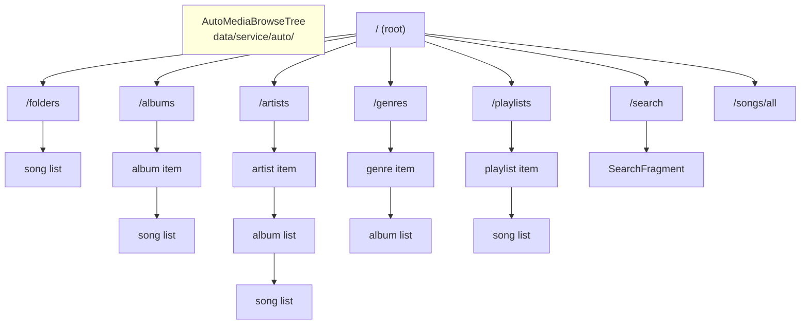

詳細: [04-engine/auto-cast-http.md](04-engine/auto-cast-http.md)

---

## 付録: 主要データ型 伝播図

`Song` ドメインオブジェクトの生成から UI までの伝播。

```mermaid
graph LR
    MS[MediaStore]:::ext -->|Cursor| MSR[MediaStoreSongRepository]:::repo
    MSR -->|toEntity| SE[SongEntity]:::db
    MSR -->|toSong| S[Song]:::model
    SE -->|toSong| S
    JR[JellyfinResponseParser]:::parse -->|toSong| S
    NR[NavidromeResponseParser]:::parse -->|toSong| S
    NTR[NeteaseResponseParser]:::parse -->|toSong| S
    QR[QqMusicResponseParser]:::parse -->|toSong| S
    GDR[GDriveResponseParser]:::parse -->|toSong| S
    TGR[TelegramResponseParser]:::parse -->|toSong| S

    S --> UI[Composable collectAsState]:::ui
    S --> MIB[MediaItemBuilder.toMediaItem]:::util
    MIB --> MS2[MediaSession MediaItem]:::ext
    MS2 --> EX[ExoPlayer.setMediaItems]:::player

    classDef ext fill:#ffd
    classDef repo fill:#ddf
    classDef db fill:#dfd
    classDef model fill:#fdf
    classDef parse fill:#ddf
    classDef ui fill:#fdd
    classDef util fill:#ddf
    classDef player fill:#dfd
```

詳細: [01-data-foundation/models.md](01-data-foundation/models.md) (Song), [10-utils.md](10-utils.md) (MediaItemBuilder)

---

## 付録: 例外・エラー ハンドリング パターン

| 層 | パターン | 例 |
|----|----------|-----|
| Repository | `Result<T>` / `Flow<T>` (失敗は空 / 例外) | `MusicRepository.getSongs()` |
| Service | `onError` コールバック → StateFlow に流す | `MusicService.onPlaybackError` |
| Composable | `runCatching` + Snackbar | `LibraryScreen.handleDelete` |
| WorkManager | `Result.retry()` / `Result.failure()` | `SyncWorker.doWork` |
| Cast | `CastSession.ErrorCode` | `CastStateHolder.onError` |
| AI | `AiHandler` がフォールバックモデルに自動切替 | `AiHandler.handleQuota` |
| HTTP (Ktor) | `Call.respond(HttpStatusCode.InternalServerError)` | `MediaFileHttpServerService` |
| Room Migration | 失敗時 `CrashHandler` で dump | `PixelPlayDatabase.onDestructiveMigration` |

詳細: 各スペック (概ね「内部実装メモ」セクションに記載)
